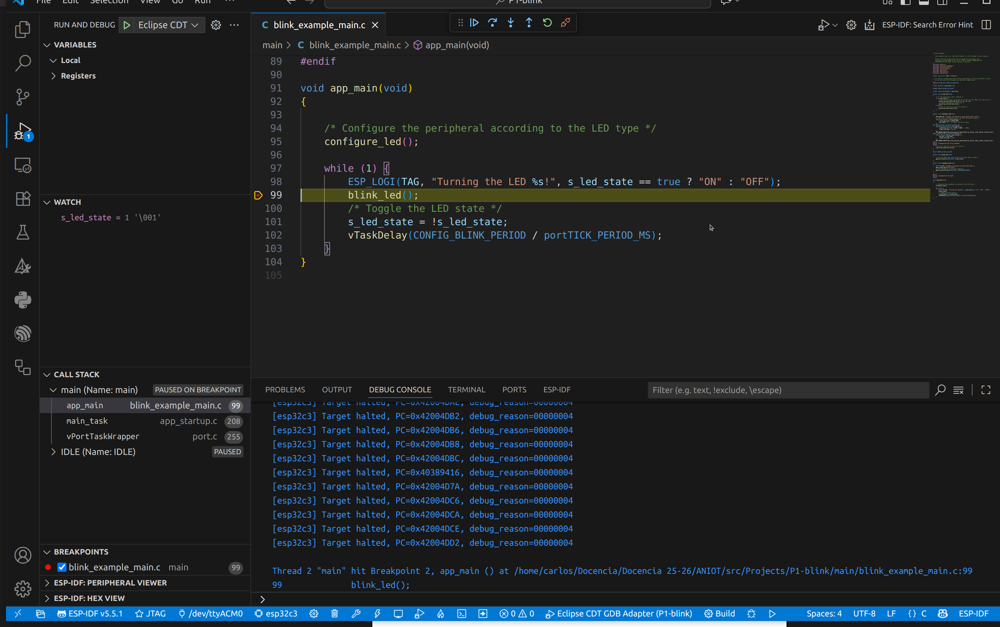

# Práctica 1 (segunda parte). Flujos de trabajo. Compilación en la nube y herramientas de depuración, perfilado y logging

## Objetivos

- Introducir los conceptos básicos de depuración en el microcontrolador
- Introducir los conceptos básicos de depuración a nivel de gestión de memoria (heap).
- Aprender a utilizar Github Actions para compilar un proyecto ESP-IDF de forma remota.

## Material de consulta

Para ver los detalles de cada aspecto de esta práctica se recomienda la lectura de los siguientes enlaces:
   * [Documentación de OpenOCD](https://openocd.org/pages/documentation.html)
   * [Git and github essentials](https://docs.github.com/en)
   * [Git cheatsheet](https://training.github.com/downloads/es_ES/github-git-cheat-sheet.pdf)
   * [Github Actions](https://docs.github.com/en/actions)
   * [Heap memory allocation](https://docs.espressif.com/projects/esp-idf/en/latest/esp32/api-reference/system/mem_alloc.html)
   * [Performance monitoring](https://docs.espressif.com/projects/esp-idf/en/latest/esp32/api-reference/system/perfmon.html)

## Depuración
La herramienta de depuración de código abierto [OpenOCD](https://openocd.org/) proporciona un entorno de depuración (*debugging*), programación en sistema (*in-system programming*) y pruebas de *boundary-scan* para dispositivos *embedded*.
OpenOCD requiere un adaptador de depuración (dongle) para funcionar.
   * **Función**: Proporciona la señalización eléctrica correcta para comunicarse con el dispositivo de destino (target).
   * **Protocolos Soportados**: OpenOCD se enfoca principalmente en JTAG (IEEE 1149.1), pero también soporta SWD (Serial Wire Debug) y otros protocolos.


### Configuración y ejecución
OpenOCD se ejecuta como un servidor que espera conexiones de clientes (GDB, Telnet o RPC).

Archivos de Configuración (.cfg): Utiliza comandos basados en el lenguaje de scripting Jim Tcl.
   * `interface/*.cfg`: Define el adaptador de depuración (dongle).
   * `board/*.cfg`: Define la placa y la inicialización de hardware externo (ej. SDRAM, Flash).
   * `target/*.cfg`: Define los Test Access Ports (TAP) y las CPUs.

Uso Básico: `openocd -f interface/ADAPTER.cfg -f board/MYBOARD.cfg`

### Columna de depuración
OpenOCD actúa como un servidor gdbserver remoto.
   * Protocolo: Cumple con el protocolo GDB remoto.
   * Conexión: GDB se conecta a OpenOCD a través de un socket TCP/IP (típicamente localhost:3333) usando target extended-remote.
   * Soporte RTOS: Puede configurarse para detectar y trabajar con estructuras de datos de RTOS conocidos como FreeRTOS, eCos, ThreadX y Linux.

```console 
user@host:~$ openocd -f board/esp32c3-builtin.cfg
Open On-Chip Debugger v0.12.0-esp32-20250707 (2025-07-06-17:37)
Licensed under GNU GPL v2
For bug reports, read
http://openocd.org/doc/doxygen/bugs.html
Info : esp_usb_jtag: VID set to 0x303a and PID to 0x1001
Info : Listening on port 6666 for tcl connections
Info : Listening on port 4444 for telnet connections
....
```

Haciendo uso del comando `telnet` al puerto 4444 se permite interacturar empleando los comando TCL
   * `targets`: muestra los targets (cores) detectados
   * `reset`: reiniciia el ESP32 y los detiene (halt)
   * `resume`: reanuda la ejecución

```console
user@host:~$ telnet localhost 4444
Trying 127.0.0.1...
Connected to localhost.
Escape character is '^]'.
Open On-Chip Debugger

targets
    TargetName         Type       Endian TapName            State       
--  ------------------ ---------- ------ ------------------ ------------
 0* esp32c3            esp32c3    little esp32c3.tap0       running
....
```

Por último para integrarlo en el entorno de desarrollo de [MS-Visual Code](https://code.visualstudio.com/) se recomiendo seguir los siguiente pasos:
1. Seleccionar en el entorno MS-Vcode el método de flaseo de **JTAG**
2. Lanzar OpenOCD: `openocd -f board/esp32c3-builtin.cfg`
3. En el entorno de MS-Vcode clicar en el icono **Debug** o en su defecto pulsar el atajo **F5**
4. Una vez configurado, ya es posible monitorizar variables, colocar breakpoints, o consultar variables




!!! note "Tarea"
	* Configura el entorno MS-Vcode para poder depurar el ejemplo **blinking** desarrollado en la Práctica 1 (Recuerda que la función de depuración se realizar con el seleccionando el mecanismo de flaseo en **JTAG**)

## Github Actions

GitHub Actions es una plataforma de integración y despliegue continuos (CI/CD) que 
permite automatizar el flujo de compilación, pruebas y despliegue. 

GitHub Actions permite ejecutar flujos de trabajo cuando suceden determinados eventos 
en un repositorio. Por ejemplo, es posible ejecutar un flujo de trabajo para que 
agregue automáticamente las etiquetas adecuadas cada que alguien cree una propuesta 
nueva en un repositorio, o compilar un código cuando se realiza un `push` sobre el 
mismo.

GitHub proporciona máquinas virtuales Linux, Windows y macOS para ejecutar 
flujos de trabajo, o es posible hospedar ejecutores propios hospedados en una
máquina propia o en una infraestructura en la nube.

### Componentes en Github Actions

Es posible configurar un flujo de trabajo de GitHub Actions que se desencadene cuando 
se produzca un evento en el repositorio, por ejemplo, la apertura de una solicitud de 
incorporación de cambios o la creación de una incidencia. 

El flujo de trabajo contiene uno o varios trabajos que se pueden ejecutar en orden 
secuencial o en paralelo. 
Cada trabajo se ejecutará dentro de su propio ejecutor de máquina virtual o dentro de 
un contenedor, y tendrá uno o varios pasos que pueden ejecutar un script que defina, 
o bien una acción, que es una extensión reutilizable que puede simplificar el flujo 
de trabajo.

### Flujos de trabajo

Un flujo de trabajo es un proceso automatizado configurable que ejecutará uno o más trabajos. Los flujos de trabajo se definen mediante un archivo de YAML que se verifica en tu repositorio y se ejecutará cuando lo active un evento dentro de este o puede activarse manualmente o en una programación definida.

Los flujos de trabajo se definen en el directorio .github/workflows de un repositorio. Un repositorio puede tener varios flujos de trabajo, y cada uno puede realizar un conjunto diferente de tareas, como las siguientes:

- Compilar y probar de solicitudes de incorporación de cambios.  
- Implementar la aplicación cada vez que se crea una versión.
- Agregar una etiqueta cada vez que se abre una incidencia nueva.


Un flujo de trabajo debe contener los siguientes componentes básicos:

- Uno o varios eventos que desencadenarán el flujo de trabajo.
- Uno o varios trabajos, cada uno de los cuales se ejecutará en una máquina del ejecutor y ejecutará uno o varios pasos.
- Cada paso puede ejecutar un script que definas, o bien una acción, que es una extensión reutilizable que puede simplificar el flujo de trabajo.

Los activadores de los flujos de trabajo son eventos que ocasionan que se ejecute un flujo de trabajo. Estos eventos pueden ser:

- Eventos que ocurren en el repositorio de tu flujo de trabajo
- Eventos que se producen fuera de GitHub y desencadenan un evento repository_dispatch en GitHub
- Tiempos programados
- Manual

Por ejemplo, puedes configurar tu flujo de trabajo para que se ejecute cuando se realiza una subida a la rama predeterminada de tu repositorio, cuando se crea un lanzamiento o cuando se abre una propuesta.

Los flujos de trabajo se definen mediante YAML. Para obtener la referencia completa de la sintaxis de YAML para crear flujos de trabajo, consulta ["Sintaxis del flujo de trabajo para Acciones de GitHub"](https://docs.github.com/es/actions/writing-workflows/workflow-syntax-for-github-actions#about-yaml-syntax-for-workflows).

### Ejemplo ilustrativo de compilación de un ejemplo C++ nativo (x86) en la nube
Esta sección presenta un ejemplo simplificado de cómo utilizar GitHub Actions para compilar un proyecto de C++ estándar, demostrando el proceso de CI/CD para una arquitectura nativa (x86-64) antes de abordar la compilación cruzada de ESP-IDF.

El flujo de trabajo automatizará la compilación del popular ejemplo "Hello World" utilizando CMake como sistema de construcción.

La estructura del repositorio tendrá la siguiente estructura de ficheros:
nombre_proyecto/
├── .github/
│   └── workflows/
│       └── build_x86.yml
└── src_example_x86/
    ├── CMakeLists.txt
    └── main_example_x86.cpp

El archivo `main_example_x86.cpp` contiene el código de C++ que se compilará con CMake:
```cpp
// src_example_x86/main_example_x86.cpp

#include <iostream>

int main() {
    std::cout << "¡Hola Mundo x86-64 desde GitHub Actions!" << std::endl;
    return 0;
}
```

El archivo de `CMakeLists.txt` define la forma de construir el ejecutable. Es importante la opción `-static`, que garantiza que el binario se enlace de forma estática con las librerías estándar de C++, facilitando su ejecución independiente en el runner de GitHub Actions.
```cmake
# CMakeLists.txt

cmake_minimum_required(VERSION 3.10)
project(HelloWorldX86 CXX)

# Añade el ejecutable, indicando que las fuentes están en la carpeta src
add_executable(hello_world_x86 main_example_x86.cpp)

# 1. Indicamos al enlazador que use versiones estáticas de las librerías estándar
target_link_options(hello_world_x86 PRIVATE
    -static
)
```

y el fichero YAML `build_x86.yml` que define el proceso de compilación en la nube:
```yaml
# .github/workflows/build_x86.yml

name: Build x86 Project

# 1. Trigger: Se ejecuta en cada 'push' a la rama 'main' o manualmente
on:
  push:
    branches: [ main ]
  workflow_dispatch:

# 2. Jobs: El job de compilación
jobs:
  build:
    # Compilará el ejecutable en un runner de Ubuntu (x86-64)
    runs-on: ubuntu-latest
    
    # Pasos del job
    steps:
    - name: Checkout Repository
      # Descarga el código del repositorio
      uses: actions/checkout@v4

    - name: Configure CMake
      # Crea el directorio de compilación y configura CMake
      run: |
        mkdir build_example_x86
        cd build_example_x86
        cmake ../src_example_x86/

    - name: Build Project
      # Compila el proyecto usando el sistema de compilación generado por CMake
      run: |
        cd build_example_x86
        cmake --build . --config Release

    - name: Test Executable (Optional)
      # Verifica que el programa se ejecute correctamente en el runner
      run: |
        echo "Ejecutando el binario compilado..."
        ./build_example_x86/hello_world_x86

    - name: Upload Executable Artifact
      # Sube el binario compilado como un artefacto
      uses: actions/upload-artifact@v4
      with:
        name: x86-64-executable
        # La ruta al ejecutable compilado por CMake
        path: build_example_x86/hello_world_x86
```

que consta de los siguiente elementos:
1. Nombre y Eventos (`on`)
2. Job de compilación (`build`):
   * Ejecutor (`runs-on: ubuntu-latest`) que especifica que el código se ejecutará en una máquina virtual de Ubuntu, cuya arquitectura es x86-64, ideal para compilar ejecutables nativos.
3. Pasos (`steps`)
   * **Checkout Repository**: Descarga el código del repositorio al runner.
   * **Configure CMake**: Crea un directorio de construcción fuera del código fuente (`build_example_x86`) y ejecuta cmake para generar los makefiles o archivos de construcción.
   * **Build Project**: Ejecuta `cmake --build .` para invocar al compilador (GCC/G++) y generar el ejecutable (`hello_world_x86`).
   * **Test Executable (Optional)**: Ejecuta el binario compilado. Esto confirma que la compilación fue exitosa y que el ejecutable es funcional en el entorno de GitHub Actions, imprimiendo el mensaje esperado.
   * **Upload Executable Artifact**: Al finalizar el job, el binario compilado se empaqueta y se sube como un artefacto para que el usuario pueda descargarlo. El nombre del artefacto es `x86-64-executable`.


!!! note "Tarea"
1.  Creación del Repositorio y añade la estructura de carpetas: `src_example_x86` y `.github/workflows/`
2.  Archivos del Proyecto: Copia los contenidos de `main_example_x86.cpp`, `CMakeLists.txt` y `build_x86.yml` en sus respectivas ubicaciones.
3.  Primer Push y Verificación en la Nube: Sube los archivos al repositorio (git push).
    * Verifica en la pestaña **Actions de GitHub** que el flujo de trabajo se ejecuta con éxito.
4.  Descarga del Artefacto: Una vez finalizada la acción, descarga el artefacto llamado `x86-64-executable` desde la página de resumen del job.
5.  Ejecución Local: Descomprime el artefacto y, en tu máquina local (si es compatible con x86-64 y ejecuta el binario descargado (`./hello_world_x86`).


### Un ejemplo: creación de un flujo de trabajo para compilación de un proyecto ESP-IDF
El proyecto se organiza con el código fuente en un subdirectorio, y los archivos de GitHub Actions en el directorio .github/workflows:

Imagina que dispones de un `fork` de ESP-IDF en forma de un repositorio propio asociado a tu usuario. 

El siguiente fragmento de código compilará un firmware que incluirá el ejemplo `hello_world` proporcionado
por la distribución estándar de ESP_IDF:

```yaml
name: "Espressif IoT Development Framework (ESP-IDF) on push"
on:
  push:
    branches: [main]

    inputs:
      path:
        description: "Relative path under $GITHUB_WORKSPACE to place the repository"
        default: "examples/get-started/hello_world"
        required: false
      esp_idf_version:
        description: "Version of ESP-IDF docker image to use"
        default: "latest"
        required: false
      target:
        description: "ESP32 variant to build for"
        default: "esp32c3"
        required: false
      command:
        description: "Command to run inside the docker container (default: builds the project)"
        default: "idf.py build"
        required: false


jobs:
  build:

    runs-on: ubuntu-latest

    steps:
    - name: Checkout repo
      uses: actions/checkout@v2
      with:
        submodules: 'recursive'
    - name: esp-idf build
      uses: espressif/esp-idf-ci-action@v1
      with:
        esp_idf_version: v5.1
        target: esp32c3
        path: 'examples/get-started/hello_world'
    - name: Download built firmware
      uses: actions/upload-artifact@v4
      with:
        name: hello_world.bin
        path: |
          examples/get-started/hello_world/build/hello_world.bin
```

Observa sus partes principales: 

1. **Nombre**: nombre del flujo de trabajo.
2. **Eventos sobre los que se activará**. En este caso, lo hará ante la acción de `push` sobre la rama `main` del repositorio.Además, el flujo de trabajo recibe ciertos argumentos obligatorios como entradas, requeridos por la acción específica de construcción (esp-idf-ci-action) proporcionada por Espressif. Estas entradas incluyen la ruta al ejemplo dentro del repositorio, la versión de ESP-IDF a utilizar, la variante de ESP32 a usar y el comando específico que se ejecutará. Todos estos inputs son configurables.
3. **Tareas/trabajos a ejecutar**. En esta sección, incluimos una tarea de construcción, a ejecutar sobre una distribución Ubuntu, compuesta por una serie de pasos consecutivos. Estos pasos incluyen el *checkout* de nuestro repositorio en la máquina destino, la construcción (usando una acción específica proporcionada por ESP-IDF), y por último la publicación de un *artifact* (resultado de la compilación) como resultado de la ejecución del flujo de trabajo.

Alternativamente, es posible controlar de forma manual la ejecución de la acción. Simplemente, utiliza un workflow como el siguiente (podrás a continuación lanzar el proceso de compilación desde la propia pestaña de Github Actions en el repositorio):

```yaml
name: "Espressif IoT Development Framework (ESP-IDF)"
on:
  workflow_dispatch:
    inputs:
      path:
        description: "Relative path under $GITHUB_WORKSPACE to place the repository"
        default: ""
        required: false
      esp_idf_version:
        description: "Version of ESP-IDF docker image to use"
        default: "latest"
        required: false
      target:
        description: "ESP32 variant to build for"
        default: "esp32"
        required: false
      command:
        description: "Command to run inside the docker container (default: builds the project)"
        default: "idf.py build"
        required: false

jobs:
  build:

    runs-on: ubuntu-latest

    steps:
    - name: Checkout repo
      uses: actions/checkout@v2
      with:
        submodules: 'recursive'
    - name: esp-idf build
      uses: espressif/esp-idf-ci-action@v1
      with:
        esp_idf_version: v5.1
        target: esp32c3
        path: 'examples/get-started/hello_world'
    - name: Download built firmware
      uses: actions/upload-artifact@v4
      with:
        name: hello_world.bin
        path: |
          examples/get-started/hello_world/build/hello_world.bin
```


!!! note "Tarea"
	* Si no tienes un usuario Github, créalo.
    * Realiza una operación de fork sobre el repositorio ESP-IDF de Espressif sobre tu usuario.
    * Clónalo en tu máquina (puedes usar línea de comandos o bien la herramienta Github Desktop).
    * Crea el fichero .github/workflows/idf_build.yml con el contenido anterior. 
    * Sube los cambios al repositorio (`git commit` + `git push`) y observa, en la pestaña Actions de tu repositorio, que efectivamente se ha construido con éxito el artifact resultado de la compilación.
    * Adapta el trabajo para otro ejemplo (elige tú mismo/a el ejemplo) y consigue una imagen compilada para cualquiera de tus placas. ¿Serías capaz de descargarla y flashearla manualmente en la placa (necesitarás determinar qué comandos son necesarios para un proceso de flasheo manual observando la salida de VSCode para dicho proceso)?
    * Proporciona al profesor un enlace al repositorio creado para que pueda revisar la correcta compilación del proyecto.

## Depuración de memoria dinámica

Aunque ya conoces la funcionalidad de depuración integrada en VS Code, en ocasiones hay 
situaciones que son difícilmente detectables por un depurador. Uno de estos ejemplos es 
la depuración de memoria dinámica (alojada en el *heap*).

ESP-IDF integra herramientas para solicitar información sobre el heap, para detectar corrupción
en el heap y para tracear el estado del heap periódicamente. 

### Obtención de información sobre el *heap*

To obtain information about the state of the heap, call the following functions:

- `heap_caps_get_free_size()` se puede utilizar para devolver la memoria libre actual para diferentes tipos de memoria.

- `heap_caps_get_largest_free_block()` se puede usar para devolver el bloque libre más grande del heap, que también es la asignación individual más grande posible actualmente. El seguimiento de este valor y su comparación con el heap libre total permite detectar la fragmentación del montón.

- `heap_caps_get_minimum_free_size()` puede usarse para obtener el mínimo tamaño libre en el heap desde el arranque.

- `heap_caps_get_info()` retorna una estructura `multi_heap_info_t`,  que contiene información sobre las funciones de más arriba, así como datos específicos sobre el heap (número de reservas, por ejemplo).

- `heap_caps_print_heap_info()` imprime por salida estándar la información recogida por la anterior función.

- `heap_caps_dump()` y `heap_caps_dump_all()` muestran información detallada sobre la estructura de cada bloque en el heap. La salida puede ser grande.

!!! note "Tarea"
    Compila y estudia el ejemplo `system/heap_task_tracking` de ESP-IDF. Observa el uso de las anteriores funciones. Moficia el código para que la cantidad de memoria reservada en cada iteración de la tarea sea constante. Prueba a eliminar la invocación a `free` cada cierto número de iteraciones, para observar cómo va agotándose el espacio libre en el `heap`. Intenta observar la fragmentación en el heap volviendo a hacer reservas de tamaño aleatorias, y liberaciones sólo cada cierto número de iteraciones.


### Hooks para la reserva y liberación de memoria en el heap

Los hooks para la asignación y liberación de memoria en el heap permiten recibir notificaciones cada vez que se realiza una reserva o una liberación sobre el mismo:

- Si se proporciona una definición de la función `esp_heap_trace_alloc_hook()`, se notificará cada vez que se realice con éxito una reserva de memoria.
- Si se proporciona una definición de la función `esp_heap_trace_free_hook()`, se notificará cada vez que se realice con éxito una liberación de memoria.

Por ejemplo:

```c
#include "esp_heap_caps.h"

void esp_heap_trace_alloc_hook(void* ptr, size_t size, uint32_t caps)
{
  ...
}
void esp_heap_trace_free_hook(void* ptr)
{
  ...
}

void app_main()
{
    ...
}
```

Esta característica se activa fijando la opción de configuración `CONFIG_HEAP_USE_HOOKS`.

!!! note "Tarea"
    Modifica el anterior ejemplo para que se invoque a tus hooks de información en cada reserva y liberación de memoria, y que se aporte en el mensaje que se mostrará por pantalla información sobre la misma.

## Monitorización de rendimiento

ESP-IDF proporciona un componente dedicado exclusivamente a la monitorización del rendimiento de las aplicaciones. Este componente proporciona una API para utilizar los contadores hardware de rendimiento disponibles en los ESP32. 
Este tipo de componentes permiten perfilar y evaluar el rendimiento de partes concretas del código, de modo que dan soporte a la optimización del mismo sobre una arquitectura concreta.

En primer lugar, compila y estudia el ejemplo proporcionado por ESP-IDF para [monitorización de rendimiento](https://github.com/espressif/esp-idf/tree/46acfdce/examples/system/perfmon). **Este ejemplo no es funcional sobre arquitecturas RISC-V, por lo que deberás utilizar la placa DevkitC que tienes en tu maletín**.

Una vez compilado y flasheado, ejecuta el binario y estudia el código proporcionado. Básicamente, el código de ejemplo calcula estadísticas de redimiento para una función de test determinada. Esta función (`exec_test_function`) simplemente introduce instrucciones NOP (*no operation*) durante 100 iteraciones. Esta función, que puede ser reemplazada por cualquier otra, se invocará consecutivamente 200 veces con dos configuraciones distintas: recolectando todos los posibles contadores hardware, y a continuación seleccionando un subconjunto a partir de una lista proporcionada por el programador.

!!! note "Tarea"
    Estudia el código asociado a la tarea, así como la salida proporcionada en cada caso. Observa cómo se utiliza la API para seleccionar qué contadores hardware se desean reportar. Apóyate en la descripción de la API proporcionada en la [documentación oficial](https://docs.espressif.com/projects/esp-idf/en/latest/esp32/api-reference/system/perfmon.html) para ayudarte en la tarea. Por último, modifica la función de ejemplo para implementar algún tipo de funcionalidad avanzada (por ejemplo, que incluya operaciones aritméticas), y observa los cambios en la salida. Experimenta con distintas opciones de compilador para optimizacón (a través de menuconfig), para ver si puedes obtener cambios significativos en los valores reportados (adicionalmente, puedes observar el impacto de estos flags en el tamaño del ejecutable). 
