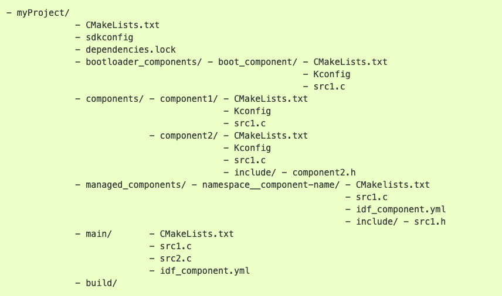

# Práctica 2. Entorno de compilación. Uso de timers
## Objetivos

El objetivo de esta práctica es familiarizarse con la estructura de componentes en que se basa la compilación de proyectos en ESP-IDF. 
Asímismo, aprovecharemos para utlizar *timers*. Trabajaremos los siguientes aspectos:

* Creación de componentes en nuestro proyecto.
* Incorporar componentes externos.
* Uso del componente  `console` para tener un entorno interactivo. 
* Familiarizarse con la API de *High Resolution Timers*  en ESP/IDF.


## Material de consulta
Para ver los detalles de cada aspecto de esta práctica se recomienda la lectura de los siguientes enlaces:

* [Documentación sobre el sistema de compilación](https://docs.espressif.com/projects/esp-idf/en/latest/esp32/api-guides/build-system.html#component-configuration)
* [Documentación del componente `console`](https://docs.espressif.com/projects/esp-idf/en/latest/esp32/api-reference/system/console.html)
* [Documentación sobre la librería Argtable](https://www.argtable.org/)
* [Documentación sobre CMake](https://cmake.org/)
* [API de High Resolution Timers](hhttps://docs.espressif.com/projects/esp-idf/en/latest/esp32/api-reference/system/esp_timer.html)

## Proyectos ESP-IDF
Tal y como hemos visto en clase, un proyecto ESP-IDF está formada de  *componentes*.
un componente es la unidad en la que se organiza el código en un proyecto ESP-IDF. Cada componente se compila formando una librería estática, que posteriormente se enlazará junto al resto de componentes y al *kernel* de ESP-IDF para crear la aplicación. El código que incluyamos en la carpeta `main` no es más que otro componente, con pequeños matices que lo diferencian de otros.

Los elementos principales en ESP-IDF son:

* **Proyecto**. Un directorio que contiene  todos los ficheros y configuración para construir un “app” (ejecutable).
Incluye elementos como tabla de partición, sistemas de ficheros y bootloader
* **Configuración de proyecto**. Se mantiene en el fichero sdkconfig  en el directorio raíz del proyecto. Se modifica a través de menuconfig. Cada proyecto tiene un único fichero de configuración.
* **app**. Es un ejecutable resultado de la compilación/enlazado.  De un proyecto se suelen crear 2 apps
   * Project app: el ejectuable principal con nuestro código
   * Bootloader app: el programa inicial que se encarga de cargar nuestro código
* **Componentes**. Partes modulares del código que se compilan como librearías estáticas (ficheros .a) y se enlazan en la app. Algunos componentes los proporciona ESP-IDF, pero pueden ser externos
https://components.espressif.com/ (aún no público)
* **Target**.  Es el hardware para el que construimos la aplicación. Podemos comprobar los targets disponibles para una versión de ESP-IDF con el comando `idf.py -list-targets`

La compilación se basa en la herramienta [CMake](https://cmake.org/), por lo que tendremos un fichero `CMakeLists.txt` para cada componente, y uno general para el proyecto. Así, la estructura general de un proyecto podría ser similar a:



El contenido mínimo del fichero `CMakeLists.txt` del proyecto (el que se encuentra en la carpeta `myProject` en el ejemplo anterior) es:

```c
cmake_minimum_required(VERSION 3.5)
include($ENV{IDF_PATH}/tools/cmake/project.cmake)
project(si7021)
```

### Componentes

Un componente es cualquier directorio en COMPONENT_DIRS que contenga un fichero `CMakeLists.txt`. Puede ser un directorio sin `CMakeLists.txt` pero con subdirectorios, cada uno de ellos con su `CMakeLists.txt`. Se creará una librería estática para cada componente, cuyo nombre será, por defecto, el nombre del directorio. Cada componente puede, asimismo, tener su propio fichero `Kconfig`.

El fichero `CMakeLists.txt` debe indicar las fuentes que se enlazarán en la librería y la ubicación de los ficheros de cabecera públicos del componente. Asimismo, puede indicar dependencias con otros componentes (si las hubiera)

```c
idf_component_register(SRCS "foo.c" "bar.c"
INCLUDE_DIRS "include"
REQUIRES mbedtls
)
```

La variable `COMPONENT_DIRS` indica los directorios en los que ESP-IDF buscará componentes. Creará bibliotecas para todos aquellos componentes que encuentre. Por defecto buscará en:

* `IDF_PATH/components`
* `PROJECT_DIR/componentes`
* `EXTRA_COMPONENT_DIRS`

Es posible reescribir la variable `COMPONENT_DIRS`para incluir algún directorio o, especialmente, para limitar la búsquda de directorios.

La variable `EXTRA_COMPONENT_DIRS` nos permite incluir directorios adicionales en la búsqueda de componentes. Las rutas pueden ser absolutas o relativas al directorio del proyecto. Se indica en el *top-level*  `CMakeLists.txt`, antes del `include`.

La variable `COMPONENTS` permita hacer explícita la lista de componentes que queremos incluir en el proyecto. Como decíamos anteriormente, por defecto serán todos aquellos que se encuentren en `COMPONENT_DIRS`. Su uso permite reducir el tamaño del binario final, lo que puede resultar conveniente en muchos proyectos.


### Aplicación *Consola* (opcional)
En muchos entornos resulta muy conveniente tener una aplicación de tipo *consola*: un intérprete de comandos que nos permita interaccionar de forma básica con el sistema. Muchos sistemas empotrados tienen la opción de arrancar en modo consola, para tareas de mantenimiento y depuración. En funcionamiento *normal* la consola no se ejecutará o se saldrá de dicho modo transcurrido un tiempo de inactividad, arrancándose entonces la aplicación real.

ESP-IDF incluye un componente llamado [*Console*](https://docs.espressif.com/projects/esp-idf/en/latest/esp32/api-reference/system/console.html) que nos da un servicio mínimo tipo REPL (Read-Evaluate-Print-Loop)  El componente incluye toda la funcionalidad necesaria para el procesamiento/eidción de línea, basándose en la [librería lineoise](https://github.com/antirez/linenoise). De ese modo, sabe interpretar la acción de borrado, movimiento por cursores, auto completa, indica el formato de cada comando... Asimismo, tiene funciones para que sea sencillo registrar nuevos comandos escritos por nosotros mismos.

Vamos a partir  [del ejemplo de consola básico](https://github.com/espressif/esp-idf/tree/4b6d9c8ad317dc9e45f3c7699525dd9479f1f4c7/examples/system/console/basic). Estudia el código, y responde a las siguientes preguntas:

!!! note "Cuestión"
    * ¿Qué componente se está incluyendo además de los que siempre se incluyen por defecto?
    * ¿Qué funcionalidad se importa de dicho componente?
    * ¿Qué particiones se crean al volcar el proyecto en nuestro dispositivo?

### Importar código externo como componente
Espressif tiene una [base de datos de componentes](https://components.espressif.com/) que permite incorporar componentes *open-source* en nuestros proyectos ESP-IDF de forma sencilla. Podemos incluir un componente del registro mediante el comando `idf.py add-dependency <componentName>` o descargando el fichero de la web de componentes y copiándolo en nuestro proyecto. Bastará con copiar la carpeta descargada dentro de la carpeta `components` de nuestro proyecto.

En ocasiones, encontraremos códigos no incluidos en el registro oficial de Espressif pero que pueden resultar útiles para nuestros desarollos. Nuevamente, resulta aconsejable importar esos proyectos externos como componentes en nuestros proyectos. Y así lo haremos en la siguiente tarea:

!!! danger "Tarea"
    El [sensor Si7021](https://www.silabs.com/documents/public/data-sheets/Si7021-A20.pdf) incorpora un sensor de tempertarua y de humedad con una interfaz I2C que facilita su uso. En el maletín disponemos de una [placa de Adafruit que incorpora dicho sensor](https://www.adafruit.com/product/3251). A partir del código disponible en [este repositorio de GitHub (https://github.com/jessebraham/esp-si7021)](https://github.com/jessebraham/esp-si7021), crea un componente llamado `si7021` para poder utilizar el sensor sin necesidad de consultar el *datasheet*. 

    * Copia los ficheros `i2c_config.c` y `i2c_config.h` proporcionados en el Campus Virtual en la carpeta `main.c` de tu proyecto.
    * Modifica los ficheros `CMakeLists.txt` necesarios para la compilación del proyecto.
    * Conecta los pines del sensor Si7021
        * SDA -> GPIO 26
        * SCL -> GPIO 27
        * GND -> GND
        * VIN -> 5V

    * En el fichero principal (aquel que contenga la función  `app_main`), incluye una llamada al nuevo componente para leer la temperatura. Imita el código de la práctica 1 para incluir un bucle infinito que lea la temperatura y la muestre por pantalla cada 2 segundos.


## ESP-IDF: High Resolution Timer
Un *Timer* es un temporizador que podemos programar para que nos *avise* transcurrido un cierto tiempo. Es similar a una cuenta atrás con alarma y es un mecanismo perfecto para planificar tareas periódicas. El *aviso* será asíncrono, por lo que no sabemos en qué punto de nuestro código estaremos cuando se dispare la alarma.

ESP-IDF ofrece un API para el uso de *timers* que, a su vez, utlizan los *timers* de 64 bits disponibles en el hardware para garantizar una precisión de hasta 50us. 

Cuando programamos un *timer* podemos optar por 2 comportamientos:

* *One-shot* (`esp_timer_start_once()`), que programrá el *timer* para que genere una única alarma transcurrido el plazo establecido.
* *Continuo* (`esp_timer_start_periodic()`) que re-programará el *timer* de forma automática cada vez que la cuenta llegue a 0. Este mecanismo es el idóneo para muestreos periódicos.

Cuando el *timer* genere la alarma, se ejecutará un *callback*, una función que habremos definido previamente (y asociado a ese *timer*). Dicha función se ejecutará en el contexto de una tarea específica (`ESP_TIMER_TASK`) o en el de una rutina de tratamiento de interrupción (`ESP_TIMER_ISR`). En nuestro caso, es aconsejable usar el primer mecanismo (tarea específica).

En la [documentación de ESP-IDF](https://docs.espressif.com/projects/esp-idf/en/latest/esp32/api-reference/system/esp_timer.html) podéis encontrar el resto de llamadas relevantes para crear y configurar *timers*. Es muy recomendable, asimismo, estudiar los [ejemplos disponibles en la distribución](https://github.com/espressif/esp-idf/tree/master/examples/system/esp_timer)

A continuación se incluye un ejemplo de uso, extraíado de la distribución de ESP-IDF:

```c
void app_main() { 
     ...
    const esp_timer_create_args_t periodic_timer_args = {
         .callback = &periodic_timer_callback,
         .name = "periodic" };
    esp_timer_handle_t periodic_timer; esp_timer_create(&periodic_timer_args, &periodic_timer);
     ...
    esp_timer_start_periodic(periodic_timer, 500000); ....
    esp_timer_stop(periodic_timer); ...
    esp_timer_delete(periodic_timer); 
}

static void periodic_timer_callback(void* arg) { 
    int64_t time_since_boot = esp_timer_get_time();
    printf("Periodic timer called, time since boot: %lld us",time_since_boot);
}
```

### Encendido de LEDs con GPIO y timer
El entrenador que está en el laboratorio, cuenta con 8 LEDs que podemos conectar a nuestro ESP32. Para ello, basta con conectar el pin de GPIO escogido (que configuraremos como entrada) al conector de un LED. También debemos asegurarnos **de que las tierras son comunes**. Para ello, conectaremos el pin de tierra del ESP32 al conector *GND* del entrenador.

!!! danger "Tarea"
	Configura un GPIO como salida y conéctalo a un LED del entrenador del laboratorio. Programa un *timer* para cambiar el estado del LED cada segundo. Recuerda usar una tierra común.


## Ejercicio final

Completa este ejercicio después de haber resuelto los anteriores. De cara la entrega de la práctica, **sólo es necesario entregar este ejercicio**

!!! danger "Tareas"
    * Incluye el componente `si7021` en tu proyecto, junto con los ficheros `i2c_config.c` y `i2c_config.h` y conecta la placa del sensor a la placa del ESP32.
    * Crea una aplicación que:
        * Muestree la temperatura cada segundo utilizando un *timer*.
        * Muestre el progreso de la temperatura usando 4 LEDs. Si la temperatura es inferior a 20 grados, todos estarán apagados. Se encederá un LED por cada 2 grados de temperatura.
        * Se programará un segundo timer que mostrará por pantalla (puerto serie) la última medida de temperatura realizada cada 10 segundos. 