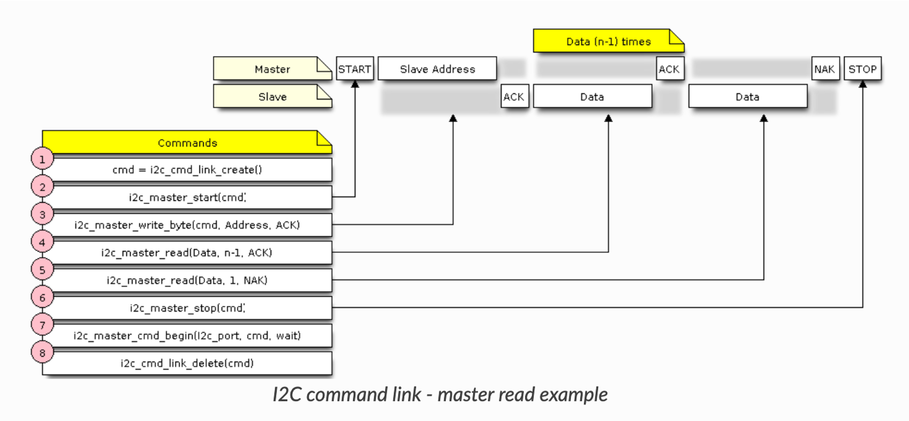

# Práctica 4. Bus I2C. Sensor de temperatura

## Objetivos
El objetivo de esta práctica es conocer el funcionamiento del bus I2C y la interfaz que ofrece ESP-IDF para su uso.
Trabajaremos los siguientes aspectos del API de ESP-IDF: 
* Configuración y uso del controlador I2C.
* Uso de sensor de temperatura y humedad (Si7021).
* Uso del sensor ICM-42670-P (IMU)

## Material de consulta
Para ver los detalles de cada aspecto de esta práctica se recomienda la lectura de los siguientes enlaces:

* [Documentación del API de I2C](https://docs.espressif.com/projects/esp-idf/en/latest/esp32/api-reference/peripherals/i2c.html)
* [Recurso online sobre I2C](https://www.i2c-bus.org/)
* [Hoja de especificaciones del sensor Si7021](https://www.silabs.com/documents/public/data-sheets/Si7021-A20.pdf)

## Bus I2C
Fue desarrollado en la empresa **Philips** (ahora **NXP**) en la década de los 80 con el objetivo de  comunicar circuitos integrados con número mínimo de pines. El nombre I2C viene de *Inter IC*. Se usa tanto la abreviatura I2C como IIC. En 2014, *NXP* publicó la Rev. 6 del protocolo.

Proporciona una conexión *serie síncrona unidireccional* (no permite envíos en dos direcciones de forma simultanea). La velocida máxima de comunicación era originalmente de 100 kbit/s, y muchas aplicaciones no requieren de velocidades mayores. Existe un *fast mode* a 400kbits/s, *fast mode plus*  (1Mbits/s), ambos compatibles hacia atrás y sin lógica adicional (aunque puede suponer ajustes en las resistencias de *pull-up* para controlar las corrientes requeridas).  La especificación  *high speed mode - HS I2C* permite conexiones a 3.4Mbits/s, pero exige lógica adicional. En nuestras pruebas, se recomienda mantener 400 kbits/s.

Las principales características de I2C son:
* Sólo require dos líneas: SDA y SCL. 
* No hay requerimientos estrictos de *baud rate* como en RS232, ya que el *master* genera la señal de reloj.
* Existe una relación sencilla *master/slave* entre todos los componentes.
* Permite tener varios *master* pues proporciona mecanismos de arbitraje y detección de colisiones.
* Cada dispositivo tiene una única dirección de 7-bits (en ocasiones, de 10 bits) que proporciona el fabricante.

## Interfaz I2C en ESP-IDF (antiguo driver)

ESP-IDF proporcionaba este API   para el uso de dispositivos I2C. Permite usar el ESP32  tanto como *master* como en modo *slave*. Nuestro SoC ESP2 dispone de dos controladores, por lo que podríamos configurar uno como *master* y otro como *slave* (o cualquier otra combinación).

Los pasos para usar un dispositivo I2C son:

* Configuración de la conexión. Indcaremos qué pines usamos como SDA y como SCL, si queremos  habilitar *pull-up* (es aconsejable tener uno externo), el modo (*master/slave*) y la frecuencia de reloj en HZ. Todo ello se escribe en una estructura de tipo `i2c_configt_t`y se cconfigura mediante la llamada a `i2c_param_config()`.
* Instalación del driver mediante la llamada `i2c_driver_install`, donde indicaremos, entre otras cosas, qué controlador I2C usaremos (0 o 1).
* Realizar las escrituras y lecturas necesarias.

Para comuicarnos con un sensor, configuraremos el ESP32 en modo *master*. Tras instalar el *driver* procederemos a iniciar la comunicación con el sensor:

Como se indica en la figura anterior, extraída de la web oficial de Espressif, debemos crear un paquete de comandos (*cmd_link*) mediante la llamda a `i2c_cmd_link_create()`. En ella incluiremos cada elemento del protocolo I2C:
* Bit de start.
* Dirección del dispositivo *slave* (7 bits).
* Bit de lectura/escritura.
* Secuencia de bytes que se desean escribir.

Es importante resaltar que, aunque lo que deseemos sea leer de un sensor (por ejemplo, leer la temperatura), es necesario escribir en el bus, pues lo primero que haremos será enviar la dirección (primer *write_byte*) y, habitualmente, un comando al dispositivo sensor.

También conviene resaltar que la comunicación no se produce hasta que no se llega a la llamada `i2c_master_cmd_begin()`.

En la siguiente figura se observa un patrón habitual para la lectura:

Nuevamente, la primera llamada (tras crear el enlace y el bit de *start*), es a `i2c_master_write_byte()`, pero esta vez se establecerá el bit de operación a lectura (el bit que se incluye tras los 7 bits de dirección del *slave*). Tras enviar ese primer byte, el ESP32 quedará a la escucha de bytes por parte del sensor mediante llamadas a `i2c_master_read()`.

Como en el ejemplo anterior, la comunicación no se produce hasta que no se llega a la llamada `i2c_master_cmd_begin()`, por lo que si queremos leer varios bytes debemos almacenarlos en posiciones diferentes de memoria y procesarlos después de esta llamada.

Existen también llamadas de más alto nivel, como `i2c_master_read_from_device()` y `i2c_master_write_read_device()` que permiten, en ocasiones, simplificar nuestro código.

##  Nueva interfaz I2C en ESP-IDF 

**TBD**

## Sensor Si7021

El Si7021 es un sensor de humedad y temperatura fabricado por *Silicon Labs*. Este sensor incopora un ADC internamente, que permite digitalizar las lecturas de los sensores y enviarlas a través del interfaz I2C integrado.

En el maletín del máster viene montado en una [placa fabricada por *Adafruit*](https://www.adafruit.com/product/3251). Adfruit es una compañía fundada por Limor Fried con la intención de convertirse en un portal de referencia para el aprendizaje de electrónica y la fabricación de diseños para *makers* de todos los niveles. ¡Merece mucho la pena echar un vistazo a su *web*!

Dependiendo de la versión del PCB que haya en el maletín, puede que únicamente haya pines expuestos (*Vin*, *3Vo*, *GND*, *SCL* y *SDA*) o conectores *STEMMA QT*, compatible con los conectores [*Qwiic* de Sparkfun](https://www.sparkfun.com/qwiic) (Sparkfun es otra compañía tan interesante como *Adafruit*). Lamentablemente, nuestra placa ESP32 DevKit-C no tiene conectores de ese tipo, por lo que necesitaremos conectar directamente los 4 cables: alimentación, tierra, SCL y SDA.

De acuerdo a las [especificaciones del sensor Si7021](https://www.silabs.com/documents/public/data-sheets/Si7021-A20.pdf), el voltaje de entrada no debe superar los 3.6V. La placa de *Adafruit* proporcionada tiene un regulador de voltaje que nos permite conectar tanto 3.3V como 5V. 

La sección de la [hoja de especificaciones del sensor Si7021](https://www.silabs.com/documents/public/data-sheets/Si7021-A20.pdf) informa acerca del interfaz I2C que ofrece el sensor. Nos indica los 7 bits de dirección del sensor, así como de los comandos disponibles (la mayoría de ellos de 1 byte). 

!!! note "Cuestión"
    La dirección del sensor es `1000000`(es decir, `0x40` expresado en hexadecimal). Si queremos hacer una operación de lectura (bit R/W a 1), ¿cómo construiremos el segundo argumento de la llamada a `i2c_master_write_byte()` que haremos tras `i2c_master_start()`?

La sección 5.1.2 del documento explica cómo obtener una medida de temperatura tras haber realizado una medidad de humedad. Para ello usa el comando 0xE0. En nuestro caso deberemos usar 0xE3 o 0xF3.

!!! note "Cuestión"
    * ¿Cuál es la diferencia entre 0xE3 y 0xF3? ¿Qué es *clock stretching*?
    * Dichos comandos devuelven 2 bytes, que leeremos en dos variables diferentes. ¿Cómo obtenemos posteriormente nuestro número de 16 bits para calcular la temperatura?

!!! danger "i2ctools (opcional)" 
     Compila y prueba el ejemplo *i2c_tools* de la carpeta de ejemplos (*examples/peripherals/i2c/i2c_tools*). Conecta el sensor a los pines indicados por defecto (también a Vcc y a tierra) y ejecuta al comando `i2cdetect`. Prueba a los distintos comandos disponibles para tratar de leer información del sensor.

## Ejercicios obligatorios

### Portar componente ICM-42670-P a nuevo driver
El [registro de componentes de IDF](https://components.espressif.com/) incluye un componente para utilizar la IMU incluida en la placa ESP-RUST-BOARD (con el SoC ESP32-C3):[ICM42607/ICM42670 6-Axis MotionTracking (Accelerometer and Gyroscope)](https://components.espressif.com/components/espressif/icm42670/versions/2.0.0).

Sin embargo, el componente está preparado para funcionar con el driver antiguo. Realiza las modificaciones oportunas para conseguir que el componente utilice el nuevo driver. 

Crea una aplicación que monitorice el estado del acelerómetro y determine si la placa está boca arriba o boca abajo. El LED RGB cambiará de color en función de la orientación, y se imprimirá por terminal el estado actual.

### [Opcional] Uso de CRC en sensor
El sensor Si7021 permite el cálculo de un byte de *checksum* (CRC) para comprobar que no ha habido errores en el envío. Completa el código del componente para leer dicho byte y comprobar que no ha habido errores. Conviene leer la sección 5.1 y una [librería para el cálculo de CRC como la ofrecida por BARR](https://barrgroup.com/tech-talks/checksums-and-crcs).
