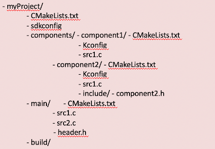

# Práctica 6. Componentes y NVS

Esta práctica se desarrollará el 15 de noviembre.

## Objetivos
El objetivo de esta práctica es familiarizarse con la estructura de componentes en que se basa la compilación de proyectos en ESP-IDF. 
Asímismo, aprovecharemos para probar la partición NVS. Trabajaremos los siguientes aspectos:

* Creación de componentes en nuestro proyecto.
* Incorporar componentes externos.
* Crear pares clave-valor en una partición NVS.
* Uso del componente  `console` para tener un entorno interactivo. 

 
## Material de consulta
* [Documentación sobre el sistema de compilación](https://docs.espressif.com/projects/esp-idf/en/latest/esp32/api-guides/build-system.html#component-configuration)
* [Documentación sobre la librería NVS](https://docs.espressif.com/projects/esp-idf/en/latest/esp32/api-reference/storage/nvs_flash.html)
* [Documentación del componente `console`](https://docs.espressif.com/projects/esp-idf/en/latest/esp32/api-reference/system/console.html)
* [Documentación sobre la librería Argtable](https://www.argtable.org/)
* [Documentación sobre CMake](https://cmake.org/)

## Proyectos ESP-IDF
Tal y como hemos visto en clase, un proyecto ESP-IDF se componente a partir de *componentes*
un componente es la unidad en la que se organiza el código en un proyecto ESP-IDF. Cada componente se compila formando una librería estática, que posteriormente se enlazará junto al resto de componentes y al *kernel* de ESP-IDF para crear la aplicación. El código que incluyamos en la carpeta `main` no es más que otro componente, con pequeños matices que lo diferencian de otros.

Los elementos principales en ESP-IDF son:

* **Proyecto**. Un directorio que contiene  todos los ficheros y configuración para construir un “app” (ejecutable).
Incluye elementos como tabla de partición, sistemas de ficheros y bootloader
* **Configuración de proyecto**. Se mantiene en el fichero sdkconfig  en el directorio raíz del proyecto. Se modifica a través de menuconfig. Cada proyecto tiene un único fichero de configuración.
* **app**. Es un ejecutable resultado de la compilación/enlazado.  De un proyecto se suelen crear 2 apps
   * Project app: el ejectuable principal con nuestro código
   * Bootloader app: el programa inicial que se encarga de cargar nuestro código
* **Componentes**. Partes modulares del código que se compilan como librearías estáticas (ficheros .a) y se enlazan en la app. Algunos componentes los proporciona ESP-IDF, pero pueden ser externos
https://components.espressif.com/ (aún no público)
* **Target**.  Es el hardware para el que construimos la aplicación. Podemos comprobar los targets disponibles para una versión de ESP-IDF con el comando `idf.py -list-targets`

La compilación se basa en la herramienta [CMake](https://cmake.org/), por lo que tendremos un fichero `CMakeLists.txt` para cada componente, y uno general para el proyecto. Así, la estructura general de un proyecto podría ser similar a:



El contenido mínimo del fichero `CMakeLists.txt` del proyecto (el que se encuentra en la carpeta `myProject` en el ejemplo anterior) es:

```c
cmake_minimum_required(VERSION 3.5)
include($ENV{IDF_PATH}/tools/cmake/project.cmake)
project(si7021)
```

### Componentes

Un componente es cualquier directorio en COMPONENT_DIRS que contenga un fichero `CMakeLists.txt`. Puede ser un directorio sin `CMakeLists.txt` pero con subdirectorios, cada uno de ellos con su `CMakeLists.txt`. Se creará una librería estática para cada componente, cuyo nombre será, por defecto, el nombre del directorio. Cada componente puede, asimismo, tener su propio fichero `Kconfig`.

El fichero `CMakeLists.txt` debe indicar las fuentes que se enlazarán en la librería y la ubicación de los ficheros de cabecera públicos del componente. Asimismo, puede indicar dependencias con otros componentes (si las hubiera)

```c
idf_component_register(SRCS "foo.c" "bar.c"
INCLUDE_DIRS "include"
REQUIRES mbedtls
)
```

La variable `COMPONENT_DIRS` indica los directorios en los que ESP-IDF buscará componentes. Creará bibliotecas para todos aquellos componentes que encuentre. Por defecto buscará en:

* `IDF_PATH/components`
* `PROJECT_DIR/componentes`
* `EXTRA_COMPONENT_DIRS`

Es posible reescribir la variable `COMPONENT_DIRS`para incluir algún directorio o, especialmente, para limitar la búsquda de directorios.

La variable `EXTRA_COMPONENT_DIRS` nos permite incluir directorios adicionales en la búsqueda de componentes. Las rutas pueden ser absolutas o relativas al directorio del proyecto. Se indica en el *top-level*  `CMakeLists.txt`, antes del `include`.

La variable `COMPONENTS` permita hacer explícita la lista de componentes que queremos incluir en el proyecto. Como decíamos anteriormente, por defecto serán todos aquellos que se encuentren en `COMPONENT_DIRS`. Su uso permite reducir el tamaño del binario final, lo que puede resultar conveniente en muchos proyectos.


## Librería NVS

La librería [*Non-volatile storage* (NVS)](https://docs.espressif.com/projects/esp-idf/en/latest/esp32/api-reference/storage/nvs_flash.html)  está diseñada para almacenar pares *clave-valor* en memoria flash (soporte no volátil). Resulta muy útil para mantener determinados parámetros de diferentes módulos de nuestra aplicación, que queremos mantener almacenados entre diferentes arranques de nuestro sistema.

Para utilizar la librería es necesario disponer de una partición de tipo NVS en nuestro dispositivo flash.  Una partición es una porción del dispositivo de almacenamiento (flash en nuestro caso) a la que daremos una identidad específica. Por ejemplo, una partición contendrá la lista de pares *clave-valor* tal y como los organiza la librería NVS. Otra partición puede contener un sistema de ficheros basado en FAT, para que podamos almacenar información y distribuirla en ficheros y directorios.

En la zona inicial de la flash se ubicará la [tabla de particiones](https://docs.espressif.com/projects/esp-idf/en/latest/esp32/api-guides/partition-tables.html) que indica qué particiones tendremos en nuestro dipositivo y de qué tamaño y tipo son cada una de ellas.

## Aplicación *Consola*
En muchos entornos resulta muy conveniente tener una aplicación de tipo *consola*: un intérprete de comandos que nos permita interaccionar de forma básica con el sistema. Muchos sistemas empotrados tienen la opción de arrancar en modo consola, para tareas de mantenimiento y depuración. En funcionamiento *normal* la consola no se ejecutará o se saldrá de dicho modo transcurrido un tiempo de inactividad, arrancándose entonces la aplicación real.

ESP-IDF incluye un componente llamado [*Console*](https://docs.espressif.com/projects/esp-idf/en/latest/esp32/api-reference/system/console.html) que nos da un servicio mínimo tipo REPL (Read-Evaluate-Print-Loop)  El componente incluye toda la funcionalidad necesaria para el procesamiento/eidción de línea, basándose en la [librería lineoise](https://github.com/antirez/linenoise). De ese modo, sabe interpretar la acción de borrado, movimiento por cursores, auto completa, indica el formato de cada comando... Asimismo, tiene funciones para que sea sencillo registrar nuevos comandos escritos por nosotros mismos.


## Ejercicios básicos

Vamos a partir  [del ejemplo de consola básico](https://github.com/espressif/esp-idf/tree/4b6d9c8ad317dc9e45f3c7699525dd9479f1f4c7/examples/system/console/basic). Estudia el código, y responde a las siguientes preguntas:

!!! note "Cuestión"
    * ¿Qué componente se está incluyendo además de los que siempre se incluyen por defecto?
    * ¿Qué funcionalidad se importa de dicho componente?
    * ¿Qué particiones se crean al volcar el proyecto en nuestro dispositivo?


!!! danger "Tareas"
    * Crea dos nuevos componentes en el proyecto creado a partir del ejemplo. Uno de ellos tendrá al menos una función `int get_hall_read()` que proporcionará una lectura del sensor de efecto Hall. El otro tendrá al menos una función `int get_temperature()` que deolverá la temperatura medida en grados Celsius obtenida del sensor Si7021. Los componentes podrán tener más funciones, tanto públicas como privadas. Antes de comenzar el REPL (que comienza con la llamada `esp_console_start_repl()`) se deberá mostrar por terminal una lectura de cada sensor.
    * Respecto al ejemplo de consola, evita que se registren comandos relaciondos con WiFi.
    * Crea un nuevo *namespace* en la partición NVS, y crea una variable de tipo entero sin signo de 8 bits (`uint8_t`)con valor 7. Lista el contenido de las variables y comprueba que efectivamente aparece.

## Ejercicio avanzado

!!! danger "Tareas"
    * Incluye dos nuevos comandos en la consola: `get_hall` y `get_temp` que muestren por pantalla una lectura del sensor de efecto Hall y la temperatura, respectivamente.
    * Trata de reducir el tamaño del binario generado alterando el valor de la variable `COMPONENTS`

Se recomienda consultar el [ejemplo de `i2c_tools`](https://github.com/espressif/esp-idf/tree/4b6d9c8ad317dc9e45f3c7699525dd9479f1f4c7/examples/peripherals/i2c/i2c_tools) para comprobar cómo incluir comandos.