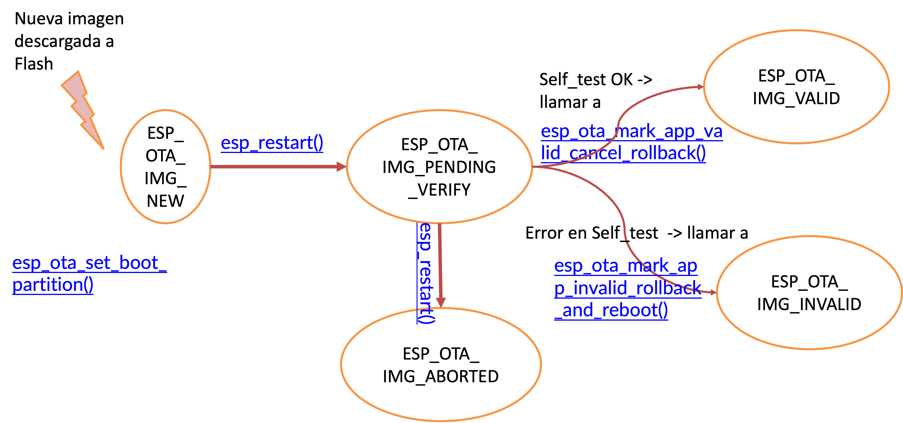

# Práctica 7. Over-The-Air Updates (OTA)

Esta práctica se desarrollará el 22 de noviembre.

## Objetivos
El objetivo de esta práctica es familiarizarse con el concepto de OTA, la actualización del *firmware* de forma remota. Específicamente, usaremos el interfaz simplificado que ofrece ESP-IDF para realizar la actualización de aplicaciones.

 Trabajaremos los siguientes aspectos:

* Actualización de *firmware* mendiante HTTPS-.
* Incorporación de certificados en nuestra aplicación.
* Firmado de binarios.


 
## Material de consulta
* [Documentación sobre el mecanismo de OTA](https://docs.espressif.com/projects/esp-idf/en/latest/esp32/api-reference/system/ota.html)
* [Documentación sobre el proceso de arranque segurlo](https://docs.espressif.com/projects/esp-idf/en/latest/esp32/security/secure-boot-v2.html)
* [Documentación sobre la tabla de particiones de ESP-IDF](https://docs.espressif.com/projects/esp-idf/en/latest/esp32/api-guides/partition-tables.html)
* [Ejemplos de OTA proporicionados por ESP-IDF](https://github.com/espressif/esp-idf/tree/master/examples/system/ota)


## Over-The-Air Update (OTA)
*OTA* es el nombre que suele dar al proceso de actualización de *firmware* de forma remota, independientemente del mecanismo de comunicación utilizado (WiFi, Bluetooth, Ethernet...).
Dicho proceso implica la recepción de una nueva imagen, su escritura y comprobación en un dispositivo de almacenamiento (no volátil), y el posterior arranque a partor de la nueva imagen.

En un despliegue IoT, la funcionalidad OTA es imprescindible. Debe contemplarse desde el inicio en el diseño de la aplicación, porque su buen funcionamiento es crítico.

### Particiones y tabla de particiones

Habitualmente, la imagen que se recibe vía red se almanceará en una **partición** diferente a la que se esté actualizando para ejecutar en el dispositivo. Una partició es una región de un dispositivo de almacenamiento que se gestiona de forma independiente. Se puede ver como un dispositivo virtual en sí mismo.

La *tabla de particiones* es la estructura que almacena la división del dispositivo de almacenamiento en particiones. La tabla indica el tamaño, tipo y ubicación de cada una, Se suele almacenar en una posición fija del propio dispositivo y ser de tamaño fijo.

En el caso concreto del ESP32 utilizado, la tabla de particiones se almacena en la *flash* (único dispositivo de almacenamiento presente), en el desplazamiento 0x8000 (32KiB más allá del comienzo de la *flash*). Tiene un tamaño de 3072 bytes, más un *checksum* MD5 almacenado tras la tabla para garantizar la integridad. Por tanto, se asigna un sector de *flash* (4KiB) para almacenar la tabla.

Por defecto, el contenido de la tabla en ESP32 es:

```c
# ESP-IDF Partition Table
# Name,   Type, SubType, Offset,  Size, Flags
nvs,      data, nvs,     0x9000,  0x6000,
phy_init, data, phy,     0xf000,  0x1000,
factory,  app,  factory, 0x10000, 1M,
```

Como se puede observar, justo tras la propia tabla (recordemos, en el desplazamiento *0x8000* y de tamaño un sector), se encuentra una partición de tipo *nvs* (*Non-Volatile Storage* API) cuyo cometido se observó en prácticas anteriores (almacenamiento de pares clave-valor). Esta partición, de 6 sectores (24KiB) por defecto, almacena infomración de la interfaz WiFi (entre otras) si se utiliza *WIFI_STORAGE_FLASH* como argumento de *esp_wifi_set_storage()* (y así es por defecto). Se recomienda que el mínimo de esta partición sea de 3 sectores, y que se haga mayor de 6 si se prevé almacenar mucha información propia de la aplicación.

La partición *phy_init* almacena datos de configuración para la inicialización del interfaz PHY. Por defecto, esta partición no se utiliza y los datos de inicialización del PHY se compilan en el propio binario de la aplicación. Si queremos que se cargue la configuración PHY desde esta partición (para, por ejemplo, particularizar el calibrado por dispositivo) debemos habilitar `CONFIG_ESP_PHY_INIT_DATA_IN_PARTITION` en *menuconfig* y volcar explícitamente la partición, ya que no se hace por defecto.

Finalmente, la partición *factory* de tipo *app* y subtipo *factory* es la partición donde escribiremos nuestro código (fichero `.bin` generado a partir del `.elf`) cuando volquemos el proyecto en la placa (`idf.py flash -p <port>`).

### Particiones para OTA

En ESP-IDF, si nuestro proyecto quiere incorporar la posibilidad de actualizarse de forma remota, debemos preverlo desde el comienzo, pues son necesarias varias particiones específicas:

```c
# Name,   Type, SubType,  Offset,   Size,  Flags
nvs,      data, nvs,      0x9000,  0x4000
otadata,  data, ota,      0xd000,  0x2000
phy_init, data, phy,      0xf000,  0x1000
factory,  app,  factory,  0x10000,  1M
ota_0,    app,  ota_0,    ,         1M
ota_1,    app,  ota_1,    ,         1M
nvs_key,  data, nvs_keys, ,        0x1000
```

Comparando con la tabla anterior, vemos dos tipo de particiones nuevas:

* *otadata* de tipo *ota*. Ocupa dos sectores y mantiene la información sobre las particiones *ota_<n>* existentes y su estado. Inicialmente, se debe inicializar a 0xFF (todo *unos*) para indicar que el arranque se debe hacer desde la partición *factory*
* *ota_0* y *ota_1*. Son dos particiones similares a *factory*, que almacenarán futuras imágenes recibidas por un interfaz de red. ESP-IDF exige que al menos tengamos dos de estas particiones, pero podemos incluir más.

## OTA *rollback*
ESP-IDF incluye la posibilidad de hacer *rollback* tras recibir una nueva imagen. La secuencia de estados por los que pasa una partición es la siguiente:



Un posible código para usar esta funcionalidad sería:

```c
void app_main(void) {
...
const esp_partition_t *running = esp_ota_get_running_partition();
esp_ota_img_states_t ota_state;

if (esp_ota_get_state_partition(running, &ota_state) == ESP_OK) {
  if (ota_state == ESP_OTA_IMG_PENDING_VERIFY) {
   // run diagnostic function ...   
   bool diagnostic_is_ok = diagnostic();
   if (diagnostic_is_ok) {
     ESP_LOGI(TAG, "Diagnostics completed successfully! Continuing execution ...");
     esp_ota_mark_app_valid_cancel_rollback();
   } else {
    ESP_LOGE(TAG, "Diagnostics failed! Start rollback to the previous version ...");
    esp_ota_mark_app_invalid_rollback_and_reboot();
   }
  }
}
```
Como se puede comprobar en la figura y en el código, en un arranque que se produce tras escribir una nueva imagen en *flash* deberíamos seguir los siguientes pasos:

* Conseguir el manejador de la partición activa (la que está ejecutando la imagen actualemnte) mediante `esp_ota_get_running_partition()`
* Conseguir el estado de dicha partición con `esp_ota_get_state_partition()`
* Realizar un diagnóstico para determinar si esta nueva imagen funciona adecuadamente (llamada a `diagnostic()` en el código de ejemplo). Esta función la debemos desarrollar nosotros mismos, no forma parte de ESP-IDF porque es específica de nuestra aplicación. También es importante resaltar que no es una comprobación de la integridad de la imagen o un proceso de autenticación. La integridad se comprueba tras el envío. Para la autenticación (garantizar que el remitente es quien debe ser) podemos obligar a que la imagen venga firmada. ESP-IDF sí ofrece funcionalidad para esta comprobación.
* Si la funcionalidad de la nueva imagen es correcta, llamaremos a `esp_ota_mark_app_valid_cancel_rollback()` y el estado de esa partición pasará a `ESP_OTA_IMG_VALID`. Los arranques posteriores (tras *reset*) seguirán siendo desde esta partición.
* Si la funcionalidad de la nueva imagen no es correcta, llamaremos a  `esp_ota_mark_app_invalid_rollback_and_reboot()` y el estado de esa partición pasará a `ESP_OTA_IMG_INVALID`. No se volerá a tratar de arrancar esta imange, y se volverá a marcar como activa la partición OTA que estuviéramos usando antes de iniciar el proceso de actualización.


## Ejercicios básicos

Vamos a partir  [del ejemplo de OTA básico](https://github.com/espressif/esp-idf/tree/master/examples/system/ota/simple_ota_example). Estudia el código, y responde a las siguientes preguntas:

!!! note "Cuestión"
    * ¿Qué entradas tiene la tabla de componentes usada?
    * ¿Cómo se llama el fichero de certificado que se incluirá en el binario?
    * ¿Cómo y dónde se indica que se debe incluir el certificado?
    * ¿Qué es el símbolo *server_cert_pem_start*?


!!! danger "Tareas"
    * Hacer funcionar el ejemplo conectando a un servidor que estará ejecutando en el equipo del profesor. Se usará [este certificado para la conexión segura por HTTP](file/ca_cert.pem) y la red WiFi creada en el laboratorio. Se proporcionaraán los credenciales de la WiFi y la IP del servidor durante el laboratorio.
    * Alterar un byte del fichero del certificado y probar nuevamente.
    * [Seguir los pasos del ejemnplo]((https://github.com/espressif/esp-idf/tree/master/examples/system/ota) para crear vuestro propio servidor HTTPS y certificado. 

## Ejercicio avanzado
Integraremos OTA en la aplicación que hemos ido desarrollando a lo largo de estas prácticas (lectura periódica del sensor de temperatura).

!!! danger "Tareas"
    La aplicación inicial corresponderá con una aplicación similar a la de prácticas anteriores: una lectura periódica del senor de temperatura cuyo valor se mostrará por pantalla. Se añadirá la siguiente funcionalidad: 
    
    * Cuando se reciba un evento externo (puede ser un mensaje por MQTT o la pulsación de un botón), la aplicación se conectará al servidor HTTPS predefinido y se bajará la nueva imagen (si se usa MQTT, la URL del servidor y el nombre de la nueva imagen se pueden comunicar en el mensaje; pero el certificado debería estar preinstalado). 
    * Se desarrollará una función de auto-diagnóstico (*self-test*) que permita decidir si la nueva imagen se comporta de forma correcta.
    * Se utilizará la opción de *rollback* para indicar si la nueva imagen se elige para futuros arranques o se marca como inválida.

!!! note "Para investigar..."
    HTTPS (SSL/TLS) no exige tener pre-almacenado el certificado de cada servidor al que nos queramos conectar. Es el propio servidor el que envía el certificado, firmado con la clave privada de una *autoridad certificador* (*CA*) que sí debemos conocer. Es un papel similar al de un notario, que valida el certificado de un servidor para que podamos confiar en su identidad.

    **Investiga** qué ofrece ESP-IDF para configurar así nuestro sistema, de modo que no tengamos que cargar el certificado de un servidor concreto, sino el de una CA (o una cadena de CAs). Enlaces recomendados para empezar:
    
    * [ESP x509 Certififcate Budle](https://docs.espressif.com/projects/esp-idf/en/latest/esp32/api-reference/protocols/esp_crt_bundle.html)
    * [ESP-TLS](https://docs.espressif.com/projects/esp-idf/en/latest/esp32/api-reference/protocols/esp_tls.html)
    * [Mbed TLS](https://docs.espressif.com/projects/esp-idf/en/latest/esp32/api-reference/protocols/mbedtls.html)