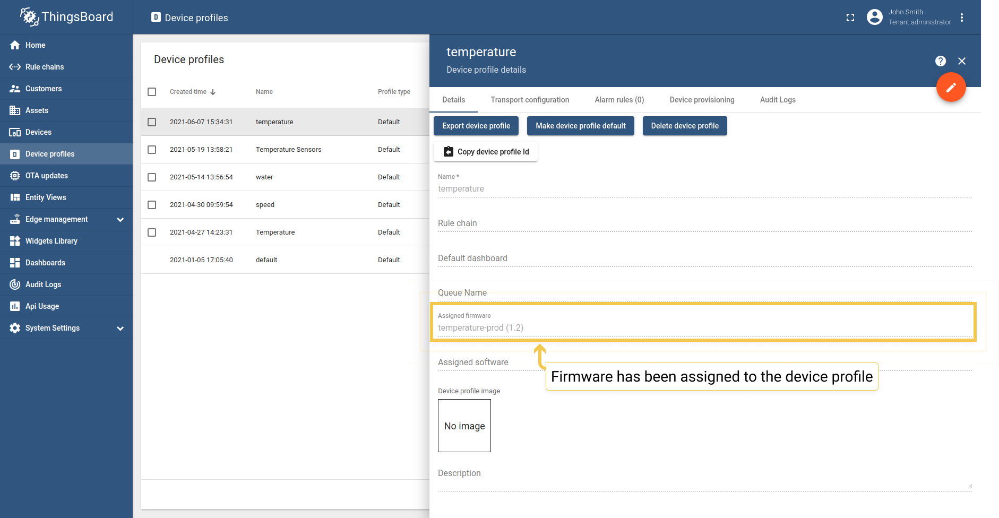
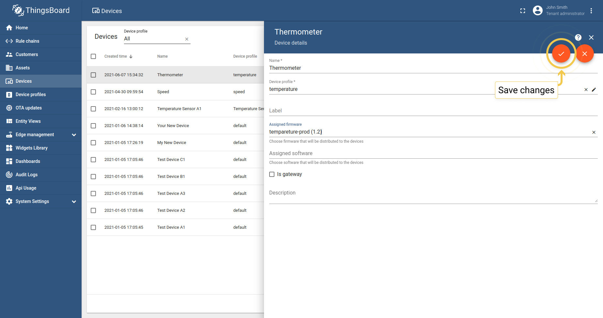
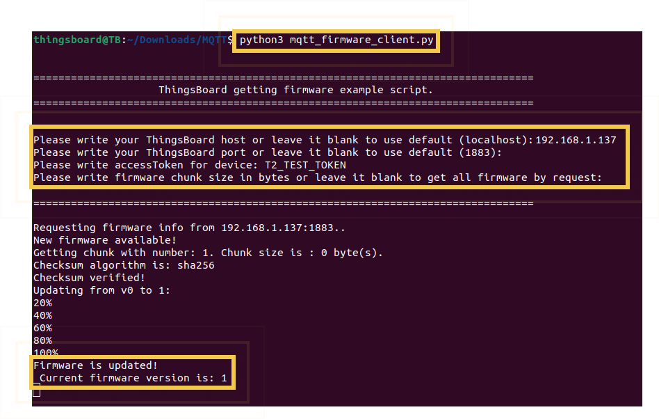

# Práctica 7 (adicional). OTA en Thingsboard


## Objetivos

El objetivo de esta práctica es familiarizarse con el proceso de OTA en la plataforma Thingsboard, para realizar actualizaciones
de fimware/software de forma remota. 

!!! note 
    Esta parte de la práctica se considera opcional y no entregable. Sin embargo, se solicitará la integración del proceso de OTA desde Thingsboard en el trabajo final de integración del Módulo Tecnología, por lo que se sugiere al menos completar las partes esenciales del boletín.

 Trabajaremos los siguientes aspectos:

* Actualización de *firmware* mendiante MQTT en Thingsboard.
* Interacción a través de la plataforma para la actualización de firmware.
* Desarrollo de un panel de control para monitorización de actualizaciones.

 
## Material de consulta
* [Documentación sobre el mecanismo de OTA en Thingsboard](https://thingsboard.io/docs/user-guide/ota-updates/)


## Over-The-Air Update (OTA) en Thingsboard

En versiones modernas de la plataforma (desde su versión 3.3), Thingsboard permite procesar y distribuir
actualizaciones OTA a dispositivos. Los tenants de la plataforma pueen subir a un repositorio de OTAs (bien
gráficamente, o bien mediante una API) imágenes que pueden a continuación asignarse a dispositivos individuales
o perfiles de dispositivo. Thingsboard se encarga, a partir de ese unto, de notificar al dispositivo sobre la
disponibilidad de una nueva versión, y proporciona una API específica (usando LWM2M, HTTP(s), MQTT(s) o CoAP)
para llevar a cabo la descarga. Además, la plataforma monitoriza el proceso de actualización y mantiene un historial
de las actualizaciones llevadas a cabo en cada dispositivo:



## Gestión del repositorio de imágenes 

Navegando hasta la entrada del menú principal titulada "OTA Updates" (Actualizaciones OTA), podemos encontrar la lista 
paquetes de actualización disponibles. Cada paquete viene descrito por:

- **Título**. Nombre del paquete.
- **Versión**. Versión del paquete. La combinación de título y versión debe ser única para cada tenant de la plataforma.
- **Perfil de dispositivo**. Cada paquete es compatible con un perfil de dispositivo. 
- **Tipo**. Puede ser firmware (FOTA) o software (SOTA). Nosotros utilizaremos la primera opción.
- **Algoritmo de checksum**. Parámetro opcional, con el nombre del algoritmo de checksum a usar.
- **Checksum**. Parámetro opcional que contiene el valor del checksum calculado para el fichero correspondiente. Si no se indica lo contrario, la plataforma utilizará SHA256 como algoritmo de cálculo de checksum.
- **Descripción**. Texto opcional y libre que describe al firmware.


!!! danger "Tarea"
    Crea en el repositorio de imágenes tantos paquetes como desees. Puedes subir imágenes ESP32 (ficheros .bin) creadas, o en general, cualquier tipo de fichero.

## Asignación de paquetes OTA a perfiles de dispositivo

Podemos asignar paquetes de firmware a perfiles de dispositivo para distribuir automáticamente el paquete a todos los dispositivos que compartan dicho perfil:




El perfil de dispositivo permite que si asignamos un paquete de firmware al perfil, se lance un proceso de actualización en todos los dispositivos que pertenecen a dicho perfil, ahorrando tiempo.

## Asignación de paquetes OTA a dispositivos

Es posible asignar imágenes de firmware/software a dispositivos específicos. Observa los pasos en las siguientes capturas:





La versión de firmware asignada a un dispositivo sobreescribirá la versión del firmware que se ha asignado al perfil de dispositivo. Por ejemplo, asumamos que disponemos de los dispositivos D1 y D2 con perfil P1:

- Si asignamos el paquete F1 al perfil P1 (a través de la UI de gestión del perfil vista en el punto anterior), los dispositivos D1 y D2 se actualizarán a F1.
- Si asignamos el paquete F2 al dispositivo D1 (a través de la UI de gestión del dispositivo), solo D1 se actualizará a F2.
- si asignamos el paquete F3 al perfil P1 solo afectará a D2, porque no tiene versión específica de firmware asignada a nivel de dispositivo individual. 


## Proceso de actualización

La asignación de firmware/software a un dispositivo o perfil de dispositivo desencadena automáticamente un proceso de actualicación. Thingsboard mantiene monitorizado el proceso de actualización a través de los atributos del dispositivo.

El proceso de actualización puede residir en un instante determinado en uno de los siguientes estados. Dicho estado se almacena com oun atributo de dispositivo y se usa para visualizar el proceso en un dashboard.

### Estado QUEUED

Es el primer estado de la actualización, marcado por el servidor. Significa que l anotificación sobre nuevo firmware disponible está encolada pero todavía no se ha llevado al dispositivo. Thingsboard encola las notificaciones para evitar picos de peticiones en el tiempo, ya que la cola se procesa ritmo constante, independientemente del número de peticiones (por defecto, se sirven 100 peticiones por minuto).

### Estado INITIATED

Significa que la notificación se ha enviado al dispositivo tras extraerla de la cola. Por debajo, Thingsboard convierte la notificación en una actualización de los siguientes *atributos compartidos* (visibles por tanto para el dispositivo):

- *fw_title*. Nombre del firmware.
- *fw_version*. Versión del firmware.
- *fw_size*. Tamaño del firmware en bytes.
- *fw_checksum*. Suma de verificación del paquete recibido.
- *fw_checksum_algorithm*. Algoritmo que se usará para verificar la integridad del paquete recibido.


El resto de estados se reportan por el dispositivo que está procesando la actualización, y no por el servidor:

### Estado DOWNLOADING

El paquete está siendo descargado tras la recepción de la notificación de nuevo firmware/software.

### Estado DOWNLOADED

El paquete ha sido descargado.

### Estado VERIFIED

El dispositivo ha verificado con éxito el checksum.

### Estado UPDATING

El dispositivo ha comenzado la actualización. Típicamente se envía ants del reinicio del dispositivo (en el caso de FOTA) o servicio (para SOTA).

### Estado UPDATED

El firmware fue correctamente actualizado a la nueva versión.

### Estado FAILED

El checksum no fue verificado, o el dispositivo fallo en el proceso de actualización.


Una vez el firmware se ha actualizado con éxito, Thingsboard espera que el usuario envíe la siguiente telemetría:

```json
{"current_fw_title": "myFirmware", "current_fw_version": "1.2.3", "fw_state": "UPDATED"}
```

En caso de error, la plataforma espera la recepción de la siguiente telemetría:

```json
{"fw_state": "FAILED", "fw_error":  "causa del error (legible)"}
```

## API MQTT de gestión de OTA/firmware

Cuando Thingsboard inicia un proceso de actualización de firmware vía MQTT, establece los atributos compartidos
`fw_title`,
`fw_version`,
`fw_checksum` y
`fw_checksum_algorithm`, como se ha dicho anteriormente. Para recibir actualizaciones de estos atributos compartidos, el 
dispositivo debe suscribirse a:

```sh
v1/devices/me/attributes/response/+
```

Cuando el dispositivo recibe actualizaciones para `fw_title` y `fw_version`, éste debe publicar vía MQTT un mensaje bajo el topic:

```sh
v2/fw/request/${requestId}/chunk/${chunkIndex}
```

donde:

- `${requestId}` es un número correspondiente al número de acuatlizaciones firmware desarrolladas por el dispositivo, que debe ser único y diferente para cada actualización de firmware.
- `${chunkIndex}` es un número correspondiente al índice de los fragmentos (chunks) de firmware recibidos; comienzan a contar en 0. El dispositivo debe incrementar el índice para cada petición, hasta que el chunk recibido sea 0. El payload debe ser el tamaño del chunk en bytes.

Para cada actualización, debe modificarse el ID de la petición y suscribirse a:

```sh
v2/fw/response/+/chunk/+
```

## Simulación de una actualización OTA desde Python usando la API MQTT

A continuación, se propone el uso de un script Python sencillo que gestiona la actualización OTA simulando un dispositivo cliente. El objetivo es que este script sirva de base para implementar los componentes necesario en ESP-IDF que permitan la actualización remota de nuestros dispositivos.

Al igual que en la práctica sobre provisionamiento, crea un entorno virtual e instala los paquetes necearios para la ejecución del script:

```sh
python3 -m venv entorno
source entorno/bin/activate
pip3 install paho-mqtt mmh3 --user
```

A continuación, descarga el script Python desde [este enlace](https://thingsboard.io/docs/user-guide/resources/firmware/mqtt_firmware_client.py). En la documentación de la plataforma tienes scripts equivalentes para HTTP y CoAP.

Ejecuta el script:

```sh
python3 mqtt_firmware_client.py
```

El script solicitará ciertos valores para configurar el cliente, incluyendo la URL y puerto de la instalación de ThingsBoard que estés usando, el token del dispositivo y el tamaño de cada fragmento de fichero descargado (si se desea fragmentar la recepción).

Si todo es correcto, el dispositivo emulará la actualización del software, simplemente descargando y almacenando en disco el fichero correspondiente:



!!! note "Tarea"
    Ejecuta el cliente para un dispositivo existente en Thingsboard. Prepara un paquete de actualización y lanza el proceso. Observa lo que ocurre en el cliente. Comprueba que efectivamente el fichero recibido es el que subiste a la plataforma (visualmente, o calculando su checksum).


!!! note "Tarea"
    Repite el proceso con múltiples clientes conectados bajo un mismo perfil, y gestiona la actualización con un único paquete para todos los dispositivos. Comprueba que la lógica de versiones para dispositivos individuales anteriormente explicada se cumple.

## Análisis del proceso de actualización

Tras recoger los datos proporcionados por el usuario, el cliente instancia un cliente PAHO MQTT, y conecta al broker proporcionado.

!!! note "Pregunta"
    ¿Qué credenciales se utilizan en el proceso de conexión?
  

### Método `__on_connect`

La función `__on_connect` se procesa si la conexión al broker ha tenido éxito.

!!! note "Pregunta"
    ¿A qué topics se suscribe el cliente tras conectar con el broker? ¿Qué datos de telemetría envía?

Por último, el cliente invoca a la función `request_firware_info`. 

!!! note "Pregunta"
    ¿Qué datos y bajo qué topic envía el cliente en este punto?

### Método `__on_message`

La función `__on_message` se procesa si la conexión al broker ha tenido éxito. Esta función es más compleja, ya 
que debe procesar la recepción de distintos tipos de mensajes por parte de Thingsboard. En ella reside la mayor
parte de la lógica de recepción del firmware.

!!! note "Pregunta"
    ¿Qué casos se procesan analizando la estructura de los topics asociados al mensaje recibido? ¿Qué ocurre si la versión recibida es la misma que la instalada? ¿Y si es diferente? ¿Cómo se procesa el mensaje de respuesta por parte de Thingsboard que incluye el firmware (o parte del mismo)? ¿Cómo se gestiona la recepción en múltiples fragmentos (*chunks*)? ¿Se envían datos de telemetría modificando el estado de la actualización (DOWNLOADING)?

### Función `get_firmware`

La función se invoca periódicamente en el proceso de recepción del firmware.  

!!! note "Pregunta"
    ¿En qué estado se encuentra en esta fase el proceso de actualización? ¿Qué datos de telemetría se envían?

### Función `process_firmware`

Esta función se invoca cuando se ha recibido la totalidad del firmware en el cliente. Observa que se envían datos de telemetría indicando el paso por los estados DOWNLOADED, VERIFIED o FAILED.

!!! note "Pregunta"
    ¿Qué tarea principal realiza la función `process_firmware`? ¿Cómo lo hace?

### Lógica de actualización

Observa, por último, que el script Python crea un hilo que simplemente espera de forma activa (función punto de entrada `__update_thread` a la recepción del firmware completo, pasando por los estados UPDATING y UPDATED. La función `dummy_upgrade` simplemente introduce esperas artificiales para simular el proceso de actualización dilatado en el tiempo. Observa también que el firmware recibido se escribe en un fichero en esta función.

!!! danger "Tarea entregable (opcional)"
    Tras estudiar y experimentar con el script Python, desarrolla una versión equivalente que gestione el proceso de actualización de firmware en un ESP32 usando Thingsboard. Para ello, opera en dos fases. En primer lugar, implementa la lógica de comunicación con la plataforma a través de la API MQTT, pero no realices el proceso de flasheo en el ESP32 (simúlalo como hace el script). Una vez comprobado el correcto funcionamiento de la lógica implementada (similar al del script), procede a la integración del proceso de actualización OTA utilizando la API de ESP-IDF. 

**NOTA IMPORTANTE: el desarrollo de esta tarea es complejo y no se espera su entrega como una práctica "normal". Sin embargo, se solicitará esta funcionalidad (aunque de forma opcional) en el trabajo de integración, por lo que se sugiere comenzar a trabajar en la tarea antes del inicio del proyecto.**

## Panel de control de monitorización OTA

Thingsboard proporciona un panel de control con el resumen de procesos de actualización de firmware, que permite 
monitorizar el progreso de cada actualización en cada dispositivo (qué dispositivos están ahora mismo en actualización, errores en los procesos de actualización, procesos completados con éxito, ...)

El panel de control se crea automáticamente con cada nuevo usuario tenant del sistema, mostrando una lista de dispositivos con información completa sobre su firmware:


Así como un historial (pulsando el botón tras el nombre del dispositivo) que permite ver el histórico de actualizaciones del sistema:


!!! note "Tarea"
    Utiliza el panel de control para monitorizar el proceso de actualización tanto del dispositivo emulado vía Python como de tu ESP32 (en el caso de haber resuelto ya la tarea anterior).

