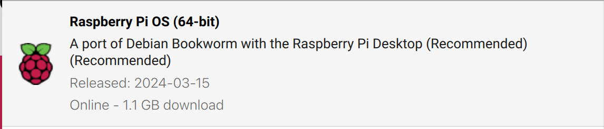

# RPI-4 con RPi OS 64 *bookworm*

Las siguientes instrucciones suponen que se ha instalado Raspberry Pi OS 64-bit en su versión Bookworm 2024-03-15.



Y que se emplea la siguiente versión del [LSI_Lab1_old.tgz](https://drive.google.com/file/d/1XZENvEQf5Wgfpm-15jswC3BbsylrqZQJ/view?usp=sharing).

## 1. Diferencias en la gestión de la cámara

### *libcamera*

La cámara ya no se gestiona del mismo modo, ahora se hace por medio de la *libcamera*.

Para más información sobre los módulos de cámara de la Raspberry Pi y el software asociado consultar el siguiente [enlace](https://www.raspberrypi.com/documentation/accessories/camera.html) (mejor no buscar en Google porque la mayor parte de la información está obsoleta).

Asociado a este nuevo interfaz se proporcionan nuevas herramientas de línea de comandos como `libcamera-hello`, `libcamera-still`, etc.  que son útiles para comprobar el correcto funcionamiento de la cámara.

### Problema de OpenCV y *libcamera*

Al usar la *libcamera* hay un problema de compatibilidad con OpenCV y la cámara de la Raspberry Pi no se puede usar directamente como dispositivo `0`, es necesario usarlo a través de un pipeline de *Gstreamer*.

## 2. Gstreamer

### ¿Qué es?

GStreamer es un framework de código abierto para la creación, manipulación y reproducción de flujos multimedia. 

### Instalación *Gstreamer*

Es preciso instalar los siguientes paquetes (basado este [enlace](https://qengineering.eu/install-gstreamer-1.18-on-raspberry-pi-4.html) y actualizado para *bookworm*)

``` shell
# install a missing dependency
$ sudo apt-get install libx264-dev libjpeg-dev
# install the remaining plugins
$ sudo apt-get install libgstreamer1.0-dev \
     libgstreamer-plugins-base1.0-dev \
     libgstreamer-plugins-bad1.0-dev \
     gstreamer1.0-plugins-ugly \
     gstreamer1.0-tools \
     gstreamer1.0-gl \
     gstreamer1.0-gtk3 
# if you have Qt5 install this plugin
$ sudo apt-get install gstreamer1.0-qt5
# install the compatibility package
$ sudo apt-get install gstreamer1.0-libcamera
# install if you want to work with audio
$ sudo apt-get install gstreamer1.0-pulseaudio
```

### Prueba de un pipeline básico (640x480)

```sh
$ gst-launch-1.0 libcamerasrc ! video/x-raw, width=640, height=480, framerate=30/1 ! videoconvert ! videoscale ! clockoverlay time-format="%D %H:%M:%S" ! autovideosink
```

## 3. OpenCV

### Instalación de OpenCV (4.6)

Por defecto *Bookworm* incluye la versión 4.6, si se necesita una más reciente es preciso compilarla o buscar un binario pre-compilado.

```sh
$ sudo apt-get install libopencv-dev
$ sudo apt-get install python3-opencv
```

### Ejemplo C++ de OpenCV empleando *libcamera+gstreamer*

Basado en este [ejemplo para *Bulleye*](https://github.com/Qengineering/Libcamera-OpenCV-RPi-Bullseye-64OS) pero retocado *Bookworm*:

```sh
$ git clone https://github.com/Qengineering/Libcamera-OpenCV-RPi-Bullseye-64OS
$ cd Libcamera-OpenCV-RPi-Bullseye-64OS
```

Modificar el fichero `GStreamer_RPi_64_Bullseye.cbp`del siguiente modo:

```diff
diff --git a/GStreamer_RPi_64_Bullseye.cbp b/GStreamer_RPi_64_Bullseye.cbp
index 69b7181..0d27522 100644
--- a/GStreamer_RPi_64_Bullseye.cbp
+++ b/GStreamer_RPi_64_Bullseye.cbp
@@ -32,7 +32,7 @@
                        <Add option="-Wall" />
                        <Add option="-fexceptions" />
                        <Add option="-pthread" />
-                       <Add directory="/usr/local/include/opencv4" />
+                       <Add directory="/usr/include/opencv4" />
                        <Add directory="/usr/include/gstreamer-1.0" />
                        <Add directory="/usr/lib/aarch64-linux-gnu/glib-2.0/include" />
                        <Add directory="/usr/include/glib-2.0" />
@@ -43,7 +43,7 @@
                        <Add option="-pthread" />
                        <Add library="/usr/lib/aarch64-linux-gnu/libgobject-2.0.so" />
                        <Add library="/usr/lib/aarch64-linux-gnu/libgstreamer-1.0.so" />
-                       <Add library="/usr/lib/aarch64-linux-gnu/libgstapp-1.0.so" />
+                       <Add library="/usr/lib/aarch64-linux-gnu/libgstapp-1.0.so.0" />
                        <Add directory="/usr/local/lib/" />
                </Linker>
                <Unit filename="main.cpp" />
```

Para compilar este ejemplo es necesario instalar CodeBlocks, abrir el proyecto (fichero `.cbp`) y construirlo. Se puede ejecutar tanto desde CodeBlocks como desde línea de comando (`)

```sh
$ sudo apt-get install codeblocks
```

Esencialmente el código lo que hace es abrir pipeline de *Gstreamer* como el visto anteriormente:

```c++
std::string gstreamer_pipeline(int capture_width, int capture_height, int framerate, int display_width, int display_height) {
    return
            " libcamerasrc ! video/x-raw, "
            " width=(int)" + std::to_string(capture_width) + ","
            " height=(int)" + std::to_string(capture_height) + ","
            " framerate=(fraction)" + std::to_string(framerate) +"/1 !"
            " videoconvert ! videoscale !"
            " video/x-raw,"
            " width=(int)" + std::to_string(display_width) + ","
            " height=(int)" + std::to_string(display_height) + " ! appsink";
}
```

```c++
//pipeline parameters
int capture_width = 640; //1280 ;
int capture_height = 480; //720 ;
int framerate = 15 ;
int display_width = 640; //1280 ;
int display_height = 480; //720 ;

// create pipeline string
std::string pipeline = gstreamer_pipeline(capture_width, capture_height, framerate,
                                              display_width, display_height);
// open pipeline
cv::VideoCapture cap(pipeline, cv::CAP_GSTREAMER);
```

Este código se puede reutlizar en los laboratorios del Lab1.

### Ejemplo Python de OpenCV empleando *libcamera+gstreamer*

Bastaría con substituir `cap = cv2.VideoCapture(0)`por la siguiente secuencia de código y todo debería funcionar correctamente:

```python
pipeline = "libcamerasrc ! video/x-raw,  width=(int)640, height=(int)480, framerate=(fraction)15/1 ! videoconvert ! videoscale ! video/x-raw, width=(int)640, height=(int)480 ! appsink"

cap = cv2.VideoCapture(pipeline,cv2.CAP_GSTREAMER)
```

Se puede probar con el ejemplo de cámara de Python del Lab1.

## 4. Tensorflow-Lite C++

### Instalación

Lo más sencillo es buscar un binario reciente pre-compilado para Raspberry Pi OS 64 *Bookworm* como por ejemplo este: [TF-Lite 2.16.1](https://github.com/prepkg/tensorflow-lite-raspberrypi?tab=readme-ov-file). 

El proceso de instalación es sencillo:

```sh
$ wget https://github.com/prepkg/tensorflow-lite-raspberrypi/releases/latest/download/tensorflow-lite_64.deb
$ sudo dpkg -i tensorflow-lite_64.deb
```

### Lab1/Classificacion/CPP

Para probar el ejemplo C++ de *clasificación de imágenes* del Lab1 basta con realizar las modificaciones relativas a la captura de cámara comentadas anteriormente y compilar el código con el siguiente comando en lugar del empleado originalmente:

```sh
$ cd LSI_Lab1/Clasificacion/CPP
$ g++ classification.cpp -I /usr/local/include -lpthread -ldl -ltensorflow-lite `pkg-config --cflags --libs opencv4` -o classification.x
```

Para probarlo, al igual que vimos en su momento hay que descargar previamente los modelos. De momento sólo la versión CPU y mejor hacerlo con los siguiente comandos:

```sh
$ cd LSI_Lab1/Clasificacion/
$ curl -O https://storage.googleapis.com/download.tensorflow.org/models/tflite/mobilenet_v1_1.0_224_quant_and_labels.zip
$ unzip mobilenet_v1_1.0_224_quant_and_labels.zip -d Modelos
$ rm mobilenet_v1_1.0_224_quant_and_labels.zip
```

Para ejecutar basta con los siguientes comandos:

```sh
$ cd LSI_Lab1/Clasificacion/CPP
$ ./classification.x
```

## 5. Runtime EdgeTPU

Las fuentes de `libedgetpu` están disponibles el [GitHub de Google-Coral](https://github.com/google-coral/libedgetpu) pero lo más sencillo es decargar binarios pre-compilados para `bookworm` y `arm64` (también denominado `aarch64`). 

Instrucciones de instalación:

```sh
$ wget https://github.com/feranick/libedgetpu/releases/download/16.0TF2.16.1-1/libedgetpu-dev_16.0tf2.16.1-1.bookworm_arm64.deb
$ wget https://github.com/feranick/libedgetpu/releases/download/16.0TF2.16.1-1/libedgetpu1-max_16.0tf2.16.1-1.bookworm_arm64.deb
$ sudo dpkg -i libedgetpu*
```

## 6. Diferencias en la gestión de módulos de Python

Debian *Bookworm* incluye por defecto Python 3.11 que exige la utilización de entornos virtuales para la gestión de módulos. 

Si no se emplea un entorno virtual aparece un aviso:

```sh
$ pip3 install tensorflow
error: externally-managed-environment

× This environment is externally managed
╰─> To install Python packages system-wide, try apt install
    python3-xyz, where xyz is the package you are trying to
    install.

    If you wish to install a non-Debian-packaged Python package,
    create a virtual environment using python3 -m venv path/to/venv.
    Then use path/to/venv/bin/python and path/to/venv/bin/pip. Make
    sure you have python3-full installed.

    For more information visit http://rptl.io/venv

note: If you believe this is a mistake, please contact your Python installation or OS distribution provider. You can override this, at the risk of breaking your Python installation or OS, by passing --break-system-packages.
```

Aunque no es la manera más elegante, en nuestro contexto, lo más sencillo es deshabilitar ese chequeo mediante el siguiente comando:

```sh
$ sudo mv /usr/lib/python3.11/EXTERNALLY-MANAGED /usr/lib/python3.11/EXTERNALLY-MANAGED.old
```

## 7. TF-Lite y EdgeTPU desde Python

Basta con instalar los paquetes correspondientes:

```
$ pip3 install tflite-runtime
```

Para poder usar los ejemplos del Lab1 basta con modificar la captura de cámara como hemos indicado previamente.
