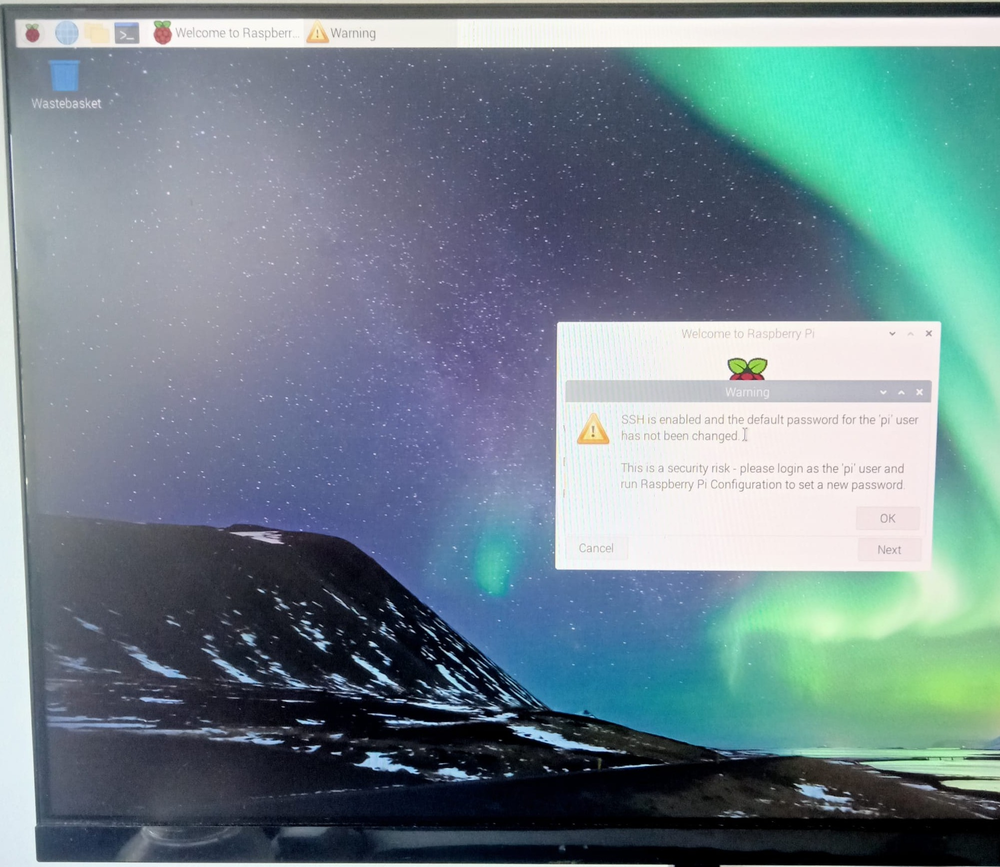

# Laboratorio 0. Entorno experimental

## Objetivos

* Preparar el entorno experimental.
* Completar la configuración del sistema.
* Probar el correcto funcionamiento tanto del Software como del Hardware.
* Demostrar la capacidad de procesamiento tanto de la placa Raspberry Pi como del acelerador EdgeTPU de Google.

## Introducción

El entorno experimental que se va a emplear en esta parte de la asignatura está compuesto de los siguientes elementos:

* Hardware
  * Kit Raspberry Pi 4
    * Placa Raspberry Pi 4 con un SoC Broadcom BCM2711 con las siguientes características: Quad core de Cortex-A72, ARM v8 de 64-bit, @1.5GHz (+ [info](https://www.raspberrypi.org/products/raspberry-pi-4-model-b/specifications/)) 
    * Alimentador USB-C
    * Cable micro-HDMI a HDMI
    * Tarjeta uSD de alta velocidad
  * Kit aceleración
    * Acelerador Coral USB (+ [info](https://coral.ai/products/accelerator/) )
    * Cámara para Raspberry Pi v2
* Software
  * Raspberry Pi OS  - Distribución Linux basada en Debian adaptada a la Raspberry Pi en su versión de 64 bits
  * OpenCV 4.5.5 - Librería de visión por computador

A continuación se proporcionan las instrucciones para configurar y probar el entorno experimental.

## Preparación SD

Para simplificar el proceso de instalación se proporciona una imagen comprimida del sistema operativo con el software necesario pre-instalado. No obstante, si alguien desea realizar el proceso de instalación completo por su cuenta, puede seguir las instrucciones de la web de [Maker Kit](https://github.com/google-coral/aiy-maker-kit-tools/), que suelen ser bastante completas y actualizadas.

A continuación se detallan los pasos a seguir para grabar la imagen de la tarjeta SD que hemos preparado..

1. Descargar e instalar un programa para *flashear* tarjetas SD:
	* [Raspberry Pi Imager](https://www.raspberrypi.org/software/) (recomendado)
	* [BalenaEtcher](https://www.balena.io/etcher/)
2. Descargar la imagen comprimida del siguiente enlace
	* [Imagen Maker Kit(basado Raspberry Pi OS)](https://github.com/google-coral/aiy-maker-kit-tools/releases/download/v20220518/aiy-maker-kit-2022-05-18.img.xz)
3. Empleado un lector/escritor de tarjetas SD escribir la imagen a disco:
	 
	* Seleccionar la tarjeta SD sobre la que se desea escribir (64GB)
	* Seleccionar sistema operativo: *"Use custom"* y localizar el fichero de la imagen comprimida previamente descargada (no es necesario descomprimirla previamente)
	
	* Realizar la escritura (puede tardar bastantes minutos)
	

## Conexión, arranque y configuración
1. Realizar la conexión de los dispositivos
	* Conectar el teclado y el ratón a los puertos USB 2.0, dejando al menos uno de los puertos USB 3.0 libre para el acelerador Google Coral (tienen un remate azul)
	* Conectar el monitor mediante el cable micro-HDMI a HDMI
		
	* Insertar la tarjeta SD grabada previamente
	* Conectar la cámara *"Raspberry Pi Camera Module v2"* (sensor Sony IMX219, interfaz CSI-2, resolución 3280 x 2464 píxeles, 30fps)
		
	* Para información más precisa de la conexión se puede consultar el siguiente [video.](https://youtu.be/lAbpDRy-gc0)
2. Conectar alimentación (cable USB-C), teclado y ratón. Comprobar el correcto arranque del equipo
3. Configuración primer arranque:
	* Seleccionar país de uso/lenguaje/Tiempo horario
	* Contraseña del usuario **pi** (por defecto "raspberry")
	
         
4. Acceder a la Wifi
	* SSID="UCM" y con las credenciales UCM propias
	* SSID="rpi-miot" con las contraseña "RPI-MIOT_2223"
5. Actualización del sistema 
	* Abrir una consola e invocar `apt update` y `apt full-upgrade`
```bash
pi@raspberry: $ sudo apt update
Get:1 http://raspbian.raspberrypi.org/raspbian buster InRelease [15.0 kB]
...
pi@raspberrypi:~ $ sudo apt full-upgrade
Reading package lists... Done
Building dependency tree       
Reading state information... Done
Calculating upgrade... Done
...
```
6. Alguna configuraciones extra (**opcionales**)
	* Opciones del sistema con el comando *raspi-config*: `sudo raspi-config`
		
		* S3- Clave usuario `pi`
			
		* S4 - Nombre del equipo
	* Opciones de interfaz
		
		* P1 - Activar cámara
		* P2 - Activar SSH para conexión remota
		* P3 - Activar VNC (opcional)
	* Finalizar y reiniciar el equipo

## Demos básicas
* Comprobar la correcta detección de la cámara
```bash
	$ vcgencmd get_camera
	supported=1 detected=1
```
* Comprobar temperatura (opcional)
```bash
	$ vcgencmd measure_temp
	temp=39.9'C
```
* Comprobar funcionamiento cámara y acelerador Coral (cámara + OpenCV + TensorFlowLite)
```bash
pi@raspberrypi:~ $ cd ~/aiy-maker-kit
pi@raspberrypi:~/aiy-maker-kit $ python3 ./run_tests.py 
--- Checking display ---
Found a display.

--- Checking required files ---
Found the required files.

--- Testing camera ---
Press Q to quit
Camera started successfully.
Closing video in... 0
Camera is working.

--- Testing USB Accelerator ---
Loading a model...
USB Accelerator is working.

Everything look good!

```

## Demos avanzadas
Vamos a evaluar la ganancia en tiempo de inferencia (ejecución de un modelo) que podemos alcanzar con el uso del acelerador de la [Coral USB](https://coral.ai/products/accelerator/). Para ello vamos a descargar un repositorio donde se encuentran varias ejemplos que capturan el vídeo con la cámara y aplican varios ejemplos de IA empleando modelos que pueden invocarse con la [API TensorFlow Lite](https://tensorflow.org/lite). Para este fin vamos a evaluar la ganancia de emplear el acelerador [Coral USB](https://coral.withgoogle.com/products/accelerator).

### Pasos a realizar
1. Clonar un repositorio con los ejemplos que se pueden encontrar en la [URL](https://github.com/google-coral/examples-camera)
```bash
pi@raspberrypi:~ $ mkdir google-coral && cd google-coral
pi@raspberrypi:~/google-coral $ git clone https://github.com/google-coral/examples-camera.git --depth 1
```

2. Descargar los modelos para poder testear los ejemplo mediante el script **download_models.sh**
```bash
pi@raspberrypi:~/google-coral $ cd examples-camera/
pi@raspberrypi:~/google-coral/examples-camera $ bash download_models.sh 
```

3. Uso de ejemplos. En el directorio *gstreamer* se encuentran varios ejemplos escritos en python que capturan imágenes con la cámara y ejecutan los modelos en el acelerador Coral USB. Pero antes de nada vamos a instalar los requisitos para poder usar la herramienta *gstreamer* que va capturando imagen tras imagen para realizar su inferencia invocando el script **install_requirements.sh**
```bash
pi@raspberrypi:~/google-coral/examples-camera $ cd gstreamer/
pi@raspberrypi:~/google-coral/examples-camera/gstreamer $ bash ./install_requirements.sh 
```

Por último lanzaremos el ejemplo de detección de objetos para lo cual emplearemos el ejemplo de python **detect.py**. Podemos conocer las opciones que permite dicho script mediante el flag ```python3 detect.py -h```. Vamos a emplear el modelo de detección de caras *mobilenet_ssd_v2_face* que se encuentra en el directorio *all_models*. Para ello ejecutaremos el siguiente comando:
```bash
pi@raspberrypi:~/google-coral/examples-camera/gstreamer $ python3 detect.py --model ../all_models/mobilenet_ssd_v2_face_quant_postprocess_edgetpu.tflite
```

Es importante tener en cuenta que el modelo seleccionado es **mobilenet_ssd_v2_face_quant_postprocess_edgetpu.tflite** que se ejecutará en el acelerador Coral.


!!! danger "Tarea"
	¿Cual es el tiempo de inferencia de cada imagen? Presta atención en el modelo elegido  ya tiene que formato TFLite y está optimizado para el acelerador Coral USB (las nomenclatura del modelo *edgetpu* así lo indica)
	
!!! danger "Tarea"
	¿Cuál es el tiempo de inferencia si empleásemos el modelo equivalente que no se ejecuta en el Coral USB que lleva el nombre de **mobilenet_ssd_v2_face_quant_postprocess.tflite**?
