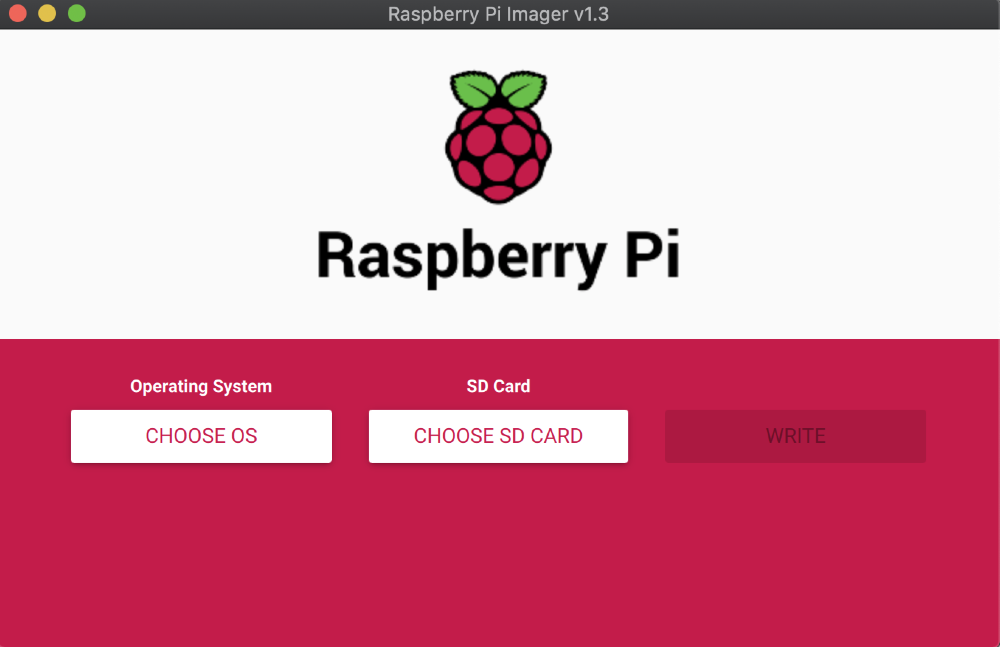
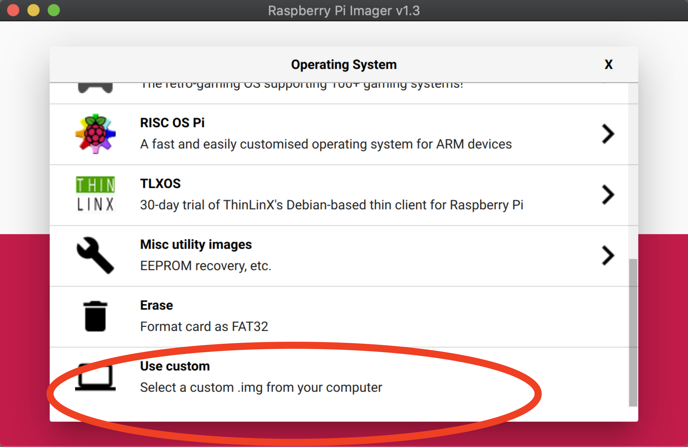
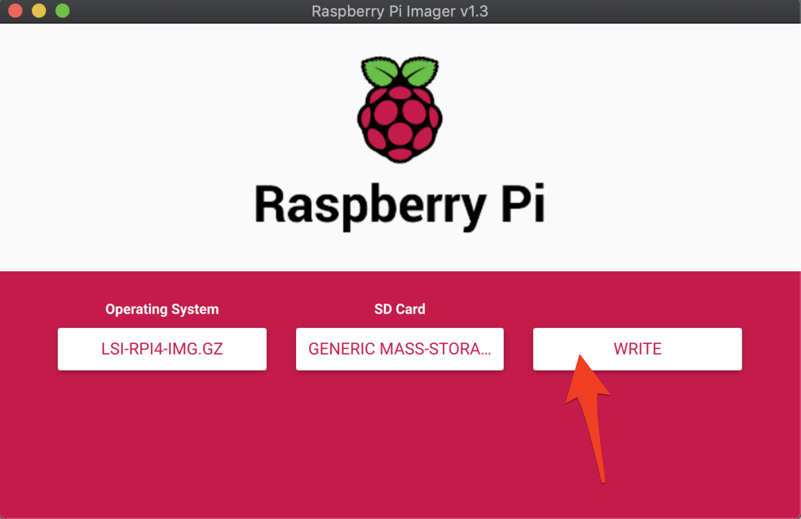
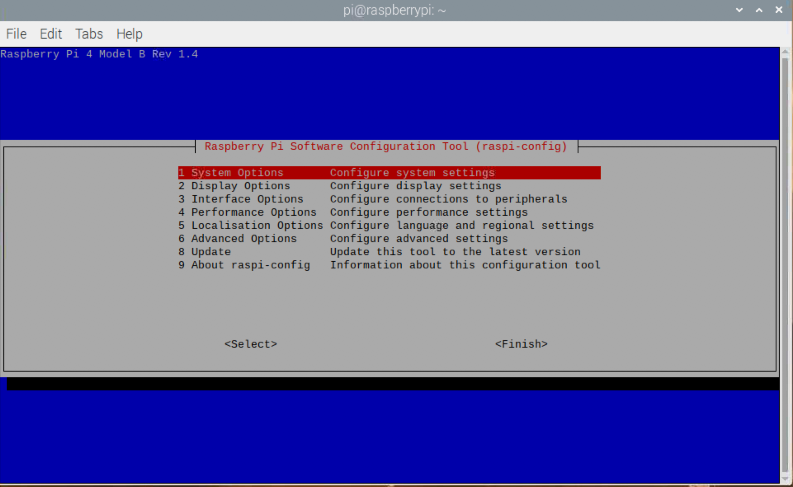
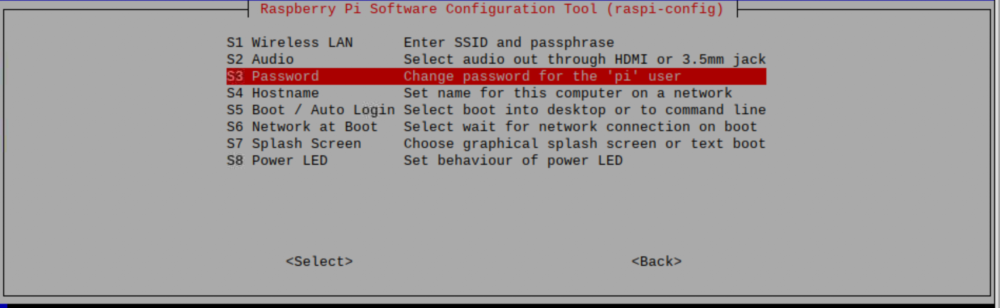
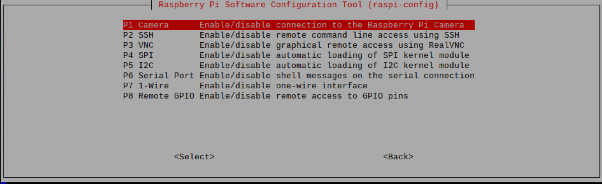

# Laboratorio 0. Entorno experimental

## Objetivos

* Preparar el entorno experimental.
* Completar la configuración del sistema.
* Probar el correcto funcionamiento tanto del Software como del Hardware.
* Demostrar la capacidad de procesamiento tanto de la placa Raspberry Pi como del acelerador EdgeTPU de Google.

## Introducción

El entorno experimental que se va a emplear en esta parte de la asignatura está compuesto de los siguientes elementos:

* Hardware
  * Kit Raspberry Pi 4
    * Placa Raspberry Pi 4 con un SoC Broadcom BCM2711 con las siguientes características: Quad core de Cortex-A72, ARM v8 de 64-bit, @1.5GHz (+ [info](https://www.raspberrypi.org/products/raspberry-pi-4-model-b/specifications/)) 
    * Alimentador USB-C
    * Cable micro-HDMI a HDMI
    * Tarjeta uSD de alta velocidad
  * Kit aceleración
    * Acelerador Coral USB (+ [info](https://coral.ai/products/accelerator/) )
    * Cámara para Raspberry Pi v2
* Software
  * Raspbian OS 64 bits - Distribución Linux basada en Debian adaptada a la Raspberry Pi en su versión de 64 bits (beta)
  * OpenCV 4.5.1 - Librería de visión por computador
  * TensorFlow 2.4 - Librería de Aprendizaje Máquina
    * TensorFlowLite - versión para sistemas *Edge/Mobile*

A continuación se proporcionan las instrucciones para configurar y probar el entorno experimental.

## Preparación SD

Para simplificar el proceso de instalación se proporciona una imagen comprimida del sistema operativo con el software necesario pre-instalado. No obstante, si alguien desea realizar el proceso de instalación completo por su cuenta, puede seguir las instrucciones de la web de [Q-engineering](https://qengineering.eu), que suelen ser bastante completas y actualizadas.

A continuación se detallan los pasos a seguir para grabar la imagen de la tarjeta SD que hemos preparado..

1. Descargar e instalar un programa para *flashear* tarjetas SD:
	* [Raspberry Pi Imager](https://www.raspberrypi.org/software/) (recomendado)
	* [BalenaEtcher](https://www.balena.io/etcher/)
2. Descargar la imagen comprimida del siguiente enlace
	* [lsi-rpi4-img.gz](https://drive.google.com/file/d/18N4STU_utrJCgKZ_HA9Ot8QORdKj4oLR/view?usp=share_link)
	* Nota: Alternativamente cabría la posibilidad de usar la imagen que ofrece Q-engineering en su repositorio de GitHub:
		* [A Raspberry Pi 4 64-bit OS image of several frameworks and deep-learning examples](https://github.com/Qengineering/RPi-image)
3. Empleado un lector/escritor de tarjetas SD escribir la imagen a disco:
	 
	* Seleccionar la tarjeta SD sobre la que se desea escribir (64GB)
	* Seleccionar sistema operativo: *"Use custom"* y localizar el fichero de la imagen comprimida previamente descargada (no es necesario descomprimirla previamente)
	
	* Realizar la escritura (puede tardar bastantes minutos)
	

## Conexión, arranque y configuración

1. Realizar la conexión de los dispositivos
	* Conectar el teclado y el ratón a los puertos USB 2.0, dejando al menos uno de los puertos USB 3.0 libre para el acelerador Google Coral (tienen un remate azul)
	* Conectar el monitor mediante el cable micro-HDMI a HDMI
		
	* Insertar la tarjeta SD grabada previamente
	* Conectar la cámara *"Raspberry Pi Camera Module v2"* (sensor Sony IMX219, interfaz CSI-2, resolución 3280 x 2464 píxeles, 30fps)
		
	* Para información más precisa de la conexión se puede consultar el siguiente [video.](https://youtu.be/lAbpDRy-gc0)
2. Conectar alimentación (cable USB-C) y comprobar el correcto arranque del equipo
3. Acceder a la Wifi con SSID=UCM y con las credenciales UCM propias
	* El procedimiento es análogo a cualquier otro computador, se accede a la wifi y posteriormente se abre un navegador y  se introducen las credenciales (+ [info](https://ssii.ucm.es/ucm))
	
4. Configurar la raspi con la utilidad `raspi-config`

```bash
	sudo raspi-config
```

* Opciones del sistema
	
	* S3- Clave usuario `pi`
		
	* S4 - Nombre del equipo
* Opciones de interfaz
	
	* P1 - Activar cámara
	* P2 - Activar SSH para conexión remota
	* P3 - Activar VNC (opcional)
* Finalizar y reiniciar el equipo

## Demos básicas

* Comprobar la correcta detección de la cámara
```bash
	$ vcgencmd get_camera
	supported=1 detected=1
```
* Comprobar temperatura (opcional)
```bash
	$ vcgencmd measure_temp
	temp=39.9'C
```
* Probar un ejemplo completo (cámara + OpenCV + TensorFlowLite)
	* El siguiente ejemplo de *Qengineering* ilustra realizar una segmentación de imáganes empleado el modelo DeepLab v3 (fuente: [github](https://github.com/Qengineering/TensorFlow_Lite_Segmentation_RPi_64-bit))
```bash
	cd ~/Test/TensorFlow_Lite_Segmentation_RPi_64-bit
	bin/Release/TestUnet
```
]


* Otros ejemplos precompiladosde *Qengineering* 
	* `TensorFlow_Lite_Pose_RPi_64-bits`: detección de postura corporal
	* `TensorFlow_Lite_SSD_RPi_64-bits`: detección de objetos
	* Nota:
		* Se trata de proyectos CodeBlocks, para compilarlos de nuevo es preciso abrir el correspondiente proyecto (`*.cbp`)
		* En ambos casos utilizan videos en lugar de captura de cámara.
		* Para usar la cámara es preciso modificar la línea `VideoCapture(0);` y recompilar el proyecto.

## Demo Google Coral

### Configuración necesaria para usar el acelerador Google Coral
* Añadir usuario `pi` al grupo `plugdev` (para no tener que ejecutar los programas como `root`)
```bash
	sudo usermod -aG plugdev $USER
```
* Instalar las fuentes de paquetes.
```bash
	echo "deb https://packages.cloud.google.com/apt coral-edgetpu-stable main" | sudo tee \
		/etc/apt/sources.list.d/coral-edgetpu.list
	curl https://packages.cloud.google.com/apt/doc/apt-key.gpg | sudo apt-key add -
	sudo apt-get update
```
* Instalar la librería de soporte, para la que hay dos opciones incompatibles `libedgetpu1-std` y `libedgetpu1-max` (máxima frecuencia y temperatura):
```bash
	sudo apt-get install libedgetpu1-max
```
### Demo
En el directorio `~/Test/TensorFlow-Lite-Object-Detection-on-Android-and-Raspberry-Pi` se proporciona un ejemplo de uso del acelerador Google Coral (fuente: [github](https://github.com/EdjeElectronics/TensorFlow-Lite-Object-Detection-on-Android-and-Raspberry-Pi/)) a continuación se indican las instrucciones para probarlo:

#### Sín EdgeTPU (i.e. Google Coral):
```bash
	cd ~/Tests/TensorFlow-Lite-Object-Detection-on-Android-and-Raspberry-Pi
	python3 TFLite_detection_webcam.py --modeldir=Sample_TFLite_model
```
#### Con EdgeTPU:

* Descarga modelo específico:
```bash
	wget    https://dl.google.com/coral/canned_models/mobilenet_ssd_v2_coco_quant_postprocess_edgetpu.tflite         
	mv mobilenet_ssd_v2_coco_quant_postprocess_edgetpu.tflite Sample_TFLite_model/edgetpu.tflite
```
* Conectar EdgeTPU a un puerto USB 3.0.
* Ejecutar la versión EdgeTPU
```bash
	python3 TFLite_detection_webcam.py --modeldir=Sample_TFLite_model --edgetpu
```
