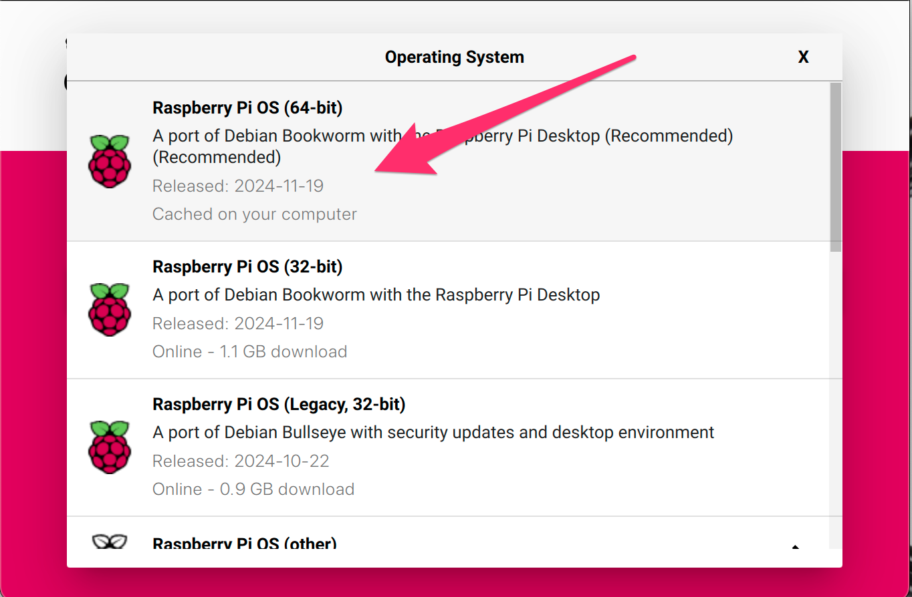
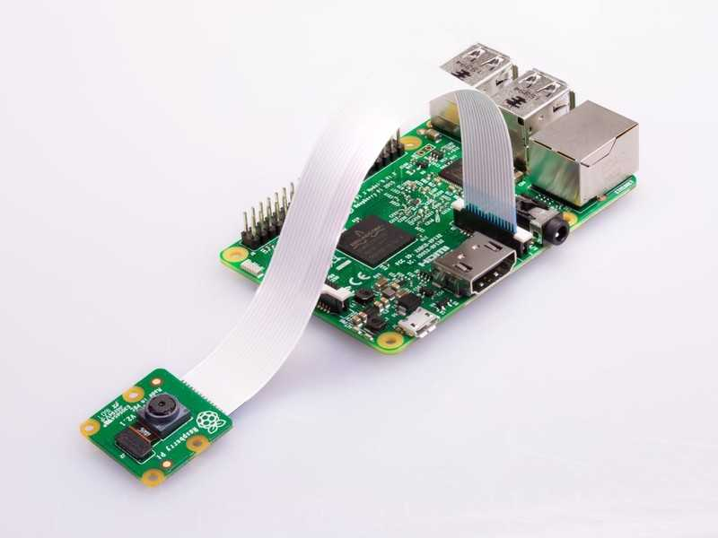
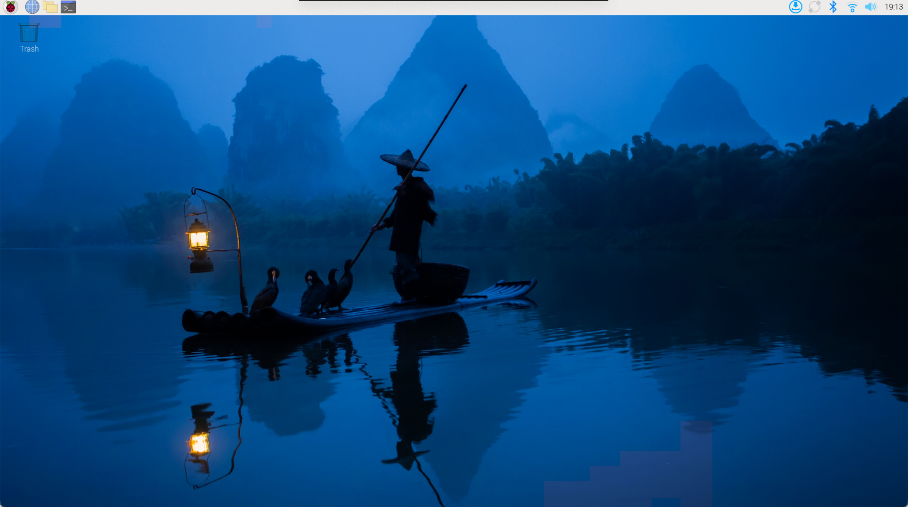
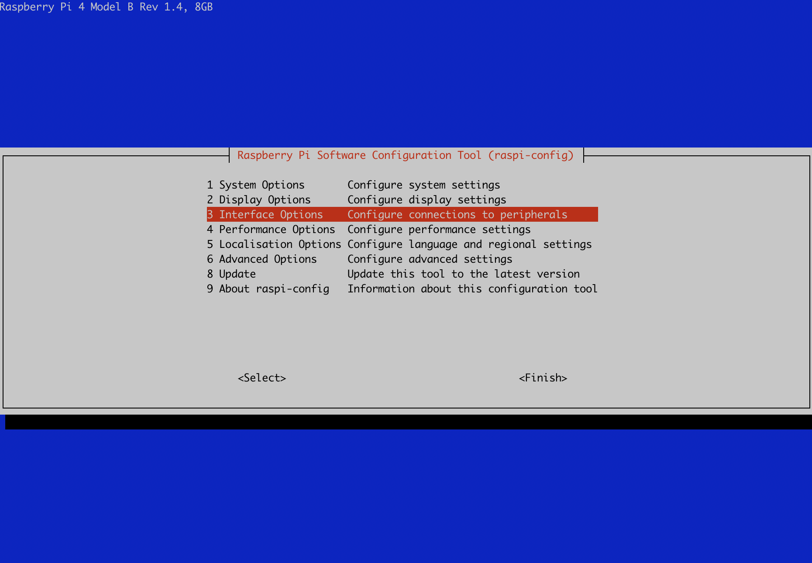
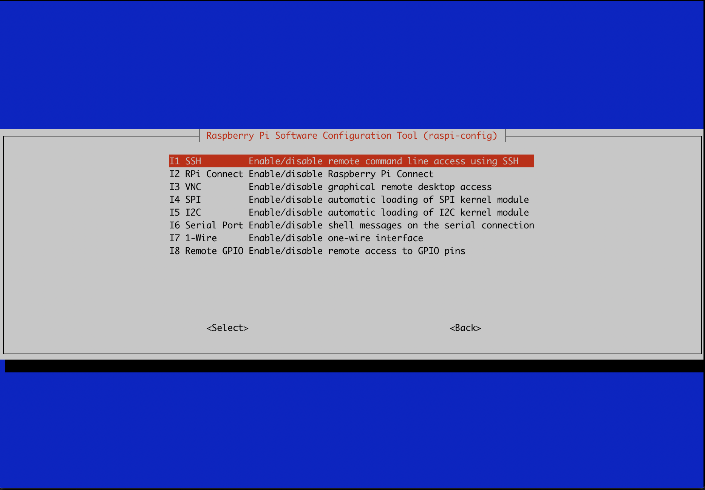

# Laboratorio 0. Entorno experimental

## Objetivos

* Preparar el entorno experimental.
* Completar la configuración del sistema.
* Probar el correcto funcionamiento tanto del Software como del Hardware.
* Familiarizase con la captura de imágenes mediante OpenCV

## 1. Introducción

El entorno experimental que se va a emplear en esta parte de la asignatura está compuesto de los siguientes elementos:

* Hardware
  * Kit Raspberry Pi 4
    * Placa Raspberry Pi 4 con un SoC Broadcom BCM2711 con las siguientes características: Quad core de Cortex-A72, ARM v8 de 64-bit, @1.5GHz (+ [info](https://www.raspberrypi.org/products/raspberry-pi-4-model-b/specifications/)) 
    * Alimentador USB-C
    * Cable micro-HDMI a HDMI
    * Tarjeta uSD de alta velocidad
  * Kit aceleración
    * Acelerador Coral USB (+ [info](https://coral.ai/products/accelerator/) )
    * Cámara para Raspberry Pi v2
  * Lector de tarjetas SD
    * No proporcionado, pero un gran número de portátiles lo llevan integrado.
* Software
  * Raspberry Pi OS  - Distribución Linux basada en Debian adaptada a la Raspberry Pi en su versión de 64 bits
  * OpenCV - Librería de visión por computador

A continuación se proporcionan las instrucciones para configurar y probar el entorno experimental.

## 2. Preparación SD

Grabar el sistema operativo Raspberry Pi OS (64-bit) en una SD siguiendo las [instrucciones de instalación](https://www.raspberrypi.com/documentation/computers/getting-started.html) de la web oficial de Raspberry Pi.



## 3. Conexión, arranque y configuración
1. Realizar la conexión de los dispositivos
  * Conectar el teclado y el ratón a los puertos USB 2.0, dejando al menos uno de los puertos USB 3.0 libre para el acelerador Google Coral (tienen un remate azul)
  * Conectar el monitor mediante el cable micro-HDMI a HDMI

  * Insertar la tarjeta SD grabada previamente
  * Conectar la cámara *"Raspberry Pi Camera Module v2"* (sensor Sony IMX219, interfaz CSI-2, resolución 3280 x 2464 píxeles, 30fps)



  * Para información más precisa de la conexión se puede consultar el siguiente [video.](https://youtu.be/lAbpDRy-gc0)

2. Conectar alimentación (cable USB-C), teclado y ratón. Comprobar el correcto arranque del equipo y proceder a la configuración inicial.

   

3. Configuración inicial:

  * Seleccionar país, lenguaje y zona horaria.
  * Configurar usuario, contraseña.
  * Configurar la Wifi (*rpi-miot*).
  * Seleccionar navegador (*Chromium*).
  * Actualización del software.
4. Reiniciar y comprobar la configuración inicial (en especial la red).

   

5. Completar la configuración necesaria:

   * Abrir una ventana de terminal y completar la configuración mediante comando *raspi-config*: `sudo raspi-config`

     


   * Establecer las opciones de interfaz necesarias:

   	
   	
   	* Activar conexión mediante SSH (mínimo) y recomendable por VNC.

6. Finalizar y reiniciar el equipo

## 4. Comprobaciones básicas
### Cámara

La cámara ya no se gestiona del mismo modo que en versiones anteriores de Raspberrypi OS, ahora se hace por medio de la librería  *libcamera*. Para más información sobre los módulos de cámara de la Raspberry Pi y el software asociado consultar el siguiente [enlace](https://www.raspberrypi.com/documentation/accessories/camera.html) (mejor no buscar en Google porque la mayor parte de la información está obsoleta).

* Comprobar la correcta detección de la cámara:

```bash
$ libcamera-hello --list-cameras
```
```
Available cameras
-----------------
0 : imx219 [3280x2464 10-bit RGGB] (/base/soc/i2c0mux/i2c@1/imx219@10)
    Modes: 'SRGGB10_CSI2P' : 640x480 [206.65 fps - (1000, 752)/1280x960 crop]
                             1640x1232 [41.85 fps - (0, 0)/3280x2464 crop]
                             1920x1080 [47.57 fps - (680, 692)/1920x1080 crop]
                             3280x2464 [21.19 fps - (0, 0)/3280x2464 crop]
           'SRGGB8' : 640x480 [206.65 fps - (1000, 752)/1280x960 crop]
                      1640x1232 [83.70 fps - (0, 0)/3280x2464 crop]
                      1920x1080 [47.57 fps - (680, 692)/1920x1080 crop]
                      3280x2464 [21.19 fps - (0, 0)/3280x2464 crop]
```

* Comprobar el  funcionamiento de la cámara:

```sh
$ libcamera-still
```

### Alimentación y refrigeración

Es crucial garantizar una buena refrigeración y un voltaje estable en la Raspberry Pi 4 para evitar sobrecalentamiento y fallos del sistema. Un exceso de temperatura reduce el rendimiento, por lo que se recomienda usar disipadores o ventilación activa. Además, un voltaje inadecuado puede causar apagones y corrupción de datos, por lo que es esencial un adaptador de 5V y al menos 3A.

* Comprobar temperatura (opcional)

```bash
$ vcgencmd measure_temp
temp=39.9'C
```
* Comprobar voltage y que no se está produciendo *throttling*:

```sh
$ vcgencmd get_throttled
throttled=0x0
```

* Nota: Si el valor devuelto es distinto de `0x0` consutar la correspondiente página de manual para identificar el problema (`man vcgencmd`)

## 5. Gstreamer

### ¿Qué es?

GStreamer es un framework de código abierto para la creación, manipulación y reproducción de flujos multimedia. 

### Instalación *Gstreamer*

Es preciso instalar los siguientes paquetes (basado este [enlace](https://qengineering.eu/install-gstreamer-1.18-on-raspberry-pi-4.html) y actualizado para *bookworm*)

``` shell
# install a missing dependency
$ sudo apt-get install libx264-dev libjpeg-dev
# install the remaining plugins
$ sudo apt-get install libgstreamer1.0-dev \
     libgstreamer-plugins-base1.0-dev \
     libgstreamer-plugins-bad1.0-dev \
     gstreamer1.0-plugins-ugly \
     gstreamer1.0-tools \
     gstreamer1.0-gl \
     gstreamer1.0-gtk3 
# if you have Qt5 install this plugin
$ sudo apt-get install gstreamer1.0-qt5
# install the compatibility package
$ sudo apt-get install gstreamer1.0-libcamera
# install if you want to work with audio
$ sudo apt-get install gstreamer1.0-pulseaudio
```

### Prueba de un pipeline de video básico (640x480)

```sh
$ gst-launch-1.0 libcamerasrc ! video/x-raw, width=640, height=480, framerate=30/1 ! videoconvert ! videoscale ! clockoverlay time-format="%D %H:%M:%S" ! autovideosink
```

## 6. OpenCV

### ¿Qué es?
OpenCV es una biblioteca de visión de código abierto que proporciona herramientas para procesar y analizar imágenes y videos. Entre otras cosas proporciona  una interfaz completa  ([Python](https://docs.opencv.org/master/d8/dfe/classcv_1_1VideoCapture.html) y [C++](https://docs.opencv.org/4.6.0/d8/dfe/classcv_1_1VideoCapture.html)) para la interacción con cámaras que usaremos a continuación.

### Instalación de OpenCV (4.6)

Por defecto *Bookworm* incluye la versión 4.6, si se necesita una más reciente es preciso compilarla o buscar un binario pre-compilado.

```sh
$ sudo apt-get install libopencv-dev
$ sudo apt-get install python3-opencv
```

### Captura de vídeos desde la cámara (Python)

En primer lugar, realizaremos una captura de flujo de vídeo desde la cámara, utilizando la API de OpenCV en Python, realizando una transformación básica y mostrando el flujo de vídeo transformado. Tomemos el siguiente script como ejemplo de referencia:

```python
import numpy as np
import cv2

# 0. Configura camara 0.
cap = cv2.VideoCapture(0)

while(True):
    # 1. Adquisición de un frame 
    ret, frame = cap.read()

    # 2. Operaciones sobre el frame
    gray = cv2.cvtColor(frame, cv2.COLOR_BGR2GRAY)

    # 3. Mostrar el frame resultante.
    cv2.imshow('frame',gray)
    if cv2.waitKey(1) & 0xFF == ord('q'):
        break

# 4. Liberar la captura y destruimos ventanas.
cap.release()
cv2.destroyAllWindows()
```

Para realizar la captura de vídeo, necesitaremos un objeto de tipo`VideoCapture`; su único argumento suele ser un índice de dispositivo o un fichero de vídeo. Un índice de dispositivo es simplemente un identificador único para cada una de las cámaras conectadas al equipo. El problema es que `VideoCapture` no es del todo compatible con la librería `libcamera`  que emplea la Raspberry Pi y es necesario hacer uso de un pipeline `GStreamer` y substituir la sentencia `cap = cv2.VideoCapture(0)` por la siguiente secuencia de código:

```python
pipeline = "libcamerasrc ! video/x-raw,  width=(int)640, height=(int)480, framerate=(fraction)15/1 ! videoconvert ! videoscale ! video/x-raw, width=(int)640, height=(int)480 ! appsink"

cap = cv2.VideoCapture(pipeline,cv2.CAP_GSTREAMER)
```

El resto del código no presenta problema de compatibilidad.

`cap.read()` devuelve un valor *booleano* en función de si el *frame* fue leído correctamente o no. Podemos, por tanto, comprobar la finalización de un flujo de vídeo utilizando dicho valor de retorno.

Es posible acceder  a algunas de las características del vídeo utilizando el método `cap.get(propId)`, donde `propId` es un número entre 0 y 18. Cada número denota una  propiedad del vídeo (si dicha propiedad se puede aplicar al vídeo en cuestión). Para más información, consulta ls [documentación de OpenCV](https://docs.opencv.org/master/d8/dfe/classcv_1_1VideoCapture.html#aa6480e6972ef4c00d74814ec841a2939). Algunos de estos valores pueden ser modificados a través de la función `cap.set(propId, value)`.

Por ejemplo, podemos comprobar la anchura y altura de un *frame* utilizando `cap.get(cv.CAP_PROP_FRAME_WIDTH)` y `cap.get(cv.CAP_PROP_FRAME_HEIGHT)`. Podemos, por ejemplo, fijar la resolución de la captura utilizando`ret = cap.set(cv.CAP_PROP_FRAME_WIDTH,320)` y `ret = cap.set(cv.CAP_PROP_FRAME_HEIGHT,240)`.

!!! danger "Tarea"
    Ejecuta el anterior script utilizando `python3`.  Estudia el código y modifícalo para introducir nuevas transformaciones en las imágenes capturadas (transformación a otros espacios de color, redimensionado de imágenes, etc.) Para ello, deberás consultar la [documentación de OpenCV](https://docs.opencv.org/master/d8/dfe/classcv_1_1VideoCapture.html#aa6480e6972ef4c00d74814ec841a2939).

!!! danger "Tarea"
    Temporiza el tiempo de adquisición (`cap.read()`) y repórtalo a través de línea de comandos, reportando no sólo el tiempo, sino los fotogramas por segundo (FPS) obtenidos. 

### Captura de vídeos desde la cámara (C++)

Desde C++, la lógica de captura es muy similar, como también lo es la API utilizada:

```cpp
// OpenCV includes.
#include <opencv2/core.hpp>
#include <opencv2/videoio.hpp>
#include <opencv2/highgui.hpp>

// Other includes.
#include <iostream>
#include <stdio.h>

using namespace cv;
using namespace std;

int main(int, char**)
{
    // 0. Declaracion de variables (vease documentacion de Mat).
    Mat frame;
    VideoCapture cap;

    // 1. Configuramos camara 0.
    int deviceID = 0;             // 0 = open default camera
    int apiID = cv::CAP_ANY;      // 0 = autodetect default API

    cap.open(deviceID, apiID);

    // 2. Check error.
    if (!cap.isOpened()) {
        cerr << "ERROR abriendo camara.\n";
        return -1;
    }

    // 3. Bucle de adquisicion.
    cout << "Comenzando adquisicion..." << endl << "Presiona cualquier tecla para terminar..." << endl;
    for (;;)
    {
        // 4. Adquisicion de frame (TODO: temporizar la adquisicion y reportar Frames por Segundo (FPS)). 
        cap.read(frame);

        // TODO: Investigar transformaciones en C++ (ver documentacion).

        // 5. Check error.
        if (frame.empty()) {
            cerr << "ERROR! blank frame grabbed\n";
            break;
        }

        // 6. Mostramos frame en ventana.
        imshow("Stream", frame);
        if (waitKey(5) >= 0)
            break;
    }

    // 7. La camara se liberara en el destructor.
    return 0;
}
```

Para compilar y enlazar un código como el anterior código, nos ayudaremos de la herramienta `pkg-config`, que nos ayudará a fijar los flags de compilación y enlazado para programas que utilicen OpenCV:

```sh
g++ programa.cpp -o programa.x `pkg-config --cflags --libs opencv4`
```

#### Ejemplo C++ con GStreamer

Como hemos comentado previamente, por motivos de compatibilidad con la `libcamera` es necesario hacer uso de un pipeline de *Gstreamer* como el visto anteriormente, para lo que habría que modificar el ejemplo de referencia del siguiente modo:

```c++
std::string gstreamer_pipeline(int capture_width, int capture_height, int framerate, int display_width, int display_height) {
    return
            " libcamerasrc ! video/x-raw, "
            " width=(int)" + std::to_string(capture_width) + ","
            " height=(int)" + std::to_string(capture_height) + ","
            " framerate=(fraction)" + std::to_string(framerate) +"/1 !"
            " videoconvert ! videoscale !"
            " video/x-raw,"
            " width=(int)" + std::to_string(display_width) + ","
            " height=(int)" + std::to_string(display_height) + " ! appsink";
}
```

```c++
//pipeline parameters
int capture_width = 640; //1280 ;
int capture_height = 480; //720 ;
int framerate = 15 ;
int display_width = 640; //1280 ;
int display_height = 480; //720 ;

// create pipeline string
std::string pipeline = gstreamer_pipeline(capture_width, capture_height, framerate,
                                              display_width, display_height);
// open pipeline
cv::VideoCapture cap(pipeline, cv::CAP_GSTREAMER);
```

El siguiente ejemplo un poco más completo está basado en este [ejemplo](https://github.com/Qengineering/Libcamera-OpenCV-RPi-Bullseye-64OS) para *Bulleye* pero retocado *Bookworm* (versión actual de Raspberry Pi OS):

```sh
$ git clone https://github.com/Qengineering/Libcamera-OpenCV-RPi-Bullseye-64OS
$ cd Libcamera-OpenCV-RPi-Bullseye-64OS
```

Para poder usarlo es necesario modificar el fichero `GStreamer_RPi_64_Bullseye.cbp` del siguiente modo:

```diff
diff --git a/GStreamer_RPi_64_Bullseye.cbp b/GStreamer_RPi_64_Bullseye.cbp
index 69b7181..0d27522 100644
--- a/GStreamer_RPi_64_Bullseye.cbp
+++ b/GStreamer_RPi_64_Bullseye.cbp
@@ -32,7 +32,7 @@
                        <Add option="-Wall" />
                        <Add option="-fexceptions" />
                        <Add option="-pthread" />
-                       <Add directory="/usr/local/include/opencv4" />
+                       <Add directory="/usr/include/opencv4" />
                        <Add directory="/usr/include/gstreamer-1.0" />
                        <Add directory="/usr/lib/aarch64-linux-gnu/glib-2.0/include" />
                        <Add directory="/usr/include/glib-2.0" />
@@ -43,7 +43,7 @@
                        <Add option="-pthread" />
                        <Add library="/usr/lib/aarch64-linux-gnu/libgobject-2.0.so" />
                        <Add library="/usr/lib/aarch64-linux-gnu/libgstreamer-1.0.so" />
-                       <Add library="/usr/lib/aarch64-linux-gnu/libgstapp-1.0.so" />
+                       <Add library="/usr/lib/aarch64-linux-gnu/libgstapp-1.0.so.0" />
                        <Add directory="/usr/local/lib/" />
                </Linker>
                <Unit filename="main.cpp" />
```

Para compilar este ejemplo es necesario instalar CodeBlocks (`sudo apt-get install codeblocks`), abrir el proyecto (fichero `.cbp`) y construirlo. Una vez construido se puede ejecutar tanto desde CodeBlocks como desde línea de comando.

!!! danger "Tarea"
    Compila y ejecuta el anterior programa (está incluido en el paquete proporcionado). Estudia el código y modifícalo para introducir nuevas transformaciones en las imágenes capturadas (transformación a otros espacios de color, redimensionado de imágenes, etc). Para ello, deberás consultar la [documentación de OpenCV](https://docs.opencv.org/4.6.0/d8/dfe/classcv_1_1VideoCapture.html).

!!! danger "Tarea"
    Temporiza el tiempo de adquisición (`cap.read(frame)`) y repórtalo a través de línea de comandos, mostrando no sólo el tiempo, sino los fotogramas por segundo (FPS) obtenidos. Tanto en el caso de C++ como de Python, experimenta con distintas resoluciones de captura. ¿Cuál es la resolución máxima soportada por la cámara que os proporcionamos?
