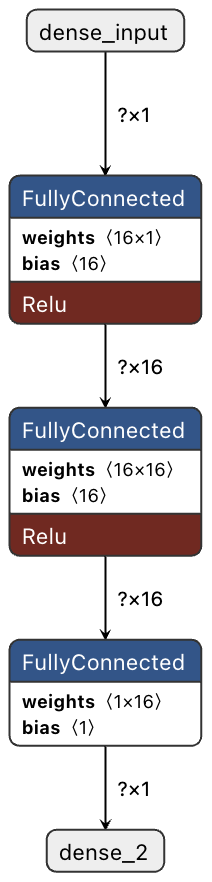
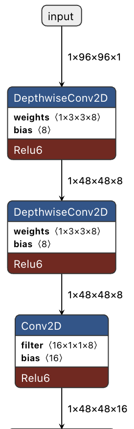
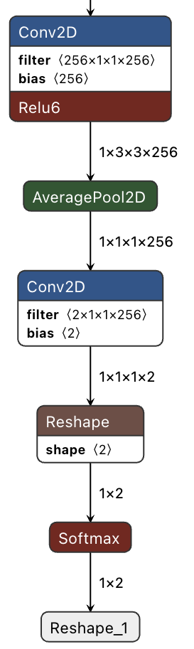

# Laboratorio 2. TensorFlow Lite en ESP32-S3-EYE

## Objetivos

* Familiarizarse con la placa ESP32-S3-EYE
* Aprender el manejo básico de su cámara y su *display* LCD
* Familiarizarse con TensorFlow Lite para Microcontroladores y en especial con la version para ESP32
* Conocer algún otro framework para ejecución de modelos en SoCs ESP32, como ESP-WH0.

## Placa ESP32-S3-EYE


### Descripción

El **[ESP32-S3-EYE](https://github.com/espressif/esp-who/blob/master/docs/en/get-started/ESP32-S3-EYE_Getting_Started_Guide.md)** es una placa de desarrollo para AIoT de pequeño tamaño producida por Espressif y está orientada a aplicaciones como timbres inteligentes, sistemas de vigilancia, relojes de control de asistencia con reconocimiento facial, entre otros. Se basa en el **[SoC ESP32-S3](https://www.espressif.com/en/products/socs/esp32-s3)** y en [**ESP-WHO**](https://github.com/espressif/esp-who), el framework de desarrollo de IA de Espressif y sus principales características se recogen en la siguiente tabla.

| Parámetro      | ESP32-S3-EYE (v2.2)                                          |
| -------------- | ------------------------------------------------------------ |
| MCU            | [ESP32-S3](https://www.espressif.com/en/products/socs/esp32-s3) (Dual-core Xtensa LX7 @ 240 MHz) |
| Módulo         | [ESP32-S3-WROOM-1](https://www.espressif.com/sites/default/files/documentation/esp32-s3-wroom-1_wroom-1u_datasheet_en.pdf) (N8R8) |
| PSRAM          | 8 MB (Octal SPI) - *¡Cuidado con confundirse con QSPI!*      |
| Flash          | 8 MB (Quad SPI)                                              |
| Display LCD    | 1,3" 240x240 pixel  (ST7789)                                 |
| Cámara         | 2M Pixel, 1600x1200, ([OV2640](https://github.com/espressif/esp32-camera)) |
| Micrófono      | I2S Digital (MSM261S4030H0)                                  |
| Conexión       | USB/JTAG y USB/UART                                          |
| Sensor         | Acelerómetro de 3 ejes (QMA7981)                             |
| Almacenamiento | MicroSD                                                      |

#### Esquema


#### Aceleración de AI y DSP

El **ESP32-S3** incorpora una serie de nuevas instrucciones extendidas (PIE: Processor Instruction Extensions) para mejorar la eficiencia en la ejecución de algoritmos específicos de IA y DSP (Procesamiento Digital de Señales).

Lista de características:

* Registros generales de 128 bits
* Operaciones vectoriales de 128 bits, como multiplicación compleja, suma, resta, multiplicación, desplazamiento, comparación, etc.
* Instrucciones de manejo de datos combinadas con instrucciones de carga/almacenamiento
* Soporte para datos vectoriales de 128 bits no alineados
* Operaciones con saturación

Las librerías [ESP-DSP](https://docs.espressif.com/projects/esp-dsp/en/) y [ESP-NN](https://github.com/espressif/esp-nn) se apoyan estas extensiones para acelerar el procesamiento de algoritmos de procesado digital de señal y de redes neuronales.

### Firmware de referencia y test funcional

La placa **ESP32-S3-EYE** viene con un firmware preinstalado por defecto basado en **ESP-WHO** que permite probar sus funciones, incluyendo:

* Activación por voz
* Reconocimiento de comandos de voz
* Detección y reconocimiento facial

!!! Danger "Tarea"
    Verificar el funcionamiento del firmware de referencia siguiendo las instrucciones proporcionadas en la [guía de la ESP32-S3-EYE](https://github.com/espressif/esp-who/blob/master/docs/en/get-started/ESP32-S3-EYE_Getting_Started_Guide.md#17-default-firmware-and-function-test).

#### ¿Cómo recuperar el firmware de referencia?

En caso de que no esté presente, se puede grabar el firmware de referencia del siguiente modo.

* Clonar el repositorio de [ESP-WHO](https://github.com/espressif/esp-who):
```sh
git clone https://github.com/espressif/esp-who.git
```
* Abrir desde la carpeta en VSCode.
* Configurar puerto serie (ej. `/dev/ttyUSB1`) y target (`esp32s3`) mediante la extensión ESP-IDF.
* En un ESP-IDF terminal ejecutar:
```sh
esptool.py erase_flash
esptool.py write_flash 0x0 default_bin/esp32-s3-eye/v2.2/esp32-s3-eye-v2.2-firmware-v0.2.0-cn.bin
```

#### ¿Problemas con el acceso al puerto serie?

La ESP32-S3-EYE no tiene un bridge USB-UART externo, lo que puede causar un problema: si el programa cargado en la placa provoca que el chip se reinicie constantemente, no podrás cargar más programas en la placa.

En caso de que suceda esto, debes:

1. Mantener presionado el botón BOOT y pulsar el botón RST.
2. Soltar primero el botón RST y luego el botón BOOT.

De este modo, la placa entra en el modo de descarga de firmware y podrás empezar a cargar el programa. Después de cargarlo, presiona el botón RST para iniciar la ejecución del programa.

### Manejo básico de la cámara

El componente [esp32-camera](https://github.com/espressif/esp32-camera)  proporciona soporte para las cámaras que usan las placas ESP32. Contiene controladores, configuraciones y ejemplos para módulos de cámara como **OV2640**, entre otros. 

#### Ejemplo de referencia: `esp32-camera`

El componente proporciona un ejemplo de referencia (`espressif/esp32-camera`) que toma una foto cada 5 segundos y muestra su tamaño en el monitor serie. A continuación vamos a probar este ejemplo  siguiendo el procedimiento habitual, empleando la siguiente configuración:

* **Tamaño de Flash :** `8MB`
* **Modo SPI RAM:** `Octal Mode PSRAM`
* **Frecuencia PRSAM:** `80 MHz`

Además es preciso descomentar la siguiente línea del fichero `main/take_picture.c`:

```c
// 1. Board setup (Uncomment):
// #define BOARD_WROVER_KIT
// #define BOARD_ESP32CAM_AITHINKER
#define BOARD_ESP32S3_WROOM
```

!!! Danger "Tarea"
     Probar el ejemplo, variando algunos de los parámetros de la inicialización de la cámara (tamaño frame, formato, compresión JPEG, etc.).

### ESP-BSP

[ESP-BSP](https://github.com/espressif/esp-bsp) es una colección de paquetes de soporte de placa (*Board Support Packages*) que facilita el desarrollo de proyectos para placas específicas sin necesidad de buscar manualmente controladores y otros detalles. Al usar ESP-BSP, puedes:

*	**Simplificar la Integración de Hardware**: Facilita el código y reduce la complejidad.
*	**Acelerar el Desarrollo**: Configura rápidamente tu entorno y empieza a trabajar en tus proyectos.
*	**Acceder a APIs Estandarizadas**: Asegura consistencia entre tus proyectos.

Entre las placas soportas se encuentra la [ESP32-S3-EYE](https://github.com/espressif/esp-bsp/blob/master/bsp/esp32_s3_eye) y su BSP especifico facilita el uso de sus distintos componentes: display LCD, cámara, uSD, micrófono y acelerómetro.

### Manejo básico del display LCD

El repositorio [ESP-BSP](https://github.com/espressif/esp-bsp) incluye componentes para [diversos displays LCD](https://github.com/espressif/esp-bsp/blob/master/LCD.md), incluido el de la ESP32-S3-EYE (de 1,3 pulgadas y basado en el controlador ST7789) que es el mismo que incorpora la placa [ESP32-S3-USB-OTG](https://docs.espressif.com/projects/esp-dev-kits/en/latest/esp32s3/esp32-s3-usb-otg/user_guide.html).

La manera más efectiva de familiarizarse con la gestión de LCDs mediante ESP-BSP es explorar sus [ejemplos](https://github.com/espressif/esp-bsp/blob/master/examples).

#### Ejemplo de referencia: `display-camera`

El ejemplo  `display-camera` captura imágenes de la cámara y las muestra en el display LCD.  Este ejemplo ademas ilustra el uso de [LVGL](https://docs.lvgl.io/master/index.html) (Light and Versatile Graphics Library), una librería gráfica de código abierto que proporciona todo lo necesario para crear una interfaz gráfica de usuario (GUI) con muy bajo consumo de memoria, muy adecuada para pequeños sistemas embebidos.

A continuación vamos a probar este ejemplo  siguiendo el procedimiento habitual, empleando la siguiente configuración.

* **Modificación componentes necesarios:** El ejemplo está configurado por defecto para otra placa por lo que lo primero que hay que hacer es modificar el fichero de dependencias de componentes `idf_component.yml`:
```yaml
description: BSP Display and camera example

dependencies:
  esp32_s3_eye:
    version: "*"
    override_path: "../../../bsp/esp32_s3_eye"
```
* **Configuración:** Una vez modificado este fichero se puede proceder como de costumbre a la configuración del proyecto:

   * **Tamaño de Flash :** `8MB`
   * **Modo SPI RAM:** `Octal Mode PSRAM`
   * **Frecuencia PRSAM:** `80 MHz`
   * **Seleccionar dispositivo LCD:** `Use ST7789 LCD driver`

!!! Danger "Tarea"
     Probar el ejemplo, jugando con los parámetros de configuración de LVGL para la visualización de rendimiento (por ejemplo `LV_USE_PERF_MONITOR`)

## TensorFlow Lite para Microcontroladores (TFLM)

### ¿Qué es?

**TensorFlow Lite para microcontroladores** (TFLM) es una versión ultra ligera de TensorFlow diseñada específicamente para ejecutar modelos en microcontroladores con escasos recursos de cómputo. Está optimizado para funcionar sin sistema operativo, con poca memoria (típicamente menos de 256 KB de RAM), y sin requerir operaciones en coma flotante si el hardware no lo permite. TFLM permite ejecutar modelos previamente entrenados en TensorFlow Lite, adaptándolos a plataformas embebidas mediante cuantización (reducción de precisión numérica) y operadores simplificados.

### Limitaciones

Las siguientes limitaciones deben tenerse en cuenta:

* Soporte para un subconjunto limitado de operaciones de TensorFlow
* Soporte para un conjunto limitado de dispositivos
* API de bajo nivel en C++, que requiere gestión manual de memoria
* El entrenamiento en el dispositivo no está soportado

### TFLM para ESP32

Para mejorar el rendimiento en microcontroladores como el ESP32-S3, TFLM aprovecha las instrucciones vectoriales (PIE en este caso)  para acelerar operaciones de inferencia. Para ello se basa en la librería [ESP-NN](https://github.com/espressif/esp-nn) que está diseñada específicamente para este propósito.

#### ¿Cómo se integra TFLM y ESP-NN?

Durante la inicialización del modelo, TFLM registra operadores que apuntan a las funciones de **ESP-NN** en lugar de las implementaciones genéricas de TFLM. Esto permite que las operaciones más costosas, como convoluciones 2D o capas fully connected, sean ejecutadas por el código optimizado.

**Condiciones para aprovecharlo**:

* El modelo debe estar **cuantizado (int8)** para beneficiarse de **ESP-NN**.
* Solo ciertos operadores están acelerados; los demás siguen usando las versiones de referencia de TFLM.
* Emplear un SoC **ESP32-S3** (otros chips ESP32 no tienen PIE).

### Componente esp-flite-micro

El componente [**esp-flite-micro**](https://github.com/espressif/esp-tflite-micro)  proporciona la integración de **TFLM** y **ESP-NN** necesaria para ejecutar de forma eficiente los modelos en SoCs ESP32, como el **ESP32-S3**, que cuentan con soporte para instrucciones de aceleración de IA (extensiones PIE). El componente proporciona versiones para  tres ejemplos de referencia de TFLM: **Hello World**, **Micro Speech** y **Person Detection**. A continuación probaremos los dos primeros.

### Ejemplos ESP-TLFM

#### Hello-World

Este ejemplo [**Hello World**](https://github.com/tensorflow/tflite-micro/tree/main/tensorflow/lite/micro/examples/hello_world) de TLFM está diseñado para demostrar los conceptos más básicos del uso de TensorFlow Lite para Microcontroladores. Incluye todo el flujo de trabajo de principio a fin, desde el entrenamiento de un modelo hasta su conversión para ser utilizado con TFLM y la ejecución en un microcontrolador.

##### Modelo

El modelo empleado es una red neuronal secuencial (*feed-forward*) simple con las siguientes características:

* **Entrada**: Escalar (x)
* **Capa 1**: 16 neuronas, activación ReLU
* **Capa 2**: 16 neuronas, activación ReLU (permite aprender relaciones más complejas)
* **Capa 3 (salida)**: 1 neurona, salida continua (regresión)

A continuación lo mostramos gráficamente mediante la aplicación **Netron**:



El modelo se entrena para replicar una función seno y genera un patrón de datos que puede utilizarse para hacer parpadear LEDs o controlar una animación, dependiendo de las capacidades del dispositivo. 

En esta práctica obviaremos el entrenamiento y conversión del modelos y partiremos siempre de modelos `.tflie` ya cuantizados a `int8`, por ejemplo [hello_world_int8.tflite](https://github.com/tensorflow/tflite-micro/blob/main/tensorflow/lite/micro/examples/hello_world/models/hello_world_int8.tflite) en este caso.

!!! Danger "Tarea"
    Instanciar el ejemplo [`hello_world`](https://components.espressif.com/components/espressif/esp-tflite-micro/versions/1.3.3~1/examples/hello_world?language=en) del componente **esp-flite-micro** para poderlo estudiar.

##### Almacenamiento del modelo

Muchos microcontroladores no tdisponen de sistema ficheros por lo que habitualmente es necesario enlazar directamente el modelo en el binario.  Por ejemplo, en el ejemplo con el que estamos trabajando se emplea  el fichero `model.cc` cuyo contenido hexadecimal se genera mediante el siguiente comando Unix (Linux/MacOS/WSL):

```sh
xxd -i model.tflite > model.cc
```

##### Análisis del código, uso de la API

Las principales funciones están en el fichero `main_functions.cc`, `setup()`y `loop()`.

**`setup()`**

Esta función es la responsable de la inicialización y lleva a cabo las siguientes acciones:

* **Cargar del modelo: el modelo:** el modelo que está almacenado en  `const unsigned char g_model[];`se instancia en una estructura `tflite::Model` y se verifica que sea compatible con la versión del esquema que está usando.

```c++
  // Map the model into a usable data structure. This doesn't involve any
  // copying or parsing, it's a very lightweight operation.
  model = tflite::GetModel(g_model);
  if (model->version() != TFLITE_SCHEMA_VERSION) {
    MicroPrintf("Model provided is schema version %d not equal to supported "
                "version %d.", model->version(), TFLITE_SCHEMA_VERSION);
    return;
  }
```

* **Instanciar el resolvedor de operaciones: **Se declara una instancia de `MicroMutableOpResolver` que será utilizada por el intérprete para registrar y acceder a los operadores que utiliza el modelo, y se registran los operadores necesarios.

```c++
  // Pull in only the operation implementations we need.
  static tflite::MicroMutableOpResolver<1> resolver;
  if (resolver.AddFullyConnected() != kTfLiteOk) {
    return;
  }
```

* **Asignar memoria: **Necesitamos preasignar una cierta cantidad de memoria para los arrays de entrada, salida e intermedios.

```c++
  // Allocate memory from the tensor_arena for the model's tensors.
  TfLiteStatus allocate_status = interpreter->AllocateTensors();
  if (allocate_status != kTfLiteOk) {
    MicroPrintf("AllocateTensors() failed");
    return;
  }
```

* **Creación del intérprete**:  Se declara un interprete y se le asignan los tensores de entrada y salida:

```c++
  // Build an interpreter to run the model with.
  static tflite::MicroInterpreter static_interpreter(
      model, resolver, tensor_arena, kTensorArenaSize);
  interpreter = &static_interpreter;
  
  // Obtain pointers to the model's input and output tensors.
  input = interpreter->input(0);
  output = interpreter->output(0);
```

**`loop()`**

Es función proporciona el tensor de entrada al modelo (valor de `x` cuantizado), ejecuta el modelo (inferencia), y procesa el tensor de salida (valor de `y` cuantizado).

* **Inferencia**: Para ejecutar el modelo se invoca el interprete creado previamente.

```c++
// Run inference, and report any error
  TfLiteStatus invoke_status = interpreter->Invoke();
  if (invoke_status != kTfLiteOk) {
    MicroPrintf("Invoke failed on x: %f\n",
                         static_cast<double>(x));
    return;
  }
```

!!! Danger "Tarea"
    Estudiar el ejemplo de referencia y probarlo en la placa ESP32-S3-EYE.

!!! Danger "Tarea"
    Convertir el modelo de referencia ([hello_world_int8.tflite](https://github.com/tensorflow/tflite-micro/blob/main/tensorflow/lite/micro/examples/hello_world/models/hello_world_int8.tflite)) a hexadecimal y comprobar su correcta ejecución.


#### Person Detection

El ejemplo [Person Detection](https://github.com/tensorflow/tflite-micro/tree/main/tensorflow/lite/micro/examples/person_detection) de TFLM ilustra un caso de clasificación binaria de images, es decir si una imagen dada pertenece o no a una categoría, en este caso que aparezca o no una persona en ella.

##### Modelo

El modelo empleado es un `mobilenet_v1_025`  de la familia de modelos [MobileNets](https://arxiv.org/abs/1704.04861) orientados a dispositivos Edge.

La MobileNet V1 es una familia de redes neuronales ligeras que utilizan convoluciones separables en profundidad (*depthwise separable convolutions*). En este enfoque, primero se aplica una convolución para filtrar cada canal de la imagen por separado (depthwise), y luego se emplea una convolución punto a punto (pointwise) para combinar los resultados. Esto reduce significativamente la cantidad de parámetros y cálculos, manteniendo un alto nivel de precisión en la clasificación de imágenes.

A continuación se muestran las primeras y las últimas capas del modelo empleado en el ejemplo (`mobilenet_v1_025`). 





##### *Dataset* y entrenamiento

El *dataset* empleado, [Visual Wake Words Dataset](https://arxiv.org/abs/1906.05721), está especialmente orientado a crear modelos de pequeño *footprint* (~250KB). 

El proceso llevado a cabo para entrenar el modelo y convertirlo a TensorFlow Lite  está descrito en el [repositorio de GitHub de TFLM](https://github.com/tensorflow/tflite-micro/blob/main/tensorflow/lite/micro/examples/person_detection/training_a_model.md), aunque de momento no nos detendremos en su análisis pormenorizado. 

El modelo resultante puede descargarse en formato [`.tflite`](https://github.com/tensorflow/tflite-micro/blob/main/tensorflow/lite/micro/models/person_detect.tflite) o en formato C ([`person_detect_model_data.cc`](https://storage.googleapis.com/download.tensorflow.org/data/tf_lite_micro_person_data_int8_grayscale_2020_01_13.zip)) en los enlaces proporcionados.

##### Código

El código sigue un esquema análogo al del ejemplo anterior.

!!! Danger "Tarea"
    Instanciar el ejemplo [`person_detection`](https://components.espressif.com/components/espressif/esp-tflite-micro/versions/1.3.3~1/examples/person_detection?language=en) del componente **esp-flite-micro** para poderlo estudiar. Responder a las siguientes preguntas: ¿Qué operadores se  registran? ¿Qué tamaño tiene el modelo? ¿Cómo se ha convertido?

!!! Danger "Tarea"
    Probar el ejemplo y determinar el tiempo de requerido para cada inferencia. 

!!! Danger "Tarea"
    Modificarlo para crear una sencilla aplicación que avise cuando detecta una persona y muestre el intervalo de tiempo que ha permanecido en cámara.

## ESP-WHO

### ¿Qué es?

[**ESP-WHO**](https://github.com/espressif/esp-who) es un framework de código abierto, diseñado por Espressif para la detección y el reconocimiento facial en dispositivos basados en ESP32 (como ESP32-CAM, ESP-EYE, ESP32-S3-EYE, entre otros). Incluye funciones y ejemplos para tareas como detección, alineación y reconocimiento de rostros, facilitando la implementación de aplicaciones de visión artificial.

### Ejemplos

**ESP-WHO** proporciona los siguientes ejemplos, todos ellos preparados para poderse emplear en la ESP32-S3-EYE:

* `human_face_detect`: detección de rostro
* `human_face_detect_lvgl`: mismo ejemplo pero haciendo uso de la libraría LVGL 
* `human_face_recognition`: reconocimiento facial
* `pedestrian_detect`: detección de peatones.
* `pedestrian_detect_lvgl`:  mismo ejemplo pero haciendo uso de la libraría LVGL

!!! Danger "Tarea"
    Estudiar y probar el ejemplo `human_face_detect`. Evaluar el tiempo de invocación.

