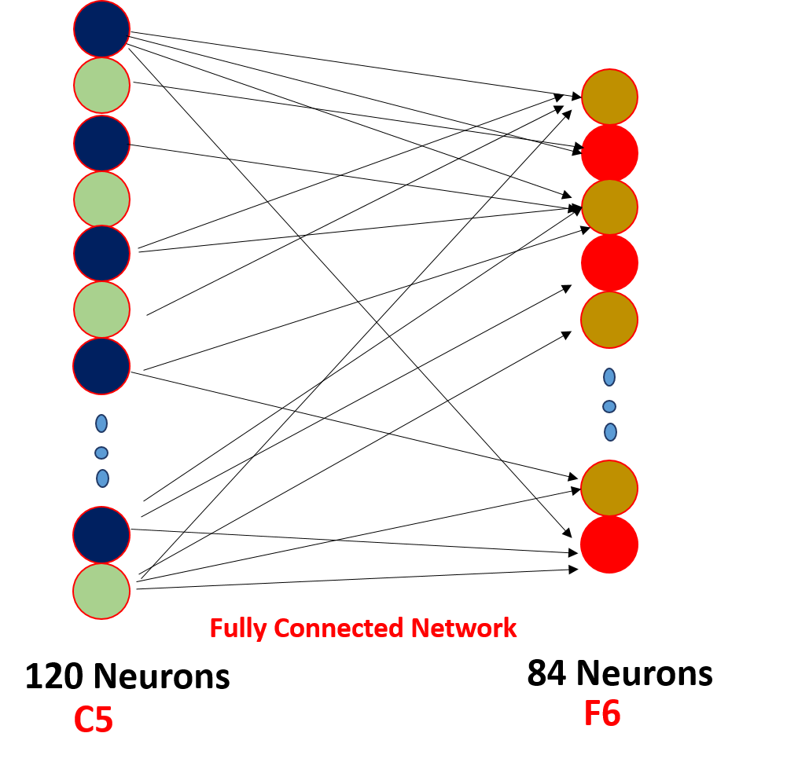
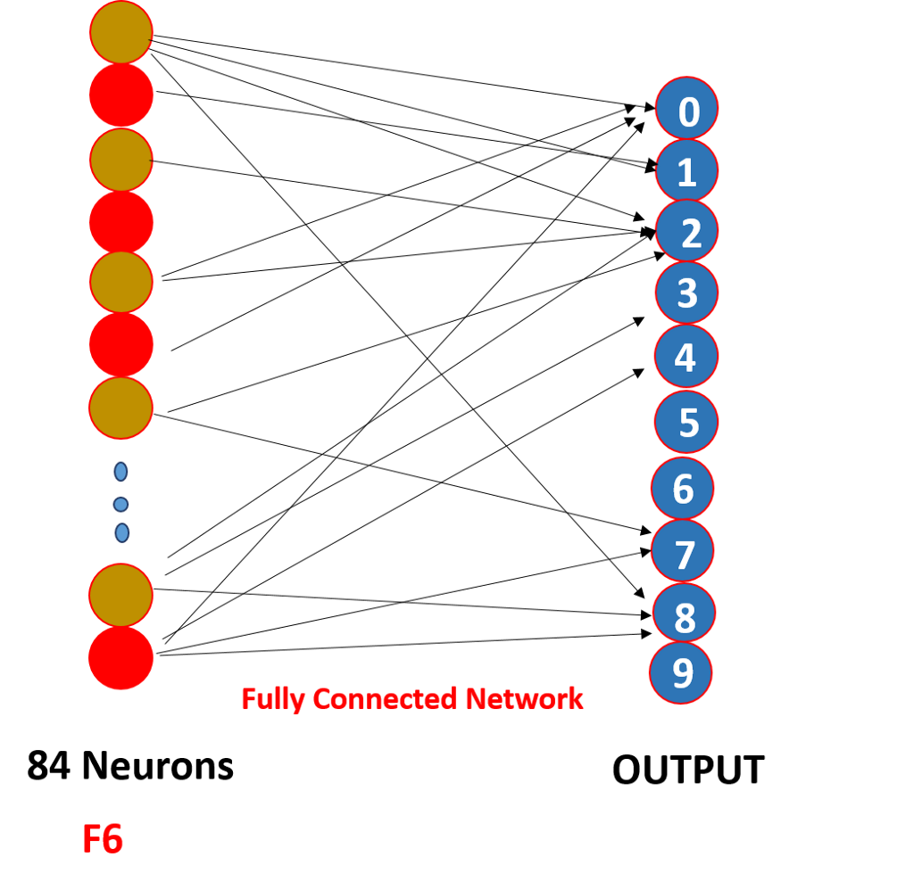
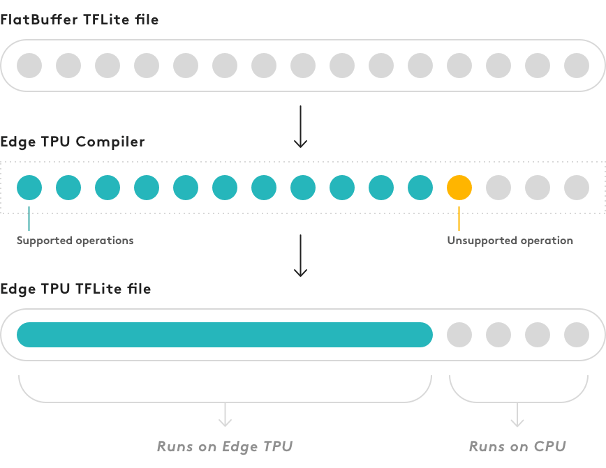

# Laboratorio 3. Entrenamiento e inferencia para clasificación de imágenes sobre Google Coral

## Objetivos

* Entender, de forma intuitiva, la estructura general de una red neuronal de convolución (CNN)
para clasificación de imágenes separando sus capas en dos clases: extracción de características y clasificación.

* Entender el proceso y las ventajas de *transfer learning* para obtener una red adaptada a un conjunto de datos de entrada.

* Practicar el proceso de *transfer learning* utilizando TensorFlow.

* Exportar los modelos entrenados a formato TFLite.

* Experimentar y evaluar el proceso de cuantización sobre un modelo real.

* Desplegar un modelo preentrenado mediante *transfer learning* sobre la Raspberry Pi + Edge TPU para una aplicación concreta.

Gran parte del trabajo de este laboratorio se centra en el uso de Google Colab. Deberás
crear una copia y trabajar en el siguiente 
[cuaderno](https://colab.research.google.com/drive/1aCLiz4zQVFxVztk4r4HIC1gyfLDRLWLy?usp=sharing).

## Modelos TensorFlow sobre Edge TPU (Google Coral)

El dispositivo Google Coral (que equipa un acelerador Edge TPU) es un 
*hardware* de propósito específico que puede ejecutar redes neuronales
profundas (esto es, con múltiples capas), y es específicamente eficiente
ejecutando redes neuronales de convolución (CNN), donde una o más de sus
capas están formadas por operaciones de convolución sobre imágenes de 
entrada. Este tipo de redes combina una serie de capas iniciales de
convolución dedicadas a la extracción de características, y una o más
capas finalles *fully connected* (totalmente conectadas), cuyo cometido
es específico del problema que pretenden resolver (por ejemplo, clasificación
de imágenes).

En problemas de aprendizaje supervisado, 
el proceso de entrenamiento es un procedimiento iterativo (cuyas bases teóricas
quedan fuera del alcance de esta asignatura), que persigue fijar, en 
base a observación de datos de entrada (*datasets*) etiquetados, unos pesos para cada
una de las neuronas que componen cada capa (bien sea de convolución o bien
totalmente conectada) que permitan ajustar la salida de la red neuronal, con 
un determinado grado de error, a la salida esperada.

Tomemos una red neuronal sencilla de ejemplo como la que se muestra a continuación:

En primer lugar, observa la estructura general de la red:

1. Los datos (tensor) proporcionados a la capa de entrada tienen un tamaño fijo, en este caso un único canal de dimensiones `28 x 28` píxeles.
2. El tensor (capa) de salida contiene 10 neuronas, que finalmente, en este caso, clasificarán la imagen de entrada como perteneciente a una de 10 clases posibles (una por dígito).
3. A grandes rasgos, la estructura de la red se divide en dos partes (esta simplificación nos servirá en el resto del laboratorio):
    * Un conjunto de capas de convolución y otras operaciones, englobadas en lo que llamaremos **extractor de características**.
    * Un conjunto de capas donde todas las neuronas están conectadas entre sí, que llamaremos **clasificador**.

### Estructura de capas

Las capas de convolución son el principal elemento que permite extraer características de una
imagen. En última instancia, se basan en la aplicación de un conjunto de filtros a cada píxel de
la imagen de entrada a la capa correspondiente, cuyos valores son realmente los pesos entrenables
de la red neuronal. Las capas de convolució son configurables (en el momento de diseñar la red); 
algunas de estas características se listan a continuación.

!!! note "Nota"
    La siguiente explicación pretende ser intuitiva más que científica, por lo 
    que se emplaza al estudiante a los conocimientos adquiridos en otras asignaturas
    para una descripción más detallada del funcionamiento de cada uno de los elementos
    que componen una CNN.

#### *Convolución*

La aplicación de un filtro de convolución toma como entrada una imagen o fragmento
de la misma (en nuestro caso, un fragmento de dimensiones `5 x 5`), y aplica en ella,
de forma ordenada, un conjunto de **pesos** en forma de filtro o *kernel*. El resultado final de
la operación se llama **característica** y comprende, para cada píxel de la característica,
una suma ponderada a través del filtro de cada uno de los elementos de la vecindad de la imagen anterior
para el píxel correspondiente:

#### *Padding*

Al aplicar convoluciones, las dimensiones de la característica de salida no coinciden con las de la entrada,
por lo que es posible "perder" cierta información. Para ello, los bordes de la imagen de entrada suelen 
rellenarse con un valor (en el ejemplo siguiente, con ceros), mediante la operación llamada *padding*:

#### *Striding*

En ocasiones, no es deseable aplicar un filtro de convolución a todos los píxeles de entrada. En esos casos,
la capa de convolución puede configurarse para que "salte" algunos de los píxeles (en el ejemplo siguiente, 
esta separación o *stride* es de dos unidades):

#### *Pooling*

La operación de *pooling* persigue resumir la información en una determinada imagen o característica, agrupando
los valores de la vecindad mediante una operación de tipo `max` o `avg`. Por ejemplo, podemos obtener únicamente 
el valor máximo de una vecindad de `2 x 2` píxeles:

#### *Función de activación*

Una función de activación es un nodo situado a la salida de una determinada neurona, que permite determinar
si dicha neurona se activará o no, por ejemplo:

La función ReLU (*rectified linear unit*) se utiliza típicamente en redes neuronales por su carácter no lineal: simplemente
devuelve 0 si el valor de entrada es negativo, y dicho valor en caso contrario.

#### *Capas fully-connected*

Finalmente, las últimas capas (de clasificación) de la anterior red pasan por dos
capas cuyas neuronas simplemente realizan una combinación lineal de sus entradas, ponderadas
con unos pesos que también se fijarán en el proceso de entrenamiento y que, en última instancia,
determinarán la clase a la que pertenece cada estímulo de entrada tras extraer las correspondientes
características.

Un ejemplo de las tres últimas capas *fully-connected* podría ser, por ejemplo:

donde en última instancia, la capa de salida es un tensor unidimensional de 10 elementos al que 
están conectadas cada una de las neuronas de la capa anterior (lo mismo ocurre con la penúltima
capa).

## Flujo de trabajo típoco para el desarrollo de un modelo TensorFlow Lite para Edge TPU

Como se vio en el anterior laboratorio, TensorFlow Lite es una versión 
reducida del *framework* Tensorflow diseñada específicamente para
dispositivos móviles y sistemas empotrados. Su objetivo es proporcionar
alto rendimiento (básicamente, baja latencia o tiempo de respuesta) en
procesos de inferencia o aplicación de una red neuronal a unos datos de
entrada. Los modelos TensorFlow Lite pueden, además, reducir todavía
más su tamaño (y por tanto aumentar su eficiencia) a través de un proceso
llamado cuantización, que convierte los pesos (y otros parámetros) del 
modelo, típicamente representados mediante números en punto flotante
de 32 bits, en una representación entera de 8 bits. Aunque en ocasiones este
proceso simplemente persigue mayor eficiencia, en el caso del acelerador
Edge TPU es obligatorio, ya que éste sólo soporta modelos Tensorflow Lite
cuantizados (y, como veremos, compilados de forma específica para el
dispositivo).

El proceso de entrenamiento no se realiza directamente con TensorFlow Lite, 
sino utilizando TensorFlow y a continuación convirtiendo el modelo entrenado
resultante (en formato `.pb`) en un modelo TFLite (con extensión `.tflite`).
El proceso general de transformación de un modelo TensorFlow en un modelo
compatible con el dispositivo Edge TPU se muestra a continuación:

Sin embargo, no es estrictamente necesario seguir de forma completa este
flujo de trabajo para obtener un buen modelo compatible con la Edge TPU. Una
alternativa reside en aprovechar modelos TensorFlow ya entrenados mediante
un proceso de reentrenamiento en base a tus propios *datasets* de entrada.

## *Transfer learning*

Como hemos mencionado anteriormente, en lugar de construir un modelo propio
y realizar un proceso de entrenamiento del mismo desde cero, es posible
reentrenar un modelo ya compatible con el dispositivo Edge TPU, usando una
técnica denominada *transfer learning* (o *fine tuning*). 

Esta técnica permite comenzar con un modelo entrenado para una tarea similar
a la que deseamos resolver, enseñando de nuevo al modelo a, por ejemplo, 
clasificar otro tipo de objetos mediante un proceso de entrenamiento utilizando
un *dataset* de menores dimensiones. En este punto, existen dos mecanismos
distintos para realizar el reentrenamiento:

1. Reentrenar el modelo completo, ajustando los pesos de toda la red neuronal.
2. Eliminando la(s) capa(s) final(es) de la red, típicamente dedicada, por 
ejemplo, al proceso de clasificación, y entrenando una nueva capa que 
reconozca las nuevas clases objetivo.

En cualquier caso, si se parte de un modelo compatible con la Edge TPU, cualquiera
de las dos estrategias ofrecerá buenos resultados (siendo la segunda mucho más
eficiente desde el punto de vista del tiempo de entrenamiento). El fabricante
proporciona un conjunto de [modelos base preentrenados](https://coral.ai/models/)
que puedes utilizar para crear modelos personalizados.

## Requisitos de los modelos

Para explotar al máximo las capacidades del Edge TPU, es necesario que el
modelo desarrollado cumpla con ciertas características:

1. Los tensores que se utilicen están cuantizados (usando punto fijo de 8 bits: `int8` o `uint8`).
2. Las dimensiones de los tensores son constantes (no dinámicas).
3. Los tensores son 1-D, 2-D o 3-D. 
4. El modelo sólo usa operaciones soportadas por la Edge TPU (véase siguiente sección).

### Operaciones soportadas

Al construir un modelo propio, es necesario tener en mente que sólo ciertas
operaciones serán soportadas de forma nativa por la Edge TPU. Si el modelo
está formado por alguna operación no compatible, sólo se ejecutará en la TPU
una porción del mismo (véase sección *Compilación*). La documentación de
Google Coral y de TensorFlow contienen listas detalladas de las operaciones
compatibles en ambos casos.

### Cuantización

Cuantizar un modelo significa convertir todos los valores que éste almacena
(por ejemplo, pesos y salidas de funciones de activación) desde valores
en punto flotante de 32 bits a sus representaciones en punto fijo de 8 bits
más cercanas. Esto, obviamente, hace que el modelo sea más pequeño en tamaño,
y más rápido en respuesta. Además, aunque las representaciones en 8 bits son
menos precisas, su precisión en el proceso de inferencia no se ve significativamente
afectado.

Existen dos mecanismos principales para llevar a cabo la cuantización:

* **Entrenamiento consciente de la cuantización** (*Quantization-aware training*). Esta
técnica inserta nodos (neuronas) artificiales en la red para simular el efecto
de usar valores de 8 bits en el entrenamiento. Por tanto, requiere modificar la
red antes de comenzar con el entrenamiento inicial. Normalmente, esto repercute
en un modelo con mayor precisión (comparado con la segunda técnica), porque
los pesos de 8 bits se aprenden en el propio proceso de entrenamiento.

* **Cuantización post-entrenamiento** (*Full integer post-training quantization*). No 
requiere ninguna modificación en la red, por lo que puede tomar como entrada
una red ya entrenada para convertirla en un modelo cuantizado. Sin embargo, el 
proceso de cuantización requiere que se proporcione un conjunto de datos de entrada
representativo (formateado de la misma manera que el conjunto de datos original).
Este conjunto representativo permite que el proceso de cuantización determine el 
rango dinámico de las entradas, pesos y activaciones, factor crítico a la hora de encontrar
una representación en 8 bits de cada peso y valor de activación.

### Compilación

Tras entrenar y convertir el modelo a TFlite (con cuantización), el paso final es
compilarlo utilizando el compilador de Edge TPU. El proceso de compilación puede
completarse incluso si el modelo del que se parte no es 100% compatible con el
dispositivo, pero en este caso, sólo una porción del modelo se ejecutará
en el Edge TPU. En el primer punto en el que el grafo resultante incluya una
operación no soportada, éste se dividirá en dos partes: la primera contendrá sólo 
las opreraciones soportadas por la Edge TPU, y la segunda, con las operaciones no
soportadas, será ejecutada exclusivamente en la CPU, con la penalización
de rendimiento que ello conlleva:

# Tareas a desarrollar

!!! danger "Tarea"
    El siguiente [cuaderno](https://colab.research.google.com/drive/1aCLiz4zQVFxVztk4r4HIC1gyfLDRLWLy?usp=sharing) 
    permite la creación de un modelo TFlite a partir
    de un modelo preexistente, usando la técnica de cuantización post-entrenamiento.
    Complétalo y obtén un modelo TFLite listo para ejecutar en 
    la Edge TPU. 

    A continuación, utilízalo en los códigos que desarrollaste (para clasificación) en el anterior laboratorio y 
    comprueba su correcto funcionamiento tanto desde el punto de vista del rendimiento comparado con la CPU, como
    de la precisión observada.

!!! danger "Tarea"
    Utilizando la misma filosofía que la seguida en el anterior cuaderno, se pide desarrollar
    una aplicación que realice la clasificación de imágenes de entrada en tiempo real, tomadas desde la cámara
    de la Raspberry Pi,
    utilizando un modelo preentrenado con conjuntos de datos de imágenes etiquetadas que representen
    cierta característica o rasgo físico. Por ejemplo, es posible desarrollar un sistema que discrimine
    **caras portando o no mascarilla**, **personas llevando o no gafas**, **pelo largo o corto**, etc.
    Es posible proponer un escenario alternativo previo visto bueno del profesor.

    Para resolver el laboratorio, se pide diseñar y seguir el flujo
    completo de trabajo propuesto, basándose en el mismo modelo base (*Mobilenetv2*), pero reentrenándolo
    con conjuntos de datos apropiados (puedes buscarlos por internet) y usando la Edge TPU como plataforma
    aceleradora.

    Se entregará una memoria del trabajo desarrollado, junto con los códigos y modelos obtenidos, así como una breve demostración de funcionamiento de la solución (a modo de vídeo, por ejemplo). Es deseable incluir algún tipo de análisis de tiempos de ejecución utilizando y sin utilizar el acelerador Google Coral.

