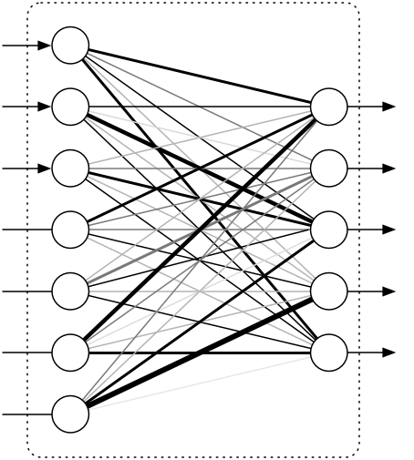
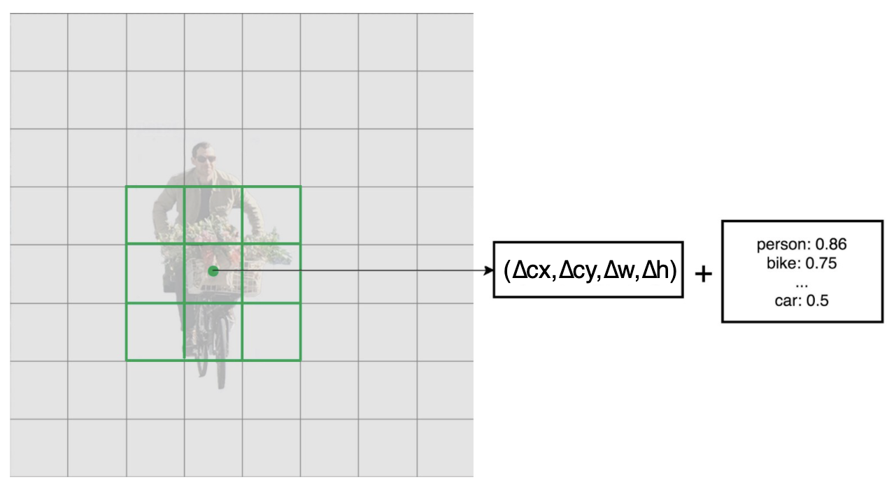
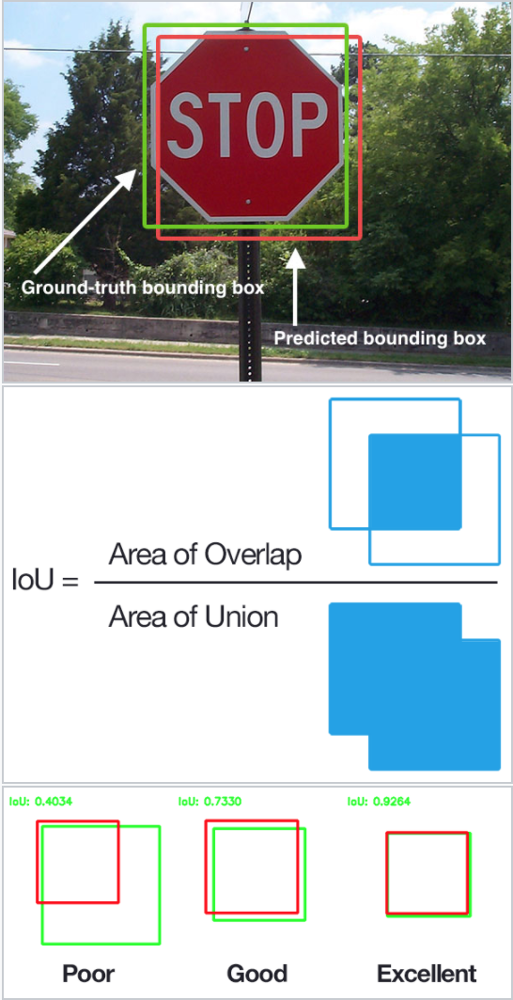

# Laboratorio 4. Detección de objetos con Google Coral

## Objetivos

* Entender el funcionamiento básico de los extractores de características MobileNet y de los detectores de objetos SSD.
* Integrar un detector de objetos con funcionalidades de *tracking* en un entorno de monitorización IoT.

## Código necesario

El código necesario para el desarrollo de la práctica puede obtenerse descargando el código de la [URL](https://drive.google.com/file/d/1765YtV6_UgCSNukjGf5bs2_iW28PDABT/view?usp=sharing).

## Detección básica de objetos. Mobilenets y SSD

La detección de objetos es a día de hoy uno de los campos más importantes dentro de la visión 
por computador. Se trata de una extensión de la clasificación de imágenes, donde el objetivo
es identificar una o más clases de objetos en una imagen y localizar su presencia mediante
cajas (en adelante, *bounding boxes*) que la delimitan. La detección de objetos juega un papel 
fundamental en campos como la videovigilancia, por ejemplo. 

Al igual que en los problemas de clasificación de objetos, algunas de las soluciones más eficientes
para la detección de objetos se basan en dos fases:

1. Fase de extracción de características, en base a una red neuronal genérica (por ejemplo, MobileNet).
2. Fase de detección de objetos, en base a una segunda red neuronal específica (por ejemplo, SSD).

### Extracción de características. Mobilenet v1

La idea principal tras MobileNet se basa en el uso intensivo de las llamadas
*depthwise separable convolutions*, o DWCs, para construir redes neuronales 
profundas muy ligeras desde el punto de vista computacional. 

Una capa de convolución convencional típica aplica un kernel de convolución (o "filtro") a cada
uno de los canales de la imagen de entrada. Este kernel se desplaza a través de la imagen y 
en cada paso lleva a cabo una suma ponderada de los píxeles de entrada "cubiertos" por el kernel, 
para todos los canales de dicha imagen de entrada.

La idea a destacar aquí es que esta operación de convolución *combina* los valores de todos
los canales de entrada. Si la imagen tiene 3 canales, la aplicación de un único kernel de 
convolución sobre la imagen resulta en una imagen de salida de un único canal:


En MobileNet v1 también se usa, aunque muy puntualmente, este tipo de convolución: únicamente en su
primera capa. El resto de capas usan la llamada convolución *depthwise separable* (DWC). Realmente, esta
es una combinación de dos operacioens de convolución: una *depthwise* y otra *pointwise*. 

Una convolución *depthwise* opera de la siguiente manera:


Como puedes ver, no combina los canales de entrada, sino que realiza una convolución para cada canal de
forma separada. Así, para una imagen de tres canales, crea una imagen de salida de 3 canales. 

El objetivo de este tipo de convolución es filtrar los canales de entrada.

En MobileNet v1, la convolución *depthwise* siempre va seguida de una convolución *pointwise*.
Una convolución *pointwise* es realmente una convolución "tradicional", pero con un kernel 1x1:


Como puedes observar, simplemente *combina* los canales de salida de una convolución *depthwise* para
crear nuevas características.

Poniendo ambas cosas juntas (*depthwise* + *pointwise*), se consigue el mismo efecto que con una convolución
tradicional, que realiza ambas operaciones en una sola pasada.

¿Por qué realizar esta separación? Desde el punto de vista computacional, una convolución tradicional realiza
más operaciones aritméticas y necesita entrenar mayor cantidad de pesos (el artículo original de presentación
de Mobilenet v1 cifra esta mejora en 9x para convoluciones 3x3).

Así, el bloque básico de MobileNet v1 sería:


Existen en total 13 de estos bloques, precedidos por una primera capa de convolución tradicional 3x3. No existen
capas de *pooling*, pero algunas de las capas *depthwise* presentan un *stride* 2 para reducir la dimensionalidad; en 
estos casos, la correspondiente capa *pointwise* dobla el número de canales: si la imagen de entrada es 224x224x3, la salida
de la red es 7x7x1024.

Mobilenet v1 usa una función de activación ReLU6 a la salida de cada bloque, que previene activaciones demasiado grandes:

`y = min(max(0, x), 6)`


Si trabajamos con un clasificador basado en MobileNet, todas estas capas desembocan en una capa de *pooling average*, seguida
de una capa totalmente conectada (*fully connected*), y una capa final de clasificación *softmax* obteniendo un valor de probabilidad
por clase.

### Capas totalmente conectadas

A modo de recordatorio, recuerda que una capa totalmente conectada (FC, de *fully connected*) tomaría la siguiente forma:



La entrada a esta capa es un vector de números. Cada entrada está conectada a cada una de las salidas (de ahí su nombre). Estas conexiones
poseen pesos asociados que determinan cuan importantes son. La salida es también un vector de números.

Cada capa transorma los datos. En el caso de FC, para cada elemento de salida, tomamos una suma ponderada de todos los 
elementos de entrada, añadiendo una desviación o *bias*:

`in1*w1 + in2*w2 + in3*w3 + ... + in7*w7 + b1`

En otras palabras, lo que calculamos es una función lineal sobre las entradas, en múltiples dimensiones. Además, aplicamos una
función de activación a la suma ponderada:

`out1 = f(in1*w1 + in2*w2 + in3*w3 + ... + in7*w7 + b1)`

Representando los pesos en forma de matriz, y las entradas y desviaciones como vectores, podemos computar la salida de una
capa FC como:


Observa que esto es en realidad un producto matriz-vector. Si el número de entradas crece por encima de 1 (es decir, tenemos
un grupo o *batch* de entradas), esta operación se convierte en un producto de matrices, para la cual muchas arquitecturas,
incluyendo nuestra Google Coral, están ampliamente optimizadas.

Observa también que la matriz de pesos es un producto del proceso de aprendizaje o entrenamiento, y que esta matriz puede contener
miles (o millones) de elementos a entrenar en redes típicas.

### Hiperparámetros

MobileNet fue diseñada no para ser una red neuronal concreta, sino una familia de redes neuronales, simplemente variando un conjunto
de parámetros (llamados hiperparámetros). El más importante de estos hiperparámetros es el llamado *depth multiplier*; este hiperparámetro
modifica la cantidad de canales por capa. Así, un valor de 0.5 reducirá a la mitad el número de canales usados en cada 
capa, reduciendo el número de operacioens en un factor 4 y el número de parámetros entrenables en un factor 3. Así, el modelo es más liviano,
pero menos predciso. 

### Mobilenet v2

[MobileNet v2](https://arxiv.org/abs/1801.04381), al igual que su versión anterior, utiliza
DWCs, pero su bloque de trabajo principal se ha visto modificado:


En este caso, por cada bloque existen tres capas convolucionales. Las dos últimas son las ya
conocidas: DWCs que filtran las entradas, seguidas por una capa *pointwise* 1x1. En este caso,
sin embargo, esta última capa tiene otro cometido. En la versión 1 del modelo, la capa *pointwise*
mantenía el número de canales o lo doblaba. En la versión 2, en cambio, su cometido es exclusivamente
*reducir* el número de canales. Es por esto que, normalmente, a esta capa se le conoce como
*projection layer* o capa de proyección: proyecta datos con un número elevado de dimensiones (canales) en
un tensor con mucho menor número de dimensiones. Por ejemplo, esta capa podría trabajar con un tensor 
con 144 canales, reduciéndolo a sólo 24 canales. En ocasiones, a este tipo de capa se le conoce como
"cuello de botella" (*bottleneck*"), ya que reduce la cantidad de datos que "fluyen" por la red.

En cuanto a la primera capa, también es una convolución 1x1. Su objetivo es expandir el número de canales
antes de la DWC. Así, esta *capa de expansión* siempre presenta más canales de salida que de entrada, al
contrario que en la capa de proyección. La cantidad exacta de expansión viene dada por el llamado *factor de expansión*,
uno de los hiperparámetros (parámetros personalizables de la red) típicos en Mobilenet v2 (por defecto, el 
valor de este factor es 6): 


Por ejemplo, si se proporciona un tensor de 24 canales a un bloque, la primera capa lo convierte a un nuevo
tensor de 144 canales (por defecto), sobre el que se aplica la capa DWC. Finalmente, la capa de proyección
proyecta estos canales a un número menor, véase 24 (por ejemplo). El resultado es que la entrada y salida a un bloque son
tensores de dimensión reducida, mientras que el filtrado intermedio ocurre sobre un tensor de dimensionalidad alta.

Como puedes observar en la anterior imagen, otra novedad en Mobilenet v2 es la denominada *residual connection*, que 
conecta la entrada y la salida de un bloque (siempre que estos mantengan su dimensionalidad).

La arquitectura Mobilenet v2 consta de 17 de estos bloques conectados uno tras otro, seguidos de una única convolución
estándar 1x1, y una capa de clasificación (si lo que se desea es utilizarla para tareas de clasificación). 

Si observamos los datos que fluyen por la red, veremos como el número de canales se mantiene relativamente reducido:


Como es normal en este tipo de modelos, el número de canaes se incrementa a medida que avanzamos en la red (mientras
la dimensión espacial disminuye). Sin embargo, en general, los tensores se mantienen relativamente pequeños, gracias a 
las capas *bottleneck* entre bloques (en la v1, los tensores llegan a ser hasta 7x7x1024, por ejemplo).

El uso de tensores de baja dimensionalidad es clave para reducir el número de operaciones aritméticas, y por tanto 
aumenta la adecuación de este tipo de modelos para trabajar sobre dispositivos móviles.

Sin embargo, trabajar sólo con tensores de baja dimensionalidad no permite, tras aplicar una capa de convolución sobre
ellos, extraer demasiada información. Así, el filtrado debería trabajar sobre datos de alta dimensionalidad. Mobilenet v2,
por tanto, une lo mejor de ambos mundos:


### Detección de objetos. SSD (*Single Shot Multi-Box Detector*)

El *framework* SSD (*Single Shot MultiBox Detector*) es uno de los principales mecanismos para 
llevar a cabo tareas de detección de objetos. Tradicionalmente, estas tareas se realizaban con
costosos métodos de ventana deslizante (detectando potenciales imágenes en múltiples ventanas
de tamaños variables que se desplazaban por la imagen). Este enfoque de fuerza bruta fue
mejorado por las llamadas R-CNN (*Region-CNN*), que se basaban en la extracción previa de
*Region Proposal* (propuestas de regiones de la imagen en las que potencialmente podían 
existir objetos), para después extraer características de cada una de ellas a través de
redes de convolución y realizar una tarea de clasificación de dichas características y extracción
de las *bounding boxes* correspondientes. Las R-CNN adolecen de ciertos defectos que las hacen
ineficientes (a día de hoy) en la vida real, véase:

* El proceso de entrenamiento de las redes es largo.
* El proceso de entrenamiento se desarrolla en múltiples etapas (por ejemplo, para proponer regiones o 
para clasificar).
* La red es lenta en la fase de inferencia.

En respuesta a esta ineficiencia, se han propuesto múltiples soluciones en los últimos años; las más populares
son [YOLO](https://arxiv.org/abs/1506.02640) (*You Only Look Once*) y [SSD MultiBox](https://arxiv.org/abs/1512.02325) 
(*Single Shot Detector*).

SSD rebaja el coste computacional de las R-CNN sin necesidad de propuestas de regiones,
operando en dos grandes fases:

* Extracción de mapas de características.
* Aplicación de filtros de convolución para detectar objetos.

La primera fase (extracción de características), se lleva a cabo mediante una red neuronal específica,
llamada genéricamente *backbone network*. En el diseño inicial de SSD, esta red fue la red VGG16, aunque
en esta práctica trabajarás con una implementación en la que se usa Mobilenet v1 y v2 (anteriormente
descritas) para mejorar la eficiencia del proceso de detección.

El análisis del propio nombre proporciona información sobre las ventajas y modo de operación de SSD MultiBox:

* *Single Shot*: Las tareas de localización de objetos y clasificación se realizan en una única pasada (ejecución) de la red.
* *MultiBox*: Técnica de regresión para *bounding boxes* desarrollada por los autores.
* *Detector*: La red es un detector de objetos que además los clasifica.

### Extracción de características

Por defecto, SSD utiliza la red neuronal de convolución VGG16 para extraer mapas de características. A continuación, detecta
objetos utilizando una de sus capas de convolución (concretamente, la capa `Conv4_3`). Suponiendo que esta capa es de dimension
espacial `8x8` (realmente, es `38x38`), para cada celda, se realizan 4 predicciones de objeto:


Cada predicción está compuesta por una *boundary box* y una puntuación o *score* para cada clase disponible (más una clase extra
si no se detecta objeto); para cada objeto detectado, se escoge la clase con mayor puntuación. Así, la capa de convolución `Conv4_3`
realiza realmente 38x38x4 predicciones:


### Predictores convolucionales

SSD utiliza pequeños filtros de convolución de dimensión 3x3 para predecir la localización y puntuación asociada a cada objeto
a detectar. Así por ejemplo, en un escenario con 20 clases, cada filtro de convolución devolverá 25 canales: 21 para cada clase más
la información asociada a una *bounding box*:



### Mapas de características multi-escala

Aunque se ha descrito el trabajo de SSD con una única capa de la red neuronal de extracción de características, realmente 
SSD utiliza múltiples capas para detectar objetos de forma independiente. SSD usa las capas de menor resolución para detectar 
objetos de mayor tamaño, y las capas de mayor resolución para detectar objetos de menor tamaño. Por ejemplo, los mapas de 
características de dimensión 4x4 se usarían para detectar objetos mayores que aquellos de dimensión 8x8:


### Predicción de *bounding boxes*

Como en cualquier otra red neuronal de convolución, la predicción de *bounding boxes* comienza con predicciones aleatorias
que se refinan durante la fase de entrenamiento vía descenso de gradiente. Sin embargo, estos valores iniciales pueden
ser conflictivos si no son suficientemente diversos desde el comienzo, principalmente en imágenes con distintos tipos de
objetos:


Si las predicciones iniciales cubren más variedad de formas, el modelo podrá detectar más objetos:


En la vida real, las *boundary boxes* no presentan formas y tamaños arbitrarios, sino que, por ejemplo, presentan dimensiones o
proporciones similares que pueden ser tomadas como base para el entrenamiento del modelo SSD. Normalmente, para un determinado
objeto y conjunto de entrenamiento, se consideran todas las *bounding boxes* en el conjunto, y se toma como representativa el
centroide del cluster que representaría a todas ellas.

Así, para cada mapa de características extraídas por la red *backbone*, se utiliza un conjunto único de *bounding boxes* por
defecto centradas en la celda correspondiente, por ejemplo:


### Estimación de similitud

Las predicciones de SSD se clasifican como positivas o negativas. Esta evaluación se basa en la métrica IoU (*Intersection over Union*):



Realmente, las estimaciones iniciales de *bounding boxes* se escogen para que presenten un valor de IoU mayor a 0.5. Esta es una 
mala predicción todavía, pero una buena base para comenzar con el proceso de regresión (refinamiento) hacia las *bounding boxes*
definitivas.

### *Data augmentation*


Para mejorar la precisión del modelo, se utiliza la técnica de aumento de datos o *data augmentation*. El objetivo de esta
técnica es exponer nuevas "variantes" de la imagen original para enriquecer la información almacenada. Estas transformaciones
incluyen recortes (*cropping*), modificación de orientación (*flipping*) y distorsiones de color. Por ejemplo:


### Conjuntos de entrenamiento

Es necesario un conjuno de entrenamiento y test etiquetado y con *bounding boxes* reales (en el artículo descriptivo de SSD, se
les conoce como *ground truth*), con una etiqueta por *bounding box*. Por ejemplo:


## Detección de objetos en TFLite

En este laboratorio, utilizaremos el código proporcionado como base para desarrollar una aplicación de monitorización de aforo en un 
recinto (por ejemplo, en un aula). 

En primer lugar, desempaqueta el fichero proporcionado e instala los requisitos necesarios. Los modelos necesarios residen ya en el directorio
`Models`, junto al fichero de etiquetas (*labels*) utilizado. 
Puedes descargar otros modelos desde [la web de Google Coral](https://coral.ai/models/) (concretamente, los modelos *MobileNet SSD v1 y v2 (COCO)*). 

Si todo ha ido bien, podrás ejecutar el código, que es totalmente funcional, mediante la orden:

```sh
python3 tracking.py
```

Estudia los argumentos requeridos para comenzar una sesión de detección de objetos usando el modelo disponible.

Observa que la salida, en forma de ventana de vídeo, mostrará una *bounding box* y un identificador único para cada objeto detectado en la escena. 

Desde el punto de vista del código, la estructura es muy similar a la vista para la clasificación de objetos. Observa que, se realiza la inferencia mediante la invocación a `detect_objects` y se analizan los resultados obtenidos (objetos detectados) en `tracker_annotate` dibujando las cajas en `draw_objects_tracked`. 

!!! danger "Tarea"
    Temporiza el tiempo de respuesta (inferencia) para la red por defecto y para cada una de las dos redes descargadas desde la [página de modelos de Google Coral](https://coral.ai/models/all/).
    
!!! danger "Tarea"
    Modifica el código para mostrar por pantalla (por la terminal) el número de objetos detectado en cada frame en la variable `tracks`, así como la posición y clase a la que pertenecen. Añade la clase (concretamente, su etiquea de texto) a la caja que se dibuja en pantalla. Intenta determinar qué significa cada uno de los campos asociados a cada *box* y cómo estos valores varían al mover un objeto por la pantalla, tal y como hace la función logger.debug(f'trackes: {tracks}')`

## *Tracking* de objetos en TFLite

El código proporcionado integra un *tracker* o seguidor de objetos, que no solo detecta objetos en un fotograma determinado, sino que los 
identifica y sigue mientras aparezcan en pantalla. Esta implementación está basada en el *motpy* ([enlace](https://pypi.org/project/motpy/)).

Para instalar el tracker es necesario instalar el paquete *motpy*:

```sh
pip3 install motpy
```

Observa que, al ejecutar el *script*, se asocia no sólo un *bounding box* y clase a cada objeto, sino también un identificador que (idealmente), debería
mantenerse mientras el objeto siga en la imagen.

El *tracker* `Sort` devuelve, en su función `update`, un array Numpy en el que cada fila contiene un *bounding box* válido, y un identificador de objeto único en su última columna. 


!!! danger "Tarea"
    Modifica el código para que se muestre para cada fotograma los bounding boxes e identificadores únicos asociados a cada objeto.

!!! danger "Tarea entregable (80% de la nota)"
    Se pide modificar el script inicial para que, periódicamente, se realice un conteo del número de personas detectadas en una determinada escena. Este valor (número de personas) será exportado a un panel de control (bajo tu elección) utilizando algún protocolo de entre los vistos en la asignatura RPI-II (por ejemplo, MQTT). El protocolo y el panel de control a utilizar queda bajo elección del alumno/a. Se establecerá un umbral de alarma en forma de aforo máximo autorizado, al cual se reaccionará enviando una señal de aviso al usuario desde el panel de control. Toda la infraestructura necesaria se puede implementar en la Raspberry Pi o en un servicio externo, pero en cualquier caso, la inferencia se realizará siempre en la Raspberry Pi, y se acelerará mediante el uso del dispositivo Google Coral. Ejemplos relacionados sobre el uso de MQTT para la creación de un "publicador" en Python pueden encontrarse en los ejemplos de [la implementación de MQTT Paho](https://github.com/eclipse/paho.mqtt.python/blob/master/examples/client_pub-wait.py)

!!! danger "Tarea entregable (20% de la nota)"
    Haciendo uso de las capacidades de *tracking* del script original, se pide diseñar e implementar una solución para monitorizar el paso de personas en sentido entrada y salida en una entrada a un recinto. Así, se supondrá una cámara situada de forma perpendicular a la entrada al recinto, de modo que las personas que accedan al mismo ingresarán en la escena por uno de los extremos y saldrán por el opuesto. Las personas que salgan del recinto discurrirán por la imagen en sentido contrario. Se pide que el sistema almacene el número de personas que han entrado y salido del recinto, así como el momento en el que lo han hecho.
