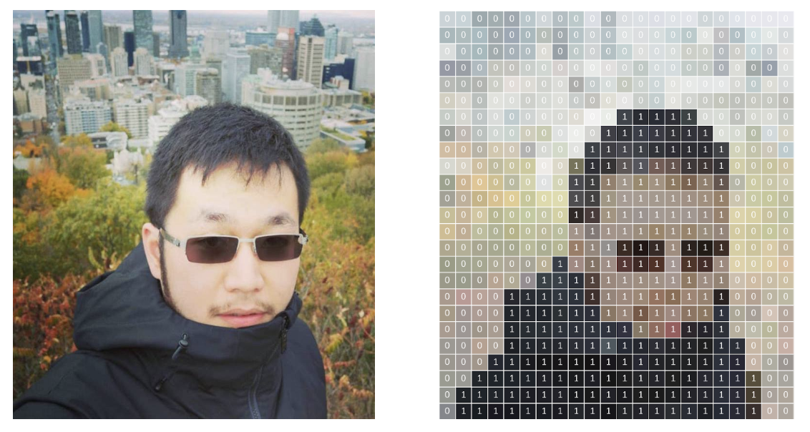
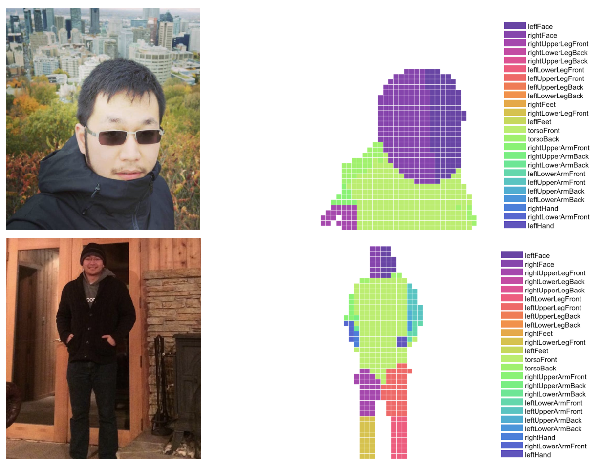

# Laboratorio 4. Segmentación de imágenes

## Objetivos

* Conocer una herramienta de segmentación de personas y partes corporales, así como su fucnionamiento básico.
* Evaluar el rendimiento de la herramienta utilizando modelos acelerados, y observar tanto su rendimiento como precisión obtenida.
* Modificar la solución propuesta para integrarla en un entorno IoT para la gestión de un esceneario real (calidad postural en conducción).

## Bodypix. Estructura y funcionamiento

[Bodypix](https://github.com/tensorflow/tfjs-models/tree/master/body-pix) es una infraestructura de código abierto (realmente, un conjunto de modelos) basada en redes neuronales de convolución y enfocada en dos tareas básicas: **segmentación de personas y partes corporales**, y **extracción de posicionamiento de partes corporales**. Bodypix está específicamente diseñado para obtener buenos rendimientos en plataformas de bajo rendimiento, y ser altamente parametrizable para adaptarse tanto a otro tipo de plataformas como a distintos niveles de precisión y rendimiento.

En este laboratorio utilizaremos los modelos desarrollados en el marco del proyecto Bodypix, pero utilizando una infraestructura aligerada, así como variantes cuantizadas de los modelos originales, que nos permitirán ejecutar la infraestructura en nuestra Raspberry Pi acelerada mediante el uso de Edge TPU.

En primer lugar, clona en tu Raspberry Pi el proyecto Bodypix proporcionado como parte de la infraestructura Google Coral:

```sh
git clone https://github.com/google-coral/project-bodypix
```

En el directorio que se creará dispones de un fichero denominado `install_requirements.sh`, que deberás ejecutar para instalar los requisitos necesarios para el correcto funcionamiento del proyecto. Una vez instalados, realiza una primera prueba de funcionamiento preliminar para comprobar que todo ha funcionado como se espera (asegúrate de que tanto tu cámara como la Google Coral están conectados a la Raspberry Pi antes de ejecutar el ejemplo):

```sh
python3 bodypix.py
```

En pantalla deberías observar una captura en tiempo real de cámara, aplicando un proceso de segmentación de zonas de la imagen que corresponden a distintas partes de cada persona detectada. Además, la infraestructura integra por defecto una sobreimpresión de los principales puntos de interés corporales, siguiendo las ideas del proyecto [Posenet](https://github.com/google-coral/project-posenet).

El proyecto sobre el que trabajaremos dispone de múltiples modificadores u opciones que simplemente trabajan o modifican la parte gráfica de la respuesta (es decir, no realizan cómputos adicionales o restringidos). Algunos de los más interesantes son:

* Selección de partes corporales

Las opciones `--bodyparts` y `--nobodyparts` diferenciarán o no las distintas partes corporales detectadas en el proceso de segmentación. Si esta opción está desactivada, simplemente se realiza la segmentación de personas, no de partes corporales para cada individuo. Observa que las partes corporales no se colorean de distinta forma totalmente, sino que se agrupan en función del tipo de parte corporal detectada. Esta característica se considera meramente de representación, ya que los modelos que se utilizan sí soportan (y de hecho, ejecutan constantenente) un proceso de segmentación completo.

* Anonimización de imágenes

Las opciones `--anonymize` y `--noanoymize` permiten mostrar u ocultar la persona detectada. En este último caso, se realiza un proceso de generación de fondo artificial, y no se muestra a la persona o personas que se están detectando.

* Selección del tamaño de imagen de entrada

Aunque cada modelo específico está diseñado para tomar un determinado tamaño de imagen de entrada, es posible preseleccionar dicho tamaño (que por defecto se escala en el código) externamente. Para ello, basta con utilizar las opciones `--height` y `--width`, que realizan dicho proceso de escalado. En general, se recomienda que la resolución sea la misma, o exceda lo menor posible, la resolución de entrada de la red a utilizar.

* Modo espejo

En la fase de pruebas, si tanto la cámara como el monitor utilizado están enfocados hacia la persona, se recomienda utilizar el modo espejo (``-mirror``) para un mejor entendimiento de la escena.

* Selección de la red neuronal

El proyecto proporciona un conjunto de modelos preentrenados que permiten un equilibrio entre rendimiento y precisión, además de soportar distintas resoluciones de imágenes de entrada. Estos modelos están basados en dos infraestructuras distintas para la extracción de características: Mobilenet, más ligera y menos precisa; y ResNet, menos liviana, pero que ofrece una mayor precisión en el proceso de inferencia. La selección del modelo concreto puede realizarse a través del argumento que acompaña a la opción `--model`, y puede seleccionarse de entre los siguientes (todos residentes en el directorio `models`):

```sh
models/bodypix_mobilenet_v1_075_1024_768_16_quant_edgetpu_decoder.tflite
models/bodypix_mobilenet_v1_075_1280_720_16_quant_edgetpu_decoder.tflite
models/bodypix_mobilenet_v1_075_480_352_16_quant_edgetpu_decoder.tflite
models/bodypix_mobilenet_v1_075_640_480_16_quant_edgetpu_decoder.tflite
models/bodypix_mobilenet_v1_075_768_576_16_quant_edgetpu_decoder.tflite
models/bodypix_resnet_50_416_288_16_quant_edgetpu_decoder.tflite
models/bodypix_resnet_50_640_480_16_quant_edgetpu_decoder.tflite
models/bodypix_resnet_50_768_496_32_quant_edgetpu_decoder.tflite
models/bodypix_resnet_50_864_624_32_quant_edgetpu_decoder.tflite
models/bodypix_resnet_50_928_672_16_quant_edgetpu_decoder.tflite
models/bodypix_resnet_50_960_736_32_quant_edgetpu_decoder.tflite
```

!!! danger "Tarea"
    Experimenta con las diferentes opciones descritas anteriormente. Realiza una evaluación del rendimiento de cada uno de los modelos proporcionados en base a los FPS obtenidos, y describe si efectivamente observas alguna diferencia en términos de calidad percibida en el proceso de segmentación.

## Segmentación de personas

A un nivel básico, la segmentación de personas consiste en realizar una segmentación de una o más imágenes de entrada en píxeles que son parte de una persona, y píxeles que no lo son. En Bodypix, tras proporcionar una imagen al modelo para inferencia, ésta se devuelve comen forma de matriz bidimensional con valores flotantes entre 0 y 1 para cada posición (pixel), indicando la probabilidad de que una persona ocupe dicho píxel. Un valor típicamente denominado *umbral de segmentación* decidirá en último término el valor mínimo de probabilidad para que dicho píxel se considere como parte de una persona. Este valor puede utilizarse, por ejemplo, para eliminar el fondo de una imagen (o sustituirlo por otro):


El proceso de segmentación de personas procede mediante una decisión *binaria* para cada pixel de la imagen de entrada, estimando, para dicho píxel, si éste pertenece o no a una persona:



En cualquier caso, se proporciona una imagen de dimensiones determinadas a la red neuronal extractora de características (MobileNet o ResNet), y se utiliza una función de activación *sigmoide* para transformar su salida en un valor entre 0 y 1, que puede ser interpretado como la probabilidad de pertenenecia a una persona o no para cada uno de los píxeles de la imagen. Normalmente, se utiliza un valor umbral (por ejemplo, 0.5) para convertir dicha segmentación en una decisión binaria. Normalmente, se utiliza un valor umbral (por ejemplo, 0.5) para convertir dicha segmentación en una decisión binaria, como se ha dicho anteriormente. 


## Segmentación de partes corporales

Para estimar una correcta segmentación de partes individuales del cuerpo, se utiliza la misma red extractora de características, pero en este caso se repite el proceso de inferencia anterior prediciendo adicionalemnte 24 canales extra a través de un tensor de salida adicional (siendo 24 el número de partes del cuerpo distintas que se desean predecir, valor por defecto en el código proporcionado). Cada uno de estos canales codifica la probabilidad de pertenencia de un pixel a una parte concreta del cuerpo. Por ejemplo, la siguiente imagen mostraría el contenido de dos canales: uno para la detección de la parte derecha de la cara, y otro para la detección de la parte izquierda:


La siguiente imagen muestra el proceso esquemático de procesamiento de una imagen de entrada en una salida multi-dimensional para la detección de partes corporales usando el extractor MobileNet:


Como para cada posición de la imagen disponemos de 24 canales en el tensor de salida `P`, es necesario encontrar la parte del cuerpo *óptima* de entre dichos 24 canales. Tras la inferencia, se realiza un proceso de postprocesado para realizar dicha detección, siguiendo la expresión:


Esto redunda en una única imagen bidimensional (del mismo tamaño que la imagen original), en la que cada pixel contiene un entero indicando a qué parte del cuerpo pertenece (asignando un valor especial, por ejemplo `-1` si el pixel correspondiente no corresponde a ninguna parte corporal, es decir, no se ha detectado persona en él:


Una posible combinación y representación final de la imagen con información detallada de segmentación podría ser:



## Análisis del código

En el código proporcionado (fichero `pose_engine.py`), el desarrollo orbita alrededor de la clase `PoseEngine`, 
encargada de realizar el proceso de inferencia sobre el modelo proporcionado a partir de una imagen de entrada. 
Concretamente, su método `DetectPosesInImage`, al que se proporciona precisamente una sola imagen de entrada, 
será el encargado de realizar el proceso de segmentación. El retorno de dicha función, de hecho, incluirá 
información tanto a nivel de detección de personas (en la estructura `heatmap`) como de partes corporales
(en la estructura `bodyparts`).

!!! danger "Tarea"
    Determina tanto las dimensiones como el contenido tentativo de las estructuras `heatmap` y `bodyparts`. Para ello, observa en detalle método `__parse_heatmaps` de la clase `PoseEngine`, que realiza la gestión de entradas, salidas e inferencia para el modelo a utilizar. ¿Qué tensores de salida se procesan en esta función tras la inferencia? ¿Están cuantizadas dichas salidas? ¿Cuáles son las dimensiones de los mapas de calor obtenidos? ¿Por qué? ¿A qué tipo de información corresponde cada canal de los tensores de salida (identifícalos en la parte inicial del mismo fichero)

Adicionalmente, la función `__parse_poses` realiza un proceso de inferencia sobre el mismo modelo, pero recogiendo en este caso información sobre puntos clave (*keypoints*) que describen la posición del sujeto.

!!! danger "Tarea"
    Responde a las mismas preguntas que anteriormente se te han planteado, pero en este caso basándote en la función `__parse_poses` y su implementación.

En cualquier caso, la información de las tres estructuras devueltas por la funión `DetectPosesInImage` te permitirá desarrollar el ejercicio propuesto, calculando, por ejemplo, el número de píxeles o su porcentaje con respecto al total de la imagen para cada parte del cuerpo, su posición relativa o absoluta en la imagen, o su detección o ausencia. **Es importante, pues, que estudies y determines correctamente el significado y contenido de cada una de estas estrcucturas**.

El proceso de representación gráfica de la imagen resultante se realiza en la fucnión `Callback` del flujo de datos de *gstreamer*. Aunque la representación gráfica no es en nuestro caso clave, en este caso observa que las distintas partes del cuerpo se agrupan en tres grandes grupos (líneas 32, 33 y 34 del fichero `bodypix.py`), que son coloreadas de igual forma en función del resultado de la inferencia.

!!! danger "Tarea"
    Modifica el código proporcionado para que sólo una determinada parte del cuerpo, seleccionada por ti, se coloree en la fase de detección de partes corporales. 

!!! danger "Tarea entregable"
    Se pide que, basándote en el proyecto proporcionado, desarrolles una aplicación que, utilizando la Raspberry Pi y mediante el uso del acelerador Google Coral, implemente un sistema que evalúe la **calidad postural** de un conductor. Para ello, supondremos que el conductor de un vehículo dispone de una cámara frontal en la que visualiza la parte superior de su cuerpo (incluido el torso) mientras conduce. Así, el sistema desarrollado deberá, en tiempo real, enviar vía MQTT (o cualquier otro protocolo) los siguientes parámetros a un panel de control:

    * Porcentaje de píxeles detectados para la parte izquierda y derecha de la cara en la imagen. Este parámetro indicará que el conductor está mirando al frente, y debería desvirtuarse si éste gira su cabeza a izquierda o derecha.
    * Porcentaje de píxeles detectados como cara no superior ni inferior a un umbral, lo que indicará que la cabeza se encuentra a una profundidad adecuada.
    * Porcentaje de píxeles detectados como manos aproximadamente similar y no superior ni inferior a un umbral, lo que indicará que ambas manos están a la misma profundidad.
    * Posición de las manos a la misma altura, y siempre por debajo de la cabeza. Este valor indicará que las manos están situadas en posición correcta en el volante.
    * Posición de los ojos aproximadamente a la misma altura, lo que indicará una posición correcta de la cabeza. 
    * Hombros a la misma altura.

    El panel de control combinará (en el porcentaje que desees) dichas métricas, para obtener un valor de calidad unificado. Si se supera por debajo el valor de calidad considerado umbral, se emitirá una alarma utilizando el mecanismo de aviso que consideres adecuado. (**Nota: puedes proponer escenarios distintos al propuesto si son de tu interés, siempre que la dificultad sea similar a la propuesta, y que se utilice el mismo tipo de información**).
