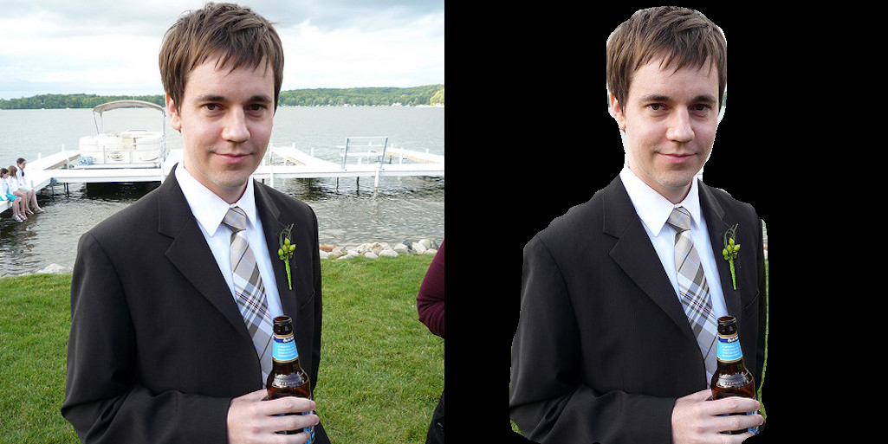
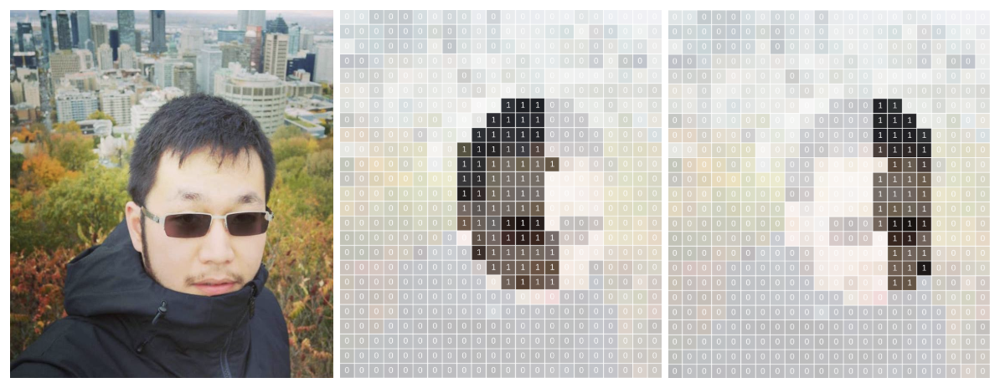
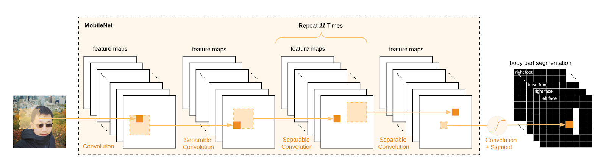

# Laboratorio 4. Segmentación de imágenes

## Objetivos

* Conocer una herramienta de segmentación de personas y partes corporales, así como su funcionamiento básico.
* Evaluar el rendimiento de la herramienta utilizando modelos acelerados, y observar tanto su rendimiento como precisión obtenida.
* Modificar la solución propuesta para integrarla en un entorno IoT para la gestión de un escenario real (calidad postural en conducción).

## Bodypix. Estructura y funcionamiento

[Bodypix](https://github.com/tensorflow/tfjs-models/tree/master/body-pix) es una infraestructura de código abierto (realmente, un conjunto de modelos) basada en redes neuronales de convolución y enfocada en dos tareas básicas: **segmentación de personas y partes corporales**, y **extracción de posicionamiento de partes corporales**. Bodypix está específicamente diseñado para obtener buenos rendimientos en plataformas de bajo rendimiento, y ser altamente parametrizable para adaptarse tanto a otro tipo de plataformas como a distintos niveles de precisión y rendimiento.

En este laboratorio utilizaremos los modelos de Bodypix, partiendo de la librería [tf-bodypix](https://pypi.org/project/tf-bodypix/).

!!! danger "Tarea"
    Instalar la librería y probar los ejemplos básicos para familiarizarse con la API.

!!! danger "Tarea"
    Adaptar alguno de los ejemplos para eliminar el fondo de una imagen capturada por la cámara en tiempo real.

!!! danger "Tarea"
    Probar a usar un modelo `.tflite`.

### Información complementaria

* [Blog Tensorflow](https://blog.tensorflow.org/2019/11/updated-bodypix-2.html)
* Código original bodypix ([readme](https://github.com/tensorflow/tfjs-models/blob/master/body-pix/README-v1.md) y [repositorio](https://github.com/tensorflow/tfjs-models/tree/master/body-pix)).
* [Coral bodypix](https://github.com/google-coral/project-bodypix) ([modelos TFLite y EdgeTPU](https://github.com/google-coral/project-bodypix/tree/master/models))

## Segmentación de personas

A un nivel básico, la segmentación de personas consiste en realizar una segmentación de una o más imágenes de entrada en píxeles que son parte de una persona, y píxeles que no lo son. En Bodypix, tras proporcionar una imagen al modelo para inferencia, ésta se devuelve comen forma de matriz bidimensional con valores flotantes entre 0 y 1 para cada posición (pixel), indicando la probabilidad de que una persona ocupe dicho píxel. Un valor típicamente denominado *umbral de segmentación* decidirá en último término el valor mínimo de probabilidad para que dicho píxel se considere como parte de una persona. Este valor puede utilizarse, por ejemplo, para eliminar el fondo de una imagen (o sustituirlo por otro):

El proceso de segmentación de personas procede mediante una decisión *binaria* para cada pixel de la imagen de entrada, estimando, para dicho píxel, si éste pertenece o no a una persona:

En cualquier caso, se proporciona una imagen de dimensiones determinadas a la red neuronal extractora de características (MobileNet o ResNet), y se utiliza una función de activación *sigmoide* para transformar su salida en un valor entre 0 y 1, que puede ser interpretado como la probabilidad de pertenencia a una persona o no para cada uno de los píxeles de la imagen. Normalmente, se utiliza un valor umbral (por ejemplo, 0.5) para convertir dicha segmentación en una decisión binaria. 

## Segmentación de partes corporales

Para estimar una correcta segmentación de partes individuales del cuerpo, se utiliza la misma red extractora de características, pero en este caso se repite el proceso de inferencia anterior prediciendo adicionalmente 24 canales extra a través de un tensor de salida adicional (siendo 24 el número de partes del cuerpo distintas que se desean predecir, valor por defecto en el código proporcionado). Cada uno de estos canales codifica la probabilidad de pertenencia de un pixel a una parte concreta del cuerpo. Por ejemplo, la siguiente imagen mostraría el contenido de dos canales: uno para la detección de la parte derecha de la cara, y otro para la detección de la parte izquierda:

La siguiente imagen muestra el proceso esquemático de procesamiento de una imagen de entrada en una salida multi-dimensional para la detección de partes corporales usando el extractor MobileNet:

Como para cada posición de la imagen disponemos de 24 canales en el tensor de salida `P`, es necesario encontrar la parte del cuerpo *óptima* de entre dichos 24 canales. Tras la inferencia, se realiza un proceso de post-procesado para realizar dicha detección, siguiendo la expresión:

Esto redunda en una única imagen bidimensional (del mismo tamaño que la imagen original), en la que cada pixel contiene un entero indicando a qué parte del cuerpo pertenece (asignando un valor especial, por ejemplo `-1` si el pixel correspondiente no corresponde a ninguna parte corporal, es decir, no se ha detectado persona en él:

Una posible combinación y representación final de la imagen con información detallada de segmentación podría ser:

!!! danger "Tarea entregable"
    Se pide que, basándote en el código de esta librería, desarrollar una aplicación que, utilizando la Raspberry Pi y mediante el uso del acelerador Google Coral, implemente un sistema que evalúe la **calidad postural** de un conductor. Para ello, supondremos que el conductor de un vehículo dispone de una cámara frontal en la que visualiza la parte superior de su cuerpo (incluido el torso) mientras conduce. Así, el sistema desarrollado deberá, en tiempo real, enviar vía MQTT (o cualquier otro protocolo) los siguientes parámetros a un panel de control:

    * Porcentaje de píxeles detectados para la parte izquierda y derecha de la cara en la imagen. Este parámetro indicará que el conductor está mirando al frente, y debería desvirtuarse si éste gira su cabeza a izquierda o derecha.
    * Porcentaje de píxeles detectados como cara no superior ni inferior a un umbral, lo que indicará que la cabeza se encuentra a una profundidad adecuada.
    * Porcentaje de píxeles detectados como manos aproximadamente similar y no superior ni inferior a un umbral, lo que indicará que ambas manos están a la misma profundidad.
    * Posición de las manos a la misma altura, y siempre por debajo de la cabeza. Este valor indicará que las manos están situadas en posición correcta en el volante.
    * Posición de los ojos aproximadamente a la misma altura, lo que indicará una posición correcta de la cabeza. 
    * Hombros a la misma altura.
    
    El panel de control combinará (en el porcentaje que desees) dichas métricas, para obtener un valor de calidad unificado. Si se supera por debajo el valor de calidad considerado umbral, se emitirá una alarma utilizando el mecanismo de aviso que consideres adecuado. (**Nota: puedes proponer escenarios distintos al propuesto si son de tu interés, siempre que la dificultad sea similar a la propuesta, y que se utilice el mismo tipo de información**).
