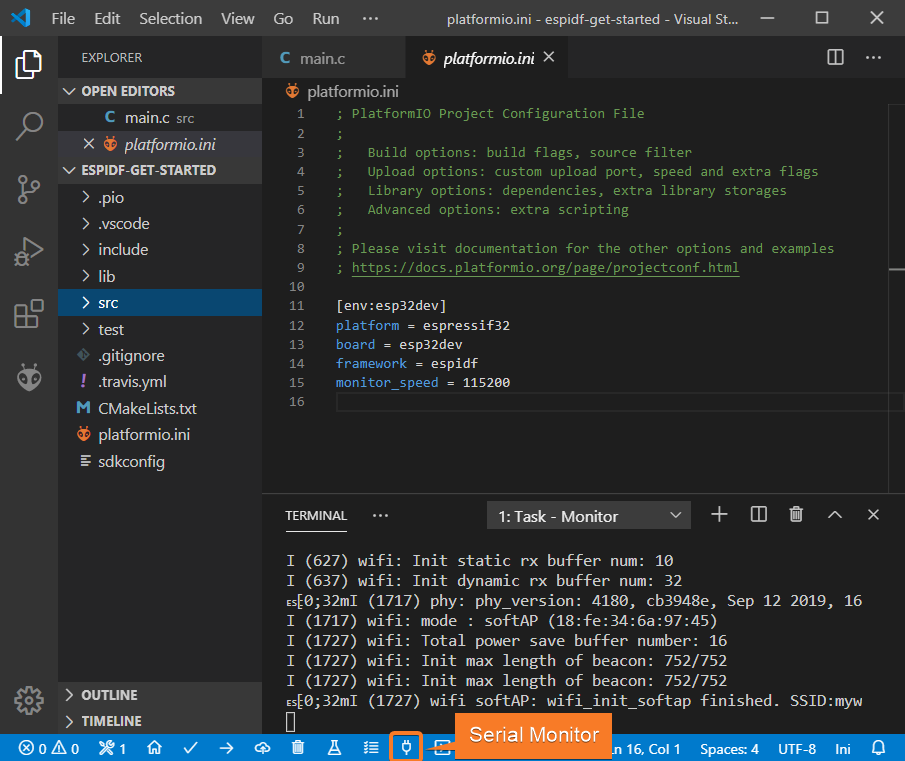

# Práctica 1. Introducción al entorno de desarrollo ESP-IDF

## Objetivos

* Conocer dos entornos básicos de desarrollo para el ESP32: uno basado
  en línea de comandos, y otro en la herramienta PlatformIO

* Ser capaz de compilar, *flashear* y monitorizar proyectos sencillos basados
  en ESP-IDF

* Entender el funcionamiento básico de una aplicación ESP-IDF que haga uso de
  las capacidades WiFi del ESP32

* Personalizar variables de configuración de proyectos ESP-IDF

* Responder a eventos básicos de red en ESP-IDF

## Introducción

ESP-IDF (*Espressif IoT Development Framework*) es el entorno de desarrollo
oficial de Espressif para los SoCs ESP32 y ESP32-S. Este entorno de desarrollo
y conjunto de herramientas permite desarrollar *firmwares* eficientes para 
dichas placas utilizando las interfaces de comunicación WiFi y Bluetooth, así
como gestionar múltiples características de los SoCs que iremos desgranando 
en futuras prácticas. 

ESP-IDF utiliza como base [FreeRTOS](https://freertos.org) para la construcción
del *firmware*, aunque añade multitud de componentes para ofrecer un soporte
de mayor nivel para la interacción con protocolos de comunicación de bajo y 
alto nivel, la mayoría de ellos enfocados al ámbito de comunicación en Internet
de las Cosas.

La presente práctica pretende ser una introducción básica a la puesta en 
marcha del entorno de desarrollo ESP-IDF sobre un sistema operativo Linux,
ofreciendo dos alternativas básicas: línea de comandos y un plugin específico
para VSCode (PlatformIO). Además, veremos de forma superficial la estructura 
básica de un programa sencillo desarrollado usando ESP-IDF, así como ejemplos
básicos para la puesta en marcha de la interfaz WiFi sobre una placa ESP32.

!!! "Recuerda"
    La presente práctica no tiene tarea entregable asociada más allá de una 
    memoria justificativa del trabajo realizado. Por tanto, recuerda apuntar
    y reportar los pasos y tareas realizadas durante su desarrollo para plasmarlas
    en una breve memoria entregable final.

## Flujo de trabajo. Entorno basado en línea de comandos

### Instalación de prerequisitos

ESP-IDF requiere ciertos paquetes software instalados en el sistema para poder
desarrollar los códigos y descargarlos sobre el ESP32. Se muestran a 
continuación los requisitos y modo de instalación para máquinas Ubuntu/Debian
(como la máquina virtual del curso), aunque la documentación de ESP-IDF
incluye instrucciones para otras distribuciones y sistemas operativos, 
incluyendo Windows y MacOS.

En tu máquina virtual, instala los paquetes necesarios utilizando (como
superusuario):

```sh
sudo apt-get install git wget flex bison gperf python python3-pip python-setuptools cmake ninja-build ccache libffi-dev libssl-dev dfu-util
```

Además, es necesario, en todo caso, que el usuario que estés utilizando pertenezca
al grupo `dialout` (puedes editar el fichero `/etc/group` añadiendo a tu 
usuario a la línea que indica el grupo correspondiente, e iniciando de nuevo
tu sesión).

Instala y configura Python 3 para su uso por defecto en tu 
distribución:

```sh
sudo apt-get install python3 python3-pip python3-setuptools
sudo update-alternatives --install /usr/bin/python python /usr/bin/python3 10
```

### Obtención de ESP-IDF

Utilizaremos las versiones de ESP-IDF a obtener directamente desde el 
repositorio Github oficial (concretamente, en su versión 4.1). Para ello,
ejecuta desde tu directorio de inicio:

```sh
mkdir -p ~/esp
cd ~/esp
git clone --recursive https://github.com/espressif/esp-idf.git
cd esp-idf
git fetch
git checkout release/v4.1
git pull
git submodule update --init --recursive
```

### Instalación de herramientas adicionales

Desde el directorio `esp-idf`, ejecuta el script `install.sh` para instalar
las herramientas (*toolchain*) específicas para tu versión:

```sh
sh install.sh
```

### Preparación del entorno

Tras el inicio de cada sesión, deberás establecer valores correctos para ciertas
variables de entorno. Afortunadamente, se proporciona un script (`export.sh`)
que te permitirá establecerlas de forma automática:

```sh
. export.sh
```

Puedes añadir esta línea en cualquier fichero de inicio de sesión para no tener
que ejecutar el comando cada vez.

En cualquier caso, en este punto deberías tener acceso a un programa llamado
`idf.py`, a través del cual gestionaremos el flujo de trabajo. Compruébalo y 
observa si la version de IDF con la que estás trabajando es efectivamente la
4.1 (el número de subversión podría variar en tu salida):

```sh
$ idf.py --version
ESP-IDF v4.1-332-g7b7c64107
```

### Preparación del proyecto

En esta primera parte, nos basaremos en un ejemplo sencillo de código desarrollado
en base a ESP-IDF. No es el objetivo de esta práctica analizar en detalle los
la estructura de dicho código (al menos de momento), sino utilizarlo para ilustrar
el flujo de trabajo típico en un proyecto ESP-IDF.

!!! "Recuerda"
    Tras la ejecución del script `export.sh`, tendrás definida una variable
    de entorno llamada `IDF_PATH`. Consulta su valor y comprueba que apunta,
    efectivamente, al directorio de instalación de IDF. La utilizaremos a 
    partir de ahora para referirnos a él.

Para empezar, toma el ejemplo `hello_world` proporcionado como parte de la instalación
básica de IDF, y cópialo en cualquier directorio del sistema de ficheros:

```sh
cp -R $IDF_PATH/examples/get-started/hello_world $HOME/
cd $HOME/hello_world
```

### Compilación

El proceso de compilación básico utiliza el script `idf.py`:

```sh
idf.py build
```

Si todo ha ido bien, en el directorio `build` se habrán generado los objetos
y binarios listos para ser *flasheados* en el ESP32.

### *Flasheado*

El proceso de *flasheado* básico utiliza el script `idf.py`:

```sh
idf.py -p PUERTO flash
```

En este punto, el ESP32 debe estar conectado utilizando el cable microUSB, y
si estás trabajando en una máquina virtual, debe haberse hecho visible a la 
misma (por ejemplo, en VirtualBox, a través del menú *Dispositivos->USB->Silicon Labs USB to UART Bridge Controller*).

En todo caso, la salida del comando `dmesg` tras la conexión del dispositivo 
te proporcionará información sobre el PUERTO que debes utilizar en el proceso
de *flasheado* y montorización posterior.

### Monitorización

Si todo ha ido bien, el proceso de monitorización nos permitirá observar la
salida del programa que tenemos ejecutando en la placa. Para ello, de nuevo,
usamos el *script* `idf.py`:

```sh
idf.py -p PUERTO monitor
```

!!! "Nota"
    Comprueba que, efectivamente, puedes realizar el proceso de compilación,
    *flasheado* y monitorización del programa sobre la placa ESP32. Recuerda
    que el botón `EN`, justo al lado del conector microUSB, forzará un 
    reseteo de la misma.

## Flujo de trabajo. Entorno basado en PlatformIO

El anterior flujo de trabajo puede también desarrollarse desde otros entornos
de desarrollo. En nuestro caso, se muestran a continuación los pasos principales
para la integración de ESP-IDF con VSCode, utilizando la plataforma 
[PlatformIO](http://platformio.org). Las máquinas virtuales proporcionadas
en el curso ya tienen instalada la última versión de PlatformIO y ESP-IDF, por lo
que se refiere al lector a la documentación oficial de PlatformIO para llevar a
cabo dicha instalación en otros sistemas operativos.

### Configuración de un proyecto

La forma más sencilla de crear un nuevo proyecto consiste en pulsar el botón
*PlatformIO Home* situado en la parte inferior de la pantalla:


A continuación, clica en *New Project* y selecciona como placa de desarrollo
*ESP DevkitC* o *Espressif ESP32 Dev Module*. Selecciona *ESP-IDF* 
como *framework* de desarrollo para el proyecto:


### Adición de ficheros a un proyecto

Crea un nuevo fichero `main.c` (si no existe) en el directorio `src` de tu 
proyecto, o modifica el que ya existe utilizando, por ejemplo, el siguiente
código:

```c
#include <string.h>
#include "freertos/FreeRTOS.h"
#include "freertos/task.h"
#include "esp_system.h"
#include "esp_wifi.h"
#include "esp_event.h"
#include "esp_log.h"
#include "nvs_flash.h"

#include "lwip/err.h"
#include "lwip/sys.h"

#define EXAMPLE_ESP_WIFI_SSID      "mywifissid"
#define EXAMPLE_ESP_WIFI_PASS      "mywifipass"
#define EXAMPLE_MAX_STA_CONN       (3)

static const char *TAG = "wifi softAP";

static void wifi_event_handler(void* arg, esp_event_base_t event_base,
                                    int32_t event_id, void* event_data)
{
    if (event_id == WIFI_EVENT_AP_STACONNECTED) {
        wifi_event_ap_staconnected_t* event = (wifi_event_ap_staconnected_t*) event_data;
        ESP_LOGI(TAG, "station "MACSTR" join, AID=%d",
                 MAC2STR(event->mac), event->aid);
    } else if (event_id == WIFI_EVENT_AP_STADISCONNECTED) {
        wifi_event_ap_stadisconnected_t* event = (wifi_event_ap_stadisconnected_t*) event_data;
        ESP_LOGI(TAG, "station "MACSTR" leave, AID=%d",
                 MAC2STR(event->mac), event->aid);
    }
}

void wifi_init_softap()
{
    tcpip_adapter_init();
    ESP_ERROR_CHECK(esp_event_loop_create_default());

    wifi_init_config_t cfg = WIFI_INIT_CONFIG_DEFAULT();
    ESP_ERROR_CHECK(esp_wifi_init(&cfg));

    ESP_ERROR_CHECK(esp_event_handler_register(WIFI_EVENT, ESP_EVENT_ANY_ID, &wifi_event_handler, NULL));

    wifi_config_t wifi_config = {
        .ap = {
            .ssid = EXAMPLE_ESP_WIFI_SSID,
            .ssid_len = strlen(EXAMPLE_ESP_WIFI_SSID),
            .password = EXAMPLE_ESP_WIFI_PASS,
            .max_connection = EXAMPLE_MAX_STA_CONN,
            .authmode = WIFI_AUTH_WPA_WPA2_PSK
        },
    };
    if (strlen(EXAMPLE_ESP_WIFI_PASS) == 0) {
        wifi_config.ap.authmode = WIFI_AUTH_OPEN;
    }

    ESP_ERROR_CHECK(esp_wifi_set_mode(WIFI_MODE_AP));
    ESP_ERROR_CHECK(esp_wifi_set_config(ESP_IF_WIFI_AP, &wifi_config));
    ESP_ERROR_CHECK(esp_wifi_start());

    ESP_LOGI(TAG, "wifi_init_softap finished. SSID:%s password:%s",
             EXAMPLE_ESP_WIFI_SSID, EXAMPLE_ESP_WIFI_PASS);
}

void app_main()
{
    //Initialize NVS
    esp_err_t ret = nvs_flash_init();
    if (ret == ESP_ERR_NVS_NO_FREE_PAGES || ret == ESP_ERR_NVS_NEW_VERSION_FOUND) {
      ESP_ERROR_CHECK(nvs_flash_erase());
      ret = nvs_flash_init();
    }
    ESP_ERROR_CHECK(ret);

    ESP_LOGI(TAG, "ESP_WIFI_MODE_AP");
    wifi_init_softap();
}
```

De momento no analizaremos el funcionamiento del código (lo haremos más adelante)
pero básicamente establece un Punto de Acceso inalámbrico abierto a conexiones
autenticadas vía WPA2.

### Compilación del proyecto

Para compilar del proyecto, despliega la paleta de comandos (menú `View -> Command Palette`)
y ejecuta la orden `PlatformIO: Build` desde ella. También puedes presionar
el botón `Build` (con forma de *check*) en la barra inferior de PlatformIO:


Si todo ha ido bien, deberías ver un mensaje final similar al siguiente en la
terminal del sistema:


### Flasheado del proyecto

Para llevar a cabo el proceso de subida (*upload*) del proyecto a la placa, 
podemos utilizar la orden `PlatformIO: Upload` a través de la paleta de comandos,
o bien presionar el botón correspondiente en la barra inferior (con un símbolo
de flecha a izquierda):


### Monitorización del proyecto

Por último, podemos monitorizar el proyecto utilizando la orden `PlatformIO: Monitor`
de la paleta de comandos o a través de la barra inferior, usando el botón con 
un enchufe como símbolo:




## Análisis de un proyecto sencillo (*Hola, mundo*) en ESP-IDF

!!! "Nota"
    Las siguientes tareas pueden realizarse desde línea de comandos o utilizando
    PlatformIO. Para familiarizarse con en entorno de bajo nivel, sin embargo,
    se sugiere el uso de línea de comandos.

Observa la estructura general del directorio `hello_world` que compilaste
anteriormente. Específicamente, nos interesará inspeccionar la estructura
básica de un programa principal para ESP-IDF, en este caso `hello_world_main.c`.

```c
#include <stdio.h>
#include "sdkconfig.h"
#include "freertos/FreeRTOS.h"
#include "freertos/task.h"
#include "esp_system.h"
#include "esp_spi_flash.h"

void app_main(void)
{
    printf("Hello world!\n");

    /* Print chip information */
    esp_chip_info_t chip_info;
    esp_chip_info(&chip_info);
    printf("This is %s chip with %d CPU cores, WiFi%s%s, ",
            CONFIG_IDF_TARGET,
            chip_info.cores,
            (chip_info.features & CHIP_FEATURE_BT) ? "/BT" : "",
            (chip_info.features & CHIP_FEATURE_BLE) ? "/BLE" : "");

    printf("silicon revision %d, ", chip_info.revision);

    printf("%dMB %s flash\n", spi_flash_get_chip_size() / (1024 * 1024),
            (chip_info.features & CHIP_FEATURE_EMB_FLASH) ? "embedded" : "external");

    printf("Minimum free heap size: %d bytes\n", esp_get_minimum_free_heap_size());

    for (int i = 10; i >= 0; i--) {
        printf("Restarting in %d seconds...\n", i);
        vTaskDelay(1000 / portTICK_PERIOD_MS);
    }
    printf("Restarting now.\n");
    fflush(stdout);
    esp_restart();
}
```

A alto nivel, la función `app_main` es el punto de entrada a todo programa
desarrollado usando ESP-IDF. De modo más específico, tras la 
[carga del sistema](https://docs.espressif.com/projects/esp-idf/en/latest/esp32/api-guides/general-notes.html), la llamada *tarea principal* (*main task*) ejecuta el
código proporcionado por el usuario e implementado en la función `app_main`. Tanto
el tamaño de pila asignado como la prioridad de esta tarea puede ser configuradas
por el desarrollador a través del sistema de configuración de ESP-IDF (lo veremos
más adelante). Normalmente, esta función se utiliza para llevar a cabo tareas
iniciales de configuración o para crear y lanzar a ejecución otras tareas. De
cualquier modo (como es el caso), se puede implementar cualquier funcionalidad
dentro de la función `app_main`.

En este ejemplo, se muestra en primer lugar información genérica sobre el 
SoC que está ejecutando el *firmware*:

```c
/* Print chip information */
    esp_chip_info_t chip_info;
    esp_chip_info(&chip_info);
    printf("This is %s chip with %d CPU cores, WiFi%s%s, ",
            CONFIG_IDF_TARGET,
            chip_info.cores,
            (chip_info.features & CHIP_FEATURE_BT) ? "/BT" : "",
            (chip_info.features & CHIP_FEATURE_BLE) ? "/BLE" : "");

    printf("silicon revision %d, ", chip_info.revision);

    printf("%dMB %s flash\n", spi_flash_get_chip_size() / (1024 * 1024),
            (chip_info.features & CHIP_FEATURE_EMB_FLASH) ? "embedded" : "external");

    printf("Minimum free heap size: %d bytes\n", esp_get_minimum_free_heap_size());
```

A continuación, dentro de un bucle sencillo, el sistema muestra un mensaje 
y difiere la ejecución de la tarea durante un período determinado de tiempo
utilizando la función [vTaskDelay](https://www.freertos.org/a00127.html) de
FreeRTOS. Esta función recibe el número de *ticks* de reloj que se desea utilizar,
por lo que el tiempo real que la tarea diferirá su ejecución depende de la 
duración de dicho *tick*. Por ello,  la constante `portTIC_PERIOD_MS` puede
utilizarse para calcular dicho tiempo:

```c
    for (int i = 10; i >= 0; i--) {
        printf("Restarting in %d seconds...\n", i);
        vTaskDelay(1000 / portTICK_PERIOD_MS);
    }
```

Finalmente, la tarea reinicia el sistema tras la finalización de la tarea
principal:

```c
    printf("Restarting now.\n");
    fflush(stdout);
    esp_restart();
```

!!! danger "Tarea Básica"
    Modifica el período de suspensión de la tarea para que sea mayor o menor,
    y comprueba que efectivamente esto modifica el comportamiento del 
    *firmware* cargado. Modifica el programa para que se muestre también por
    pantalla si el SoC tiene capacidades WiFi y si incluye memoria FLASH (para
    ello, puedes consultar [la siguiente página](https://docs.espressif.com/projects/esp-idf/en/latest/esp32/api-reference/system/system.html#_CPPv415esp_chip_info_t)).

### Creación de tareas

El anterior proyecto puede replantearse para que no sea la tarea principal la
que ejecute la lógica del programa. Para ello, es necesario introducir 
brevemente la API básica para gestión (en nuestro caso, creación) de tareas. 
Verás muchos más detalles sobre esta API en la asignatura ANIOT, por lo que 
no veremos aquí más detalles de los estrictamente necesarios. 

La función `xTaskCreate` (incluida en `task.h`) permite la creación de nuevas
tareas:

```c
 BaseType_t xTaskCreate( TaskFunction_t pvTaskCode,
                         const char * const pcName,
                         configSTACK_DEPTH_TYPE usStackDepth,
                         void *pvParameters,
                         UBaseType_t uxPriority,
                         TaskHandle_t *pxCreatedTask
                        );
```

Concretamente, crea una nueva tarea y la añade a la lista de tareas listas para
ejecución, recibiendo como parámetros:

* `pvTaskCode`: Puntero a la función de entrada para la tarea. Las tareas suelen
    implementarse como un bucle infinito, y no debería, en su cuerpo, retornar
    o simplemente finalizar abruptamente. En cambio, una tarea puede ser 
    destruida externamente a través de su manejador (último parámetro en 
    la creación), o internamente (desde el propio código de la tarea), tal y 
    como se muestra en el siguiente ejemplo extraído directamente desde la
    documentación de FreeRTOS:

```c
 void vATaskFunction( void *pvParameters )
    {
        for( ;; )
        {
            -- Task application code here. --
        }

        /* Tasks must not attempt to return from their implementing
        function or otherwise exit.  In newer FreeRTOS port
        attempting to do so will result in an configASSERT() being
        called if it is defined.  If it is necessary for a task to
        exit then have the task call vTaskDelete( NULL ) to ensure
        its exit is clean. */
        vTaskDelete( NULL );
    }
```

* `pcName`: Nombre (en forma de cadena) descriptivo de la tarea a ejecutar, 
    típicamente usado en tiempo de depuración.

* `usStackDepth`: Número de palabras a alojar para utilizar como pila para la
    tarea.

* `pvParameters`: Parámetros a proporcionar a la función de entrada para la
    tarea.

* `uxPriority`: Prioridad asignada a la tarea.

* `pxCreatedTask`: Manejador opcional para la tarea.

Así, la funcionalidad del programa `Hola, mundo` que hemos analizado 
anteriormente, podría reestrcturarse en base a una única tarea:

```c
void hello_task(void *pvParameter)
{
    printf("Hello world!\n");
    for (int i = 10; i >= 0; i--) {
        printf("Restarting in %d seconds...\n", i);
        vTaskDelay(1000 / portTICK_RATE_MS);
    }
    printf("Restarting now.\n");
    fflush(stdout);
    esp_restart();
}
```

Que podría ser creada desde la tarea principal:

```c
void app_main()
{
    nvs_flash_init();
    xTaskCreate( &hello_task, "hello_task", 2048, NULL, 5, NULL );
}
```

!!! danger "Tarea Adicional"
    Implementa una modificación del programa `hello_world` que implemente
    y planifique dos tareas independientes con distinta funcionalidad (en este
    caso, es suficiente con mostrar por pantalla algún mensaje) y distintos
    tiempos de suspensión. Comprueba que, efectivamente, ambas tareas se 
    ejecutan concurrentemente.

## Personalización del proyecto

ESP-IDF utiliza la biblioteca `kconfiglib` para proporcionar un sistema de 
configuracion de proyectos en tiempo de compilación sencillo y extensible. Para
ilustrar su funcionamiento, utilizaremos el ejemplo `blink` que puedes encontrar
en la distribución de ESP-IDF que has clonado anteriormente (copia el ejemplo
en cualquier punto de tu jerarquía de directorios antes de comenzar). 

Para configurar un proyecto ESP-IDF, simplemente utiliza la siguiente orden:

```sh
idf.py menuconfig
```

La ejecución de la orden anterior te permitirá navegar por un conjunto de 
opciones de carácter general, que te permitirán configurar las características
específicas del proyecto a compilar (por ejemplo, seleccionando los componentes
que deseas habilitar en la construcción del mismo).

!!! danger "Tarea Básica"
    Navega por las opciones que aparecen en los menús de configuración para
    familiarizarte con ellos. Los utilizarás en futuras prácticas.

En el proyecto `blink`, observa que una de las opciones del menú de navegación,
llamada *Example configuration*, incluye una opción llamada *Blink GPIO number*.
Más allá de su funcionalidad (define el número de pin GPIO a activar/desactivar
para iluminar un LED), es de interés para nosotros el hecho de que esta opción
de configuración definirá en tiempo de compilación el valor de una constante 
(en este caso `CONFIG_BLINK_GPIO`) que podemos utilizar directamente en cualquier
fichero de nuestro proyecto. 

!!! note "Nota"
    Observa el uso que da el código del proyecto `blink` a la constante 
    `CONFIG_BLINK_GPIO`.

Esta opción de configuración no forma parte de las opciones por defecto de 
ESP-IDF, sino que ha sido añadida por los desarrolladores del proyecto `blink`.
Observa y estudia el formato y contenido del fichero `main/Kconfig.projbuild`
que se proporciona como parte del fichero. En él, se definen las características
(nombre, rango, valor por defecto y descripcion) de la opción de configuración
a definir.

!!! danger "Tarea Básica"
    Modifica el proyecto `hello_world` para que defina dos opciones de configuración
    que permitirán definir el tiempo de espera de cada una de las dos tareas que
    hayas definido en tu anterior solución. Haz uso de ellas en tu código y 
    comprueba que efectivamente su modificación a través del sistema de menús
    permite una personalización del comportamiento de tus códigos.

## Gestión de redes WiFi. Ejemplo 1. Escaneado de redes WiFi

A modo de ejemplo, y en preparación para los códigos con los que trabajaremos
en futuras prácticas,  vamos a analizar a continuación un ejemplo concreto de
*firmware* cuya tarea es el escaneado de redes inalámbricas al alcance del ESP32,
y su reporte a través del puerto serie del mismo. Para cada red escaneada, se
reportarán sus características principales.

!!! danger "Tarea Básica"
    Compila, flashea y monitoriza el ejemplo `scan` situado en el directorio
    `examples/wifi/scan`. Recuerda copiarlo antes a cualquier otro directorio
    de tu *home*. Antes de compilarlo, modifica el número máximo de redes a 
    escanear a través del menú de configuración del ejemplo para ampliarlo a 20.
    Crea un punto de acceso WiFi con tu teléfono móvil y observa que, efectivamente,
    es escaneado por el ejemplo.

Observa su funcionamiento. Realmente, el *firmware* simplemente escanea un 
subconjunto de las redes disponibles, reportando algunas de sus características
(por ejemplo, SSID, modo de autenticación o canal primario). 

!!! danger "Tarea Adicional"
    Analiza el código de la función `wifi_scan` (tarea principal). Específicamente,
    céntrate en las líneas que permiten activar y configurar el escaneado de 
    redes. Intenta entender el funcionamiento general del programa, consultando
    y apuntando el cometido de cada línea, con especial interés a aquellas
    funciones con prefijo `esp_wifi_*`. Anota en la memoria entregable el 
    cometido de cada una de ellas, consultando la [documentación oficial](https://docs.espressif.com/projects/esp-idf/en/latest/esp32/api-reference/network/esp_wifi.html).

## Gestión de redes WiFi. Ejemplo 2. Gestión de eventos de red

El segundo ejemplo consiste en la creación de un *firmware* para conexión del 
ESP32 a un punto de acceso existente. Este ejemplo nos permitirá observar, a 
grandes rasgos, el sistema de gestión de eventos en FreeRTOS/ESP-IDF, que
estudiarás en más detalle en ANIOT y que permite gestionar, entre otros, las
respuestas a eventos de red, como por ejemplo la obtención de dirección IP
o la conexión exitosa a un punto de acceso.

!!! danger "Tarea Básica"
    Compila, flashea y monitoriza el ejemplo `station` situado en el directorio
    `examples/wifi/getting_started`. Recuerda copiarlo antes a cualquier otro directorio
    de tu *home*. Antes de compilarlo, modifica el SSID de la red al que conectará,
    así como la contraseña elegida (puedes usar el mismo punto de acceso que
    creaste anteriormente como objetivo de tu conexión) a través del sistema
    de menús de configuración.

Observa su funcionamiento. El *firmware* simplemente inicializa el dispositivo
en modo *station* (en contraposición al modo *Access Point*, que veremos en 
la próxima sesión), realizando una conexión al punto de acceso preconfigurado
a través del menú de configuración.

Analiza el código de la función `wifi_init_sta`. Esta función, que implementa
la tarea principal, se divide básicamente en dos partes:

* **Gestión de eventos**. Observa el mecanismo mediante el cual se registra
y se asocia la recepción de un evento a la ejecución de un manejador o función
determinada.

!!! danger "Tarea Adicional"
	Responde a la siguiente pregunta de forma razonada:
    ¿Qué eventos se asocian a la ejecución de qué función en el *firmware* que
    estás estudiando?

* **Configuración de la conexión a un punto de acceso**. La configuración 
de la conexión se realiza a través de los campos correspondientes de una
estructura de tipo `wifi_config_t`. Observa los campos básicos que necesita,
cómo fuerza el uso de WPA2 y cómo recoge los datos de conexión (SSID y contraseña)
a través del sistema de configuración. Observa también cómo, una vez realizadas
dichas personalizaciones, inicializa el sistema de comunicación inalámbrica
a través de `esp_wifi_start()`. Consulta la documentación relativa a dichas
funciones y anota en tu memoria entregable aquellos aspectos que consideres 
más relevantes.

!!! danger "Tarea Adicional"
    Modifica el *firmware* para que el *handler* de tratamiento de la obtención
    de una dirección IP sea independiente del tratamiento del resto de eventos
    del sistema WiFi que ya se están considerando. Comprueba que, efectivamente
    sigue observándose la salida asociada a dicho evento, aun cuando ambas 
    funciones sean independientes. Entrega o añade a la memoria el código 
    modificado.
