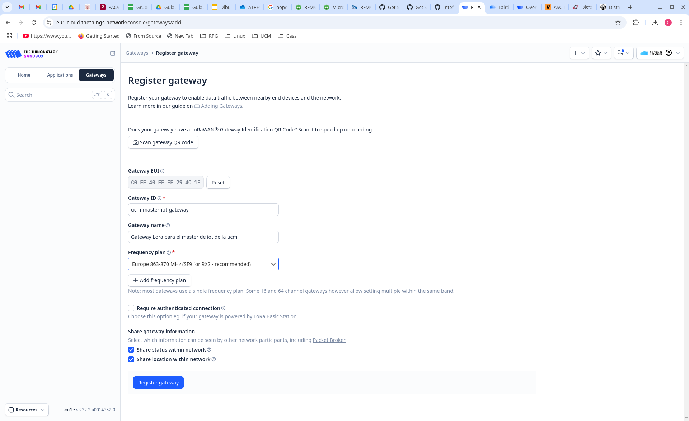

# Práctica 10. LoRa y LoRaWAN

## Introducción y objetivos

En esta práctica vamos a utilizar la tecnología LoRa para comunicar nuestros
nodos esp32 entre ellos, así como con el Router de Red LoRaWAN y los servicios
del cloud de The Things Network (TTN).

El nodo esp32 con el que hemos venido trabajando no dispone de radio LoRa
incorporada, por lo que deberemos conectar un transceptor externo antes de poder
utilizar esta tecnología para nuestras comunicaciones. Asimismo, para la
conexión con los servidores de TTN necesitaremos un gateway LoRa. Por motivos
prácticos usaremos un único Gateway para toda la clase, que será configurado por
el profesor, aunque la memoria de la práctica detalla los pasos a seguir para su
configuración y registro en TTN.

!!! danger "Tarea"
	Escribe un informe en el que describas cada una de las tareas propuestas, su
	desarrollo y los resultados obeservados, así como tus observaciones o
	comentarios personales.

## LoRaWAN. The Things Network

En la arquitectura LoRaWAN los nodos envían mensajes al aire, cualquier gateway
al alcance recibe el mensaje y lo envía por Internet al servidor de red
configurado, que elimina los duplicados y reenvía a su vez el mensaje al
servidor de aplicación configurado.

[The Things Network (TTN)](https://www.thethingsnetwork.org/) es una red abierta
en la que cualquier persona puede crear una cuenta y dar de alta gateways y/o
nodos. Los paquetes capturados por cualquier gateway de la red TTN son enviados
a su servidor de red, que los envía a su servidor de aplicación, que ofrece un
dashboard al usuario donde puede ver los paquetes recibidos.

Las siguientes subsecciones describen los elementos que necesitamos para montar
una red LoRaWAN, con nodos esp32, que envíen datos a un gateway LoRa conectado a
la red TTN.


### Registro de Gateway en TTN

Para poder desplegar nuestra red lo primero que debemos hacer es dar de alta un
gateway en TTN. Esto no podemos hacerlo todos porque no habrá un gateway por
alumno, pero aquí se documentan los pasos a seguir.

Primero nos conectamos a TTN, nos registramos si no tenemos cuenta, y entramos
en el sistema. Una vez conectados, se nos muestra el dashboard:


En el panel izquierdo pulsamos en Gateways y luego en el botón Create Gateway
del lado derecho de la ventana. Nos aparecerá una ventana en la que tendremos
que introducir el identificador universal del gateway (EUI) que vendrá en la
pegatina de la tapa inferior del mismo (marcado como M2 EUI):



Damos entonces a Register Gateway y el quedrá registrado en nuestro dashboard:


Sólo nos falta crear un API key para permitir la conexión del gateway. Para ello
seleccionamos API keys en el panel izquierdo del dashboard del gateway que hemos
creado y pulsamos el botón Add API Key en el lado derecho de la ventana.
Rellenamos los datos y pulsamos Create API Key:


Se nos abrirá una ventana que nos permitirá copiar el API key generado. Es
importante hacer la copia y guardarla porque la necesitarmos para configurar
nuestro el Gateway.

### Gateway Laird Sentrinus RG1xx

Este proceso no podemos hacerlo todos puesto que no disponemos más que de un
gateway LoRa comercial, concretamente el modelo Sentrinus RG1xx de Laird. A
continuación se describe el proceso que debemos seguir para configurar dicho
gateway para trabajar con TTN.

Empezaremos por conectarnos a la web de configuración del gateway usando su
interfaz wifi. Para ello pulsaremos el botón de usuario (parte trasera) durante
unos 10 segundos y luego lo soltamos. Esto configurará un punto de acceso wifi
con SSID rg1xx294c1f al que nos conectaremos. Una vez conectados abriremos un
navegador web y nos conectaremos a la dirección 192.168.1.1 e introducimos el
usuario y contraseña (consultar manual si no se ha cambiado). Entonces
selecionamos la opción LoRa en el menú superior y se abrirá una página. En el
panel izquierdo pulsaremos en Forwarder y en el panel central seleccionaremos el
modo Semtech Basics Stations. Además tendremos que proporcionar la url del
servidor de red (LNS server), el certificado del servidor y el *Key File*,
siguiendo [las instrucciones de la página de
TTN](https://www.thethingsindustries.com/docs/gateways/concepts/lora-basics-station/lns/)
y usando el API key generado en TTN en el paso anterior para el gateway.


Podemos entonces conectar el gateway a la red por su interfaz ethernet (que
podemos configurar previamente) o activar su interfaz wifi para el acceso a
internet (que debemos configurar en esta misma web). Si todo ha ido bien,
veremos en el dashboard de TTN que nuestro gateway se ha conectado:


### Registro de Aplicación en TTN

Una vez registrado el Gateway debemos registrar una aplicación en TTN a la que
podremos vincular nodos. Esto podemos hacerlo cada uno por nuestra cuenta. Para
ello pulsaremos en Applications en el panel izquierdo del dashboard, y acto
seguido en el botón Add Application de la parte derecha de la ventana, y
rellenamos los datos para la aplicación:


Pulsamos a Create Application y nos mostrará el dashboard de la aplicación, que
nos permitirá añadir nodos a la aplicación, como se indica en la siguiente
subsección.

### Registro de End-Devices

El dashboard de la aplicación está actualmente vació:


Para añadir un nodo pulsamos en Register End Device. Como vamos a crear un end
device a partir de una placa esp32 debemos seleccionar *Enter end device
specifics manually*; si tuvieramos un nodo comercial podríamos darlo de alta
escaneando un QR o seleccionandolo en el menú desplegable. Introducimos los
datos como muestra la figura siguiente, seleccionando como JoinEUI/AppEUI el
identificador que queramos:


Al pulsar en Confirm se nos mostrarán nuevos campos para introducir o generar
el identificador del dispositivo (devEUI) y la clave de la aplicación (AppKey).
Pulsaremos el botón generar en ambos casos y copiaremos los valores generados
porque luego tendremos que usarlos en el firmware del nodo que desarrollemos.
Finalmente pondremos un nombre a nuestro dispositivo:


Pulsaremos Register End Device para completar el proceso.

### Transceptor HopeRFM95

El dispositvo [HopeRFM95](https://www.hoperf.com/modules/lora/RFM95W.html?ref=halle1wh.de&/modules/index.html&gad_source=1&gclid=Cj0KCQjw7Py4BhCbARIsAMMx-_KBeOI3-6XQhq7MNRCsB8IjwhyyCOZXpjxvjlvnDkuDDoE9-TqUB9saAg9hEALw_wcB)
es un pequeño trasceptor LoRa que puede conectarse por SPI a cualquier
microcontrolador para dotarle de conectividad LoRa. Han salido al mercado varios
modelos de *breakout boards* que nos permiten adaptar este transceptor a una
*breadboard* y así poder usar cables estándar para conectar el transceptor a
nuestro nodo esp32.

La siguiente figura muestra el esquema de una de estas placas de *breakout*,
fabricada por adafruit:


Para conectar este transceptor al esp32 dev kit rust, debemos poner ambos sobre
una breadboard. Debido a la anchura del transceptor no tendremos acceso a los
pines por los dos lados, por lo que deberemos utilizar cable de puente (*jumper
wire*) para sacar las conexiones de uno de los lados, dejando el otro accesible
para conexiones directas. Lo más sencillo es sacar el pin G1, ya que es el único
pin que necesitamos de ese lado.

El pinout del dev kit rust es el siguiente:


Una posible conexión entre el transceptor y la esp32 dev kit rust sería la
siguiente:

| Adafruit 3070   | esp32 dev kit rust |  Función   |
|-----------------|:------------------:|:----------:|
| RST             |      5             | Reset      |
| CS              |      6             | SPI SS     |
| MOSI            |      2             | SPI MOSI   |
| MISO            |      3             | SPI MISO   |
| SCK             |      4             | SPI CLK    |
| G0              |      0             | DIO0       |
| GND             |     GND            | GND        |
| Vin             |     3.3 V          | 3.3 V      |
| G1              |      1             | DIO1       |

La siguiente figura muestra como las dos placas conectadas con las conexiones
indicadas en la tabla anterior:


### Codigo del nodo: librería ttn-esp32

La librería [ttn-esp32](https://github.com/manuelbl/ttn-esp32) es un componente
para esp-idf que proporciona comunicación LoRaWAN con The Things Network.
Soporta dispositivos conectados a transceptores Semtech SX127x. Esta librería
soporta las siguientes características de TTN:

- OTAA (activación remota, *over the air activation*)
- Mensajes uplink y downlink
- Guardado los EUIs y la clave en memoria no volátil
- Deep sleep y apagado sin necesidad de reincorporación
- Comandos AT para el aprovisionamiento de EUIs y clave (de modo que el mismo
  código puede ser flasheado a varios dispositivos)
- Compatibilidad con las regiones de Europa, América del Norte y del Sur,
  Australia, Corea, Asia e India
- API en C y C++

Este componente usa por debajo la librería LMIC de IBM (específicamente la
versión mantenida por MCCI) y proporciona una API de alto nivel específicamente
dirigida a The Things Network.

Para crear un proyecto que use esta librería lo primero que haremos es clonar el
repositorio en nuestro equipo o descargar el zip de la rama master:

```sh 
git clone https://github.com/manuelbl/ttn-esp32.git
```

o

```sh 
wget https://github.com/manuelbl/ttn-esp32/archive/master.zip
unzip master.zip
```

Después copiaremos el ejemplo que viene con la librería en examples/hello_world
a un nuevo directorio. Dentro de la copia creamos un directorio *components* y
dentro copiaremos toda la librería ttn-esp32. La estructura que tendrá el
proyecto será:

```sh
hello_world/
+- CMakeLists.txt
+- components/
|  +- ttn-esp32
|     +- ...
+- main/
|   - CMakeLists.txt
|   - component.mk
|   - main.cpp
+- Makefile
```

Si echamos un vistazo al fichero main.cpp veremos que el programa se conectará a
TTN, y después el nodo se pondrá a enviar mensajes "hello world" uplink (hacia
el servidor de aplicación) al ritmo de uno por segundo. El programa debe ser
configurado definiendo los valores de una serie de macros, que determinan por un
lado los identificadores del nodo para TTN y por otro lado los pines usados para
la conexión del esp32 con el transceptor LoRa.

Para los identificadores del nodo en TTN usaremos los datos obtenidos en el
registro del end device en TTN:

```c 
// AppEUI (sometimes called JoinEUI)
const char *appEui = "0101010101010101";
// DevEUI
const char *devEui = "70B3D57ED006B7B2";
// AppKey
const char *appKey = "8427407CC943D5B188160CC89F176846";
```

Para la conexión entre ambos chips indicada, arriba en la sección del
transceptor HopeRFM95, la configuración de pines sería como sigue:

```c 
#define TTN_SPI_HOST      SPI2_HOST
#define TTN_SPI_DMA_CHAN  SPI_DMA_DISABLED
#define TTN_PIN_SPI_SCLK  4
#define TTN_PIN_SPI_MOSI  2
#define TTN_PIN_SPI_MISO  3
#define TTN_PIN_NSS       6
#define TTN_PIN_RXTX      TTN_NOT_CONNECTED
#define TTN_PIN_RST       5
#define TTN_PIN_DIO0      0
#define TTN_PIN_DIO1      1
```

Una vez configurado el fichero fuente main.cpp, haremos un menuconfig para
configurar la librería ttn-esp32. En la parte final (abajo) del menú principal
encontraremos la entrada The Things Network, y seleccionaremos en ella las
entradas como en la figura siguiente:


Después podemos compilar el proyecto y descargarlo en la placa (flash). Lo
monitorizaremos, y si todo ha ido bien iremos viendo en el dashboard de nuestra
aplicación TTN cómo se van recibiendo los mensajes.

La aplicación envía el mensaje hello world, pero el dashboard nos muestra el
payload del mensaje en hexadecimal. Podemos usar el servicio de [RapidTable](https://www.rapidtables.com/convert/number/ascii-to-hex.html)
para traducir el payload hexadecimal a ascii y comprobar así que el payload
recibido es correcto.

!!! danger "tarea"
    Modificar el código para que se envíen mensajes con payload {0xAA, 0xBB,
    0xCC, 0xDD} y comprobar en el dashboard que se reciben correctamente.
    Incluir en el informe las capturas de pantalla apropiadas.

## Comunicación LoRa raw

Podemos también hacer comunicaciones LoRa diréctamente entre los nodos sin
necesidad de utilizar la infrastructura de red LoRaWAN. Para ello podemos hacer
uso de la librería
[esp32-lora-library](https://github.com/Inteform/esp32-lora-library) que es un
componente de esp-idf que podemos añadir a un proyecto para tener comunicaciones
LoRa usando transceptores de la familia Semtech SX127x.

!!! danger "Tarea opcional"
    Clonar el repositorio de la librería. Crear un proyecto de esp-idf que use
    esta librería como componente. Programar dos nodos con el código de ejemplo
    que viene en el README.md de la librería, acordándonos de configurar los
    pines usados para la conexión con el transceptor a través del menuconfig.
    Monitorizar ambos nodos y comprobar que los paquetes enviados por uno son
    recibidos por el otro. Añadir a la memoria las capturas de pantalla
    apropiadas que muestren el correcto funcionamiento de los nodos.
