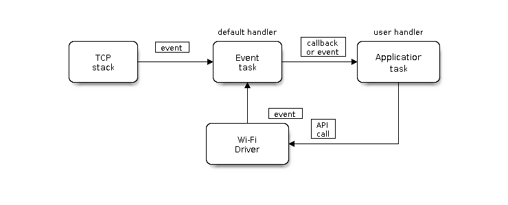
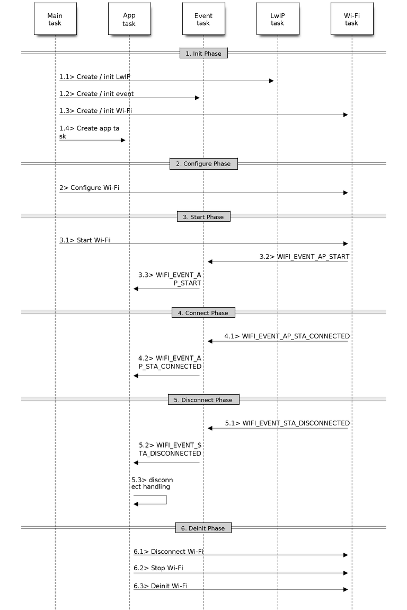
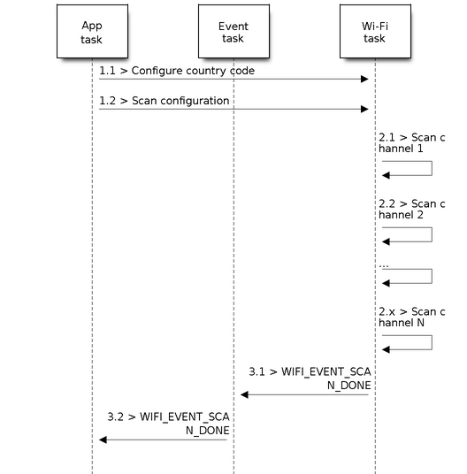

# LAB2. WiFi en el ESP32

## Objetivos

- Conocer el flujo de trabajo del driver WiFi en ESP-IDF.
- Analizar las diferencias entre un *firmware* desarrollado para trabajar 
en modo *station* y en modo *AP*.
- Desarrollar un *firmware* combinado para que funcione en modo AP y *station*
de forma simultánea.
- Conocer los mecanismos de escaneado de redes en ESP-IDF.
- Conectar a redes vía WPA2 Enterprise desde el ESP32 (*eduroam*).

## Introducción

Las bibliotecas y componentes de soporte WiFi en ESP-IDF proporcionan soporte
para configurar y monitorizar la conexión 802.11 sobre placas ESP32. Este 
soporte incluye configuraciones para:

* Modo `station` (modo cliente WiFi, o *STA*). 
  En este caso, el ESP32 conecta con un punto de acceso preconfigurado.

* Modo `AP` (también denominado *softAP* o modo *Punto de Acceso*). En este
  caso, son las estaciones las que conectan al ESP32.

* Modo combinado AP-STA, donde el ESP32 actúa de forma concurrente como punto de
  acceso (AP) y cliente WiFi conectado a otro punto de acceso (STA).

* Varios modos de seguridad tanto en modo cliente como en modo AP (WPA,
  WPA2, WEP, etc.)

* Escaneado de puntos de acceso (activo y pasivo).

* Provisionamiento de claves y modo WPS.

* Modo promiscuo para monitorización de paquetes IEEE 802.11.

En la presente práctica, a través de ejemplos básicos, estudiaremos las
características principales soportadas por el driver WiFi sobre el ESP32.
Todas estas características pueden ser utilizadas a posteriori para el 
desarrollo de códigos y proyectos más complejos con mínimas modificaciones.

### Modelo de programación del driver WiFi en ESP-IDF

El modelo de programación del driver WiFi en ESP-IDF sigue un modelo de 
programación sencillo que se puede resumir en la siguiente imagen:



Puede considerarse que el driver WiFi es una caja negra independiente del resto
de la aplicación, como la pila TCP/IP, las tareas de aplicación y los eventos.
El código de las tareas de aplicación generalmente invoca a la API WiFi para
inicializar el dispositivo inalámbrico y tratar eventos específicos cuando
resulta necesario. El driver WiFi recibe invocaciones a su API, las procesa y
emite eventos a la aplicación. 

El tratamiento de eventos WiFi se basa en la [biblioteca de eventos
esp_event](https://docs.espressif.com/projects/esp-idf/en/latest/esp32/api-reference/system/esp_event.html);
los eventos se envían por parte del driver al [bucle de tratamiento de eventos
por
defecto](https://docs.espressif.com/projects/esp-idf/en/latest/esp32/api-reference/system/esp_event.html#esp-event-default-loops).
La aplicación registra una serie de funciones *callback*, a través de la función
`esp_event_handler_register()`, que serán las responsables de tratar estos
eventos. Algún tipo de eventos es también procesado por el componente
`esp_netif` para proporcionar reacciones por defecto ante su recepción. Por
ejemplo, cuando un dispositivo se conecta a un AP el `esp_netif` arranca un
cliente DHCP para obtener una dirección IP sin intervención del código de
usuario (aunque este comportamiento por defecto puede ser personalizado para,
por ejemplo, asignar una dirección IP estáticamente).

!!! note "Nota"
    Toda la API mencionada a continuación se encuentra descrita en profundidad 
    [aquí](https://docs.espressif.com/projects/esp-idf/en/latest/esp32/api-reference/network/esp_wifi.html). Se aconseja disponer de esta información durante el proceso
    de desarrollo y también en el propio desarrollo de la práctica.

### Eventos WiFi

Se listan a continuación algunos de los ejemplos más utilizados en la gestión
de conexiones WiFi, que utilizaremos en los ejemplos posteriores.

* `WIFI_EVENT_SCAN_DONE`

    Este evento se envía automáticamente en la invocación de
    `esp_wifi_scan_start()`, en los siguientes escenarios:

    - El escaneado de redes se completa, es decir, se ha encontrado el punto de
      acceso (AP) objetivo.
    - El escaneado de redes finaliza tras la invocación de `esp_wifi_scan_stop()`.
    - Se invoca al inicio de un nuevo escaneo (mediante la rutina
      `esp_wifi_scan_start()`) antes de finalizar un escaneado previo. Este
      nuevo escaneado se superpondrá al anterior y se emitirá el evento.

    El evento no se emite cuando el escaneado se fuerza mediante la invocación
    a `esp_wifi_connect()`.

    Ante la recepción de este evento, no se lanza ningún proceso específico como
    respuesta. La aplicación necesitará invocar normalmente a 
    `esp_wifi_scan_get_ap_num()` y a `esp_wifi_scan_get_ap_records()` 
    para recoger la lista de APs escaneados y  liberar los recursos  (memoria)
    que se aloja en el proceso de escaneado.

* `WIFI_EVENT_STA_START`

    Este evento se envía cuando, tras la invocación a `esp_wifi_start()`,
    ésta devuelve `ESP_OK`. Tras la recepción de este evento, se inicializa
    la interfaz de red, por lo que normalmente, tras la recepción de este evento
    se está listo para invocar a `esp_wifi_connect()` para comenzar el proceso
    de conexión con un punto de acceso (AP).

* `WIFI_EVENT_STA_STOP`

    Este evento se envía cuando, tras la invocación a `esp_wifi_stop()`,
    ésta devuelve `ESP_OK`. Tras la recepción de este evento, se libera la
    dirección IP, se detiene el cliente DHCP y se liberan las conexiones
    TCP/UDP existentes. Normalmente no se trata desde el punto de vista de la
    aplicación.

* `WIFI_EVENT_STA_CONNECTED`

    Este evento se envía cuando, tras la invocación a `esp_wifi_connect()`,
    ésta devuelve `ESP_OK`. Tras la recepción de este evento, arranca un 
    cliente DHCP para la obtención de una dirección IP. A continuación,
    si todo ha ido bien, el driver WiFi está listo para enviar y recibir
    datos.

    Dicho instante es el adecuado para comenzar con la lógica de la aplicación,
    siempre que ésta no dependa de la correcta obtención de una dirección IP. 
    Si este es el caso, será necesario esperar a la obtención de la misma
    esperando al evento `WIFI_EVENT_STA_GOT_IP`.

* `WIFI_EVENT_STA_DISCONNECTED`

    Este evento se genera en los siguientes escenarios:

    - Cuando se invoca a las funciones
    `esp_wifi_disconnect()`, `esp_wifi_stop()`, `esp_wifi_deinit()` o
    `esp_wifi_restart()` y la estación está conectada al punto de acceso.
    - Cuando se invoca a `esp_wifi_connect()`, pero el driver WiFi no 
    consigue configurar una conexión con el AP debido a cualquier razón
    (por ejemplo, el escaneo no puede encontrar el AP objetivo, el proceso
    de autenticación no tiene éxito, etc). Si hay más de un AP con el mismo
    SSID, el evento se emite sólo cuando el dispositivo no puede conectar
    a ninguno de los APs encontrados.
    - Cuando la conexión WiFi se interrumpe, por ejemplo porque el dispositivo
    pierde N *beacons* emitidos por el AP, el AP expulsa al dispositivo, el modo
    de autenticación cambia, etc.

    Resulta común que la rutina de tratamiento del evento trate de invocar de
    nuevo a la función `esp_wifi_connect()` para reintentar la conexión.  

* `WIFI_EVENT_STA_GOT_IP`

    Este evento se emite cuando el cliente DHCP obtiene una dirección IPv4
    desde un servidor DHCP, o cuando se modifica su dirección IPv4. El 
    evento significa que todo está listo y que la aplicación puede continuar
    con sus tareas (por ejemplo, creación de sockets, inicialización de 
    protocolos, etc.)

    La dirección IPv4 podría modificarse por alguna de las siguientes razones:

    - El cliente DHCP no puede renovar la dirección IPv4 tras su expiración
    (los servidores DHCP suelen conceder direcciones IP durante un tiempo
    limitado).
    - El cliente DHCP se asocia a otra dirección.
    - Se modifica la dirección IPv4 asignada estáticamente (no vía DHCP).

    Normalmente, cuando la IP cambia, todos los sockets asociados a ella
    quedarán en un estado no utilizable. Así, la recepción de este evento
    se suele aprovechar para cerrar y a continuación recrear todos los 
    sockets abiertos.

* `WIFI_EVENT_STA_LOST_IP`

    Evento emitido cuando una dirección IPv4 se convierte en una dirección
    inválida. El evento no se emite inmediatamente tras la desconexión
    WiFi, sino que inicializa un temporizador de tipo *address lost*. Si se
    obtiene una IP antes de su expiración, el evento no se emite. En otro
    caso, se emite justo en el instante de expirción del temporizador.

    Normalmente, las aplicaciones no deben tratar este evento (suele usarse
    en tareas de depuración).

* `WIFI_EVENT_AP_START`

    Emitido en el inicio de un AP (punto de acceso).

* `WIFI_EVENT_AP_STACONNECTED`

    Cuando un dispositivo (*station*) se conecta a un AP, éste emite el event
    `WIFI_EVENT_AP_STACONNECTED`. Es posible ignorarlo, o aprovecharlo para
    obtener información sobre la estación conectada, por ejemplo.

* `WIFI_EVENT_AP_STADISCONNECTED`

    Este evento se genera en los siguientes escenarios:

    - La aplicación invoca a `esp_wifi_disconnect()` o `esp_wifi_deauth_sta()`
    para desconectarla manualmente del punto de acceso.
    - El driver WiFi expulsa al dispositivo (*station*), por ejemplo en una
    situación en la que el AP no ha recibido paquetes en los últimos minutos.
    
    Cuando ocurre este evento, la aplicación necesitaría (idealmente) tomar
    las medidas necesarias asociadas al mismo, por ejemplo, cerrar los *sockets*
    abiertos.

## Modo Station 

La siguiente figura describe, a grandes rasgos, algunos de los escenarios
principales que pueden darse en modo *station*:


Se analizan a continuación las fases principales en este tipo de *firmware*
(no todas tienen que estar necesariamente presentes en cualquier escenario).

**Fase 1: inicialización WiFi**

  1. La tarea principal invoca a `esp_netif_init()` para crear la pila
  IP y realizar las tareas de inicialización pertinentes.
  2. La tarea principal invoca a `esp_event_loop_create()` para crear e 
  inicializar el sistema de eventos.
  3. La tarea principal invoca a `esp_netif_create_default_wifi_sta()` para
  crear la interfaz de red que asocia el dispositivo con la pila TCP/IP.
  4. La tarea principal invoca a `esp_wifi_init()` para crear la tarea que
  manejará la conexión WiFi e inicializa el driver WiFi.
  5. Por último, se invoca (si así se desea, aunque es lo más común) a la
  API para la creación de la tarea o tareas de aplicación.

  Esta secuencia es la recomendada para la inicialización del sistema de 
  comunicación WiFi, pero no es estrictamente obligatorio seguirla en dicho
  orden o en su totalidad. Por ejemplo, se podría crear directamente una
  tarea de aplicación (paso 5) y realizar la configuración en su cuerpo, o se
  puede diferir su creación hasta la obtención de una dirección IP.

**Fase 2: configuración WiFi**

Una vez inicializado el driver WiFi, comienza su configuración. En 
este escenario, el modo debe fijarse a *station* a través de una invocación
a `esp_wifi_set_mode(WIFI_MODE_STA)`. Es posible invocar a continuación
a otras rutinas de tipo `esp_wifi_set_xxx()` para configurar parámetros
adicionales (país, ancho de banda, modo de protocolo, ...). 
Para más información sobre los modos de operación (*station*, *AP* o
modo combinado *station/AP*, consulta el siguiente
[enlace](https://docs.espressif.com/projects/esp-idf/en/latest/esp32/api-guides/wifi.html#wi-fi-mode)).

Generalmente, es necesario configurar el driver WiFi antes de establecer
una conexión, pero no es obligatorio: es posible reconfigurarlo en cualquier
momento, siempre que el driver esté correctamente incializado. En cualquier
caso, si la configuración no tiene que modificarse tras la conexión, es mejor
realizarla en este punto, porque algunos de los parámetros que pueden variar
forzarán una reconexión WiFi, aspecto que es mejor evitar.

La rutina `esp_wifi_set_config()` permite configurar los aspectos básicos
de la conexión WiFi. Por ejemplo, el código:

```c
    wifi_config_t wifi_config = {
        .sta = {
            .ssid = EXAMPLE_ESP_WIFI_SSID,
            .password = EXAMPLE_ESP_WIFI_PASS,
	        .threshold.authmode = WIFI_AUTH_WPA2_PSK,

            .pmf_cfg = {
                .capable = true,
                .required = false
            },
        },
    };
    ESP_ERROR_CHECK(esp_wifi_set_mode(WIFI_MODE_STA) );
    ESP_ERROR_CHECK(esp_wifi_set_config(ESP_IF_WIFI_STA, &wifi_config) );
```

Realiza una configuración básica WiFi proporcionando SSID, contraseña y 
modo de autenticación antes de configurar la conexión.

**Fase 3: inicio WiFi**

  1. Invocación a `esp_wifi_start()` para iniciar el driver WiFi.
  2. El driver WiFi envia un evento `WIFI_EVENT_STA_START`, que será tratado
por la tarea de gestión de eventos por defecto para realizar las tareas
necesarias e invocará a la runtina de tratamiento del evento a nivel de 
aplicación.
  3. La aplicación deberá tratar el evento `WIFI_EVENT_STA_START`, invocando
(se recomienda) a `esp_wifi_connect()`. 

**Fase 4: conexión WiFi**

  1. Una vez invocada `esp_wifi_connect()`, el dirver WiFi comienza un proceso
interno de escaneado/conexión.
  2. Si dicho proceso tiene éxito, se genera un evento `WIFI_EVENT_STA_CONNECTED`.
Automáticamente se invoca al cliente DHCP y comienza el proceso de obtención de 
dirección IP.
  3. Generalmente, la aplicación no suele responder a este evento, pero podría
por ejemplo imprimirse un mensaje por pantalla a modo de depuración.

En el segundo paso, la conexión podría fallar, por ejemplo, si la contraseña
proporcionada es incorrecta. En dicho caso, se envía un evento 
de tipo `WIFI_EVENT_STA_DISCONNECTED` y se proporcionará la causa del error. 
En el paso 6 se trata este aspecto.

**Fase 5: obtención de IP**

  1. Una vez inicializado el cliente DHCP (paso 4.2) comienza la fase de
     obtención de IP.
  2. Si se recibe con éxito una IP desde el servidor DHCP, se emite un evento de
     tipo `IP_EVENT_STA_GOT_IP`.
  3. La aplicación tratará este evento. Realmente, en este punto puede comenzar
     la lógica de red de la aplicación, incluyendo, por ejemplo, la creación de
     sockets TCP/UDP. Es imprescindible la recepción de una dirección IP antes
     de la inicialización de sockets.

**Fase 6: desconexión WiFi**

  1.  Cuando finaliza de forma abrupta una conexión WiFi, por ejemplo al apagar
el punto de acceso (AP), si la calidad de recepción (RSSI) es baja, etc. 
se emite un evento `WIFI_EVENT_STA_DISCONNECTED`.
  2. La tarea de aplicación debería tratar este evento para, típicamente, 
reintentar la conexión a través de una invocación a `esp_wifi_reconnect()`.

**Fase 7: cambio de IP**

  1. Cuando la dirección IP asignada a un dispositivo cambia, se emite un evento
de tipo `IP_EVENT_STA_GOT_IP`. Por defecto, y de forma automática, se activa
el campo `ip_change` de la estructura de tipo `ip_event_got_ip_t` que acompaña
al evento.
  2. La aplicación debería tomar las medidas necesarias (por ejemplo, recreación
de sockets) para mantenerse en un estado consistente.

**Fase 8: terminación WiFi**

  1. Invocación a `esp_wifi_disconnect()` para desconectar la conexión en marcha.
  2. Invocación a `esp_wifi_stop()` para parar el driver WiFi.
  3. Invocación a `esp_wifi_deinit()` para descargar el driver WiFi.


### Análisis de un ejemplo (`wifi/getting_started/station`)

!!! note "Tarea"
    Analiza el ejemplo `station`, compílalo y flashealo. Estudia el tratamiento
    de eventos que realiza, y cómo estos son emitidos para casos reales. Para
    ello, conecta tu ESP32 con un punto de acceso existente, otro inexistente,
    apaga el punto de acceso mientras la IP está concedida, y analiza los
    eventos generados y su respuesta. 

!!! danger "Entregable 1"    
    Revisa el tratamiento de eventos del código anterior, añade el tratamiento
    de los eventos que falten por tratar. Entrega tu código con comentarios
    explicando el código añadido.

## Modo Punto de Acceso

La siguiente figura describe, a grandes rasgos, algunos de los escenarios
principales que pueden darse en modo *AP (access point)*:



El flujo de trabajo es muy similar al del modo *station*, con la diferencia
básica del tipo de configuración WiFi a realizar (`WIFI_MODE_AP`) y obviamente
los parámetros de configuración. Observa el siguiente ejemplo de configuración:

```c
    wifi_config_t wifi_config = {
        .ap = {
            .ssid = EXAMPLE_ESP_WIFI_SSID,
            .ssid_len = strlen(EXAMPLE_ESP_WIFI_SSID),
            .channel = EXAMPLE_ESP_WIFI_CHANNEL,
            .password = EXAMPLE_ESP_WIFI_PASS,
            .max_connection = EXAMPLE_MAX_STA_CONN,
            .authmode = WIFI_AUTH_WPA_WPA2_PSK
        },
    };
    if (strlen(EXAMPLE_ESP_WIFI_PASS) == 0) {
        wifi_config.ap.authmode = WIFI_AUTH_OPEN;
    }

    ESP_ERROR_CHECK(esp_wifi_set_mode(WIFI_MODE_AP));
    ESP_ERROR_CHECK(esp_wifi_set_config(ESP_IF_WIFI_AP, &wifi_config));
```

Para más información sobre los parámetros de configuración de un punto 
de acceso, consulta este 
[enlace](https://docs.espressif.com/projects/esp-idf/en/latest/esp32/api-guides/wifi.html#ap-basic-configuration).

### Análisis de un ejemplo (`wifi/getting_started/softAP`)

!!! note "Tarea"
    Analiza el ejemplo `softAP`, compílalo y flashealo. Estudia el tratamiento
    de eventos que realiza, y cómo estos son emitidos para casos reales. Para
    ello, conecta distintos clientes (*stations*), bien sean ESP32 o cualquier
    otro dispositivo, y analiza los eventos generados y su respuesta.
  
!!! danger "Entregable 2"
    Revisa el tratamiento de eventos del código anterior, añade el tratamiento
    de los eventos que falten por tratar. Añade en tu código un comentario
    explicando el código añadido.

## Modo combinado Station/Punto de Acceso

ESP-IDF soporta un modo mixto de conexión, en el que el ESP32 es a la vez
un punto de acceso (AP) y una estación (*station*). Este modo se configura
utilizando el parámetro `ESP_MODE_APSTA` en la invocación a la rutina
`esp_wifi_set_mode()`.

Además, obviamente el *firmware* combinado requerirá la creación de dos
estructuras de tipo `wifi_config_t`, una con los datos asociados al punto
de acceso (campo `.ap`) y otra con los campos asociados a la 
*station* (campo `.sta`). A continuación, será necesario invocar a la rutina
de configuración (`esp_wifi_set_config`) con cada una de dichas estructuras
(por último, también es necesario invocar a la inicialización de
`netif` tanto en modo *station* --`esp_netif_create_default_wifi_sta()`--
como en modo *AP* --`esp_netif_create_default_wifi_ap()`).

### Ejercicio: desarrollo de un nodo mixto *station/AP*

!!! danger "Entregable 3"
    Modifica el ejemplo `station` para que el ESP32 se comporte a la vez 
    como estación y como punto de acceso. Añade las opciones de configuración
    necesarias para que todos los parámetros se puedan modificar vía 
    `menuconfig`. Comprueba que el ESP32 efectivamente se conecta al punto
    de acceso y que a la vez es posible conectar otro dispositivo al mismo
    (por ejemplo, tu teléfono móvil). Entrega el código.

## Escaneado de redes WiFi

### Modos de escaneado de redes WiFi

El modo de escaneo de redes WiFi (es decir, la invocación de la rutina
`esp_wifi_scan_start()`) sólo está soportada en la actualidad en modo
*station* o *station+AP*. En este modo, se da soporte a distintos tipos de
escaneado de redes, véase:

* **Escaneado activo:** El escaneado se desarrolla mediante el envío de paquetes
*probe* y esperando respuesta, de forma activa.
* **Escaneado pasivo:** El escaneado se desarrolla simplemente escuchando en 
cada canal y esperando el envío por parte de los APs de paquetes baliza
(*beacons*). El modo activo o pasivo puede configurarse desde la aplicación, 
mediante el campo `scan_type` de la estrcutura `wifi_scan_config_t` (lo verás
en el siguiente ejemplo).
* **Escaneado en primer plano:**: Se utiliza cuando no hay conexión WiFi activa
en el momento del escaneado. No es, por tanto, directamente configurable.
* **Escaneado en segundo plano:** Se utiliza cuando hay conexión WiFi activa
en el momento del escaneado. No es, por tanto, directamente configurable.
* **Escaneado de todos los canales:** Escanea SSIDs en todos los canales. 
La forma de activarlo es mediante el valor `0` en el campo correspondiente
de `wifi_scan_config_t`.
* **Escaneado de canal específico:** Escanea únicamente en un canal. 

Así, existen 8 modos distintos de escaneado de red WiFi, resultantes de la
combinación de los anteriores modos, llamados:

1. *All-Channel Background Active Scan.*
2. *All-Channel Background Passive Scan.*
3. *All-Channel Foreground Active Scan.*
4. *All-Channel Foreground Passive Scan.*
5. *Specific-Channel Background Active Scan.*
6. *Specific-Channel Background Passive Scan.*
7. *Specific-Channel Foreground Active Scan.*
8. *Specific-Channel Foreground Passive Scan.*

### Configuración de escaneado de redes WiFi

Para configurar una sesión de escaneado, se utilizan los campos correspondientes
de la estructura de tipo `wifi_scan_config_t`, proporcionada a la rutina 
`esp_wifi_scan_start()`, que es la encargada de iniciar la sesión. Los campos
de dicha estructura son:

* `ssid`: Si SSID no es NULL, sólo se escanea en búsqueda de este `ssid`.
* `channel`: Si es 0, se realiza un escaneado de todos los canales. En caso 
contrario, sólo se escanea el canal especificado.
* `show_hidden`: Si es 0, se ignoran los AP con SSID oculto. En caso contrario
se consideran SSIDs normales, y por tanto se muestran.
* `scan_type`: Si toma el valor `WIFI_SCAN_TYPE_ACTIVE` realiza un escaneado 
activo. En cualquier otro caso, el escaneado es pasivo.
* `scan_time`: Especifica el tiempo de escaneado por canal.

### Escaneado de todos los canales en primer plano. Ejemplo de flujo

El siguiente escenario describe un escaneado básico sobre todos los canales en 
primer plano (recuerda que únicamente puede ocurrir en modo *station* si 
todavía no hay conexión a un AP).



**Fase 1: Configuración del escaneado**

  1. Se invoca a la rutina `esp_wifi_set_country()` para establecer el país
donde se está desarrollando el escaneado (opcional).

  2. Se invoca a `esp_wifi_scan_start()` para configurar el escaneado. Para
ello, se utilizan los parámetros por defecto o se configuran tal y como
se ha especificado en la sección anterior.

**Fase 2: Fase de escaneado**

  1. El driver WiFi cambia al canal 1 y emite (en caso de escaneado activo)
en modo *broadcast* un paquete de tipo *probe request*. En caso de escaneado
pasivo, seguirá escuchando en el canal 1 durante un tiempo determinado a la
espera de *beacons*. En cualquier caso, el valor por defecto de espera es de
120 milisengundos.

  2. El driver cambia al canal 2 y repite el proceso. 

  3. El proceso se repite para N canales, donde N viene configurado según el 
país en el que se lleva a cabo el análisis.

**Fase 3: Fase de análisis de resultados**

  1. Cuando todos los canales se han escaneado, se emite un evento de tipo
     `WIFI_EVENT_SCAN_DONE`.

  2. La aplicación, a través del *callback* correspondiente, recibe y procesa
     los resultados. Se invoca a `esp_wifi_scan_get_ap_num()` para obtener el
     número de APs que se han encontrado. A continuación, reserva memoria para
     este número de entradas e invoca a `esp_wifi_scan_get_ap_records()` para
     obtener la información de cada AP. 

### Análisis de un ejemplo (`wifi/scan`)

Analiza el ejemplo de escaneado *wifi/scan*, e intenta observar el flujo de
trabajo detallado anteriormente.

!!! note "Tarea"
    Compila, flashea y ejecuta el ejemplo de escaneado. Observa si los resultados
    son los esperados en el laboratorio o en un entorno doméstico. Modifica el 
    código para conseguir distintos tipos de escaneado, asegurándote, por ejemplo,
    de que si fijas un canal específico en el que tu punto de acceso está trabajando,
    éste es detectado corretamente. Estudia y modifica los tiempos de espera en el 
    escaneado y observa su efecto en el tiempo total de escaneado.

!!! danger "Entregable 4"
    Diseña un firmware de nodo que realice un escaneado de las redes
    disponibles. Si el nodo detecta la presencia de una o más de las *redes
    conocidas*, se conectará en modo STA a la red de mayor prioridad entre las
    conocidas. Probadlo usando como redes conocidas la del laboratorio, vuestro
    móvil y vuestro domicilio.
  
!!! danger "Entregable 5"
    Codificar el código de la tarea anterior para que la lista de *redes
    conocidas* y la prioridad relativa se puedan configurar con menuconfig.

## Conexión a una red WPA2 Enterprise (*eduroam*)

Las últimas versiones de ESP-IDF permiten la conexión a redes con autenticación
RADIUS, como por ejemplo *eduroam*. Aunque los detalles de configuración y 
desarrollo de un ejemplo concreto van más allá del objetivo de la práctica, 
es deseable realizar una prueba de conexión a *eduroam* en el laboratorio, 
ya que nos resultará de utilidad de cara a futuras prácticas. 

Para conectar a *eduroam* nuestro ESP32, necesitaremos seguir los siguientes
pasos:

1. Descarga el certificado de la CA de la UCM desde 
[este enlace](https://ssii.ucm.es/file/eduroam). Copia el fichero descargado, 
con nombre `eduroam.crt` al directorio `main`, y asígnale el nombre `wpa2_ca.pem`.

2. Configura el proyecto a través de `idf.py menuconfig` con los siguientes
parámetros:
    * SSID: eduroam
    * Validate server: activo
    * EAP method: TTLS
    * Phase2 method for TTLS: PAP
    * EAP ID: anonymous@ucm.es
    * EAP USERNAME: (tu correo UCM)
    * EAP PASSWORD: (tu contraseña UCM)

!!! danger "Entregable 6"
    Configura el ejemplo de autenticación para WPA2 Enterprise con tus
    credenciales de eduroam. Compila y ejecuta el ejemplo de autenticación y
    adjunta una captura de pantalla que demuestre la correcta conexión del nodo
    a *eduroam*.

