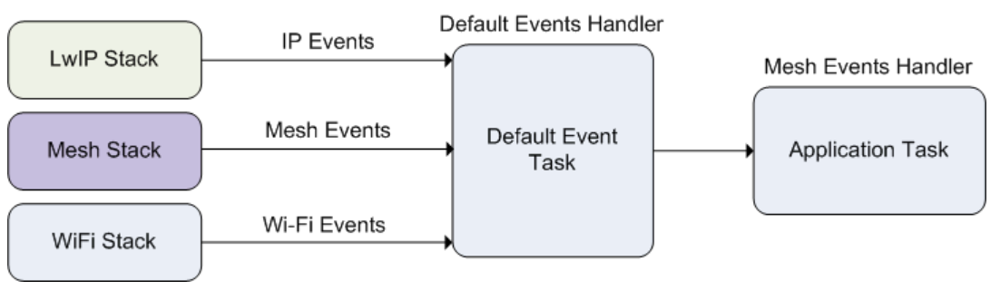

# Práctica 3. WiFi. Conceptos avanzados (WiFi Mesh, provisionamiento y ahorro de energía)

## Objetivos

La presente práctica se divide en tres partes principales, que abordan 
tres temas avanzados relacionados con la conectividad WiFi en ESP-IDF y en
el ESP32. Los objetivos en cada punto son:

* WiFi MESH
    - Revisar los conceptos básicos para la construcción de una red MESH WiFi
    autogestionada.
    - Presentar la API básica para la creación de aplicaciones basadas en la 
    pila ESP-MESH.
    - Observar en funcionamiento una red ESP-MESH, así como sus capacidades
    de autoconfiguración.

* Provisionamiento
    - Entender y experimentar con distintos modos de provisionamiento de 
    credenciales WiFi, vía `BLE` y vía `softAP`.
    - Comprobar el intercambio de claves en claro realizando provisionamientos
    desde línea de comandos, así como observar la utilidad (y necesidad)
    del envío cifrado de credenciales.

* Ahorro de energía
    - Entender los tres modos de funcionamiento del ESP32 a nivel de ahorro
    energético en conexiones WiFi.
    - Observar la desviación en latencia de recepción de paquetes en función
    del modo aplicado.

## Parte 1. WiFi Mesh (ESP MESH)

El *stack* ESP-MESH está construido por encima del *driver* WiFi
(es decir, obviamente hace uso de sus servicios), y en algunos
casos también haciendo uso de servicios de la pila IP (*lwIP*), por ejemplo
en el nodo raíz, que es el único con comunicación IP contra un router
de borde. El siguiente diagrama muestra la situación de la pila Mesh
en ESP-IDF:


Como cualquier otro componente ESP-IDF, ESP-MESH se comunica con las aplicaciones
a través de eventos propios:



El tipo `mesh_event_id_t` define todos los posibles eventos que pueden surgir
en las distintas fases del ciclo de vida de una red (por ejemplo, para un
nodo determinado, conexión o desconexión de su nodo padre, o de uno de sus
nodos hijo). Antes de utilizar los eventos ESP-MESH para gestionar u observar
el funcionamiento de la red, es necesario registrarlos vía
`esp_event_handler_register()`. Algunos usos típicos de los eventos  incluyen,
por ejemplo, la situación de conexión de un nodo padre (`MESH_EVENT_PARENT_CONNECTED`)
o de un hijo (`MESH_EVENT_CHILD_CONNECTED`), indicando, respectivamente, que
un nodo puede comenzar a emitir hacia arriba en el grafo, o hacia abajo. Del
mismo modo, en un nodo raíz, la recepción de los eventos
`IP_EVENT_STA_GOT_IP` y `IP_EVENT_STA_LOST_IP` se pueden aprovechar para 
indicar que dicho nodo raíz puede o no enviar datos a la red IP externa.

### Eventos

* `MESH_EVENT_STARTED`: *mesh* iniciada.

* `MESH_EVENT_STOPPED`: *mesh* finalizada.

* `MESH_EVENT_CHANNEL_SWITCH`: cambio de canal.

* `MESH_EVENT_CHILD_CONNECTED`: un hijo ha conectado a la interfaz `softAP`.

* `MESH_EVENT_CHILD_DISCONNECTED`: un hijo ha desconectado de la interfaz `softAP`.

* `MESH_EVENT_ROUTING_TABLE_ADD`: se han añadido nuevas entradas a la tabla de enrutamiento añadiendo nuevos hijos.

* `MESH_EVENT_ROUTING_TABLE_REMOVE`: se ha eliminado entradas de la tabla de enrutamiento eliminado hijos que han abandonado la red.

* `MESH_EVENT_PARENT_CONNECTED`: un padre se ha conectado a la interfaz `station`.

* `MESH_EVENT_PARENT_DISCONNECTED`: un padre se ha desconectado de la interfaz `station`.

* `MESH_EVENT_NO_PARENT_FOUND`: no se ha encontrado un padre.

* `MESH_EVENT_LAYER_CHANGE`: el nodo ha cambiado de nivel en la red.

* `MESH_EVENT_TODS_STATE`: indica que el nodo raíz es capaz de acceder a la red IP externa.

* `MESH_EVENT_VOTE_STARTED`: el proceso de voto de un nuevo nodo raíz ha comenzado.

* `MESH_EVENT_VOTE_STOPPED`: el proceo de voto de un nuevo nodo raíz ha finalizado.

* `MESH_EVENT_ROOT_ADDRESS`: se ha obtenido la dirección del nodo raíz.

* `MESH_EVENT_ROOT_SWITCH_REQ`: un nodo raíz candidato ya elegido solicita un cambio de nodo raíz.

* `MESH_EVENT_ROOT_SWITCH_ACK`: respuesta a la anterior petición por parte del nodo raíz actual.

* `MESH_EVENT_NETWORK_STATE`: la actual red tiene un nodo raíz.

* `MESH_EVENT_STOP_RECONNECTION`: el nodo raíz detiene el proceso de reconexión al router y los demás nodos detienen los procesos de conexión a sus nodos padre.

* `MESH_EVENT_FIND_NETWORK`: si el canal solicitado es 0, la pila escaneará 
todos los canales para encontrar una red mesh a la que conectar, devolviendo
el canal en el que lo ha conseguido.

### Uso de la pila IP

El código de una aplicación que haga uso de ESP-MESH puede  acceder directamente
a la pila MESH sin pasar por la pila IP. De hecho, la pila IP sólo es
estrictamente necesaria por parte del nodo raíz, al ser el único que puede
recibir o transmitir datos desde o hacia la red IP externa. Sin embargo, 
como cualquier nodo de la topología puede potencialmente convertirse en 
nodo raíz (ya que su selección es automática), todos los nodos deberán
inicializar la pila IP.

Por tanto, todos los nodos incializan la pila IP vía `tcpip_adapter_init()`. Además, todos los nodos deberán detener el servidor DHCP en la interfaz
`softAP`, y el cliente DHCP en la interfaz `station`:

```c
/*  tcpip initialization */
tcpip_adapter_init();
/*
 * for mesh
 * stop DHCP server on softAP interface by default
 * stop DHCP client on station interface by default
 */
ESP_ERROR_CHECK(tcpip_adapter_dhcps_stop(TCPIP_ADAPTER_IF_AP));
ESP_ERROR_CHECK(tcpip_adapter_dhcpc_stop(TCPIP_ADAPTER_IF_STA));
```

Sin embargo, en el caso de un nodo que se convierte en raíz, es 
imprescindible arrancar el cliente DHCP como respuesta al evento
corresondiente para así obtener dirección IP desde el router que
da salida hacia la red externa.

### Estructura básica de una aplicación ESP-MESH

El siguiente código muestra la estructura básica de inicialización
de pilas IP y WiFi necesarias para comenzar con la configuración de la 
red MESH:

```c
tcpip_adapter_init();
/*
 * for mesh
 * stop DHCP server on softAP interface by default
 * stop DHCP client on station interface by default
 */
ESP_ERROR_CHECK(tcpip_adapter_dhcps_stop(TCPIP_ADAPTER_IF_AP));
ESP_ERROR_CHECK(tcpip_adapter_dhcpc_stop(TCPIP_ADAPTER_IF_STA));

/*  event initialization */
ESP_ERROR_CHECK(esp_event_loop_create_default());

/*  Wi-Fi initialization */
wifi_init_config_t config = WIFI_INIT_CONFIG_DEFAULT();
ESP_ERROR_CHECK(esp_wifi_init(&config));
/*  register IP events handler */
ESP_ERROR_CHECK(esp_event_handler_register(IP_EVENT, IP_EVENT_STA_GOT_IP, &ip_event_handler, NULL));
ESP_ERROR_CHECK(esp_wifi_set_storage(WIFI_STORAGE_FLASH));
ESP_ERROR_CHECK(esp_wifi_start());
```

Tras esta inicialización, comienza la fase de configuración e inicialización
de la malla, que procederá en tres pasos principales:

1. Inicialización de la malla
2. Configuración de la red ESP-MESH
3. Arranque de la red

### Paso 1. Inicialización de la malla

La inicialización de la malla y registro de eventos propios es sencilla:

```c
/*  mesh initialization */
ESP_ERROR_CHECK(esp_mesh_init());
/*  register mesh events handler */
ESP_ERROR_CHECK(esp_event_handler_register(MESH_EVENT, ESP_EVENT_ANY_ID, &mesh_event_handler, NULL));
```

### Paso 2. Configuración de la red ESP-MESH

La configuración de ESP-MESH se realiza a través de la
función `esp_mesh_set_config()`, que recibe una estructura de tipo
`mesh_cfg_t` con la configuración de la red:

| Parámetro           | Descripción |
|---------------------|------------|
| *Channel*           | Canal (entre 1 y 14)        |
| *Mesh ID*           | Identificación de la red MESH (6 bytes) |
| *Router*            | SSID y contraseña de conexión al router de salida        |
| *Mesh AP*           | Configuración específica del AP generado por cada nodo |

Un ejemplo de configuración podría ser:

```c
/* Mesh ID */
static const uint8_t MESH_ID = { 0x77, 0x77, 0x77, 0x77, 0x77, 0x77 };
/* Enable the Mesh IE encryption by default */
mesh_cfg_t cfg = MESH_INIT_CONFIG_DEFAULT();
/* mesh ID */
memcpy((uint8_t *) &cfg.mesh_id, MESH_ID, 6);
/* channel (must match the router's channel) */
cfg.channel = CONFIG_MESH_CHANNEL;
/* router */
cfg.router.ssid_len = strlen(CONFIG_MESH_ROUTER_SSID);
memcpy((uint8_t *) &cfg.router.ssid, CONFIG_MESH_ROUTER_SSID, cfg.router.ssid_len);
memcpy((uint8_t *) &cfg.router.password, CONFIG_MESH_ROUTER_PASSWD,
       strlen(CONFIG_MESH_ROUTER_PASSWD));
/* mesh softAP */
cfg.mesh_ap.max_connection = CONFIG_MESH_AP_CONNECTIONS;
memcpy((uint8_t *) &cfg.mesh_ap.password, CONFIG_MESH_AP_PASSWD,
       strlen(CONFIG_MESH_AP_PASSWD));
ESP_ERROR_CHECK(esp_mesh_set_config(&cfg));
```

### Paso 3. Arranque de la red

El arranque de la red MESH es sencillo:

```c
/* mesh start */
ESP_ERROR_CHECK(esp_mesh_start());
```

Tras el arranque, la aplicación debería comprobar los eventos para determinar
si la conexión a la red ha sido exitosa. En dicho caso, tras la conexión,
la aplicación puede comenzar a transmitir paquetes a través de la red MESH
utilizando las rutinas `esp_mesh_send()` y `esp_mesh_recv()`.

## Ejercicio en clase. Despliegue conjunto de una red WiFi Mesh

La forma más conveniente de observar el comportamiento de una red WiFi
Mesh es desplegar una infraestructura con suficiente número de nodos pertenecientes
a una misma red. Desafortunadamente, para ello es necesario disponer
de dichos nodos en un espacio cercano.

En la presente práctica, desplegaremos una red WiFi Mesh en el laboratorio,
utilizando vuestro o vuestros ESP32 como elementos de la red. Para ello,
configuraremos, compilaremos y ejecutaremos el ejemplo
`examples/mesh/internal_communication`. Antes de proceder, configuraremos
el proyecto para:

1. Conectar al punto de acceso común del laboratorio (*Router SSID y Router
password*).
2. Configurar la red ESP-MESH para utilizar WPA2_PSK y seleccionar
como contraseña `password`.
3. Aumentar el número de conexiones al AP a 10.

De momento, no realizaremos ningún cambio en el código del ejemplo.

Compila y ejecuta tu código. En la dirección
del [enlace](https://docs.google.com/spreadsheets/d/1kcjrlYTCDG7gX70-G85aKz3MKbfMcNTc9yDWwQTVFwE/edit?usp=sharing)
dispones de una primera pestaña en la que deberás completar cierta información
que observarás en la salida de monitorización una vez arranques el ESP32, 
en la celda correspondiente a tu puesto.
Esta información, en principio, incluye:

1. Tu nombre.
2. Direcciones MAC de las interfaces `STA` y `SoftAP` (lo observarás en los
primeros mensajes de salida).
3. Capa de la topología en la que se encuentra tu nodo (lo observarás
en formato `[L:XX]` en los envíos y recepciones de datos).
4. En caso de haber sido elegido nodo raíz, anotar también esta circunstancia
y la IP asignada por el *router* (observa la respuesta al evento correspondiente).

Además, anota la ID de la red Mesh que se ha utilizado para conectar.

Antes de rellenar la información, espera que el profesor te indique que la
topología ha convergido, y que por tanto no habrá ningún cambio más en ella
(siempre que ningun nodo deje de formar parte de la misma).

!!! danger "Ejercicio entregable"
    Captura el estado de la red cuando todos tus compañeros hayan llegado al
    punto de convergencia, e intenta determinar, en forma de grafo, 
    la topología de la misma.

A continuación, apagaremos el nodo raíz y esperaremos a la vuelta a la 
convergencia de la red.

!!! danger "Ejercicio entregable"
    Captura de nuevo el estado de la red cuando todos tus compañeros hayan 
    llegado al punto de convergencia, e intenta determinar, en forma de grafo, 
    la topología de la misma.

## Ejercicio en clase. Despliegue conjunto de una red WiFi Mesh de menores dimensiones

Como último ejercicio, vamos a crear nuevas redes Mesh en función del puesto
que tengas asignado. Observa los colores asignados a cada grupo de puestos
en la siguiente [hoja](https://docs.google.com/spreadsheets/d/1z4hBzc16Ec6K0XN78LjyxQ1lknZw7ifKXwPL_jzC9Fg/edit?usp=sharing).

Modifica tu código para que el canal de escucha y el identificador de red
coincidan con el indicado. Puedes configurar el canal a través del menú de 
configuracion del ejemplo (*channel*) y el identificador modificando
la variable correspondiente en el fichero `mesh_main.c`.

Una vez hecho esto, reconstruid la información de las tablas para reflejar
las nuevas topologías. Podéis hacer pruebas posteriores apagando el 
nodo raíz y observando la convergencia de la red.

!!! danger "Ejercicio entregable"
    Captura de nuevo el estado de la red cuando todos tus compañeros hayan 
    llegado al punto de convergencia, e intenta determinar, en forma de grafo, 
    la topología de la misma.

El estudio detallado del código para el despliegue de la red queda como
ejercicio para el alumno. Observa el tratamiento de eventos y la fase
de configuración de la red. Intenta entender el funcionamiento del código
(envíos y recepciones, destinatarios de los mismos, etc.).

## Parte 2.Provisionamiento WiFi

ESP-IDF proporciona un componente específico que ofrece un servicio
de provisionamiento WiFi. Entendemos por provisionamiento WiFi el mecanismo
o mecanismos mediante los cuales es posible proporcionar, de forma externa y 
segura, el conjunto de credenciales de conexión a una red WiFi a un dispositivo
no conectado. El component de provisionamiento WiFi en ESP-IDF permite 
proporcionar dichas credenciales a través de dos vías: Bluetooth Low
Energy (modo *BLE*) o a través de un mecanismo de punto de acceso WiFi temporal
(modo *SoftAP*). ESP-IDF proporciona una serie de APIs (con prototipos
`wifi_prov_mgr_*`) para implementar de forma sencilla ambos modos de 
provisionamiento.

Para completar esta parte de la práctica deberás trabajar
con el ejemplo `examples/provisioning/wifi-prov-mgr`.


### Inicialización del servicio de provisionamiento

La rutina `wifi_prov_mgr_init()` se utiliza para configurar e inicializar
el componente de provisionamiento, y debe invocarse antes de cualquier
otra invocación a rutinas de tipo `wifi_prov_mgr*`. Además, es necesario
destacar que el componente de provisionamiento confía en las funcionalidades
de otros componentes (básicamente NVS, TCP/IP, *Event loop* y mDNS), por lo 
que éstos deben inicializarse antes del propio componente. Para finalizar
el componente de provisionamiento, es suficiente con invocar a la rutina
`wifi_prov_mgr_deinit()`.

Un ejemplo de inicialización resultaría en:

```c
wifi_prov_mgr_config_t config = {
  .scheme = wifi_prov_scheme_ble,
  .scheme_event_handler = WIFI_PROV_SCHEME_BLE_EVENT_HANDLER_FREE_BTDM
};

ESP_ERR_CHECK( wifi_prov_mgr_init(config) );
```

La estructura de configuración de tipo `wifi_prov_mgr_config_t` dispone de
campos que permiten especificar el comportamiento del componente;
específicamente, el campo `scheme` especifica el esquema (o tipo) de 
provisionamiento. Disponemos de tres opciones:

- `wifi_prov_scheme_softap`: transporta la información de provisionamiento
vía WiFi (creando un punto de acceso temporal) y un servidor HTTP para 
recibir los comandos e información de provisionamiento.
- `wifi_prov_scheme_ble`: transporta la información de provisionamiento 
vía Bluetooth Low Energy (BLE) y un servidor GATT para recibir los comandos
e información de provisionamiento.
- `wifi_prov_scheme_console`: transporta la información vía puerto serie y 

### Comprobación del estado de provisionamiento

Es posible comprobar el estado de provisionamiento de un dispositivo mediante
una invocación a `wifi_prov_mgr_is_provisioned()`, que chequea si las
credenciales de conexión WiFi están almacenadas en la memoria no volátil (NVS).

Aunque existen distintos métodos para eliminar la información de provisionamento
almacenada en la NVS, utilizaremos el mecanismo proporcionado por `idf.py` para
eliminar su contenido. Para ello, ejecutaremos:

```sh
idf.py erase_flash
```

### Parámetros de inicialización del servicio de provisionamiento WiFi

Al inicializar el componente de provisionamiento, es necesario especificar
un nombre de servicio y una clave. Esto se traduce en:

- SSID y contraseña para el modo SoftAP (es decir, cuando el esquema 
  de provisionamiento se ha configurado como `wifi_prov_scheme_softap`).

- Nombre del dispositivo BLE para el modo BLE (es decir, cuando el esquema 
  de provisionamiento se ha configurado como `wifi_prov_scheme_ble`).

Además, internamente el componente utiliza el mecanismo de comunicación
*protocomm*, que permite dos niveles de seguridad en la comunicación
de credenciales de provisionamiento:

- Nivel 1 de seguridad, que consiste en un *handshake* previo entre ambos
  extremos, con intercambio de claves y utilización de una prueba de posesión
  (PoP, *proof of possession*), y utilizando encriptación AES para el intercambio
  de mensajes.

- Nivel 0 de seguridad, que consiste en un intercambio de credenciales utilizando
  texto plano y sin *PoP*.

Así, un ejemplo de inicialización del servicio de provisionamiento podría
resultar en el siguiente código:

```c
const char *service_name = "my_device";
const char *service_key  = "password";

wifi_prov_security_t security = WIFI_PROV_SECURITY_1;
const char *pop = "abcd1234";

ESP_ERR_CHECK( wifi_prov_mgr_start_provisioning(security, pop, service_name, service_key) );
```

El servicio de provisionamiento finalizará automáticamente al conectar a un 
AP con éxito (es decir, al obtener IP desde el mismo). En cualquier caso, 
puede también detenerse de forma manual en cualquier momento a través
de la invocación a `wifi_prov_mgr_stop_provisioning()`.

### Espera a la finalización del proceso de provisionamiento

Típicamente, las aplicaciones de usuario en el ESP32 deberán esperar a que
el proceso de provisionamiento finalice antes de proceder. En ese momento, y
antes de proceder, liberarán los recursos que se alojaron para el proceso
de provisionamiento, y comenzarán con su lógica habitual.

Existen dos mecanismos para conseguir este efecto:

- En primer lugar, la solución más simple consiste en utilizar una 
  invocación **bloqueante** a la rutina `wifi_prov_mgr_wait()`:

```c
// Inicialización del servicio de provisionamiento
ESP_ERR_CHECK( wifi_prov_mgr_start_provisioning(security, pop, service_name, service_key) );

// Espera a la compleción del provisionamiento
wifi_prov_mgr_wait();

// Liberación de recursos
wifi_prov_mgr_deinit();

// A partir de aquí, comenzaría la lógica habitual de la aplicación
// ...
```

- El segundo mecanismo estaría basado en eventos (es decir, sería *no bloqueante*),
  interceptando y trabajando sobre eventos de tipo `WIFI_PROV_EVENT` e 
  invocando a `wifi_prov_mgr_deinit()` cuando el identificador de evento
  sea `WIFI_PROV_END`:

```c
static void event_handler(void* arg, esp_event_base_t event_base,
                          int event_id, void* event_data)
{
    if (event_base == WIFI_PROV_EVENT && event_id == WIFI_PROV_END) {
        /* Liberar recursos una vez el proceso de provisionamiento ha finalizado */
        wifi_prov_mgr_deinit();
    }
}
```

### Herramientas de provisionamiento para dispositivos móviles

Existen aplicaciones preparadas por Espressif para llevar a cabo el proceso
de provisionamiento sobre ESP32. Estas aplicaciones están disponibles tanto
para dispositivos Android como IOS, en las versiones con transporte BLE o SoftAP:

- Android:
    - [Provisionamiento BLE](https://play.google.com/store/apps/details?id=com.espressif.provble).
    - [Provisionamiento SoftAP](https://play.google.com/store/apps/details?id=com.espressif.provsoftap).

- IOS:
    - [Provisionamiento BLE](https://apps.apple.com/in/app/esp-ble-provisioning/id1473590141).
    - [Provisionamiento SoftAP](https://apps.apple.com/in/app/esp-softap-provisioning/id1474040630).

!!! danger "Tarea entregable"
    Utilizando las aplicaciones correspondientes a tu dispositivo móvil, 
    tanto para el uso de BLE como de SoftAP, provisiona tu ESP32 utilizando
    las credenciales que correspondan a tu red WiFi. Entrega una breve 
    descripción del proceso desarrollado, así como capturas de pantalla
    correspondientes a la salida del ESP32 que evidencien que el proceso de
    provisionamiento se ha realizado correctamente. Recuerda, antes de 
    cada repetición del experimento, utilizar la orden `idf.py erase_flash`
    para eliminar información de provisionamiento de sesiones anteriores. 
    Comprueba el funcionamiento de los distintos niveles de seguridad.

Estas aplicaciones funcionan mediante una comunicación muy sencilla con el
ESP32 no provisionado, cuyos mecanismos dependen del transporte utilizado;
en el caso de BLE, se crea una tabla GATT con distintas características que
serán utilizadas para escribir (enviar) datos en el dispositivo. Veremos 
qué es una tabla GATT en próximas prácticas, por lo que retornaremos a 
este punto. En el caso de `softAP`, se crean una serie de *endpoints*
(URIs HTTP) que permiten, de forma sencilla, leer y escribir aquellos datos que
deseamos comunicar al otro extremo de la comunicación.

La siguiente tabla resume los *endpoints* creados por las versiones 
estándar del protocolo de provisionamiento (pueden ser modificados o 
adaptados en función de la información adicional que deseemos intercambiar):

|           | Endpoint (BLE + Servidor GATT) | URI (SoftAP + HTTP) |
|-----------|-------|------------|
| Establecimiento de sesión         | prov-session | http://IP:80/prov-session        |
| Escaneo de redes disponibles      | prov-scan    | http://IP:80/prov-scan         |
| Configuración de provisionamiento | prov-config  | http://IP:80/prov-config         |
| Versión del protocolo             | proto-ver    | http://IP:80/proto-ver         |

Los detalles de este tipo de protocolo de provisionamiento quedan como 
ejercicio adicional al alumno, y van más allá del objetivo de la práctica. Sin
embargo, sí es conveniente disponer de algún mecanismo que permita observarlos, 
y determinar, por ejemplo para el caso de SoftAP, si el intercambio de 
credenciales se realiza como texto plano (en claro) o cifrado, lo cuál podría
suponer serios problemas de seguridad para el usuario de un dispositivo 
móvil, ya que se expondrían las credenciales de conexión a la red WiFi.

Para estudiar este hecho, utilizaremos una herramienta de línea de órdenes
proporcionada junto a ESP-IDF, llamada `esp_prov.py`, situada en el 
directorio `tools/esp_prov` de la instalación.

!!! note "Nota"
    Antes de utilizar el programa, debes instalar las dependencias respectivas
    utilizando las órdenes (desde el propio directorio `tools/esp_prov`):

    ```
    pip install -r requirements.txt
    pip install -r requirements_linux_extra.txt
    ```

Su uso es sencillo, y puede consultarse ejecutando `python esp_prov.py -h`.
Básicamente, una sesión de provisionamiento utilizando `softAP`
sobre un dispositivo a la espera con IP `192.168.4.1`, sin capa de 
seguridad (cifrado) y proporcionando la SSID y clave SSID_EJEMPLO/CLAVE_EJEMPLO
resultaría:

```sh
python esp_prov.py --transport softap --service_name "192.168.4.1:80" --sec_ver 0 --ssid SSID_EJEMPLO --passphrase CLAVE_EJEMPLO
```

Ten en cuenta que, para emitir el anterior comando, debes pertenecer a la 
misma red que el dispositivo a provisionar, es decir, haber conectado al SSID
de provisionamiento que se proporciona.

!!! danger "Tarea entregable"
    Realiza el proceso de provisionamiento desde línea de comandos utilizando
    las anteriores indicaciones, y muestra capturas de tráfico vía Wireshark donde se
    evidencie la entrega en claro (en modo texto, sin cifrar) de las 
    credenciales de red entre el provisionador y el dispositivo, y 
    el uso de los *endpoints/URIs* anteriormente mencionados. 
    A continuación,
    pasa a un modo seguro (opción `--sec_ver 1`) y observa cómo las claves
    se intercambian cifradas.

## Parte 3. Modos de ahorro de consumo WiFi

En la versión actual de ESP-IDF, el *framework* soporta distintos modos
de ahorro de energía, con soporte tanto a nivel de dispositivo (*station*) como
de punto de acceso (*AP*). Todos estos modos se basan en las características
de ahorro de consumo contempladas en el estándar 802.11 (concretamente en el
modo *Modem-sleep*). El modo *Modem-sleep* trabaja exclusivamente cuando un
dispositivo está configurado como *station*, y se encuentra conectado a un
AP. Si el modo *Modem-sleep* está activo, el dispositivo varía su estado entre
*activo* y *sleep* periódicamente. En el modo *sleep*, tres de los principales
componentes del subsistema de comunicacion inalámbrica (PHY, BB y RF) se 
desconectan para reducir el consumo energético. Pese a permanecer desconectados,
la estación sigue conectada al AP en todo momento.

El modo *Modem-sleep* soporta dos submodos de ahorro de consumo: *mínimo* y 
*máximo*. 

- En el modo *mínimo*, la estación se despierta cada *DTIM* para
recibir un beacon. Debido a que los mensajes de difusión (*broadcast*) se
transmiten tras cada DTIM, en este caso no se perderán y serán recibidos por
las estaciones. Sin embargo, el ahorro energético puede ser reducido si
el *DTIM* es breve (además, *DTIM* está determinado por el AP, por lo que
la estación no tiene control sobre este parámetro). 

- En el modo *máximo*, la estación se despierta tras cada intervalo de escucha
para recibir un beacon. Este intervalo de escucha no tiene que coincidir con
el valor de *DTIM*, y de hecho suele fijarse a un valor mayor para conseguir
mayor ahorro de consumo. Los datos de *broadcast* podrían perderse usando este
modo si la estación está en estado de reposo mientras expira el temporizador
*DTIM*. El valor del intervalo de escucha puede configurarse mediante una 
invocación a `esp_wifi_set_config()` antes de conectar al AP.

Para activar el modo *mínimo*, es neceario invocar a la rutina
`esp_wifi_set_ps(WIFI_PS_MIN_MODEM)`; 
para activar el modo *máximo*, es neceario invocar a la rutina
`esp_wifi_set_ps(WIFI_PS_MAX_MODEM)`, ambos tras la infocación de
`esp_wifi_init()`. Los modos de ahorro se activarán al conectar al AP, y se
desactivarán al desconectar.
Es posible desactivar los modos de ahorro mediante una invocación a
`esp_wifi_set_ps(WIFI_PS_NONE)`. Obviamente, esto aumentará el consumo, pero
reducirá la latencia en la recepción de mensajes. Con el modo de ahorro
activado, la recepción de los mensajes se retrasará tanto como el período
*DTIM* (en modo mínimo ahorro) o el período de escucha (modo máximo ahorro).
El modo por defecto es `WIFI_PS_MIN_MODEM`.

En modo punto de acceso, ESP-IDF no soporta todos los modos de ahorro dictados
en la especificación WiFi. Concretamente, un AP programado vía ESP-IDF sólo 
cacheará (almacenará temporalmente) los paquetes de tipo *unicast* para las
estaciones conectadas a dicho AP, pero no paquetes *multicast* para dichas
estacioens. Así, con el modo de ahorro activo, las estaciones podrían perder
paquetes *multicast*.

El ejemplo `examples/wifi/power_save` ilustra mediante un código sencillo
la configuración de una estación en los dos modos de ahorro energético. 
Estos modos pueden configurarse a través del menú de configuración; además,
se ofrece una opción para modificar el tiempo de escucha en el caso del modo
de ahorro *máximo*.

!!! danger "Tarea entregable"
    Compila, flashea y ejecuta el código de ejemplo utilizando los tres modos
    disponibles (sin ahorro, con ahorro mínimo y con ahorro máximo). En el 
    caso del ahorro máximo, varía el tiempo de escucha para que tome distintos
    valores. En todos los casos, conecta tu ESP32 a un punto de acceso y, 
    desde un portátil conectado al mismo AP, ejecuta una serie de `pings` hacia
    la estación. Para cada modo, representa gráficamente el tiempo de 
    respuesta de la estación en una gráfica para cada petición `ping`, relacionando
    su comportamiento con los tiempos *DTIM* y de escucha.
