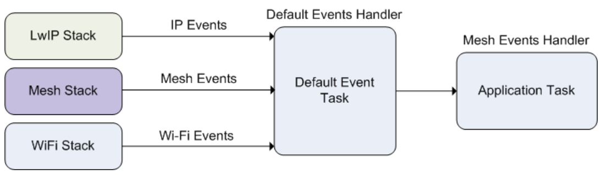

# Práctica 4. ESP WiFi Mesh

## Objetivos

- Revisar los conceptos básicos para la construcción de una red MESH WiFi
  autogestionada.
- Presentar la API básica para la creación de aplicaciones basadas en la pila
  ESP-MESH.
- Observar en funcionamiento una red ESP-MESH, así como sus capacidades de
  autoconfiguración.


## ESP WiFi Mesh

El *stack* ESP-MESH está construido por encima del *driver* WiFi
(es decir, obviamente hace uso de sus servicios), y en algunos
casos también haciendo uso de servicios de la pila IP (*lwIP*), por ejemplo
en el nodo raíz, que es el único con comunicación IP contra un router
de borde. El siguiente diagrama muestra la situación de la pila Mesh
en ESP-IDF:


Como cualquier otro componente ESP-IDF, ESP-MESH se comunica con las aplicaciones
a través de eventos propios:



El tipo `mesh_event_id_t` define todos los posibles eventos que pueden surgir
en las distintas fases del ciclo de vida de una red (por ejemplo, para un
nodo determinado, conexión o desconexión de su nodo padre, o de uno de sus
nodos hijo). Antes de utilizar los eventos ESP-MESH para gestionar u observar
el funcionamiento de la red, es necesario registrarlos vía
`esp_event_handler_register()`. Algunos usos típicos de los eventos  incluyen,
por ejemplo, la situación de conexión de un nodo padre (`MESH_EVENT_PARENT_CONNECTED`)
o de un hijo (`MESH_EVENT_CHILD_CONNECTED`), indicando, respectivamente, que
un nodo puede comenzar a emitir hacia arriba en el grafo, o hacia abajo. Del
mismo modo, en un nodo raíz, la recepción de los eventos
`IP_EVENT_STA_GOT_IP` y `IP_EVENT_STA_LOST_IP` se pueden aprovechar para 
indicar que dicho nodo raíz puede o no enviar datos a la red IP externa.

### Eventos

* `MESH_EVENT_STARTED`: *mesh* iniciada.

* `MESH_EVENT_STOPPED`: *mesh* finalizada.

* `MESH_EVENT_CHANNEL_SWITCH`: cambio de canal.

* `MESH_EVENT_CHILD_CONNECTED`: un hijo ha conectado a la interfaz `softAP`.

* `MESH_EVENT_CHILD_DISCONNECTED`: un hijo ha desconectado de la interfaz `softAP`.

* `MESH_EVENT_ROUTING_TABLE_ADD`: se han añadido nuevas entradas a la tabla de enrutamiento añadiendo nuevos hijos.

* `MESH_EVENT_ROUTING_TABLE_REMOVE`: se ha eliminado entradas de la tabla de enrutamiento eliminado hijos que han abandonado la red.

* `MESH_EVENT_PARENT_CONNECTED`: un padre se ha conectado a la interfaz `station`.

* `MESH_EVENT_PARENT_DISCONNECTED`: un padre se ha desconectado de la interfaz `station`.

* `MESH_EVENT_NO_PARENT_FOUND`: no se ha encontrado un padre.

* `MESH_EVENT_LAYER_CHANGE`: el nodo ha cambiado de nivel en la red.

* `MESH_EVENT_TODS_STATE`: indica que el nodo raíz es capaz de acceder a la red IP externa.

* `MESH_EVENT_VOTE_STARTED`: el proceso de voto de un nuevo nodo raíz ha comenzado.

* `MESH_EVENT_VOTE_STOPPED`: el proceo de voto de un nuevo nodo raíz ha finalizado.

* `MESH_EVENT_ROOT_ADDRESS`: se ha obtenido la dirección del nodo raíz.

* `MESH_EVENT_ROOT_SWITCH_REQ`: un nodo raíz candidato ya elegido solicita un cambio de nodo raíz.

* `MESH_EVENT_ROOT_SWITCH_ACK`: respuesta a la anterior petición por parte del nodo raíz actual.

* `MESH_EVENT_NETWORK_STATE`: la actual red tiene un nodo raíz.

* `MESH_EVENT_STOP_RECONNECTION`: el nodo raíz detiene el proceso de reconexión al router y los demás nodos detienen los procesos de conexión a sus nodos padre.

* `MESH_EVENT_FIND_NETWORK`: si el canal solicitado es 0, la pila escaneará 
todos los canales para encontrar una red mesh a la que conectar, devolviendo
el canal en el que lo ha conseguido.

### Uso de la pila IP

El código de una aplicación que haga uso de ESP-MESH puede  acceder directamente
a la pila MESH sin pasar por la pila IP. De hecho, la pila IP sólo es
estrictamente necesaria por parte del nodo raíz, al ser el único que puede
recibir o transmitir datos desde o hacia la red IP externa. Sin embargo, 
como cualquier nodo de la topología puede potencialmente convertirse en 
nodo raíz (ya que su selección es automática), todos los nodos deberán
inicializar la pila IP.

Por tanto, todos los nodos incializan la pila IP vía `tcpip_adapter_init()`. Además, todos los nodos deberán detener el servidor DHCP en la interfaz
`softAP`, y el cliente DHCP en la interfaz `station`:

```c
/*  tcpip initialization */
tcpip_adapter_init();
/*
 * for mesh
 * stop DHCP server on softAP interface by default
 * stop DHCP client on station interface by default
 */
ESP_ERROR_CHECK(tcpip_adapter_dhcps_stop(TCPIP_ADAPTER_IF_AP));
ESP_ERROR_CHECK(tcpip_adapter_dhcpc_stop(TCPIP_ADAPTER_IF_STA));
```

Sin embargo, en el caso de un nodo que se convierte en raíz, es 
imprescindible arrancar el cliente DHCP como respuesta al evento
corresondiente para así obtener dirección IP desde el router que
da salida hacia la red externa.

### Estructura básica de una aplicación ESP-MESH

El siguiente código muestra la estructura básica de inicialización
de pilas IP y WiFi necesarias para comenzar con la configuración de la 
red MESH:

```c
tcpip_adapter_init();
/*
 * for mesh
 * stop DHCP server on softAP interface by default
 * stop DHCP client on station interface by default
 */
ESP_ERROR_CHECK(tcpip_adapter_dhcps_stop(TCPIP_ADAPTER_IF_AP));
ESP_ERROR_CHECK(tcpip_adapter_dhcpc_stop(TCPIP_ADAPTER_IF_STA));

/*  event initialization */
ESP_ERROR_CHECK(esp_event_loop_create_default());

/*  Wi-Fi initialization */
wifi_init_config_t config = WIFI_INIT_CONFIG_DEFAULT();
ESP_ERROR_CHECK(esp_wifi_init(&config));
/*  register IP events handler */
ESP_ERROR_CHECK(esp_event_handler_register(IP_EVENT, IP_EVENT_STA_GOT_IP, &ip_event_handler, NULL));
ESP_ERROR_CHECK(esp_wifi_set_storage(WIFI_STORAGE_FLASH));
ESP_ERROR_CHECK(esp_wifi_start());
```

Tras esta inicialización, comienza la fase de configuración e inicialización
de la malla, que procederá en tres pasos principales:

1. Inicialización de la malla
2. Configuración de la red ESP-MESH
3. Arranque de la red

### Paso 1. Inicialización de la malla

La inicialización de la malla y registro de eventos propios es sencilla:

```c
/*  mesh initialization */
ESP_ERROR_CHECK(esp_mesh_init());
/*  register mesh events handler */
ESP_ERROR_CHECK(esp_event_handler_register(MESH_EVENT, ESP_EVENT_ANY_ID, &mesh_event_handler, NULL));
```

### Paso 2. Configuración de la red ESP-MESH

La configuración de ESP-MESH se realiza a través de la
función `esp_mesh_set_config()`, que recibe una estructura de tipo
`mesh_cfg_t` con la configuración de la red:

| Parámetro           | Descripción |
|---------------------|------------|
| *Channel*           | Canal (entre 1 y 14)        |
| *Mesh ID*           | Identificación de la red MESH (6 bytes) |
| *Router*            | SSID y contraseña de conexión al router de salida        |
| *Mesh AP*           | Configuración específica del AP generado por cada nodo |

Un ejemplo de configuración podría ser:

```c
/* Mesh ID */
static const uint8_t MESH_ID = { 0x77, 0x77, 0x77, 0x77, 0x77, 0x77 };
/* Enable the Mesh IE encryption by default */
mesh_cfg_t cfg = MESH_INIT_CONFIG_DEFAULT();
/* mesh ID */
memcpy((uint8_t *) &cfg.mesh_id, MESH_ID, 6);
/* channel (must match the router's channel) */
cfg.channel = CONFIG_MESH_CHANNEL;
/* router */
cfg.router.ssid_len = strlen(CONFIG_MESH_ROUTER_SSID);
memcpy((uint8_t *) &cfg.router.ssid, CONFIG_MESH_ROUTER_SSID, cfg.router.ssid_len);
memcpy((uint8_t *) &cfg.router.password, CONFIG_MESH_ROUTER_PASSWD,
       strlen(CONFIG_MESH_ROUTER_PASSWD));
/* mesh softAP */
cfg.mesh_ap.max_connection = CONFIG_MESH_AP_CONNECTIONS;
memcpy((uint8_t *) &cfg.mesh_ap.password, CONFIG_MESH_AP_PASSWD,
       strlen(CONFIG_MESH_AP_PASSWD));
ESP_ERROR_CHECK(esp_mesh_set_config(&cfg));
```

### Paso 3. Arranque de la red

El arranque de la red MESH es sencillo:

```c
/* mesh start */
ESP_ERROR_CHECK(esp_mesh_start());
```

Tras el arranque, la aplicación debería comprobar los eventos para determinar
si la conexión a la red ha sido exitosa. En dicho caso, tras la conexión,
la aplicación puede comenzar a transmitir paquetes a través de la red MESH
utilizando las rutinas `esp_mesh_send()` y `esp_mesh_recv()`.

## Ejercicio Basico (en clase). Despliegue conjunto de una red WiFi Mesh

La forma más conveniente de observar el comportamiento de una red WiFi
Mesh es desplegar una infraestructura con suficiente número de nodos pertenecientes
a una misma red. Desafortunadamente, para ello es necesario disponer
de dichos nodos en un espacio cercano.

En la presente práctica, desplegaremos una red WiFi Mesh en el laboratorio,
utilizando vuestro o vuestros ESP32 como elementos de la red. Para ello,
configuraremos, compilaremos y ejecutaremos el ejemplo
`examples/mesh/internal_communication`. Antes de proceder, configuraremos
el proyecto para:

1. Conectar al punto de acceso común del laboratorio (*Router SSID y Router
password*).
2. Configurar la red ESP-MESH para utilizar WPA2_PSK y seleccionar
como contraseña `password`.
3. Aumentar el número de conexiones al AP a 10.

De momento, no realizaremos ningún cambio en el código del ejemplo.

Compila y ejecuta tu código. En la dirección
del [enlace](https://docs.google.com/spreadsheets/d/1H0ETY_oDMOFHQOw2lci0t7ShT4lp2LO16FeVm_ORv_Q/edit?usp=sharing)
dispones de una primera pestaña en la que deberás completar cierta información
que observarás en la salida de monitorización una vez arranques el ESP32, 
en la celda correspondiente a tu puesto.
Esta información, en principio, incluye:

1. Tu nombre.
2. Direcciones MAC de las interfaces `STA` y `SoftAP` (lo observarás en los
primeros mensajes de salida).
3. Capa de la topología en la que se encuentra tu nodo (lo observarás
en formato `[L:XX]` en los envíos y recepciones de datos).
4. En caso de haber sido elegido nodo raíz, anotar también esta circunstancia
y la IP asignada por el *router* (observa la respuesta al evento correspondiente).

Además, anota la ID de la red Mesh que se ha utilizado para conectar.

Antes de rellenar la información, espera que el profesor te indique que la
topología ha convergido, y que por tanto no habrá ningún cambio más en ella
(siempre que ningun nodo deje de formar parte de la misma).

!!! danger "Tarea Básica"
    Captura el estado de la red cuando todos tus compañeros hayan llegado al
    punto de convergencia, e intenta determinar, en forma de grafo, 
    la topología de la misma.

A continuación, apagaremos el nodo raíz y esperaremos a la vuelta a la 
convergencia de la red.

!!! danger "Tarea Básica"
    Captura de nuevo el estado de la red cuando todos tus compañeros hayan 
    llegado al punto de convergencia, e intenta determinar, en forma de grafo, 
    la topología de la misma.

## Ejercicio Adicional (en clase). Despliegue conjunto de una red WiFi Mesh de menores dimensiones

Como último ejercicio, vamos a crear nuevas redes Mesh en función del puesto
que tengas asignado. Observa los colores asignados a cada grupo de puestos
en la siguiente [hoja](https://docs.google.com/spreadsheets/d/1OiMcjNNNq8DRjlju2pZ5Di_XOjbv6qLnmEqAN1fHy2c/edit?usp=sharing).

Modifica tu código para que el canal de escucha y el identificador de red
coincidan con el indicado. Puedes configurar el canal a través del menú de 
configuracion del ejemplo (*channel*) y el identificador modificando
la variable correspondiente en el fichero `mesh_main.c`.

Una vez hecho esto, reconstruid la información de las tablas para reflejar
las nuevas topologías. Podéis hacer pruebas posteriores apagando el 
nodo raíz y observando la convergencia de la red.

!!! danger "Tarea Adicional"
    Captura de nuevo el estado de la red cuando todos tus compañeros hayan 
    llegado al punto de convergencia, e intenta determinar, en forma de grafo, 
    la topología de la misma.

El estudio detallado del código para el despliegue de la red queda como
ejercicio para el alumno. Observa el tratamiento de eventos y la fase
de configuración de la red. Intenta entender el funcionamiento del código
(envíos y recepciones, destinatarios de los mismos, etc.).
