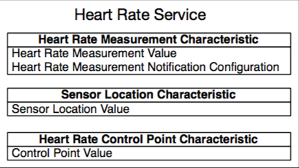

# Práctica 5. Bluetooth Low Energy (BLE)

# Objetivos

* Diseccionar en detalle un *firmware* de construcción de tabla GATT (servidor
GATT) utilizando la API de ESP-IDF.
* Aprender a utilizar la herramienta `gatttool` para interactuar con el servidor GATT.
* Modificar el servidor GATT para que acepte peticiones de notificación por parte del cliente,
y para que publique bajo demanda valores actualizados para una determinada característica.

# Implementación de un servidor GATT basado en tablas

## Introducción

En esta práctica, desplegaremos un servidor GATT utilizando la API de ESP-IDF
para tal fin. Dicha API expone las funcionalidades de Bluedroid, la pila
Bluetooth (incluyendo BLE) que proporciona ESP-IDF para el desarrollo de 
aplicaciones Bluetooth. 

El ejemplo con el que trabajaremos reside en el directorio 
`examples/bluetooth/bluedroid/ble/gatt_server_service_table`. Debido a la 
complejidad del ejemplo (al menos en su parte inicial), la presente práctica
procede, en primer lugar, con un recorrido por la preparación y construcción
del servidor siguiendo una estructura de tabla que define los servicios y
características que se implementarán en el mismo. 

El ejemplo implementa el perfile *Heart Rate Profile* definido en la
[especificación Bluetooth](https://www.bluetooth.com/specifications/profiles-overview),
y sigue la siguiente estructura:

<div align="center"> </div>

Desplegaremos, por tanto, tres características. De ellas, la más importante
para nosotros será el valor de medición de ritmo cardiaco, con su valor
(*Heart Rate Measurement Value*) y su configuración de notificaciones
(*Heart Rate Measurement Notification Configuration*).

## Inclusión de encabezados

Los siguientes ficheros de cabecera son necesarios para dotar de funcionalidad
BLE a nuestro *firmware*:

```c
#include "freertos/FreeRTOS.h"
#include "freertos/task.h"
#include "freertos/event_groups.h"
#include "esp_system.h"
#include "esp_log.h"
#include "nvs_flash.h"
#include "esp_bt.h"
#include "esp_gap_ble_api.h"
#include "esp_gatts_api.h"
#include "esp_bt_main.h"
#include "gatts_table_creat_demo.h"
#include "esp_gatt_common_api.h"
```

Estos encabezados son necesarios para un correcto funcionamiento de *FreeRTOS*
y de sus componentes, incluyendo funcionalidad relativa a *logging* y 
almacenamiento no volátil. 
Son especialmente interesantes los ficheros ``bt.h``, ``esp_bt_main.h``, 
``esp_gap_ble_api.h`` y ``esp_gatts_api.h``, ya que exponen la API BLE necesaria
para la implementación del *firmware*:

* `esp_bt.h`: implementa el controlador BT y los procedimientos VHCI del lado del host.
* ``esp_bt_main.h``: implementa las rutinas de inicialización y activación de la pila Bluedroid.
* ``esp_gap_ble_api.h``: implementa la configuración GAP (parámetros de anuncios y conexión).
* ``esp_gatts_api.h``: implementa la configuración del servidor GATT (por ejemplo, la creación de servicios y características).

## La tabla de servicios

El fichero de encabezado [gatts_table_creat_demo.h](../main/gatts_table_creat_demo.h) 
contiene una enumeración de los servicios y características deseadas:

```c
enum
{
    IDX_SVC,
    IDX_CHAR_A,
    IDX_CHAR_VAL_A,
    IDX_CHAR_CFG_A,

    IDX_CHAR_B,
    IDX_CHAR_VAL_B,

    IDX_CHAR_C,
    IDX_CHAR_VAL_C,

    HRS_IDX_NB,
};
```

Los elementos de la anterior estructura se han incluido en el mismo orden que
los atributos del *Heart Rate Profile*, comenzando con el servicio, seguido por
las características del mismo. Además, la característica *Heart Rate
Measurement* dispone de configuración propia (*Client Characteristic
Configuration*, o CCC), un descriptor que **describe si la característica tiene
las notificaciones activas**. Todos estos índices pueden utilizarse para
identificar a cada elemento a la hora de crear la tabla de atributos:

* ``IDX_SVC``: índice del servicio Heart Rate
* ``IDX_CHAR_A``: índice de la definición de la característica Heart Rate Measurement
* ``IDX_CHAR_VAL_A``: índice del valor de la característica Heart Rate Measurement
* ``IDX_CHAR_CFG_A``: índice del descriptor de característica Client
  Configuration Characteristic (CCC) de la característica Heart Rate Measurement
  (permite configurar notificaciones por cambio en el valor de la característica)
* ``IDX_CHAR_B``: ínidce de la declaración de característica Heart Rate Body Sensor Location
* ``IDX_CHAR_VAL_B``: índice del valor de la característica Heart Rate Body Sensor Location
* ``IDX_CHAR_C``: índice de la declaración de característica Heart Rate Control Point
* ``IDX_CHAR_VAL_C``: índice del valor de la característica Heart Rate Control Point
* ``IDX_NB``: Número de elementos en la tabla

## Punto de entrada

El punto de entrada de la aplicación (``app_main()``) se implementa como 
sigue:

```c
void app_main(void)
{
    esp_err_t ret;

    /* Initialize NVS. */
    ret = nvs_flash_init();
    if (ret == ESP_ERR_NVS_NO_FREE_PAGES || ret == ESP_ERR_NVS_NEW_VERSION_FOUND) {
        ESP_ERROR_CHECK(nvs_flash_erase());
        ret = nvs_flash_init();
    }
    ESP_ERROR_CHECK( ret );

    ESP_ERROR_CHECK(esp_bt_controller_mem_release(ESP_BT_MODE_CLASSIC_BT));

    esp_bt_controller_config_t bt_cfg = BT_CONTROLLER_INIT_CONFIG_DEFAULT();
    ret = esp_bt_controller_init(&bt_cfg);
    if (ret) {
        ESP_LOGE(GATTS_TABLE_TAG, "%s enable controller failed: %s", __func__, esp_err_to_name(ret));
        return;
    }

    ret = esp_bt_controller_enable(ESP_BT_MODE_BLE);
    if (ret) {
        ESP_LOGE(GATTS_TABLE_TAG, "%s enable controller failed: %s", __func__, esp_err_to_name(ret));
        return;
    }

    ret = esp_bluedroid_init();
    if (ret) {
        ESP_LOGE(GATTS_TABLE_TAG, "%s init bluetooth failed: %s", __func__, esp_err_to_name(ret));
        return;
    }

    ret = esp_bluedroid_enable();
    if (ret) {
        ESP_LOGE(GATTS_TABLE_TAG, "%s enable bluetooth failed: %s", __func__, esp_err_to_name(ret));
        return;
    }

    ret = esp_ble_gatts_register_callback(gatts_event_handler);
    if (ret){
        ESP_LOGE(GATTS_TABLE_TAG, "gatts register error, error code = %x", ret);
        return;
    }

    ret = esp_ble_gap_register_callback(gap_event_handler);
    if (ret){
        ESP_LOGE(GATTS_TABLE_TAG, "gap register error, error code = %x", ret);
        return;
    }

    ret = esp_ble_gatts_app_register(ESP_APP_ID);
    if (ret){
        ESP_LOGE(GATTS_TABLE_TAG, "gatts app register error, error code = %x", ret);
        return;
    }

    esp_err_t local_mtu_ret = esp_ble_gatt_set_local_mtu(500);
    if (local_mtu_ret){
        ESP_LOGE(GATTS_TABLE_TAG, "set local  MTU failed, error code = %x", local_mtu_ret);
    }
}
```

La función principal procede incializando el almacenamiento no volátil, para 
almacenar los parámetros necesarios en memoria *flash*:

```c
ret = nvs_flash_init();
```

## Inicialización del controlador y de la pila Bluetooth

La función principal inicializa también el controlador Bluetooth, creando
en primer lugar una estructura de configuración para tal fin de tipo 
`esp_bt_controller_config_t` con valores por defecto dictados por la macro               `BT_CONTROLLER_INIT_CONFIG_DEFAULT()`. 

El controlador Bluetooth implementa el *Host Controller Interface* (HCI), la
capa de enlace y la capa física BLE; es, por tanto, transparente para el programador. 
La configuración incluye el tamaño de pila reservado al controlador, prioridad 
y baudios para la transmisión. Con estas configuraciones, el controlador
puede ser inicializado y activado con la función `esp_bt_controller_init()`:

```c
esp_bt_controller_config_t bt_cfg = BT_CONTROLLER_INIT_CONFIG_DEFAULT();
ret = esp_bt_controller_init(&bt_cfg);
```

A continuación, el controlador activa el modo BLE:

```c
ret = esp_bt_controller_enable(ESP_BT_MODE_BLE);
```

Existen cuatro modos de funcioinamiento Bluetooth:

1. `ESP_BT_MODE_IDLE`: Bluetooth no funcional
2. `ESP_BT_MODE_BLE`: Modo BLE
3. `ESP_BT_MODE_CLASSIC_BT`: Modo BT Clásico
4. `ESP_BT_MODE_BTDM`: Modo Dual (BLE + BT Clásico)

Tras la incialización del controlador Bluetooth, la pila Bluedroid (que 
incluye APIs tanto para BLE como para Bluetooth Clásico) debe ser inicializada
y activada:

```c
ret = esp_bluedroid_init();
ret = esp_bluedroid_enable();
```

La pila Bluetooth está, a partir de este punto, lista para funcionar, pero todavía
no se ha implementado ninguna lógica de aplicación. Dicha funcionalidad
se define con el clásico mecanismo basado en eventos, que pueden ser emitidos,
por ejemplo, cuando otro dispositivo intenta leer o escribir parámetros, o
establecer una conexión. 

Existen dos gestores de eventos relacionados con BLE: los manejadores 
(*handlers*) GAP y GATT. La aplicación necesita registrar una función de 
*callback* para cada manejador, para permitir a la aplicación conocer qué 
funciones se invocarán eventos de tipo GAP y GATT:

```c
esp_ble_gatts_register_callback(gatts_event_handler);
esp_ble_gap_register_callback(gap_event_handler);
```

Las funciones `gatts_event_handler()` y `gap_event_handler()` 
manejan todos los eventos emitidos por la pila BLE hacia la plicación.

## Perfiles de aplicación (*Application profiles*)

Como se ha dicho, el objetivo es implementar un Perfil de Aplicación 
para el servicio *Heart Rate*. Un Perfil de Aplicación es un mecanismo que
permite agrupar funcionalidad diseñada para ser utilizada por un cliente
de la aplicación, por ejemplo, una aplicación móvil. En este sentido, 
diferentes tipos de perfiles pueden acomodarse en un mismo servidor.

El Identifificador de Perfil de Aplicación (*Application Profile ID*) es un valor
seleccionable por el usuario para identificar cada perfil; su uso se recude al
registro del perfil en la pila Bluetooth. En el ejemplo, el ID es `0x55`.

```c
#define PROFILE_NUM                  1
#define PROFILE_APP_IDX              0
#define ESP_APP_ID                   0x55
```

Los perfiles se almacenan en el array ``heart_rate_profile_tab``. 
Al haber un único perfil en el ejemplo, sólo se almacena un elemento en el 
array, con índice 0 (tal y como se define en ``PROFILE_APP_IDX``). 
Además, es necesario inicializar la función de *callback* manejadora de los
eventos del perfil. Cada aplicación en el servidor GATT utiliza una interfaz
diferenciada, representada por el parámetro `gats_if`. Para la incialización,
este parámetro se iguala a ``ESP_GATT_IF_NONE``; 
cuando la aplicación se registre, más adelante, el parámetro `gatts_if` se 
actualizará con la interfaz generada automáticamente por la pila Bluetooth.

```c
/* One gatt-based profile one app_id and one gatts_if, this array will store the gatts_if returned by ESP_GATTS_REG_EVT */
static struct gatts_profile_inst heart_rate_profile_tab[PROFILE_NUM] = {
    [PROFILE_APP_IDX] = {
        .gatts_cb = gatts_profile_event_handler,
        .gatts_if = ESP_GATT_IF_NONE,       /* Not get the gatt_if, so initial is ESP_GATT_IF_NONE */
    },
};
```

El registro de la aplicación tiene lugar en la función ``app_main()``,
utilizando la función ``esp_ble_gatts_app_register()``:

```c
esp_ble_gatts_app_register(ESP_APP_ID);
```

## Parámetros GAP

El evento de registro de aplicación es el primero que se invoca durante
la vida de un programa. Este ejemplo utiliza este evento para configurar 
parámetros GAP (de anuncio). Las funciones asociadas son:

* ``esp_ble_gap_set_device_name()``: utilizada para establecer el nombre del dispositivo anunciado.
* ``esp_ble_gap_config_adv_data()``: usada para configurar datos estándar de anuncio.

La función utilizada para configurar los parámetros estándar 
(``esp_ble_gap_config_adv_data()``) toma un puntero a una estructura de tipo ``esp_ble_adv_data_t``. La estructura ``esp_ble_adv_data_t`` dispone de los siguientes campos:

```c
typedef struct {
    bool set_scan_rsp;    /*!< Set this advertising data as scan response or not*/
    bool include_name;    /*!< Advertising data include device name or not */
    bool include_txpower; /*!< Advertising data include TX power */
    int min_interval;     /*!< Advertising data show slave preferred connection min interval */
    int max_interval;     /*!< Advertising data show slave preferred connection max interval */
    int appearance;       /*!< External appearance of device */
    uint16_t manufacturer_len; /*!< Manufacturer data length */
    uint8_t *p_manufacturer_data; /*!< Manufacturer data point */
    uint16_t service_data_len;    /*!< Service data length */
    uint8_t *p_service_data;      /*!< Service data point */
    uint16_t service_uuid_len;    /*!< Service uuid length */
    uint8_t *p_service_uuid;      /*!< Service uuid array point */
    uint8_t flag;         /*!< Advertising flag of discovery mode, see BLE_ADV_DATA_FLAG detail */
} esp_ble_adv_data_t;
```

En el ejemplo, la estructura se incializará como sigue:

```c
static esp_ble_adv_data_t heart_rate_adv_config = {
    .set_scan_rsp = false,
    .include_name = true,
    .include_txpower = true,
    .min_interval = 0x0006,
    .max_interval = 0x0010,
    .appearance = 0x00,
    .manufacturer_len = 0, //TEST_MANUFACTURER_DATA_LEN,
    .p_manufacturer_data =  NULL, //&test_manufacturer[0],
    .service_data_len = 0,
    .p_service_data = NULL,
    .service_uuid_len = sizeof(heart_rate_service_uuid),
    .p_service_uuid = heart_rate_service_uuid,
    .flag = (ESP_BLE_ADV_FLAG_GEN_DISC | ESP_BLE_ADV_FLAG_BREDR_NOT_SPT),
};
```
Los intervalos mínimos y máximos de conexión se establecen en unidades de
1.25 ms. En el ejemplo, el intervalo de conexión mínimo preferido se establece, 
por tanto, en 7.5 ms y el máximo en 20 ms.

El *payload* del anuncio puede almacenar hasta 31 bytes de datos.  Es posible
que algunos parámetros los superen, pero en dicho caso el stack BLE cortará el
mensaje y eliminará aquellos que superen el tamaño máximo. Para solicionar esto,
los parámetros más largos se suelen se almacenan para enviar con el *scan
response*, configurado con ``esp_ble_gap_config_adv_data()`` poniendo el campo
.set_scan_rsp a true en la estructura tipo esp_ble_adv_data_t. Por último, para
establecer el nombre del dispositivo se puede utilizar la función
``esp_ble_gap_set_device_name()``. 

Para registrar el manejador de eventos, procedemos de la siguiente forma:

```c
static void gatts_profile_event_handler(esp_gatts_cb_event_t event, 
esp_gatt_if_t gatts_if, esp_ble_gatts_cb_param_t *param)
{
    ESP_LOGE(GATTS_TABLE_TAG, "event = %x\n",event);
    switch (event) {
        case ESP_GATTS_REG_EVT:
            ESP_LOGI(GATTS_TABLE_TAG, "%s %d\n", __func__, __LINE__);
            esp_ble_gap_set_device_name(SAMPLE_DEVICE_NAME);
            ESP_LOGI(GATTS_TABLE_TAG, "%s %d\n", __func__, __LINE__);
            esp_ble_gap_config_adv_data(&heart_rate_adv_config);
            ESP_LOGI(GATTS_TABLE_TAG, "%s %d\n", __func__, __LINE__);
...
```

## El manejador de eventos GAP

Una vez establecidos los datos de anuncio, se emite un evento de tipo
``ESP_GAP_BLE_ADV_DATA_SET_COMPLETE_EVT``, que será manejado por el manejador
GAP configurado. Además, se emite también un evento de tipo
``ESP_GAP_BLE_SCAN_RSP_DATA_SET_COMPLETE_EVT`` si se ha configurado una
respuesta al escaneado.  Así, el manejador puede utilizar cualquiera de estos
dos eventos para comenzar con el proceso de anuncio, utilizando la función
``esp_ble_gap_start_advertising()``:

```c
static void gap_event_handler(esp_gap_ble_cb_event_t event, esp_ble_gap_cb_param_t *param)
{
    ESP_LOGE(GATTS_TABLE_TAG, "GAP_EVT, event %d\n", event);

    switch (event) {
    case ESP_GAP_BLE_ADV_DATA_SET_COMPLETE_EVT:
        esp_ble_gap_start_advertising(&heart_rate_adv_params);
        break;
    case ESP_GAP_BLE_ADV_START_COMPLETE_EVT:
        //advertising start complete event to indicate advertising start successfully or failed
        if (param->adv_start_cmpl.status != ESP_BT_STATUS_SUCCESS) {
            ESP_LOGE(GATTS_TABLE_TAG, "Advertising start failed\n");
        }
        break;
    default:
        break;
    }
}
```

La función de inicio de anuncios toma una estructura de tipo 
``esp_ble_adv_params_t`` con los parámetros de anuncio requeridos:

```c
/// Advertising parameters
typedef struct {
    uint16_t adv_int_min; /*!< Minimum advertising interval for undirected and low duty cycle directed advertising.
    Range: 0x0020 to 0x4000
    Default: N = 0x0800 (1.28 second)
    Time = N * 0.625 msec
    Time Range: 20 ms to 10.24 sec */
    uint16_t adv_int_max; /*!< Maximum advertising interval for undirected and low duty cycle directed advertising.
    Range: 0x0020 to 0x4000
    Default: N = 0x0800 (1.28 second)
    Time = N * 0.625 msec
    Time Range: 20 ms to 10.24 sec */
    esp_ble_adv_type_t adv_type;            /*!< Advertising type */
    esp_ble_addr_type_t own_addr_type;      /*!< Owner bluetooth device address type */
    esp_bd_addr_t peer_addr;                /*!< Peer device bluetooth device address */
    esp_ble_addr_type_t peer_addr_type;     /*!< Peer device bluetooth device address type */
    esp_ble_adv_channel_t channel_map;      /*!< Advertising channel map */
    esp_ble_adv_filter_t adv_filter_policy; /*!< Advertising filter policy */
} esp_ble_adv_params_t;
```

Nótese como ``esp_ble_gap_config_adv_data()`` configura los datos que son
aunciados al cliente y toma una estructura de tipo ``esp_ble_adv_data_t structure``, 
mientras que ``esp_ble_gap_start_advertising()`` hace que el servidor realmente
comience a anunciar, tomando una estructura de tipo ``esp_ble_adv_params_t``. 
Los datos de anuncio son aquellos que realmente se envían al cliente, mientras
que los parámetros de anuncio son la configuración requerida por la pila BLE
para actuar correctamente.

Para este ejemplo, los parámetros de anuncio se inicializarán como sigue:

```c
static esp_ble_adv_params_t heart_rate_adv_params = {
    .adv_int_min        = 0x20,
    .adv_int_max        = 0x40,
    .adv_type           = ADV_TYPE_IND,
    .own_addr_type      = BLE_ADDR_TYPE_PUBLIC,
    //.peer_addr            =
    //.peer_addr_type       =
    .channel_map        = ADV_CHNL_ALL,
    .adv_filter_policy = ADV_FILTER_ALLOW_SCAN_ANY_CON_ANY,
};
```

Estos parámetros configuran el intervalo de anuncio entre 20 ms y 40 ms. 
El anuncio es de tipo `ADV_TYPE_IND` (tipo genérico), destinados a ningún dispositivo
central en particular, y anuncia que el servidor GATT es conectable. El tipo 
de dirección es público, utiliza todos los canales y permite peticiones de 
escaneo y conexión por parte de cualquier dispositivo central.

Si el proceso de anuncio se inició correctamente, se emitirá un evento de tipo
``ESP_GAP_BLE_ADV_START_COMPLETE_EVT``, que en este ejemplo se utiliza para comprobar
si el estado de anuncio es realmente *anunciando* u otro, en cuyo caso se 
emitirá un mensaje de error:

```c
...
    case ESP_GAP_BLE_ADV_START_COMPLETE_EVT:
        //advertising start complete event to indicate advertising start successfully or failed
        if (param->adv_start_cmpl.status != ESP_BT_STATUS_SUCCESS) {
            ESP_LOGE(GATTS_TABLE_TAG, "Advertising start failed\n");
        }
        break;
...
```

## Manejadores de eventos GATT

Al registrar un Pefil de Aplicación, se emite un evento de tipo
``ESP_GATTS_REG_EVT``. Los parámetros asociados al evento son:

```c
esp_gatt_status_t status;    /*!< Operation status */
uint16_t app_id;             /*!< Application id which input in register API */
```

Además de los anteriores parámetros, el evento también contiene la interfaz GATT
asignada por la pila BLE, a utilizar a partir de ahora. El evento es capturado
por el manejador ``gatts_event_handler()``, que almacena la interfaz generada en
la tabla de perfiles, y la reenvía al manejador de eventos correspondiente al
perfil:

```c
static void gatts_event_handler(esp_gatts_cb_event_t event, esp_gatt_if_t gatts_if, esp_ble_gatts_cb_param_t *param)
{
    ESP_LOGI(GATTS_TABLE_TAG, "EVT %d, gatts if %d\n", event, gatts_if);

    /* If event is register event, store the gatts_if for each profile */
    if (event == ESP_GATTS_REG_EVT) {
        if (param->reg.status == ESP_GATT_OK) {
            heart_rate_profile_tab[HEART_PROFILE_APP_IDX].gatts_if = gatts_if;
        } else {
            ESP_LOGI(GATTS_TABLE_TAG, "Reg app failed, app_id %04x, status %d\n",
                    param->reg.app_id,
                    param->reg.status);
            return;
        }
    }

    do {
        int idx;
        for (idx = 0; idx < HEART_PROFILE_NUM; idx++) {
            if (gatts_if == ESP_GATT_IF_NONE || /* ESP_GATT_IF_NONE, not specify a certain gatt_if, need to call every profile cb function */
            gatts_if == heart_rate_profile_tab[idx].gatts_if) {
                if (heart_rate_profile_tab[idx].gatts_cb) {
                    heart_rate_profile_tab[idx].gatts_cb(event, gatts_if, param);
                }
            }
        }
    } while (0);
}
```

## Creación de Servicios y Características con una Tabla de Atributos

Aprovecharemos el evento de tipo Registro para crear una tabla de atributos de
perfil utilizando la función ``esp_ble_gatts_create_attr_tab()``.  Esta función
toma como argumento una estructura de tipo ``esp_gatts_attr_db_t``, que
corresponde a una tabla de *lookup* indexada por los valores de la enumeración
definidos en el fichero de cabecera.

La estructura ``esp_gatts_attr_db_t`` tiene dos miembros:

```c
esp_attr_control_t    attr_control;       /*!< The attribute control type*/
esp_attr_desc_t       att_desc;           /*!< The attribute type*/
```

* `attr_control` es el parámetro de autorespuesta, típicamente fijado a 
``ESP_GATT_AUTO_RSP`` para permitir que la pila BLE reponda automáticamente a los
mensajes de lectura o escritura cuando dichos eventos son recibidos. 
Una opción alternativa es ``ESP_GATT_RSP_BY_APP`` que permite respuestas 
manuales utilizando la función ``esp_ble_gatts_send_response()``.

* `att_desc` es la descripción del atributo, formada por:

```c
uint16_t uuid_length;      /*!< UUID length */
uint8_t  *uuid_p;          /*!< UUID value */
uint16_t perm;             /*!< Attribute permission */
uint16_t max_length;       /*!< Maximum length of the element*/
uint16_t length;           /*!< Current length of the element*/
uint8_t  *value;           /*!< Element value array*/
```

Por ejemplo, el primer elemento de la tabla en el ejemplo es el atributo de
servicio:

```c
    // Service Declaration
    [IDX_SVC]        =
    {{ESP_GATT_AUTO_RSP}, {ESP_UUID_LEN_16, (uint8_t *)&primary_service_uuid, ESP_GATT_PERM_READ,
      sizeof(uint16_t), sizeof(GATTS_SERVICE_UUID_TEST), (uint8_t *)&GATTS_SERVICE_UUID_TEST}},
```

Los valores de inicialización son:

* ``[IDX_SVC]``: Inicializador en la tabla.
* ``ESP_GATT_AUTO_RSP``: configuración de respuesta automática, fijada en este
    caso a respuesta automática por parte de la pila BLE.
* ``ESP_UUID_LEN_16``: longitudo del UUID fijada a 16 bits.
* ``(uint8_t *)&primary_service_uuid``: UUID para identificar al servicio como primario (0x2800).
* ``ESP_GATT_PERM_READ``: Permisos de lectura para el servicio.
* ``sizeof(uint16_t)``: Longitud máxima del UUID del servicio (16 bits).
* ``sizeof(heart_rate_svc)``: Longitud del servicio, en este caso 16 bits (fijada por el tamaño de la variable *heart_rate_svc*).
* ``(uint8_t *)&heart_rate_svc``: Valor del atributo servicio fijada a la 
 variable the variable *heart_rate_svc*, que contiene el UUID del *Heart Rate Service* (0x180D).

El resto de atributos se inicializan de forma similar. Algunos atributos también
tienen activa la propiedad *NOTIFY*, que se establece vía 
``&char_prop_notify``. La tabla completa se inicializa como sigue:

```c
/* Full Database Description - Used to add attributes into the database */
static const esp_gatts_attr_db_t gatt_db[HRS_IDX_NB] =
{
    // Service Declaration
    [IDX_SVC]        =
    {{ESP_GATT_AUTO_RSP}, {ESP_UUID_LEN_16, (uint8_t *)&primary_service_uuid, ESP_GATT_PERM_READ,
      sizeof(uint16_t), sizeof(GATTS_SERVICE_UUID_TEST), (uint8_t *)&GATTS_SERVICE_UUID_TEST}},

    /* Characteristic Declaration */
    [IDX_CHAR_A]     =
    {{ESP_GATT_AUTO_RSP}, {ESP_UUID_LEN_16, (uint8_t *)&character_declaration_uuid, ESP_GATT_PERM_READ,
      CHAR_DECLARATION_SIZE, CHAR_DECLARATION_SIZE, (uint8_t *)&char_prop_read_write_notify}},

    /* Characteristic Value */
    [IDX_CHAR_VAL_A] =
    {{ESP_GATT_AUTO_RSP}, {ESP_UUID_LEN_16, (uint8_t *)&GATTS_CHAR_UUID_TEST_A, ESP_GATT_PERM_READ | ESP_GATT_PERM_WRITE,
      GATTS_DEMO_CHAR_VAL_LEN_MAX, sizeof(char_value), (uint8_t *)char_value}},

    /* Client Characteristic Configuration Descriptor */
    [IDX_CHAR_CFG_A]  =
    {{ESP_GATT_AUTO_RSP}, {ESP_UUID_LEN_16, (uint8_t *)&character_client_config_uuid, ESP_GATT_PERM_READ | ESP_GATT_PERM_WRITE,
      sizeof(uint16_t), sizeof(heart_measurement_ccc), (uint8_t *)heart_measurement_ccc}},

    /* Characteristic Declaration */
    [IDX_CHAR_B]      =
    {{ESP_GATT_AUTO_RSP}, {ESP_UUID_LEN_16, (uint8_t *)&character_declaration_uuid, ESP_GATT_PERM_READ,
      CHAR_DECLARATION_SIZE, CHAR_DECLARATION_SIZE, (uint8_t *)&char_prop_read}},

    /* Characteristic Value */
    [IDX_CHAR_VAL_B]  =
    {{ESP_GATT_AUTO_RSP}, {ESP_UUID_LEN_16, (uint8_t *)&GATTS_CHAR_UUID_TEST_B, ESP_GATT_PERM_READ | ESP_GATT_PERM_WRITE,
      GATTS_DEMO_CHAR_VAL_LEN_MAX, sizeof(char_value), (uint8_t *)char_value}},

    /* Characteristic Declaration */
    [IDX_CHAR_C]      =
    {{ESP_GATT_AUTO_RSP}, {ESP_UUID_LEN_16, (uint8_t *)&character_declaration_uuid, ESP_GATT_PERM_READ,
      CHAR_DECLARATION_SIZE, CHAR_DECLARATION_SIZE, (uint8_t *)&char_prop_write}},

    /* Characteristic Value */
    [IDX_CHAR_VAL_C]  =
    {{ESP_GATT_AUTO_RSP}, {ESP_UUID_LEN_16, (uint8_t *)&GATTS_CHAR_UUID_TEST_C, ESP_GATT_PERM_READ | ESP_GATT_PERM_WRITE,
      GATTS_DEMO_CHAR_VAL_LEN_MAX, sizeof(char_value), (uint8_t *)char_value}},

};
```

## Inicialización del servicio

Cuando la tabla se crea, se emite un evento de tipo
``ESP_GATTS_CREAT_ATTR_TAB_EVT``.  Este evento tiene los siguientes parámetros
asociados:

```c
esp_gatt_status_t status;    /*!< Operation status */
esp_bt_uuid_t svc_uuid;      /*!< Service uuid type */
uint16_t num_handle;         /*!< The number of the attribute handle to be added to the gatts database */
uint16_t *handles;           /*!< The number to the handles */
```

Este ejemplo utiliza este evento para mostrar información y comprobar que el
tamaño de la tabla creada es igual al número de elementos en la enumeración
`HRS_IDX_NB`. Si la tabla se creó correctamente, los manejadores de atributos se
copian en la tabla de manejadores `heart_rate_handle_table` y el servicio se
inicicaliza utilizando la función ``esp_ble_gatts_start_service()``:

```c
case ESP_GATTS_CREAT_ATTR_TAB_EVT:{
	if (param->add_attr_tab.status != ESP_GATT_OK){
		ESP_LOGE(GATTS_TABLE_TAG, "create attribute table failed, error code=0x%x", param->add_attr_tab.status);
	}
	else if (param->add_attr_tab.num_handle != HRS_IDX_NB){
		ESP_LOGE(GATTS_TABLE_TAG, "create attribute table abnormally, num_handle (%d) \
				doesn't equal to HRS_IDX_NB(%d)", param->add_attr_tab.num_handle, HRS_IDX_NB);
	}
	else {
		ESP_LOGI(GATTS_TABLE_TAG, "create attribute table successfully, the number handle = %d\n",param->add_attr_tab.num_handle);
		memcpy(heart_rate_handle_table, param->add_attr_tab.handles, sizeof(heart_rate_handle_table));
		esp_ble_gatts_start_service(heart_rate_handle_table[IDX_SVC]);
	}
	break;
```

Los manejadores almacenados son números que identifican cada atributo. Estos manejadores
pueden usarse para determinar qué característica está siendo leída o escrita,
y por tanto pueden ser proporcionados a otros puntos de la aplicación para manejar
distintas acciones.

Finalmente, la tabla `heart_rate_profile_table` contiene el Perfil de Aplicación
en forma de estructura con información sobre los parámetros de los atributos y 
la interfaz GATT, ID de conexión, permisos e ID de aplicación. La estructura
presenta los siguientes campos (no todos se usan en el ejemplo):

```c
struct gatts_profile_inst {
    esp_gatts_cb_t gatts_cb;
    uint16_t gatts_if;
    uint16_t app_id;
    uint16_t conn_id;
    uint16_t service_handle;
    esp_gatt_srvc_id_t service_id;
    uint16_t char_handle;
    esp_bt_uuid_t char_uuid;
    esp_gatt_perm_t perm;
    esp_gatt_char_prop_t property;
    uint16_t descr_handle;
    esp_bt_uuid_t descr_uuid;
};
```
# Interacción a través de un cliente GATT

Existen multitud de herramientas que permiten gestionar la conexión al servidor
GATT. En Linux, utilizaremos `hcitool` y `gatttool`; en Windows, puedes utilizar
una herramienta llamada `Bluetooth LE Explorer`, que implementa, aunque de forma
gráfica, la misma funcionalidad.

!!! note "Nota"
    Para desarrollar esta parte de la práctica, deberás importar la máquina 
    virtual del curso en el PC del laboratorio, y hacer visible a ella el
    dispositivo Bluetooth del equipo de laboratorio.


## Uso de `hcitool` y `gatttool` en modo cliente

### Escaneando dispositivos disponibles: `hcitool`

`hcitool` es una herramienta de línea de comandos que permite gestionar
la interfaz Bluetooth del equipo en el que se ejecuta. En nuestro caso, 
necesitaremos determinar la dirección MAC Bluetooth de nuestro servidor.
Para ello, en primer lugar, realizaremos un escaneado de los dispsitivos
BLE disponibles en el entorno utilizando la orden:

```sh
sudo hcitool lescan
```

!!! note "Nota"
	Este comando no funcionará si no has pasado el control del dispositivo
	bluetooth a la máquina virtual.

Si todo ha ido bien, se mostrará una línea por dispositivo BLE disponible
y en fase de anuncio. Entre ellos, deberemos encontrar nuestro dispositivo,
para recordar su dirección MAC.

!!! danger "Tarea Básica"
    Edita el fichero `main/gatts_table_creat_demo.c` y modifica el nombre
    de tu dispositivo, que se anunciará en cada anuncio emitido en la fase
    de `advertising`. Para ello, debes modificar el campo correspondiente de la 
    estructura `raw_adv_data`.
    A continuación, compila y flashea el ejemplo, y comienza una sesión de
    escaneado de dispositivos BLE mediante la orden:
    ```
    sudo hcitool lescan
    ```
    Deberás observar tu dispositivo en una de las líneas. Anota o recuerda
    su dirección MAC.

!!! danger "Tarea Adicional"
	Documenta y explica el ejercicio en tu informe de la práctica.

### Interactuando con el servidor GATT: `gatttool`

Una vez obtenida la dirección MAC Bluetooth del dispositivo, deberemos proceder
en dos fases. La primera de ellas es el emparejado al dispostivo desde tu
consola. La segunda, la interacción con la tabla GATT. En ambos casos, se
utilizará la herramienta `gatttool` desde línea de comandos.

!!! danger "Tarea Adicional"
	Prepara un informe donde documentes y comentes cada uno de los pasos y
	tareas que realices en esta práctica.

Para comenzar una sesión `gatttool`, invocaremos a la herramienta en modo
interactivo, utilizando la orden:

```sh
gatttool -b MAC -I
```

Esto abrirá una consola interactiva, a la espera de las ordenes correspondientes.

Para realizar el emparejamiento, y considerando que la MAC Bluetooth es 
ya conocida, utilizaremos la orden `connect`. Si todo ha ido bien, deberemos observar
un cambio en el color del prompt, y un mensaje *Connection successful*. En este punto,
observa como en la salida de depuración del ESP32 se muestran los mensajes
correspondientes al proceso de emparejamiento.

Desde la terminal de `gatttool`, puedes ejecutar en cualquier momento la 
orden `help` para obtener ayuda (en forma de lista de comandos disponibles):

```sh
gatttool -b 24:6F:28:36:60:B2 -I
[24:6F:28:36:60:B2][LE]> connect
Attempting to connect to 24:6F:28:36:60:B2
Connection successful
[24:6F:28:36:60:B2][LE]> help
help                                           Show this help
exit                                           Exit interactive mode
quit                                           Exit interactive mode
connect         [address [address type]]       Connect to a remote device
disconnect                                     Disconnect from a remote device
primary         [UUID]                         Primary Service Discovery
included        [start hnd [end hnd]]          Find Included Services
characteristics [start hnd [end hnd [UUID]]]   Characteristics Discovery
char-desc       [start hnd] [end hnd]          Characteristics Descriptor Discovery
char-read-hnd   <handle>                       Characteristics Value/Descriptor Read by handle
char-read-uuid  <UUID> [start hnd] [end hnd]   Characteristics Value/Descriptor Read by UUID
char-write-req  <handle> <new value>           Characteristic Value Write (Write Request)
char-write-cmd  <handle> <new value>           Characteristic Value Write (No response)
sec-level       [low | medium | high]          Set security level. Default: low
mtu             <value>                        Exchange MTU for GATT/ATT
```

Comenzaremos consultando la lista de características del servidor GATT.

!!! danger "Tarea Básica"
    Mediante el comando correspondiente (`characteristics`), 
    consulta y anota las características disponibles en tu servidor GATT.

!!! danger "Tarea Adicional"
	Documenta y explica el ejercicio en tu informe de la práctica.

Una de estas características será de crucial interés, ya que nos permitirá
acceder, a través de su UUID, a la medición instantánea de ritmo cardíaco, así
como a la configuración de notificaciones sobre dicho valor. Para determinar 
cuál de las líneas es la que nos interesa, observa el valor de UUID devuelta
para cada una de ellas, y determina, en función de la macro `GATTS_CHAR_UUID_TEST_A`
de cuál se trata.

Para interactuar con dicha característica, necesitaremos un manejador 
(*handler*) que permita un uso más sencillo de la misma desde la herramienta
`gatttool`. Dicho manejador se muestra, para cada línea, tras la cadena
*char value handle*. 

!!! danger "Tarea Adicional"
    El manejador que permite leer desde la característica *Heart Rate Value"
    tiene un manejador de tipo carácter asociado. Anota su valor.

Para leer el valor de la característica, podemos utilizar su manejador asociado.
Así, podemos obtener dicho valor con un comando de lectura, en este caso
`char-read-hnd manejador`.

!!! danger "Tarea Básica"
    Obtén los datos de lectura de la característica de medición del valor
    de monitorización de ritmo cardíaco. ¿Cuáles son? Deberías observar un 
    valor de retorno de cuatro bytes con valor 0x00. Estos valores corresponden
    a los de la variable `char_value` de tu código. Modifícalos, recompila y 
    vuelve a *flashear* el código. ¿Han variado?

!!! danger "Tarea Básica"
    Intenta ahora escribir en la anterior característica. Para ello, utiliza
	el comando `char-write-cmd handler valor`, siendo valor, por ejemplo,
	`11223344`.

!!! danger "Tarea Adicional"
	Documenta el proceso en tu informe de la práctica explicando
	cómo saber el handle que se debe usar para poder modificar la
	característica.

Escribiremos a continuación en la característica de configuración del servicio
de montorización. Para ello, utilizaremos el manejador siguiente al utilizado
anteriormente. Esto es, si se nos devolvió, por ejemplo, un manejador
`0x0001` para el valor de monitorización, el valor de configuración será 
`0x0002`.

!!! danger "Tarea Básica"
	Intenta ahora escribir en la característica de configuración. Para ello,
	utiliza el comando `char-write-cmd handler valor`, siendo valor, por
	ejemplo, `0100`.

!!! danger "Tarea Adicional"
	Documenta el proceso en tu informe de la práctica
	explicando cómo saber el handle que se debe usar para poder modificar la
	característica.

Como habrás observado, es posible leer desde el valor de monitorización, y 
escribir en el valor de configuración. Utilizaremos esta última característica
para configurar las notificaciones sobre el valor de monitorización. De este
modo, cada vez que se desee enviar dicho valor a los clientes que tengan 
activada la notificación, éstos la recibirán sin necesidad de cambio alguno.

Para ello, necesitamos modificar algunas partes de nuestro código.
Específicamente, necesitaremos:

1. Crear una nueva tarea que, periódicamente, modifique el valor de
   monitorización de ritmo cardíaco (leyéndolo desde un sensor, si está
   disponible, o, en nuestro caso generando un valor aleatorio). Dicha tarea
   consistirá en un bucle infinito que, en cualquier caso, sólo enviará datos al
   cliente si la notificación está activa, con un intervalo de envío de un
   segundo:

```c
static void publish_data_task(void *pvParameters)
{
    while (1) {
        ESP_LOGI("APP", "Sending data..."); 

        // Paso 1: Actualizo valor...

        // Paso 2: Si las notificaciones están activas envío datos...

        // Paso 3: Duermo un segundo...
        vTaskDelay( 1000. / portTICK_PERIOD_MS);
    }
}
```

Esta rutina deberá crearse en respuesta al evento de conexión por parte de un
cliente, utilizando, por ejemplo, la invocación a:

```c
xTaskCreate(&publish_data_task, "publish_data_task", 4096, NULL, 5, NULL);
```

2. La actualización del valor, realizada periódicamente y de forma aleatoria,
   modificará el byte 1 de la variable `char_value`, tomando un valor aleatorio
   entre 0 y 255 (como nota adicional, los pulsómetros actuales soportan valores
   mayores para ritmo cardiaco, aunque la configuración de esta funcionalidad
   está fuera del alcance de la práctica).

3. La comprobación de la activación o no de la notificación se realiza
   consultando los dos bytes de la variable `heart_measurement_ccc`. Si dichos
   valores son `0x01` y `0x00` (posiciones 0 y 1, respectivamente), las
   notificaciones están activas, y por tanto, se realizará el envío de
   notificación.

4. Para enviar la notificación, utilizaremos la siguiente función:

```c
esp_ble_gatts_send_indicate(heart_rate_profile_tab[0].gatts_if, 
                                      heart_rate_profile_tab[0].conn_id,
                                      heart_rate_handle_table[IDX_CHAR_VAL_A],
                                      sizeof(char_value), char_value, false);
```

La activación de notificaciones desde `gatttool` se realizará mediante 
la escritura del valor `0x0100` en la característica de configuración, esto es:

```sh
char-write-cmd HANDLER 0100
```

Nuestro *firmware* deberá modificarse para que, al recibir dicho valor en 
la característica, se sobreescriba el contenido de la variable
`heart_measurement_ccc`. Esta escritura debe realizarse en respuesta al
evento `ESP_GATTS_WRITE_EVT`.

!!! danger "Tarea Adicional"
	Modifica el firmware original para que, periódicamente (cada segundo)
	notifique el valor de ritmo cardíaco a los clientes conectados.

	Si además modificas las UUID por las proporcionadas en la especificación
	Bluetooth para el Servicio *Heart Rate* y todo ha sido configurado
	correctamente, tu ESP32 debería poder interactuar con cualquier monitor de
	ritmo cardiaco para, por ejemplo, Android. Para ello, utiliza las siguientes
	UUIDs:

    * static const uint16_t GATTS_SERVICE_UUID_TEST      = 0x180D; //0x00FF;
    * static const uint16_t GATTS_CHAR_UUID_TEST_A       = 0x2A37; //0xFF01;
    * static const uint16_t GATTS_CHAR_UUID_TEST_B       = 0x2A38; //0xFF02;
    * static const uint16_t GATTS_CHAR_UUID_TEST_C       = 0x2A39; //0xFF03;

	Entrega el código modificado e incluye en tu informe evidencias (capturas de
	pantalla) que demuestren que un cliente `gatttool` suscrito a notificaciones
	recibe, cada segundo, la actualización de ritmo cardíaco por parte del
	sensor.

