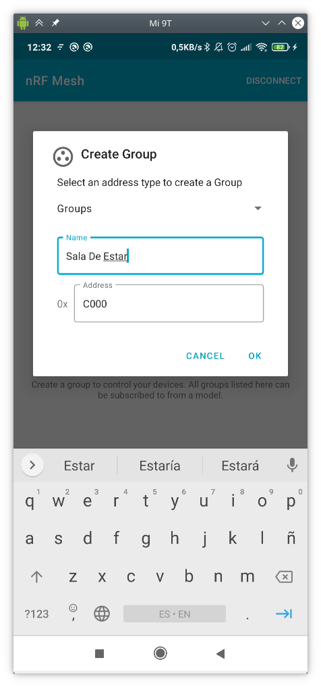
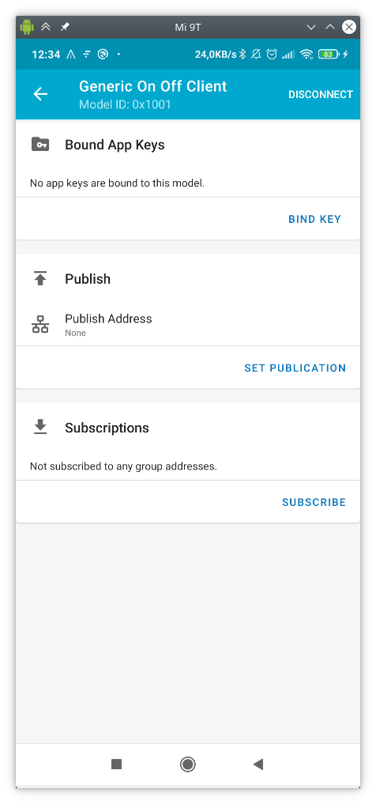

# Práctica 6. BLE Mesh

!!! note "Nota"
	Esta práctica es opcional para aquellos que opten a evaluación por proyecto
	y obligatoria para los que se evaluen por prácticas, es decir, las tareas
	aquí descritas son obligatorias sólo para los que se presentan por
	prácticas.

## Objetivos

* Poner en práctica los conceptos estudiados en teoría en relación a BLE MESH,
específicamente provisionamiento y modelos cliente/servidor.

* Desplegar una infraestructura de provisionamiento de un modelo ONOFF GENERIC
SERVER con provisionamiento desde aplicación móvil para el control remoto de 
encendido/apagado LED.

* Desplegar una infraestructura de provisionamiento de un modelo GENERIC SENSOR 
con provisionamiento desde ESP32.

## Estructura de la práctica

Esta práctica está dividida en dos partes. En la primera parte trabajaremos un
ejemplo de modelo genérico ON-OFF (ble_mesh_node/onoff_server), en el que se
simulará una red domótica con un interruptor y varias luces conectadas a una red
BLE-Mesh (o un sólo led rgb).  Si disponemos de ellos, podemos conectar leds a
los pines GPIO indicados en el fichero board.h para ver físicamente el efecto
del encendido y apagado de las luces.

En la segunda parte trabajaremos un ejemplo de modelo sensor
(ble_mesh_sensor_model), en el que un sensor enviará información de un sensor
virtual (simulado con números aleatorios) que enviará a los clientes conectados
en la red BLE-Mesh.

!!! danger "Tarea"
	Escribe un informe en el que describas cada una de las tareas propuestas, su
	desarrollo y los resultados obeservados, así como tus observaciones o
	comentarios personales.

## Requisitos previos

En segundo lugar, deberás rellenar la hoja Excel correspondiente a tu puesto
con la dirección MAC Bluetooth de tu dispositivo, que podrás obtener con 
cualquier mecanismo que hayas utilizado en prácticas anteriores.

Los códigos que estudiaremos en la práctica se encuentran en el directorio
`examples/bluetooth/esp_ble_mesh/ble_mesh_node` en el caso del sistema
*OnOff* (primera parte de la práctica) y 
`ble_mesh_sensor_model` en el caso del modelo sensor (segunda parte de
la práctica).

Por último, descarga e instala la aplicación (disponible para Android e IOS)
`nRF Mesh`.

## Modelo genérico ON-OFF

### El servidor ON-OFF

El servidor implementa un único elemento, en el cual se integran dos modelos
distintos:

1. *Modelo Configuration Server*, que implementa la configuración de 
claves de aplicación (*AppKey*), así como configuraciones genéricas del servidor
como suscripciones, tamaño de TTL o funcionalidad de *relay* de mensajes.
2. *Modelo Generic OnOff Server*, que implementa la funcionalidad básica de
encendido/apagado de una luz.

El código en el fichero `ble_mesh_demo_main.c` contiene la funcionalidad
básica del servidor, que podemos resumir en:

* Inicialización de la pila BLE (*bluedroid*).
* Inicialización de la pila BLE Mesh.
* Registro de las funciones de *callback* para el proceso de provisionamiento y
  del modelo o modelos implementados.
* Implementación e inicialización del elemento BLE Mesh.
* Implementación e inicialización del modelo *Configuration Server* y *Generic
  OnOff Server*.
* Soporte para operaciones *Get Opcode* y *Set Opcode* en el modelo de
  configuración.

#### Análisis básico de código

* **Inicialización y activación de la pila BLE Mesh**

    Tras la inicialización del sistema, la tarea principal (*app_main*) se encarga
    de la incialización de las pilas BLE y BLE Mesh:

```c
void app_main(void)
{
    int err;

    ESP_LOGI(TAG, "Initializing...");

    board_init();

    err = bluetooth_init();

    if (err) {
        ESP_LOGE(TAG, "esp32_bluetooth_init failed (err %d)", err);
        return;
    }

    /* Initializes the Bluetooth Mesh Subsystem */
    err = ble_mesh_init();
    if (err) {
        ESP_LOGE(TAG, "Bluetooth mesh init failed (err %d)", err);
    }
}
```

En particular, el código incluye invocaciones a `bluetooth_init()` y
`ble_mesh_init()`, que se encargan de ambas inicializaciones.

La inicialización de la pila BLE Mesh requiere alguna explicación adicional:

```c
static esp_err_t ble_mesh_init(void)
{
    int err = 0;

    memcpy(dev_uuid + 2, esp_bt_dev_get_address(), BLE_MESH_ADDR_LEN);

    // See comment 1
     esp_ble_mesh_register_prov_callback(esp_ble_mesh_prov_cb);
    esp_ble_mesh_register_custom_model_callback(esp_ble_mesh_model_cb);

    err = esp_ble_mesh_init(&provision, &composition);
    if (err) {
        ESP_LOGE(TAG, "Initializing mesh failed (err %d)", err);
        return err;
    }

    esp_ble_mesh_node_prov_enable(ESP_BLE_MESH_PROV_ADV | ESP_BLE_MESH_PROV_GATT);

    ESP_LOGI(TAG, "BLE Mesh Node initialized");

    board_led_operation(LED_G, LED_ON);

    return err;
}
```

Observa que el código incluye la siguiente funcionalidad:

* `esp_ble_mesh_register_prov_callback(esp_ble_mesh_prov_cb)`: registra la
  función de *callback* para la pila BLE Mesh. Esta función se ejecuta durante
  el proceso de configuración, y permite a la pila BLE Mesh generar eventos y
  notificar a la aplicación sobre hitos importantes en el proceso de
  configuración. Los eventos principales que pueden emitirse son:

	- `ESP_BLE_MESH_PROVISION_REGISTER_COMP_EVT`: generado cuando se completa el
	  proceso de incialización de BLE Mesh.
	- `ESP_BLE_MESH_NODE_PROV_LINK_OPEN_EVT`: generado cuando un provisionador y
	  un dispositivo no provisionado establecen un enlace.
	- `ESP_BLE_MESH_NODE_PROV_LINK_CLOSE_EVT`: generado para notificar a la
	  aplicación que se ha roto un enlace con un dispositivo asociado.
	- `ESP_BLE_MESH_NODE_PROV_COMPLETE_EVT`: recibido por la aplicación cuando
	  el proceso de provisionamiento se completa.

* `esp_ble_mesh_register_custom_model_callback(esp_ble_mesh_model_cb)`: registra
  la función de *callback* asociada al modelo. Esta función se utiliza cuando el
  otro extremo de la comunicación solicita operaciones sobre el modelo, y es
  capaz de emitir los siguientes eventos principales:

	- `ESP_BLE_MESH_MODEL_OPERATION_EVT`: se puede generar en dos situaciones:
		- El modelo servidor recibe un *Get Status* o *Set Status* desde un
		  modelo cliente.
		- El modelo cliente recibe un *Status State* desde un modelo servidor.
	- `ESP_BLE_MESH_MODEL_SEND_COMP_EVT`: generado después de que el modelo
	  servidor envíe un *Status State* a través de la función
	  `esp_ble_mesh_server_model_send_msg`.
	- `ESP_BLE_MESH_MODEL_PUBLISH_COMP_EVT`: generado después de que la
	  aplicación complete la invocación a `esp_ble_mesh_model_publish_msg` para
	  publicar mensajes.
	- `ESP_BLE_MESH_CLIENT_MODEL_SEND_TIMEOUT_EVT`: generado cuando el modelo
	  cliente invoca a la función `esp_ble_mesh_client_model_send_msg`, pero no
	  recibe mensaje de `ACK` de vuelta.
	- `ESP_BLE_MESH_MODEL_PUBLISH_UPDATE_EVT`: generado después de que la
	  aplicación configure la función de publicación para enviar de forma
	  periódica mensajes al otro extremo.

* `esp_ble_mesh_node_prov_enable(ESP_BLE_MESH_PROV_ADV |
  ESP_BLE_MESH_PROV_GATT)`: activa el proceso de Anuncio y Escaneo, haciendo
  visible al dispositivo para potenciales provisionadores que estén a la
  escucha.  

* `board_led_operation(LED_G, LED_ON)`: inicializa un hipotético LED RGB, que se
  controlará remotamente.

En este punto, la inicialización de la pila BLE Mesh debería estar completa, por
lo que un provisionador podría identificar dispositivos para privisonamiento de
parámetros de red y transmisión de datos.

#### Implementación de la estructura BLE Mesh Element

A continuación, se detallan los pasos necesarios para, en el servidor:

* Completar la inicialización del sistema.
* Añadir un elemento y un modelo al servidor.
* Elegir distintas implementaciones de encriptación.
* Declarar las características de *Proxy*, *Relay*, *Low Power* y *Friend* del
  nodo.

En primer lugar, para declarar y definir un elemento y un modelo asociado,
utilizaremos las siguientes estructuras:

```c
/*!< Abstraction that describes a BLE Mesh Element.
    This structure is associated with bt_mesh_elem in mesh_access.h */
typedef struct {
    /* Element Address, it is assigned during provisioning. */
    uint16_t element_addr;

    /* Location Descriptor (GATT Bluetooth Namespace Descriptors) */
    const uint16_t location;

    /* Model count */
    const uint8_t sig_model_count;
    const uint8_t vnd_model_count;

    /* Models */
    esp_ble_mesh_model_t *sig_models;
    esp_ble_mesh_model_t *vnd_models;
} esp_ble_mesh_elem_t;
```

Así, podemos mantener información sobre los elementos disponibles en el vector
`elements`:

```c
static esp_ble_mesh_elem_t elements[] = {
    ESP_BLE_MESH_ELEMENT(0, root_models, ESP_BLE_MESH_MODEL_NONE),
    ESP_BLE_MESH_ELEMENT(0, extend_model_0, ESP_BLE_MESH_MODEL_NONE),
    ESP_BLE_MESH_ELEMENT(0, extend_model_1, ESP_BLE_MESH_MODEL_NONE),
};
```

Dónde la macro ```ESP_BLE_MESH_ELEMEN``` se utiliza para inicializar los campos
de la estructura ```esp_ble_mesh_elem_t```:

```c
#define ESP_BLE_MESH_ELEMENT(_loc, _mods, _vnd_mods)    \
{                                                       \
    .location         = (_loc),                         \
    .sig_model_count  = ARRAY_SIZE(_mods),              \
    .sig_models       = (_mods),                        \
    .vnd_model_count  = ARRAY_SIZE(_vnd_mods),          \
    .vnd_models       = (_vnd_mods),                    \
}

```

Las variables de la estructura son las siguientes:

- `addr`: almacena la dirección del elemento primario, usado por la pila ble
  mesh durante la inicialización. Puede ser ignorado por las aplicaciones.
- `loc`: descriptor location definido por el SIG. En este ejemplo se pone a `0`.
- `model_count`: número de modelos soportados por este elemento.
- `vnd_model_count`: número de modelos de vendedor soportados por este elemento.
- `models`: puntero al array de modelos ya definidos.
- `vnd_models`: puntero al array de modelos de vendedor ya definidos (ninguno en
  nuestro ejemplo).

Como vemos, cada elemento usa un array del tipo ```ble_mesh_model_t``` para
identificar los modelos implementados por el elemento, como es el array
```root_models``` en nuestro código de ejemplo.

```c
static esp_ble_mesh_model_t root_models[] = {
    ESP_BLE_MESH_MODEL_CFG_SRV(&config_server),
    ESP_BLE_MESH_MODEL_GEN_ONOFF_SRV(&onoff_pub_0, &onoff_server_0),
};
```

Distintos modelos requieren diferentes macros (en este caso, ya que vamos a
implementar un modelo *Generic OnOff Server*, hemos utilizado
`ESP_BLE_MESH_MODEL_GEN_ONOFF_SRV`). 

### El cliente ON-OFF

El cliente resulta mucho más sencillo en su funcionamiento. El código de ejemplo
es (ble_mesh_node/onoff_client). De forma genérica, simplemente define un modelo
*Client ON/OFF* y espera a ser provisionado. Una vez completado el proceso de
provisionamento, espera a la pulsación de uno de los botones en la placa (RESET)
para el envío a todos los nodos en la misma red de una solicitud de modificación
en el estado de activación de las luces.

Concretamente, nos interesan las siguientes definiciones. En el fichero
`board.c`, observa la respusta a la pulsación del botón:

```c

static void button_tap_cb(void* arg)
{
    ESP_LOGI(TAG, "tap cb (%s)", (char *)arg);

    example_ble_mesh_send_gen_onoff_set();
}

static void board_button_init(void)
{
    button_handle_t btn_handle = iot_button_create(BUTTON_IO_NUM, BUTTON_ACTIVE_LEVEL);
    if (btn_handle) {
        iot_button_set_evt_cb(btn_handle, BUTTON_CB_RELEASE, button_tap_cb, "RELEASE");
    }
}

void board_init(void)
{
    board_led_init();
    board_button_init();
}
```

La función invocada, `example_ble_mesh_send_gen_onoff_set()` (definida en el
fichero `main.c`), realiza el envío de una operación de tipo `SET` a *todos los
miembros de la red*:

```c
void example_ble_mesh_send_gen_onoff_set(void)
{
    esp_ble_mesh_generic_client_set_state_t set = {0};
    esp_ble_mesh_client_common_param_t common = {0};
    esp_err_t err = ESP_OK;

    common.opcode = ESP_BLE_MESH_MODEL_OP_GEN_ONOFF_SET_UNACK;
    common.model = onoff_client.model;
    common.ctx.net_idx = store.net_idx;
    common.ctx.app_idx = store.app_idx;
    common.ctx.addr = 0xFFFF;   /* to all nodes */
    common.ctx.send_ttl = 3;
    common.ctx.send_rel = false;
    common.msg_timeout = 0;     /* 0 indicates that timeout value from menuconfig will be used */
    common.msg_role = ROLE_NODE;

    set.onoff_set.op_en = false;
    set.onoff_set.onoff = store.onoff;
    set.onoff_set.tid = store.tid++;

    err = esp_ble_mesh_generic_client_set_state(&common, &set);
    if (err) {
        ESP_LOGE(TAG, "Send Generic OnOff Set Unack failed");
        return;
    }

    store.onoff = !store.onoff;
    mesh_example_info_store(); /* Store proper mesh example info */
}
```

Observa cómo el mensaje se enviará a *todos los nodos de la red*
(`common.ctx.addr = 0xFFFF;`).

### Provisionamiento y control desde una aplicación móvil

En primer lugar, nos dividiremos en grupos de 3-4 personas. Uno de vosotros,
utilizando la aplicación móvil *nRF Mesh*, actuará como provisionador de la red,
proporcionando claves de red y aplicación, así como información básica de red
(por ejemplo, direcciones unicast). Además, podrá crear grupos y
suscribir/desuscribir modelos a dichos grupos.

Además, se requiere que uno de vuestros ESP32 actúe como cliente, y el resto
como servidores. Así, emularemos una sala con múltiples luces, y un sólo
interruptor que controlará su estado de encendido/apagado.

* *PASO 1*: en la pantalla inicial se nos mostrarán los nodos ya provisionados.
  En nuestro caso, inicialmente ninguno.


* *PASO 2*: pincharemos sobre *ADD NODE*, y provisionaremos, uno a uno, todos
  los nodos que deseemos que formen parte de nuestra red (sólo aquellos que
  forman parte de tu grupo de compañeros):


* *PASO 3*: antes de provisionar, generamos información de red para el nuevo
  nodo (lo *identificamos*), presionando en *IDENTIFY*:


* *PASO 4*: una vez generada la información de red, provisionamos el nodo
  (*PROVISION*):


* *PASO 5*: si todo ha ido bien, se nos mostrará un mensaje de éxito como el
  siguiente:


* *PASO 6*: tras repetir este paso con todos los nodos de nuestro grupo, veremos
  una pantalla como la siguiente. Observa y anota las direcciones unicast de
  cada nodo. Los nodos con un elemento son el cliente OnOff; los nodos con tres
  elementos son los servidores OnOff:


A continuación, generarás un grupo de nodos. Esto nos permitirá suscribir a
modelos al mismo, y publicar mensajes que se transmitirán a todos los modelos
del grupo.

* *PASO 7*: crea un nuevo grupo pulsando el botón `+`. Dale el nombre y la
  dirección que desees, por ejemplo, *Sala de Estar*, `0xC000`. Si todo ha ido
  bien, se especificará que en el único grupo disponible no hay ningún
  dispositivo suscrito/asociado.


A continuación, suscribiremos a cada modelo de los servidores y clientes (de
tipo *Generic On Off Server* y *Generic On Off Client*) al grupo creado. Esto lo
harás nodo a nodo, en primer lugar pincando en el modelo concreto:



Y a continuación asociando una clave de aplicación (*BIND KEY*) y suscribiendo
(*SUBSCRIBE*) al grupo deseado:





Ahora, si vuelves a la descripción del grupo, verás que, tras pinchar, observas
dos luces (o una por servidor) y un interruptor (correspondiente al cliente):


En este punto, si estás monitorizando la salida de todos los ESP32, verás que el
estado del LED cambia a petición de la aplicación. Además, verás que también
cambia si presionas el botón correspondiente del interruptor (*RESET*) en la
placa.

!!! danger "Tarea"
	El cliente envía, tras presionar un botón, el mensaje de tipo `SET` a todos
	los nodos de la red. Modifícalo para que únicamente se envíe a los
	pertenecientes a tu grupo. Prueba a suscribir/desuscribir un modelo del
	grupo, y verás como ya no recibe los mensajes de solicitud de modificación
	de estado.

## Modelo sensor

En este ejemplo (ble_mesh_sensor_model), se implementa la creación de un cliente
de modelo sensor que, además, es provisionador, y un servidor de modelo sensor
configurable. 

El modelo *Sensor Server* es un modelo que permite exponer series de datos de
sensorización.  El modelo *Sensor Client* se usa para consumir valores de
sensorización (*Sensor states*) expuestos por el servidor.

Estos estados se componen de las siguientes partes:

* Estado *Sensor Descriptor*. Describe los datos del sensor, y es inmutable
  durante su vida.
* Estado *Sensor Setting*. Controla los parámetros del sensor. Por ejemplo,
  podría indicar su sensibilidad, y podría ser ajustado remotamente para
  prevenir que un sensor de movimiento se disparase ante pequeños movimientos.
* Estado *Sensor Cadence*. Controla la cadencia de sensorización.
* Estado *Sensor Data*. Contiene los valores de sensorización. Realmente,
  representa uno o más pares *Property ID*-*Valor*.
* Estado *Sensor Series Column*. Sólo utilizado si se considera cada uno de los
  valores como perteneciente a una serie de datos.

En el ejemplo *client*, el dispositivo es a la vez un provisionador y un
cliente. Una vez el dispositivo servidor es provisionado y configurado, los
usuarios pueden presionar el botón de la placa para enviar al servidor
peticiones que, sucesivamente, devolverán el siguiente estado del sensor en
orden (*Descriptor*, *Setting*, *Cadence*, ...).

En el ejemplo *server*, el dispositivo no provisonado implementa un modelo
*Sensor Server*. El servidor soporta dos instancias de estados: la pimrea
(*Property ID 0x0056*) representaría la temperatura *Indoor*; la segunda
(*Property ID 0x005B*) representaría la temperatura *Outdoor*. Todos los datos,
en estos ejemplos, están preinicializados. 

### Puesta en marcha

En primer lugar, arranca en tu grupo un nodo cliente/provisionador, y monitoriza
su salida. Cuando un compañero/a arranque un nodo servidor, verás que es
provisionado por tu cliente, otorgándole una dirección unicast. Anótala.

El funcionamiento general del sistema es:

1. El dispositivo A ejecuta el ejemplo *client*, y el dispositivo B ejecuta el
   ejemplo *server*.
2. A actúa como provisionador. Tras recibir una petición por parte de B, lo
   provisiona y almacena su dirección. Observarás la MAC BLE (UUID) de B en el
   proceso de provisionamiento desde A.
3. En A, cada pulsación del botón supondrá una petición al nodo B.
4. Sucesivamente, estas peticiones serán, en orden y por cada pulsación:
    - *Sensor Descriptor*.
    - *Sensor Cadence*.
    - *Sensor Settings*.
    - *Sensor Data*.
    - *Sensor Series*.

!!! danger "Tarea"
	Estudia el código del cliente y del servidor, y observa a qué nodo se envían
	las peticiones desde el cliente, qué operaciones se solicitan en cada
	pulsación de botón, y qué datos devuelve el servidor en cada caso.

!!! danger "Tarea"
	Modifica el código de cliente y/o servidor para que los valores de
	sensorización que se consulten en cada pulsación del botón no sean **todos**
	los del modelo del **último** nodo provisonado, como ahora se hace, sino
	únicamente los datos de sensorización (*Sensor Data State*) de **todos**
	los nodos provisionados. Así, si hay tres nodos provisionados, cada
	pulsación nos devolverá el valor de sensorización de uno de ellos, por orden
	de provisionamiento.

!!! danger "Tarea"
	Como funcionalidad adicional, sólo se provisionará automáticamente a
	aquellos nodos autorizados (los que pertenecen a tu sala, por ejemplo).

!!! danger "Tarea"
	Por último, se pide que el valor sensorizado varíe aleatoriamente de forma
	periódica en el servidor, con una cadencia predeterminada.

!!! danger "Tarea Opcional"
	Modifica el código de cliente y/o servidor para que se pueda cambiar
	remotamente la cadencia de cambio del valor sensorizado.
