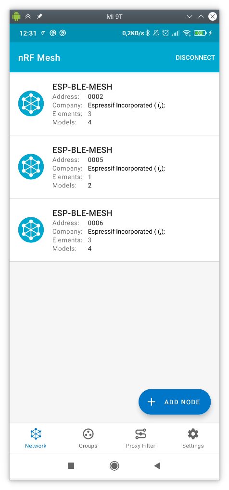
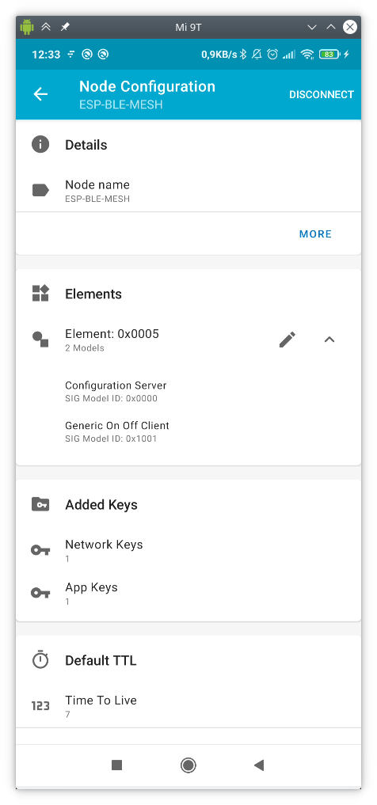
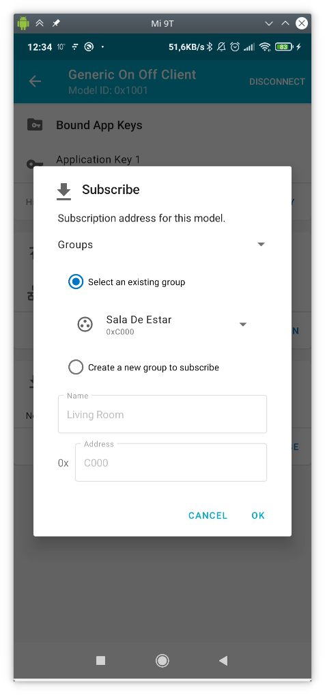

# LAB7. BLE Mesh

## Objetivos

* Poner en práctica los conceptos vistos en teoría en relación a BLE Mesh,
específicamente provisionamiento y modelos cliente/servidor.

* Desplegar una infraestructura de provisionamiento de un modelo *Generic OnOff Server*
con provisionamiento desde aplicación móvil para el control remoto de 
encendido/apagado de un LED.

* Desplegar una infraestructura de provisionamiento de un modelo *Generic Sensor*
con provisionamiento desde ESP32.

## Estructura de la práctica

Esta práctica está dividida en dos partes. En la primera parte trabajaremos un
ejemplo de modelo genérico OnOff en el que se simulará una red domótica con un interruptor y varias luces conectadas a
una red BLE Mesh (o un sólo led RGB). Si disponemos de ellos, podemos conectar
leds a los pines GPIO indicados en el fichero board.h para ver físicamente el
efecto del encendido y apagado de las luces.

En la segunda parte trabajaremos un ejemplo de modelo Sensor, en el que un sensor enviará información de un sensor
virtual (simulado con números aleatorios) a los clientes conectados en la red BLE Mesh.

## Requisitos previos

Los códigos que estudiaremos en la práctica se encuentran en el directorio
`examples/bluetooth/esp_ble_mesh/onoff_models` en el caso del sistema
*OnOff* (primera parte de la práctica) y en
`examples/bluetooth/esp_ble_mesh/sensor_models` en el caso del modelo sensor (segunda parte de
la práctica).

Por otro lado, descarga e instala la aplicación *nRF Mesh* en tu móvil (disponible para Android e iOS).

## Modelo genérico OnOff

### El servidor OnOff

El servidor implementa un único elemento en el cual se integran dos modelos
distintos:

1. Modelo *Configuration Server*: obligatorio en todo nodo BLE Mesh, implementa la configuración de 
claves (*NetKey* y *AppKey*) así como configuraciones genéricas del servidor (suscripciones, tamaño de TTL o funcionalidad de *relay* de mensajes).
2. Modelo *Generic OnOff Server*: implementa la funcionalidad básica de encendido/apagado de una luz.

El código en el fichero `main.c` contiene la funcionalidad básica del servidor,
que podemos resumir en:

* Inicialización de la pila BLE (*bluedroid*).
* Inicialización de la pila BLE Mesh.
* Registro de las funciones de *callback* para el proceso de provisionamiento y
  del modelo/modelos implementados.
* Implementación e inicialización del elemento BLE Mesh.
* Implementación e inicialización del modelo *Configuration Server* y *Generic OnOff Server*.
* Soporte para operaciones *Get Opcode* y *Set Opcode* en el modelo de configuración.

#### Análisis básico del código

Primero, la tarea principal (*app_main*) se encarga de la inicialización de las pilas BLE y BLE Mesh:

```c
void app_main(void)
{
    esp_err_t err;

    ESP_LOGI(TAG, "Initializing...");

    board_init();

    err = nvs_flash_init();
    if (err == ESP_ERR_NVS_NO_FREE_PAGES) {
        ESP_ERROR_CHECK(nvs_flash_erase());
        err = nvs_flash_init();
    }
    ESP_ERROR_CHECK(err);

    err = bluetooth_init();
    if (err) {
        ESP_LOGE(TAG, "esp32_bluetooth_init failed (err %d)", err);
        return;
    }

    ble_mesh_get_dev_uuid(dev_uuid);

    /* Initialize the Bluetooth Mesh Subsystem */
    err = ble_mesh_init();
    if (err) {
        ESP_LOGE(TAG, "Bluetooth mesh init failed (err %d)", err);
    }
}
```

En particular, el código incluye invocaciones a `bluetooth_init()` y
`ble_mesh_init()` encargadas de ambas inicializaciones.
La inicialización de la pila BLE Mesh requiere alguna explicación adicional:

```c
static esp_err_t ble_mesh_init(void)
{
    esp_err_t err = ESP_OK;

    esp_ble_mesh_register_prov_callback(example_ble_mesh_provisioning_cb);
    esp_ble_mesh_register_config_server_callback(example_ble_mesh_config_server_cb);
    esp_ble_mesh_register_generic_server_callback(example_ble_mesh_generic_server_cb);

    err = esp_ble_mesh_init(&provision, &composition);
    if (err != ESP_OK) {
        ESP_LOGE(TAG, "Failed to initialize mesh stack (err %d)", err);
        return err;
    }

    err = esp_ble_mesh_node_prov_enable((esp_ble_mesh_prov_bearer_t)(ESP_BLE_MESH_PROV_ADV | ESP_BLE_MESH_PROV_GATT));
    if (err != ESP_OK) {
        ESP_LOGE(TAG, "Failed to enable mesh node (err %d)", err);
        return err;
    }

    ESP_LOGI(TAG, "BLE Mesh Node initialized");

    board_led_operation(LED_G, LED_ON);

    return err;
}
```

Observa que el código incluye la siguiente funcionalidad:

* `esp_ble_mesh_register_prov_callback(example_ble_mesh_provisioning_cb)`: registra la
  función de *callback* de provisionado en la pila BLE Mesh. Esta función se ejecuta durante
  el proceso de configuración y permite a la pila BLE Mesh generar eventos y
  notificar a la aplicación sobre eventos importantes en el proceso de
  configuración. Los eventos principales que pueden emitirse son:
	  - `ESP_BLE_MESH_PROV_REGISTER_COMP_EVT` y `ESP_BLE_MESH_NODE_PROV_ENABLE_COMP_EVT`:
    generados cuando se completa la inicialización de la pila BLE Mesh.
    En este punto, el nodo está listo para ser descubierto por un provisionador.
    - `ESP_BLE_MESH_NODE_PROV_ENABLE_COMP_EVT`: generado cuando 
	  - `ESP_BLE_MESH_NODE_PROV_LINK_OPEN_EVT`: generado cuando un provisionador y
	  un dispositivo no provisionado establecen un enlace.
	  - `ESP_BLE_MESH_NODE_PROV_LINK_CLOSE_EVT`: generado para notificar a la
	  aplicación que se ha roto un enlace con un dispositivo asociado.
	  - `ESP_BLE_MESH_NODE_PROV_COMPLETE_EVT`: recibido por la aplicación cuando
	  el proceso de provisionamiento se completa.<br><br>

* `esp_ble_mesh_register_config_server_callback(example_ble_mesh_config_server_cb)` y
  `esp_ble_mesh_register_generic_server_callback(example_ble_mesh_generic_server_cb)`:
  registran las funciones de *callback* asociadas a los modelos *Configuration Server* y
  *Generic OnOff Server*, respectivamente. Centrándonos en la segunda función, el *callback* se utiliza cuando el
  otro extremo de la comunicación solicita operaciones sobre el modelo, pudiendo emitir los siguientes eventos:
    - `ESP_BLE_MESH_GENERIC_SERVER_STATE_CHANGE_EVT`: generado cuando se produce un cambio en el
    estado del modelo (ya sea por recibir un mensaje *Set* o por un cambio interno).
	  - `ESP_BLE_MESH_GENERIC_SERVER_RECV_GET_MSG_EVT`: generado cuando el servidor recibe un mensaje
    *Get* de un cliente que solicita el estado actual del modelo.
	  - `ESP_BLE_MESH_GENERIC_SERVER_RECV_SET_MSG_EVT`: generado cuando el servidor recibe un mensaje
    *Set* de un cliente que solicita cambiar el estado del modelo.<br><br>

* `esp_ble_mesh_node_prov_enable((esp_ble_mesh_prov_bearer_t)(ESP_BLE_MESH_PROV_ADV | ESP_BLE_MESH_PROV_GATT))`:
  activa el proceso de Anuncio y Escaneo, haciendo visible al dispositivo
  para potenciales provisionadores que estén a la escucha.

* `board_led_operation(LED_G, LED_ON)`: inicializa un hipotético LED RGB, que se
  controlará remotamente.

En este punto, la inicialización de la pila BLE Mesh se ha completado, por
lo que un provisionador podría identificar dispositivos para provisionamiento de
parámetros de red y transmisión de datos.

#### Implementación de la estructura BLE Mesh Element

A continuación, se detallan los pasos necesarios para, en el servidor:

* Completar la inicialización del sistema.
* Añadir un elemento y un modelo.
* Elegir distintas implementaciones de encriptación.
* Declarar las características de *Proxy*, *Relay*, *Low Power* y *Friend* del
  nodo.

En primer lugar, para declarar y definir un elemento y un modelo asociado,
utilizamos las siguientes estructuras:

```c
/** Abstraction that describes a BLE Mesh Element.
 *  This structure is associated with struct bt_mesh_elem in mesh_access.h
 */
typedef struct {
    /** Element Address, assigned during provisioning. */
    uint16_t element_addr;

    /** Location Descriptor (GATT Bluetooth Namespace Descriptors) */
    const uint16_t location;

    const uint8_t sig_model_count;      /*!< SIG Model count */
    const uint8_t vnd_model_count;      /*!< Vendor Model count */

    esp_ble_mesh_model_t *sig_models;   /*!< SIG Models */
    esp_ble_mesh_model_t *vnd_models;   /*!< Vendor Models */
} esp_ble_mesh_elem_t;
```

De esta forma podemos mantener la información de los elementos disponibles en el vector
`elements`:

```c
static esp_ble_mesh_elem_t elements[] = {
    ESP_BLE_MESH_ELEMENT(0, root_models, ESP_BLE_MESH_MODEL_NONE),
    ESP_BLE_MESH_ELEMENT(0, extend_model_0, ESP_BLE_MESH_MODEL_NONE),
    ESP_BLE_MESH_ELEMENT(0, extend_model_1, ESP_BLE_MESH_MODEL_NONE),
};
```

Donde la macro `ESP_BLE_MESH_ELEMENT` se utiliza para inicializar los campos
de la estructura `esp_ble_mesh_elem_t`:

```c
#define ESP_BLE_MESH_ELEMENT(_loc, _mods, _vnd_mods)    \
{                                                       \
    .location         = (_loc),                         \
    .sig_model_count  = ARRAY_SIZE(_mods),              \
    .vnd_model_count  = ARRAY_SIZE(_vnd_mods),          \
    .sig_models       = (_mods),                        \
    .vnd_models       = (_vnd_mods),                    \
}
```

Los campos incluidos en las estructuras anteriores son:

  - `element_addr`: almacena la dirección de 16 bits del elemento (asignada durante el provisionado).
  - `location`: descriptor de localización (p.e. interruptor izquierdo o derecho). En este ejemplo se establece a `0`.
  - `sig_model_count`: número de modelos SIG estándar contenidos en este elemento.
  - `vnd_model_count`: número de modelos de fabricante contenidos en este elemento (no estándar).
  - `sig_models`: puntero al array de modelos SIG ya definidos.
  - `vnd_models`: puntero al array de modelos de fabricante ya definidos (ninguno en
  nuestro ejemplo, `ESP_BLE_MESH_MODEL_NONE`).

Como vemos, cada elemento usa un array del tipo `esp_ble_mesh_model_t` para
identificar los modelos implementados por el elemento, como por ejemplo el array `root_models`:

```c
static esp_ble_mesh_model_t root_models[] = {
    ESP_BLE_MESH_MODEL_CFG_SRV(&config_server),
    ESP_BLE_MESH_MODEL_GEN_ONOFF_SRV(&onoff_pub_0, &onoff_server_0),
};
```

Distintos modelos requieren diferentes macros. En nuestro caso, ya que vamos a
implementar un modelo *Generic OnOff Server*, hemos utilizado
`ESP_BLE_MESH_MODEL_GEN_ONOFF_SRV`.

### El cliente OnOff

El cliente resulta mucho más sencillo en su funcionamiento. De forma general,
simplemente define un modelo *Client OnOff* y espera a ser provisionado.
Una vez completado el proceso de provisionamento,
espera a la pulsación de uno de los botones en la placa (*BOOT*)
para enviar a todos los nodos de la red mesh una solicitud de cambio
en el estado de encendido de las luces.

Concretamente, nos interesan las siguientes definiciones. En el fichero
`board.c`, observa la respuesta a la pulsación del botón:

```c
static void button_tap_cb(void* arg)
{
    ESP_LOGI(TAG, "tap cb (%s)", (char *)arg);

    example_ble_mesh_send_gen_onoff_set();
}

static void board_button_init(void)
{
    button_handle_t btn_handle = iot_button_create(BUTTON_IO_NUM, BUTTON_ACTIVE_LEVEL);
    if (btn_handle) {
        iot_button_set_evt_cb(btn_handle, BUTTON_CB_RELEASE, button_tap_cb, "RELEASE");
    }
}

void board_init(void)
{
    board_led_init();
    board_button_init();
}
```

La función invocada, `example_ble_mesh_send_gen_onoff_set()` (definida en el
fichero `main.c`), realiza el envío de una operación de tipo *Set* a todos los
miembros de la red mesh:

```c
void example_ble_mesh_send_gen_onoff_set(void)
{
    esp_ble_mesh_generic_client_set_state_t set = {0};
    esp_ble_mesh_client_common_param_t common = {0};
    esp_err_t err = ESP_OK;

    common.opcode = ESP_BLE_MESH_MODEL_OP_GEN_ONOFF_SET_UNACK;
    common.model = onoff_client.model;
    common.ctx.net_idx = store.net_idx;
    common.ctx.app_idx = store.app_idx;
    common.ctx.addr = 0xFFFF;   /* to all nodes */
    common.ctx.send_ttl = 3;
    common.msg_timeout = 0;     /* 0 indicates that timeout value from menuconfig will be used */
#if ESP_IDF_VERSION < ESP_IDF_VERSION_VAL(5, 2, 0)
    common.msg_role = ROLE_NODE;
#endif

    set.onoff_set.op_en = false;
    set.onoff_set.onoff = store.onoff;
    set.onoff_set.tid = store.tid++;

    err = esp_ble_mesh_generic_client_set_state(&common, &set);
    if (err) {
        ESP_LOGE(TAG, "Send Generic OnOff Set Unack failed");
        return;
    }

    store.onoff = !store.onoff;
    mesh_example_info_store(); /* Store proper mesh example info */
}
```

### Provisionamiento y control desde una aplicación móvil

En primer lugar, nos dividiremos en grupos de 3-5 personas. Uno de los integrantes del grupo,
utilizando la aplicación móvil *nRF Mesh*, actuará como provisionador de la red,
proporcionando las claves de red y aplicación (*NetKey* y *AppKey*), así como información básica de red
(por ejemplo, las direcciones unicast). Además, podrá crear grupos de nodos y
suscribir/desuscribir modelos a dichos grupos.

Además, se requiere que uno de vuestros ESP32 actúe como cliente, mientras que el resto
como servidores. De este modo, emularemos una sala por grupo con múltiples luces y un único
interruptor que controlará su estado de encendido/apagado.

!!! danger "Ejercicio 1"
	Documenta la configuración de la red mesh y el proceso de provisionamiento de nodos que vas a realizar a continuación.

* *PASO 1*: en la pestaña *Network* aparecerán los nodos ya provisionados.
  En nuestro caso, inicialmente ninguno:

  

* *PASO 2*: pincharemos sobre *ADD NODE* (o sobre `+` en iOS), y provisionaremos, uno a uno, todos
  los nodos que queramos que formen parte de nuestra red mesh:

  

* *PASO 3*: antes de provisionar un nodo, lo identificamos presionando en *IDENTIFY*:

  

* *PASO 4*: provisionamos el nodo pulsando en *PROVISION*:

  

* *PASO 5*: si todo ha ido bien, se mostrará un mensaje de éxito similar al
  siguiente:

  

* *PASO 6*: tras repetir este paso con todos los nodos del grupo, veremos
  una pantalla como la siguiente.
  Observa y anota las direcciones unicast de cada nodo provisionado.
  El nodo con un elemento es el cliente OnOff, mientras que los nodos con tres
  elementos son los servidores OnOff:

  

A continuación, generarás un grupo de nodos. Esto permitirá suscribir modelos
a dicho grupo (no son los elementos los que se suscriben) y publicar mensajes
que se enviarán a todos los modelos del grupo.

* *PASO 7*: en la pestaña *Groups*, crea un nuevo grupo pulsando `+`. Asigna el nombre y la
  dirección de grupo de 16 bits que desees, por ejemplo *Sala de Estar* y `0xC000`:

  

Si todo ha ido bien, verás que en el nuevo grupo aún no hay ningún dispositivo suscrito/asociado.
A continuación, suscribiremos cada modelo servidor y cliente (tipos
*Generic OnOff Server* y *Generic OnOff Client*) de los nodos de la red al grupo creado.
Esto lo harás nodo a nodo seleccionando cada nodo en la pestaña *Network*,
después el elemento, y finalmente el modelo:



Para, a continuación, (1) asociar una clave de aplicación (*BIND KEY*) y (2) suscribir el modelo
al grupo con *SUBSCRIBE*:




Si vuelves a la pestaña *Groups* y seleccionas el grupo, verás que aparece una luz por cada servidor/modelo suscrito:


En este punto, si estás monitorizando la salida de todos los ESP32 de tu red mesh, verás que el
estado del LED cambia a petición de la aplicación. Además, verás que también
cambia si presionas el botón *BOOT* del interruptor (cliente) en la
placa.

!!! danger "Ejercicio 2"
	El cliente envía, tras presionar el botón *BOOT*, el mensaje de tipo *Set* a todos
	los nodos de la red. Modifícalo para que únicamente se envíe a los nodos suscritos
	al grupo. Prueba a desuscribir uno o varios modelos del grupo y verás cómo ya no reciben los
	mensajes de solicitud de cambio de estado. Finalmente, vuelve a suscribir uno de los modelos
	desuscritos.

## Modelo sensor

En este ejemplo (`examples/bluetooth/esp_ble_mesh/sensor_models`), se implementa tanto un cliente
de modelo sensor (que además es provisionador) como un servidor de modelo sensor configurable.

El modelo *Sensor Server* permite exponer datos de sensores. El modelo *Sensor Client* se utiliza
para consumir los valores de sensores (*Sensor States*) expuestos por el servidor:

* Estado *Sensor Descriptor*: describe los datos del sensor (ID, tipo, unidad de medida, rango de valores).
* Estado *Sensor Cadence*: controla la frecuencia de actualización de los datos del sensor.
* Estado *Sensor Settings*: controla los parámetros del sensor. Por ejemplo,
  podría indicar su sensibilidad y puede ser ajustado remotamente para
  prevenir que un sensor de movimiento se disparase ante pequeños movimientos.
* Estado *Sensor Data*: contiene los valores reales medidos por el sensor. Realmente,
  representa uno o más pares *Property ID*-*Valor*.
* Estado *Sensor Series Column/Row*: sólo utilizado si se considera cada uno de los
  valores como perteneciente a una serie temporal de datos.

En el ejemplo *sensor_client*, el dispositivo actúa tanto de cliente como de provisionador.
Una vez que el dispositivo servidor es provisionado y configurado, los
usuarios pueden presionar el botón *BOOT* de la placa para enviar una petición al servidor,
el cual responderá con los distintos estados del sensor en orden (*Descriptor*, *Setting*, *Cadence*...).

En el ejemplo *sensor_server*, el dispositivo no provisonado implementa un modelo
*Sensor Server*. El servidor soporta dos instancias de estados: la primera
(*Property ID 0x0056*) representaría la temperatura *Indoor*; la segunda
(*Property ID 0x005B*) representaría la temperatura *Outdoor*. Todos los datos
en estos ejemplos están preinicializados.

### Puesta en marcha

En primer lugar, arranca un nodo cliente/provisionador y monitoriza
su salida. Cuando un/a compañero/a arranque un nodo servidor, verás que es
provisionado por tu cliente, otorgándole una dirección unicast. Anótala.

El funcionamiento general del ejemplo es el siguiente:

1. El dispositivo A ejecuta el ejemplo *sensor_client*, mientras que el dispositivo B ejecuta el
  ejemplo *sensor_server*.
2. A actúa como provisionador. Cuando detecta el dispositivo no provisionado B,
  inicia el proceso de provisionamiento y le asigna una dirección unicast.
3. En A, cada pulsación del botón *BOOT* supondrá una petición al nodo B.
4. Estas peticiones serán, sucesivamente y en este orden:
    - *Sensor Descriptor*.
    - *Sensor Cadence*.
    - *Sensor Settings*.
    - *Sensor Data*.
    - *Sensor Series*.

!!! danger "Ejercicio 3"
	Estudia el código del cliente y del servidor, y observa a qué nodo se envían
	las peticiones desde el cliente, qué operación se solicita en cada
	pulsación de botón *BOOT* y qué datos devuelve el servidor en cada caso.

!!! danger "Ejercicio 4"
	Modifica el código para que los valores consultados
	en cada pulsación del botón *BOOT* no sean únicamente los del modelo
	del último nodo provisonado, sino que se consulten de forma secuencial 
	los valores *Sensor Data* de todos los nodos provisionados.
	Así, si hay tres nodos provisionados, cada pulsación devolverá
	el valor de *Sensor Data* de uno de ellos, siguiendo el orden de provisionamiento.

!!! danger "Ejercicio 5"
	Modifica el código para que ahora sólo se provisione automáticamente a aquellos
	nodos autorizados. Aplica el filtro por UUID.

!!! danger "Ejercicio 6"
	Modifica el código del servidor para que los valores de temperatura cambien
	aleatoriamente de forma periódica. Implementa esta funcionalidad mediante
	una tarea de FreeRTOS.
