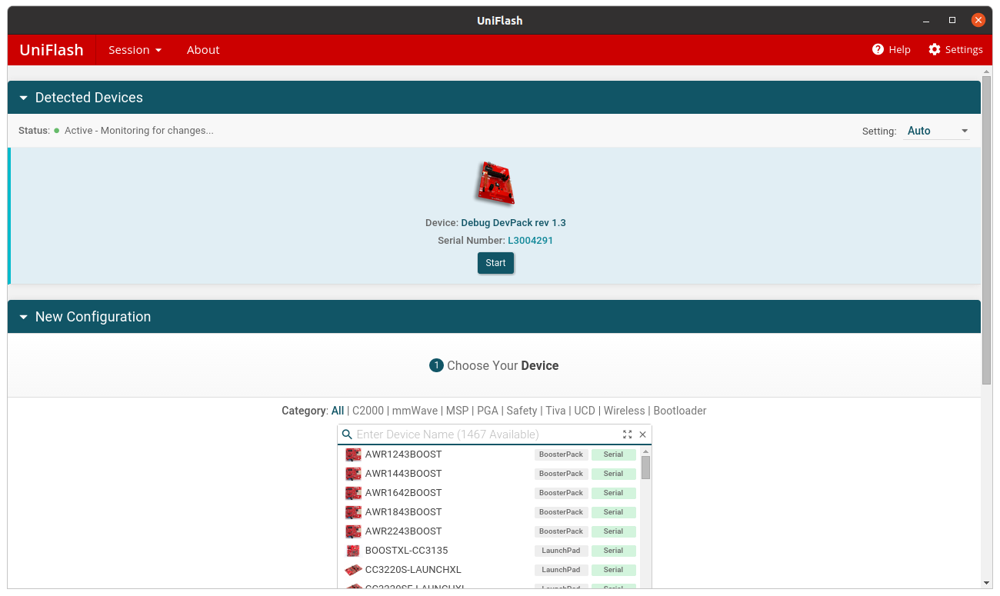

# Práctica 6. 6LowPAN (SensorTag)

## Objetivos

El objetivo principal de la presente práctica es reproducir (y ampliar) 
el entorno simulado visto en la práctica anterior, pero en este caso utilizando
*hardware* real. Para ello, ampliaremos el entorno para desplegar un router
de borde físico en el laboratorio, que enrutará los mensajes con origen la red
RPL hacia un servidor UDP físico situado en la red externa. 

Tras el despliegue, cada Sensortag que forme parte de la red RPL enviará, periódicamente,
mensajes UDP con un formato preestablecido, que serán mostrados por pantalla en 
el servidor UDP desplegado en el PC del profesor.

## Despliegue y modificación de un cliente UDP en el SensorTag

Para la realización de la práctica, partiremos del ejemplo de cliente UDP situado en 
el directorio `examples/ipv6/rpl-udp/udp-client.c`. Este sencillo código realiza un 
envío periódico de un paquete UDP (en su versión original, una cadena de caracteres
conteniendo el mensaje *Hello XX from the client* (siendo *XX* un número de secuencia
ascendente), a un servidor a la escucha en el puerto *5678* de una dirección IP determinada.

Estudia el código del cliente UDP, concretamente centrándote en las siguientes partes:

* **Temporización del envío (línea 252)**. El código establece un temporizador con un 
retardo determinado (`SEND_TIME`) y un *callback* asociado (`send_packet`).
* **Envío del mensaje vía UDP (línea 111)**. La función `uip_udp_packet_sendto` realiza
el envío del mensaje al extremo remoto del *socket* UDP. En este caso, utiliza la dirección
de inicio del *buffer* (`buf`) y su tamaño para controlar el inicio del mensaje y su tamaño
en bytes.
* **Reporte del estado de las tablas de enrutamiento y rutas por defecto**. La función 
`send_packet` incluye, en su parte inicial, un reporte del estado de las tablas de enrutamiento
(rutas por defecto) precediendo a cada envío del mensaje.
* **Establecimiento de dirección IP y puerto del servidor UDP**. La variable `server_ipaddr` contiene la
dirección IP del destino de la comunicación. El puerto destino viene fijado por la macro `UDP_SERVER_PORT`.

Las modificaciones que deberás realizar para conseguir interactuar con el servidor UDP remoto son
sencillas, pero requieren ser correctas para una correcta comunicación:

1. Modifica el valor de la dirección IP destino para que coincida con la indicada por el profesor. Para ello,
deberás modificar el valor de la variable `server_address`, que codifica una dirección IPv6, para embeber
en ella una dirección IPv4. Para ello, los 80 primero bits de la dirección deberán ser 0s, seguidos
de 16 bits fijados con valor 1, y seguidos por último de los 32 bits de la dirección IPv4 que se te indicará.

2. Modifica el valor del puerto destino para que coincida con el indicado por el profesor.

3. Modifica la lógica de envío para que el mensaje a enviar contenta, en este orden, los siguientes datos:

```c
struct mensaje{
  unsigned short id; // Identificador unico del mensaje.
  unsigned short ip; // Ultimos dos bytes de la dirección IPv6 del emisor (tu Sensortag).
  unsigned short nsensors; // Número de valores sensorizados que se envían.
  float sensors[6]; // Valores sensorizados.
};
```

Los valores sensorizados pueden generarse aleatoriamente o asignárseles valores fijos.

## Compilación de la imagen

Antes de comenzar a trabajar, crea una nueva carpeta al mismo nivel que la del ejemplo original, sobre
la que realizarás las compilaciones del *firmware*. Una vez creada, realiza una primera compilación
de prueba, utilizando la orden:

```sh
make TARGET=srf06-cc26xx BOARD=sensortag/cc2650 CPU_FAMILY=cc26xx udp-client
```

Si todo ha ido bien, esta orden creará un fichero binario con nombre `udp-client.hex`, que utilizarás en 
los siguientes pasos para *flashear* tu SensorTag.

## Flasheado de imagen

El proceso de *flasheado* de la anterior imagen requiere el uso de la herramienta *Uniflash*, que encontrarás
en tu escritorio. En todo momento, tu SensorTag debe estar conectado al depurador (*Devpack*), y éste a tu 
máquina virtual.

Arranca *Uniflash* y selecciona tu dispositivo de entre los que se muestran en la parte superior de la pantalla.



A continuación, en la pantalla *Flash images*, selecciona tu fichero *.hex* y elige la orden
*Load image*. Es importante que **no selecciones** la opción *Binary*.

Cuando el proceso haya finalizado, puedes reiniciar tu SensorTag y comenzar una sesión de monitorización, como se
muestar a continuación.

## Monitorización vía minicom

Instala el programa `minicom` (`sudo apt-get install minicom`) y arráncalo con la orden `minicom`. Configura una nueva conexión usando los siguientes parámetros (accede a la pantalla correspondiente usando la combinación de teclas `Ctrl+a+z`):

* Puerto: `/dev/ttyACM0` (asegúrate de que tu SensorTag es reconocido en dicho puerto usando la orden `dmesg`).
* BPS: `9600`.

Si todo ha ido bien, deberás observar por pantalla la salida de depuración de Contiki.

## Actualización del *firmware* del *Devpack*

El proceso de *flasheado* requiere, en algunos casos, un proceso de actualización del *firmware* del 
*Devpack*. Sigue las instrucciones proporcionadas en Campus Virtual para llevar a cabo dicho proceso de
actualización.

!!! danger "Tarea entregable"
    Realiza las modificaciones indicadas hasta que consigas observar, en la salida del servidor UDP mostrada por el profesor, los datos enviados por tu SensorTag. Entrega el código modificado y una evicencia (captura de pantalla) de la corrección del mismo.
