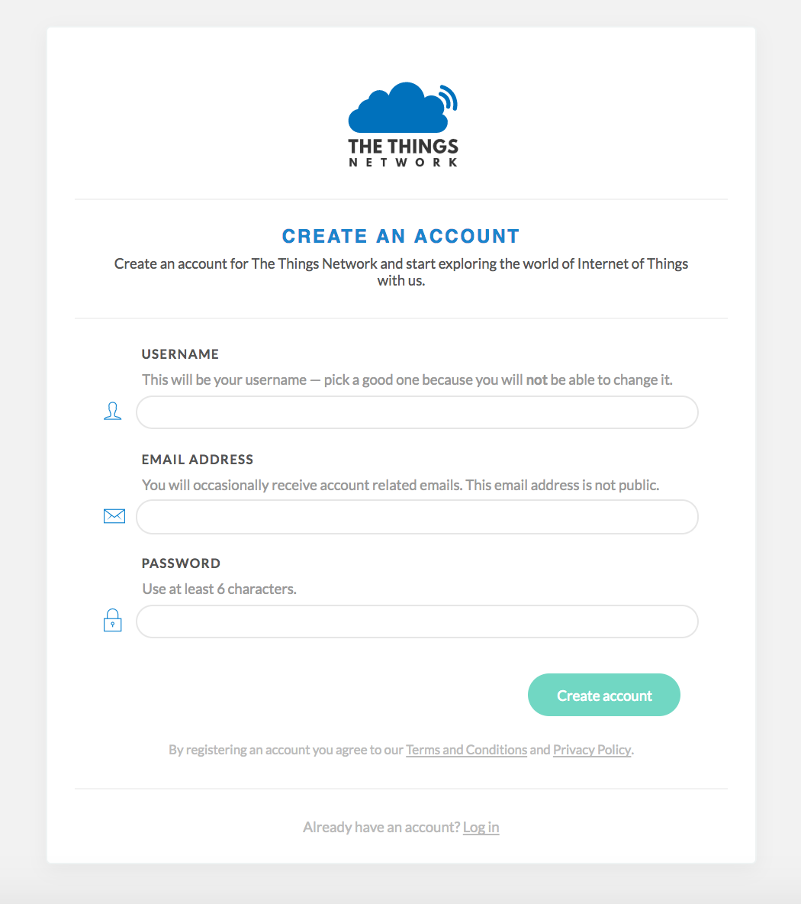
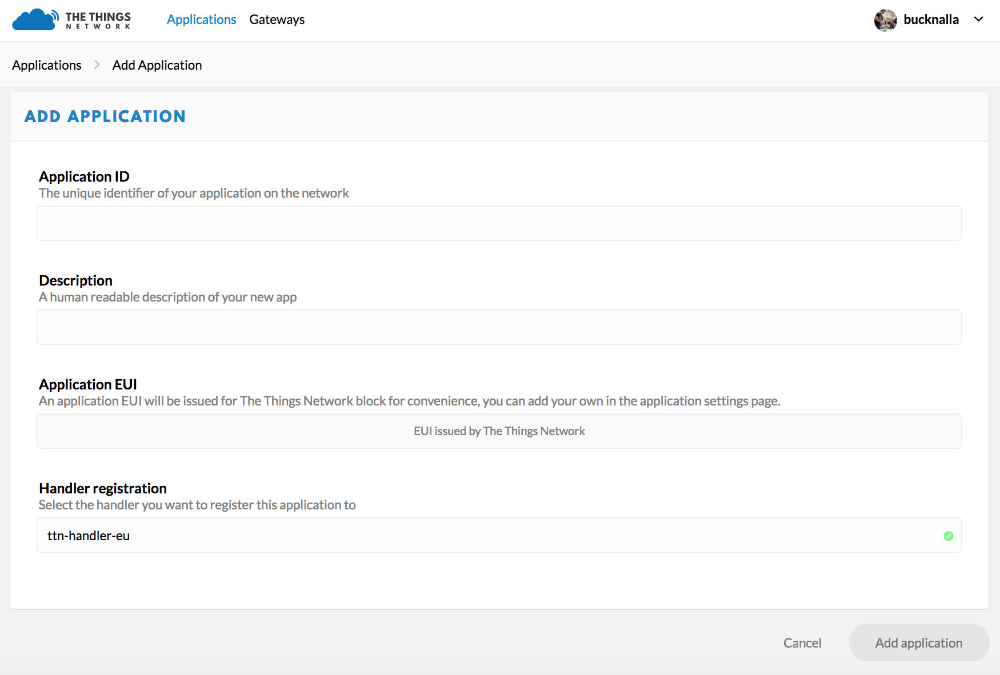

# Práctica 7. LoRA

## Objetivos


Los objetivos didácticos de esta práctica son:

* Introducir conceptos básicos de programación usando el entorno MicroPython

* Experimentar con el protocolo LoRa sobre placas reales (Pycom LoPy4).

* Desarrollar ejemplos reales de topologías punto-a-punto, en estrella y en
  malla usando tecnología LoRa.

## Introducción al entorno de desarrollo LoRa

### Pycom LoPy4

La placa Pycom LoPy4 es una placa de desarrollo con soporte para múltiples
tecnologías de red (WiFi, BLE, LoRa y Sigfox), que equipa un SoC Espressif
ESP32, 4 MBytes de memoria RAM, 8 MBytes de memoria flash externa, aceleración
hardware para cómputo en punto flotante y soporte para desarrollo usando el
*framework* MicroPython. Además, integra interfaces UART (2), SPI, I2C (2), I2S
y soporte para tarjetas microSD, junto con 24 pines GPIO. Según sus
especificaciones, puede soportar rangos de transmisión de hasta 40 kilómetros
(para comunicación nodo a nodo) o 22 kilómetros (funcionando en modo *gateway*),
en este caso con soporte de hasta 100 nodos conectados.

!!! note "Tarea"
	Como parte de la práctica, se te proporciona un entorno *hardware* compuesto
	por una placa LoPy4 con antena sub-GHz LoRa y una placa de expansión
	(*Expansion Board 3.0*) con conexión microUSB, que permitirá la programación
	de la primera. Investiga en la página del fabricante las características de
	ambos elementos y comprueba que las conexiones de antena son correctas.
	Sigue las instrucciones del fabricante para actualizar el *firmware* de la
	placa, en función del sistema operativo con el que vayas a trabajar
	([firmwaretool](https://docs.pycom.io/gettingstarted/installation/firmwaretool)).

### Micropython

[Micropython](https://micropython.org) es una implementación de la versión 3.5
del lenguaje de programación Python, reducida y adaptada específicamente para su
correcta ejecución en microcontroladores con recursos limitados. A cambio de una
huella en memoria mayor, permite un desarrollo y prototipado mucho más rápido
que lenguajes de menor nivel (por ejemplo, C).  Como dato, a día de hoy, sus
requisitos básicos incluyen 256Kb de memoria ROM y 16Kb de RAM. 

MicroPython implementa un sistema de ficheros mínimo directamente en la memoria
*flash* de la placa en la que se ejecuta, siempre que ésta disponga de más de
1Mb de almacenamiento. En este sistema de ficheros, existen dos archivos con un
papel especial: *boot.py* y *main.py*. Estos dos ficheros se ejecutan, en este
orden, en el arranque del sistema, por lo que deberán contener las partes
principales de los programas que deseemos ejecutar tras el inicio de la placa.
*boot.py* contiene típicamente parámetros generales de configuración (por
ejemplo, redes WiFi a las que conectar en el arranque), mientras que main.py
suele contener la lógica principal del programa.

### Entorno de desarrollo

!!! note "Tarea"
	Instala, en tu sistema operativo, el editor Atom y el plugin Pymakr tal y
	como se muestra en la página del fabricante
	[pymark](https://docs.pycom.io/gettingstarted/installation/pymakr).


#### Creación de un proyecto en Pymark

* En primer lugar, crea un directorio nuevo y vacío en tu sistema. Por ejemplo,
  podemos crear un directorio llamado *MiProyecto*.

* Ejecuta el editor *Atom* y abre el directorio (*Open Folder*).

* Necesitaremos crear una jerarquía para nuestro proyecto. Típicamente, 
la jerarquía de un proyecto sigue el siguiente esquema:

```text
MiProyecto
|-lib
  |-biblioteca.py
|boot.py
|main.py
```

En este primer ejemplo, simplemente utilizaremos un fichero *main.py*.
Adicionalmente, crearemos un fichero de configuración para nuestro proyecto a
través del botón *Settings->Project Settings* del panel de Pymakr. Nos
aseguraremos de la existencia de un fichero llamado *pymakr.conf*.  Para más
información sobre el contenido de este fichero, consulta
[pymakr/settings](https://docs.pycom.io/pymakr/settings) en la raíz de nuestro
proyecto.

#### Controlando el LED de nuestra placa

Añadiremos a nuestro fichero principal (*main.py*) la lógica para controlar
un LED de nuestra placa. Para ello, añadiremos, en primer lugar, las bibliotecas
a importar:

```python
import pycom
import time
```

La primera de las bibliotecas añade la funcionalidad necesaria para controlar
específicamente ciertas funcionalidades de las placas Pycom. La segunda nos
ayudará a fijar temporizadores.

!!! note "Tarea"
	Habrás observado que, al arrancar la placa Pycom, el LED de la placa
	parpadea de forma regular. Para desactivar este parpadeo, puedes utilizar la
	sentencia *pycom.heartbeat(False)*.

	Añade esta sentencia a tu código y ejecútalo (*Run*) para coprobar que
	tu placa puede ejecutar tus códigos.


!!! note "Tarea"
	Una vez comprobada la funcionalidad del botón *Run*, modifica el código
	para que el LED cambie de color (R-G-B) cada segundo. Encontrarás la
	documentación necesaria en la página de documentación de Pycom.

El uso del botón *Run* es intuitivo y muy útil en el desarrollo, pero no es
adecuado en despliegues, ya que, como puedes observar, el código desarrollado no
se almacena en la placa, y por tanto se pierde en el reinicio.  Para salvar esta
limitación, experimenta con el botón *Upload* y observa cómo tu código sigue
ejecutándose tras un reinicio.

#### REPL

REPL (*Read Evaluate Print Loop*) es el nombre que recibe la línea de órdenes
interactivas ofrecida por las placas Pycom (y otras muchas compatibles con
MicroPython). REPL proporciona historial de comandos, completado de comandos
(usando la tecla *Tab*), ejecución y parada de código (usando *Ctrl-C*)
y otras funcionalidades que facilitan el desarrollo sobremanera.

Existe un conjunto de atajos que pueden resultar de interés a la hora de 
interactuar con la placa. Entre ellos:

* **Ctrl-A** Entra en modo *raw*: permite pegar y copiar código, sin
  realizar un *echo* de cada línea introducida.

* **Ctrl-B** Pasa RAPL a modo normal.

* **Ctrl-C** Cancela cualquier entrada o interrumpe el código que se está
  ejecutando.

* **Ctrl-D** Realiza un *soft-reset* de la placa.
* **Ctrl-E** Entra en modo *paste*, lo que permite copiar y pegar fragmentos
  de texto. Para salir de este modo es necesario utilizar el atajo *Ctrl-D*.

* **Ctrl-F** Realiza un arranque seguro del dispositivo; en otras palabras, no
  ejecuta los scripts *boot.py* ni *main.py* en el momento del arranque.

## Infraestructura LoRa a desarrollar

### Conexión a red WiFi

Todas las placas Pycom soportan WiFi, por lo que es trivial realizar una
conexión a este tipo de red. En primer lugar, inicializamos el módulo WLAN y
construimos un objeto para interactuar con este tipo de conexión:

```python
from network import WLAN
wlan = WLAN() 
wlan.mode() # Chequeamos el modo - Por defecto WLAN.AP (punto de acceso).
```

Para conectar a un punto de acceso, en primer lugar deberemos configurar nuestra
placa como *station* en lugar de *access point* (modo por defecto):

```python
from network import WLAN
wlan = WLAN(mode=WLAN.STA) # Modo station.
```
Y a continuación podemos, sin más, conectar a un SSID existente:

```python
nets = wlan.scan()
for net in nets:
    if net.ssid == 'SSID':
        print('Red encontrada!')
        wlan.connect(net.ssid, auth=(net.sec, 'clave'), timeout=5000)
        while not wlan.isconnected():
            machine.idle() # Ahorro de energia mientras esperamos.
        print('WLAN: conexion establecida!')
        break
```

Si necesitamos asignar una IP estática a nuestra placa en el proceso de
arranque, podemos hacerlo en el fichero *boot.py*:

```python
import machine
from network import WLAN
wlan = WLAN() # get current object, without changing the mode

if machine.reset_cause() != machine.SOFT_RESET:
    wlan.init(mode=WLAN.STA)
    # Esta configuracion debe coincidir con la del router.
    wlan.ifconfig(config=('192.168.178.107', '255.255.255.0', '192.168.178.1', '8.8.8.8'))

if not wlan.isconnected():
    wlan.connect('SSID', auth=(WLAN.WPA2, 'clave'), timeout=5000)
    while not wlan.isconnected():
        machine.idle() 
```

!!! note "Tarea"
	Conecta tu placa a un punto de acceso creado en tu Ci40 con y sin seguridad
	WiFi. Experimenta asignando una IP estática a la placa.

!!! note "Tarea"
	Investiga cómo conseguir que tu placa sea capaz de almacenar una lista de
	redes inalámbricas a las que potencialmente conectar, y realice un proceso
	de intento de conexión a cada una de ellas en el momento del arranque, hasta
	llegar a conectar con una de ellas.

### LoRaMAC

#### Comunicación punto-a-punto

En esta primera parte de la práctica, utilizaremos la interfaz LoRa directamente
(*raw mode*), por lo que se ignora la capa LoRaWAN para enviar y recibir
datos. De este modo, los datos son enviados en crudo, sin formato ni
encriptación posible, y no se añade ningún tipo de direccionamiento a nivel de
enlace en los *frames* enviados.

En este ejemplo, utilizaremos dos placas LoPy. El script a desarrollar se basa
en un bucle infinito (*while*) con un tiempo de espera variable (y
aleatorio) entre envíos para minimizar las posibilidades de transmisión
simultánea entre dos o más dispositivos. El siguiente código realiza envíos y
recepciones del modo descrito:


```python
from network import LoRa
import socket
import machine
import time

# initialise LoRa in LORA mode
# Please pick the region that matches where you are using the device:
# Asia = LoRa.AS923
# Australia = LoRa.AU915
# Europe = LoRa.EU868
# United States = LoRa.US915
# more params can also be given, like frequency, tx power and spreading factor
lora = LoRa(mode=LoRa.LORA, region=LoRa.EU868)

# create a raw LoRa socket
s = socket.socket(socket.AF_LORA, socket.SOCK_RAW)

while True:
    # send some data
    s.setblocking(True)
    s.send('Hello')

    # get any data received...
    s.setblocking(False)
    data = s.recv(64)
    print(data)

    # wait a random amount of time
    time.sleep(machine.rng() & 0x0F)
```

!!! note "Tarea"
	Modifica el programa anterior para que cada LoPy cambie el estado de
	iluminación de su LED en el momento en el que reciba cada *frame*.  El
	resultado debería iluminar/apagar alternativamente dicho LED con la
	recepción de cada dato. 

!!! note "Tarea"
	Estudia la documentación del módulo LoRa en
	[https://docs.pycom.io/firmwareapi/pycom/network/lora](https://docs.pycom.io/firmwareapi/pycom/network/lora),
	especialmente los parámetros de inicialización/construcción del módulo.
	Experimenta, en tu placa, variando cada uno de los valores configurables
	(por ejemplo, *frequency*, *tx\_power*, *bandwidth*, *spreading factor*,
	*preamble* y *coding rate*. Describe (y entrega) una descripción sobre su
	impacto en la transmisión, así como (si te es posible) su impacto en la
	velocidad de transmisión o distancia máxima de transferencia.

#### Comunicación *gateway* - nodo

El ejemplo que se muestra a continuación propone una topología en la que un
*gateway* o elemento central recibe datos crudos LoRa desde uno o más nodos
LoRa. El código, en este caso, es distinto en función del elemento de la
topología que estemos tratando. 

El *gateway*, en nuestro caso, realizará una escucha pasiva a la espera de la
recepción de un paquete por parte de los nodos. Observa que el formato del
paquete recibido (y acuse de recibo --ACK-- enviado en respuesta) está definido
al inicio del propio script, y debe coincidir con el formato esperado en los
nodos:


```python
import socket
import struct
from network import LoRa

# A basic package header, B: 1 byte for the deviceId, B: 1 byte for the pkg size, %ds: Formatted string for string
_LORA_PKG_FORMAT = "!BB%ds"
# A basic ack package, B: 1 byte for the deviceId, B: 1 byte for the pkg size, B: 1 byte for the Ok (200) or error messages
_LORA_PKG_ACK_FORMAT = "BBB"

# Open a LoRa Socket, use rx_iq to avoid listening to our own messages
# Please pick the region that matches where you are using the device:
# Asia = LoRa.AS923
# Australia = LoRa.AU915
# Europe = LoRa.EU868
# United States = LoRa.US915
lora = LoRa(mode=LoRa.LORA, rx_iq=True, region=LoRa.EU868)
lora_sock = socket.socket(socket.AF_LORA, socket.SOCK_RAW)
lora_sock.setblocking(False)

while (True):
    recv_pkg = lora_sock.recv(512)
    if (len(recv_pkg) > 2):
        recv_pkg_len = recv_pkg[1]

        device_id, pkg_len, msg = struct.unpack(_LORA_PKG_FORMAT % recv_pkg_len, recv_pkg)

# If the uart = machine.UART(0, 115200) and os.dupterm(uart) are set in the boot.py this print should appear in the serial port
        print('Device: %d - Pkg:  %s' % (device_id, msg))

        ack_pkg = struct.pack(_LORA_PKG_ACK_FORMAT, device_id, 1, 200)
        lora_sock.send(ack_pkg)
```

Observa como *\_LORA\_PKG\_FORMAT* se utiliza como un mecanismo para identificar
los distintos dispositivos existentes en la red. Por su parte,
*\_LORA\_PKG\_ACK\_FORMAT* es un mecanismo de acuse de recibo sencillo para
responder al nodo que envió el paquete.

Por otra parte, el código del nodo se reduce al envío de paquetes y a la espera
activa a sus respectivos acuses de recibo:

```python
import os
import socket
import time
import struct
from network import LoRa

# A basic package header, B: 1 byte for the deviceId, B: 1 byte for the pkg size
_LORA_PKG_FORMAT = "BB%ds"
_LORA_PKG_ACK_FORMAT = "BBB"
DEVICE_ID = 0x01


# Open a Lora Socket, use tx_iq to avoid listening to our own messages
# Please pick the region that matches where you are using the device:
# Asia = LoRa.AS923
# Australia = LoRa.AU915
# Europe = LoRa.EU868
# United States = LoRa.US915
lora = LoRa(mode=LoRa.LORA, tx_iq=True, region=LoRa.EU868)
lora_sock = socket.socket(socket.AF_LORA, socket.SOCK_RAW)
lora_sock.setblocking(False)

while(True):
    # Package send containing a simple string
    msg = "Device 1 Here"
    pkg = struct.pack(_LORA_PKG_FORMAT % len(msg), DEVICE_ID, len(msg), msg)
    lora_sock.send(pkg)

    # Wait for the response from the gateway. NOTE: For this demo the device does an infinite loop for while waiting the response. Introduce a max_time_waiting for you application
    waiting_ack = True
    while(waiting_ack):
        recv_ack = lora_sock.recv(256)

        if (len(recv_ack) > 0):
            device_id, pkg_len, ack = struct.unpack(_LORA_PKG_ACK_FORMAT, recv_ack)
            if (device_id == DEVICE_ID):
                if (ack == 200):
                    waiting_ack = False
                    # If the uart = machine.UART(0, 115200) and os.dupterm(uart) are set in the boot.py this print should appear in the serial port
                    print("ACK")
                else:
                    waiting_ack = False
                    # If the uart = machine.UART(0, 115200) and os.dupterm(uart) are set in the boot.py this print should appear in the serial port
                    print("Message Failed")

    time.sleep(5)
```

!!! note "Tarea"
	Adapta el código anterior a algún escenario real, por ejemplo:

	* Fija un tiempo máximo de espera para la recepción de acuse de recibo y el reenvío del paquete (o para descartarlo).

	* Incrementa el tamaño de paquete modificando *\_LORA\_PKG\_FORMAT* a
	  *BH\%ds*; el carácter *H* permite usar
	  2 bytes para el tamaño (véase
	  [https://docs.python.org/2/library/struct.html\#format-characters](https://docs.python.org/2/library/struct.html\#format-characters) para
	  más información).

	* Reduce el tamaño de mensaje y adáptalo a un escenario real de tu elección.

### LoRaWAN. Topología en estrella. Implementación de un Gateway LoRaWAN

En esta sección trabajaremos en el desarrollo de un *gateway* implementado en
una LoPy utilizando MicroPython. Este tipo de ejemplo permite conectar a una red
LoRaWAN existente (por ejemplo, *The Things Network* --elegida en nuestro caso--
o *Loriot*), haciendo que nuestro *gateway* simplemente actúe como *forwarder*
de paquetes recibidos desde nodos hacia un servidor remoto. 

El código del *gateway* está dividido en tres scripts diferenciados: *main.py*,
*config.py* y *nanogateway.py*. Conjuntamente, su funcionalidad es configurar el
*gateway* para realizar una conexión a una red preferida (WLAN) y para actuar
como *packet forwarder* hacia un servidor.

#### Obtención del *Gateway ID*

La mayoría de servidores LoRaWAN esperan un identificador de *gateway* (*
ateway ID*) en forma de número hexadecimal de 64 bits, típicamente nombrado
como *EUI-64*). La práctica recomendada consiste, durante el desarrollo del
*gateway*, en obtener este ID a partir de una expansión de la MAC WiFi de la
placa (que es un valor de 48 bits). Podemos obtener este identificador usando el
siguiente código: 

```python
from network import WLAN
import ubinascii
wl = WLAN()
ubinascii.hexlify(wl.mac())[:6] + 'FFFE' + ubinascii.hexlify(wl.mac())[6:]
```

El resultado será algo similar a *b'240ac4FFFE008d88'*, donde *40ac4FFFE008d88*
sería nuestro identificador de *gateway*, que usaremos en la configuración del
servidor LoRa para identificar de forma unívoca a nuestro dispositivo.

#### El fichero *main.py*

Este fichero, como se ha dicho anteriormente, se ejecuta al inicio e importa, en
primer lugar, el script de configuración *config.py* para inicializar el
*gateway*. Una vez configurado, se arranca la lógica del *gateway*. 

```python
""" LoPy LoRaWAN Nano Gateway example usage """

import config
from nanogateway import NanoGateway

if __name__ == '__main__':
    nanogw = NanoGateway(
        id=config.GATEWAY_ID,
        frequency=config.LORA_FREQUENCY,
        datarate=config.LORA_GW_DR,
        ssid=config.WIFI_SSID,
        password=config.WIFI_PASS,
        server=config.SERVER,
        port=config.PORT,
        ntp_server=config.NTP,
        ntp_period=config.NTP_PERIOD_S
        )

    nanogw.start()
    nanogw._log('You may now press ENTER to enter the REPL')
    input()
```

#### El fichero *config.py*

El fichero de configuración *config.py* contiene parámetros generales de
configuración para el servidor y la red LoRa a la que deseamos conectar nuestro
dispositivo. En función de la región y el proveedor (*TTN, Loriot, etc.*), estos
parámetros variarán, por lo que será necesario adaptar estos valores en función
de nuestra configuración. El siguiente ejemplo muestra la configuración
necesaria para la conexión a *The Things Network (TTN)* en región europea (868
Mhz). Obsérvese cómo se obtiene un *Gateway ID* como se ha indicado
anteriormente, y cómo es necesario adaptar tanto el SSID como la contraseña para
autenticación en nuestra red WiFi de forma acorde:

```python
""" LoPy LoRaWAN Nano Gateway configuration options """

import machine
import ubinascii

WIFI_MAC = ubinascii.hexlify(machine.unique_id()).upper()
# Set  the Gateway ID to be the first 3 bytes of MAC address + 'FFFE' + last 3 bytes of MAC address
GATEWAY_ID = WIFI_MAC[:6] + "FFFE" + WIFI_MAC[6:12]

SERVER = 'router.eu.thethings.network'
PORT = 1700

NTP = "pool.ntp.org"
NTP_PERIOD_S = 3600

WIFI_SSID = 'my-wifi'
WIFI_PASS = 'my-wifi-password'

# for EU868
LORA_FREQUENCY = 868100000
LORA_GW_DR = "SF7BW125" # DR_5
LORA_NODE_DR = 5

# for US915
# LORA_FREQUENCY = 903900000
# LORA_GW_DR = "SF7BW125" # DR_3
# LORA_NODE_DR = 3
```

#### El fichero/bilioteca *nanogateway.py*

La biblioteca *nanogateway.py* implementa la lógica de recepción, generación y
reenvío de paquetes de datos LoRa. No requiere ninguna configuración y se
muestra en el apéndice de este boletín a modo de referencia. Se sugiere que el
estudiante observe e intente enteder su fucionamiento y funcionalidad ofrecida.

#### Registro en el servidor LoRaWAN (*The Things Network -- TTN*)

Para configurar nuestro *gateway* en TTN, navegaremos a su página web y
crearemos una nueva cuenta, introduciendo un nombre de usuario, contraseña y
dirección de correo que nos permitirá validar dicha información, como se muestra
en la Figura: 



Con la cuenta ya creada, podemos proceder con el
registro del *gateway* desde la consola TTN.

#### Registro del *gateway* en (*The Things Network -- TTN*)

En la consola TTN existen dos opciones: *applications* y *gateways*,
como muestra la Figura:


Selecciona la opción *gateways* y, dentro de ella, *Register Gateway*.
Esto permitirá registrar un nuevo *gateway*.

En esta opción, configuraremos los parámetros que se muestran en la
siguiente tabla:

| *Opción*       | *Valor*                                                                    |
|----------------|----------------------------------------------------------------------------|
| Protocolo      | Packet Forwarder                                                           |
| Gateway EUI    | Definido por el usuario (debe coincidir con el obtenido en *config.py*)    |
| Description    | Definido por el usuario                                                    |
| Frequency Plan | Spain/EU 868 Mhz                                                           |
| Location       | Definido por el usuario                                                    |
| Antena         | Indoor o outdoor                                                           |


Una vez configurado, registramos el *gateway* con el botón *Register Gateway*;
una vez registrado, navega a la opción *Gateway Settiings* y selecciona una
dirección de router que coincida con la usada en la configuración del mismo (en
este caso, *router.eu.thethings.network*, véase la siguiente Figura).


En este punto, si todo ha ido bien, el *gateway* debería estar configurado y
registrado en TTN. Pasamos a continuación a la *configuración de los nodos
LoRa*.

#### Configuración del nodo LoRaWAN

Existen dos métodos para conectar dispositivos LoPy a nuestro *gateway*: OTAA
(*Over The Air Activation*) y ABP (*Activation By Personalization*), cuyas
instrucciones de confguración se muestran en las siguientes secciones.

#### Configuración del nodo vía OTAA (*Over The Air Activation*)

Si nuestro nodo LoPy conecta una aplicación (a través de TTN) usando OTAA, la
configuración de red se extrae usando un protocolo de *handshake* entre la
LoPy y el servidor de red. Obsérvese como las claves de red derivadas usando
OTAA son específicas para el dispositivo y se utilizan para encriptar y
verificar las transmisiones a nivel de red:

```python
""" OTAA Node example compatible with the LoPy Nano Gateway """

from network import LoRa
import socket
import ubinascii
import struct
import time

# Initialize LoRa in LORAWAN mode.
lora = LoRa(mode=LoRa.LORAWAN)

# create an OTA authentication params
dev_eui = ubinascii.unhexlify('AABBCCDDEEFF7778') # these settings can be found from TTN
app_eui = ubinascii.unhexlify('70B3D57EF0003BFD') # these settings can be found from TTN
app_key = ubinascii.unhexlify('36AB7625FE77776881683B495300FFD6') # these settings can be found from TTN

# set the 3 default channels to the same frequency (must be before sending the OTAA join request)
lora.add_channel(0, frequency=868100000, dr_min=0, dr_max=5)
lora.add_channel(1, frequency=868100000, dr_min=0, dr_max=5)
lora.add_channel(2, frequency=868100000, dr_min=0, dr_max=5)

# join a network using OTAA
lora.join(activation=LoRa.OTAA, auth=(dev_eui, app_eui, app_key), timeout=0)

# wait until the module has joined the network
while not lora.has_joined():
    time.sleep(2.5)
    print('Not joined yet...')

# remove all the non-default channels
for i in range(3, 16):
    lora.remove_channel(i)

# create a LoRa socket
s = socket.socket(socket.AF_LORA, socket.SOCK_RAW)

# set the LoRaWAN data rate
s.setsockopt(socket.SOL_LORA, socket.SO_DR, 5)

# make the socket non-blocking
s.setblocking(False)

time.sleep(5.0)

""" Your own code can be written below! """

for i in range (200):
    s.send(b'PKT #' + bytes([i]))
    time.sleep(4)
    rx = s.recv(256)
    if rx:
        print(rx)
    time.sleep(6)
```

#### Configuración del nodo vía ABP (*Activation By Personalization*)

Si se escoge el modo de unión a la red ABP, se requiere que el usuario defina
los siguietnes valores, que deben definirse en el *firmware* y especificarse en
TTN:

* Dirección del dispositivo.
* Clave de sesión de aplicación (*Application Session Key*).
* Clave de sesión de red (*Network Session Key*).

El siguiente código muestra un ejemplo de configuración de nodo usando ABP:

```python
""" ABP Node example compatible with the LoPy Nano Gateway """

from network import LoRa
import socket
import ubinascii
import struct
import time

# Initialise LoRa in LORAWAN mode.
lora = LoRa(mode=LoRa.LORAWAN)

# create an ABP authentication params
dev_addr = struct.unpack(">l", ubinascii.unhexlify('2601147D'))[0] # these settings can be found from TTN
nwk_swkey = ubinascii.unhexlify('3C74F4F40CAE2221303BC24284FCF3AF') # these settings can be found from TTN
app_swkey = ubinascii.unhexlify('0FFA7072CC6FF69A102A0F39BEB0880F') # these settings can be found from TTN

# join a network using ABP (Activation By Personalisation)
lora.join(activation=LoRa.ABP, auth=(dev_addr, nwk_swkey, app_swkey))

# remove all the non-default channels
for i in range(3, 16):
    lora.remove_channel(i)

# set the 3 default channels to the same frequency
lora.add_channel(0, frequency=868100000, dr_min=0, dr_max=5)
lora.add_channel(1, frequency=868100000, dr_min=0, dr_max=5)
lora.add_channel(2, frequency=868100000, dr_min=0, dr_max=5)

# create a LoRa socket
s = socket.socket(socket.AF_LORA, socket.SOCK_RAW)

# set the LoRaWAN data rate
s.setsockopt(socket.SOL_LORA, socket.SO_DR, 5)

# make the socket non-blocking
s.setblocking(False)

""" Your own code can be written below! """

for i in range (200):
    s.send(b'PKT #' + bytes([i]))
    time.sleep(4)
    rx = s.recv(256)
    if rx:
        print(rx)
    time.sleep(6)
```

#### Aplicaciones TTN

Cno los nodos y *gateways* ya configurados, podemos proceder al desarrollo de
una *aplicación* en TTN (esto es, el procesamiento que sufren los datos LoRa
una vez recibidos por parte de TTN). Aunque existen multitud de configuraciones
disponibles, nosotros trabajaremos con una integración de nuestra aplicación con
peticiones HTTP de salida.

#### Registro de una nueva aplicación

Seleccionando la pestaña *Applications* en la consola TTN, aparecerá una
pantalla para el registro de aplicaciones. Al clicar en *Register* aparecerá
una nueva ventana como la mostrada en la siguiente Figura.



Introduce en el formulario un ID de aplicación único y un descriptor y manejador.

#### Registro de dispositivos

Para conectar nodos al *gateway*, los dispositivos deben añadirse a la propia
aplicación. Para ello, navega a la pestaña *Devices* en la página *Application*
y pulsa el botón *Register Device*. En el panel que aparecerá, completa los
campos *Device ID* y *Device EUI*; el primero es seleccionado por el usuario y
es única para cada dispositivo en esta aplicación; el segundo también es
seleccionable por el usuario y debe consistir en un valor de 8 bytes, dados en
hexadecimal.  Una vez añadido, modifica el método de activación (*Activation
Method*) y selecciona *OTAA* o *ABP*, en función de tu código del nodo (pestaña
*Settings*). 

#### Integración con aplicaciones/servicios externos

En este punto, los datos deberían estar siendo recibidos por el *backend* TTN.
Podemos indicar a TTN cómo reenviar estos datos a un servicio externo. Para
ello, utilizaremos la pestaña *Integrations* dentro de las preferencias de la
nueva aplicación. Añadiremos una nueva integración de tipo HTTP, en la que,
entre otros valores, deberemos indicar la URL destino de nuestros envíos, el
método de envío (por ejemplo, POST) y en caso de ser necesaria, información
sobre autenticación. TTN reenviará los datos recibidos al servidor indicado tan
pronto como nuestros nodos LoPy comiencen a enviar datos.

!!! note "Tarea"
	Sigue los pasos anteriormente descritos para configurar un *gateway*
	LoRaWAN, registrándolo en TTN, y para la configuración de al menos uno nodo
	LoRa que, a través del *gateway* configurado, envíe datos a TTN.


### LoRaMESH. Topología en malla

La implementación de topologías en malla proporcionada por Pycom se basa en la
especificación [OpenThread](https://openthread.io/guides/thread-primer).

!!! note "Tarea"
	Infórmate sobre OpenThread, especialmente sobre los términos que maneja y
	funcionalidad general. Los siguientes enlaces son especialmente
	interesantes:

	* [Thread](https://openthread.io/guides/thread-primer).

	* [Nodos: tipos y roles](https://openthread.io/guides/thread-primer/node-roles-and-types).

	* [Direccionamiento IPv6](https://openthread.io/guides/thread-primer/ipv6-addressing),
	  especialmente direccionamiento unicast RLOC.


El siguiente ejemplo ilustra alguna de las funcionalidades básicas de LoRaMESH,
incluyendo:

* Configuración de una red LoRaMESH.
* Descubrimiento de vecinos.
* Envío de PINGs a nodos vecinos.
* Apertura de un socket UDP para:
	* Escuchar paquetes UDP entrantes, con envío de ACK de vuelta.
	* Envío de paquetes a todos los vecinos.
* Activación del LED de la placa al ercibir paquetes o pings.

Nótese que, a día de hoy, LoRaMESH soporta únicamente las operaciones *close*,
*bind*, *sendto* y *recvfrom*.

```python
from network import LoRa
import socket
import time
import utime
import ubinascii
import pycom
import machine

from loramesh import Loramesh

lora = LoRa(mode=LoRa.LORA, region=LoRa.EU868, bandwidth=LoRa.BW_125KHZ, sf=7)
MAC = str(ubinascii.hexlify(lora.mac()))[2:-1]
print("LoRa MAC: %s"%MAC)

mesh = Loramesh(lora)

# waiting until it connected to Mesh network and
# it has some valid neighbors
while True:
    mesh.led_state()
    print("%d: State %s, single %s"%(time.time(), mesh.cli('state'), mesh.cli('singleton')))
    time.sleep(2)
    if not mesh.is_connected():
        continue

    neigbors = mesh.neighbors_ip()
    if len(neigbors) == 0:
        print('No neighbor')
        continue

    print('Neighbors found: %s'%neigbors)
    break

# create UDP socket
s = socket.socket(socket.AF_LORA, socket.SOCK_RAW)
myport = 1234
s.bind(myport)
pack_num = 1
msg = "Hello World! MAC: " + MAC + ", pack: "
ip = mesh.ip()

while True:
    mesh.led_state()
    print("%d: State %s, single %s, IP %s"%(time.time(), mesh.cli('state'), mesh.cli('singleton'), mesh.ip()))

    # check if topology changes, maybe RLOC IPv6 changed
    new_ip = mesh.ip()
    if ip != new_ip:
        print("IP changed from: %s to %s"%(ip, new_ip))
        ip = new_ip

    # listen for incomming packets
    rcv_data, rcv_addr = s.recvfrom(128)
    if len(rcv_data)>0:
        rcv_ip = rcv_addr[0]
        rcv_port = rcv_addr[1]
        print('Incomming %d bytes from %s (port %d)'%(len(rcv_data), rcv_ip, rcv_port))
        print(rcv_data)
        # could send some ACK pack:
        if rcv_data.startswith("Hello"):
            try:
                s.sendto('ACK ' + MAC + ' ' + str(rcv_data)[2:-1], (rcv_ip, rcv_port))
            except Exception:
                pass
        mesh.blink(7, .3)
        continue

    # update neighbors list
    neigbors = mesh.neighbors_ip()
    print("%d Neighbors %s"%(len(neigbors), neigbors))

    # send PING and UDP packets to all neighbors
    for neighbor in neigbors:
        if mesh.ping(neighbor) > 0:
            print('Ping OK from neighbor %s'%neighbor)
            mesh.blink(10, .1)
        else:
            print('Ping not received from neighbor %s'%neighbor)

        time.sleep(10)

        pack_num = pack_num + 1
        try:
            s.sendto(msg + str(pack_num), (neighbor, myport))
            print('Sent message to %s'%(neighbor))
        except Exception:
            pass
        time.sleep(20 + machine.rng()%20)

    # random sleep time
    time.sleep(30 + machine.rng()%30)
```

!!! note "Tarea"
	Configura tu LoPy con el código anterior, y observa la comunicación
	bidireccional con todos los nodos que forman parte de la malla (en este
	caso, los nodos de tus compañeros).

