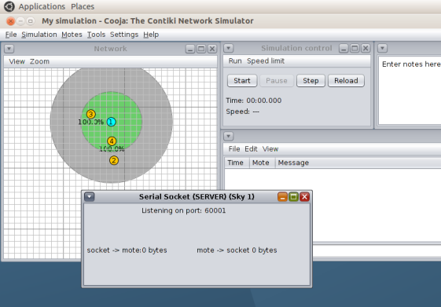

# Práctica 7. 6LowPAN con simulador Cooja

!!! note "Nota"
	Esta práctica es opcional para aquellos que opten a evaluación por proyecto
	y obligatoria para los que se evaluen por prácticas. Las tareas aquí
	descritas son por tanto obligatorias para los que se presentan por
	prácticas, los que vayan por proyecto no tienen qué hacerlas.

## Introducción y objetivos

Los routers de borde son enrutadores que pueden encontrarse en el borde de una
red, encaminando el tráfico de dicha red hacia una segunda red externa. Su
función, en definitiva, es conectar una red con otra.

En esta práctica, veremos cómo construir una simulación utilizando un router de
borde en Contiki. Más concretamente, veremos cómo un router de borde Contiki
puede utilizarse para enrutar tráfico entre una red RPL (una red de sensores
Contiki con protocolo de enrutamiento RPL sobre IPv6) y una red IPv4 externa,
siguiendo el siguiente diagrama:


El objetivo de la práctica es ofrecer una visión general sobre cómo desplegar
tanto una red RPL con Contiki en el simulador Cooja, así como conseguir hacerla
interactuar con una segunda red externa real utilizando la herramienta
`tunslip`.

!!! danger "Tarea"
	Escribe un informe en el que describas cada una de las tareas propuestas, su
	desarrollo y los resultados obeservados, así como tus observaciones o
	comentarios personales.

## Instalación de requisitos software

!!! note "Nota"
	Si utilizas la máquina virtual proporcionada por los profesores de RPI es
	posible que contiki y cooja ya estén instalados y por tanto puedas saltarte
	este paso. Compruébalo.

La instalación básica de Contiki (en su versión 2.7) se encuentra en el
directorio `/home/ubuntu/contiki` de tu máquina virtual.

Antes de comenzar, necesitarás instalar una serie de software de soporte para el
correcto desarrollo de la práctica:

```sh
sudo apt install -y openjdk-8-jdk openjdk-8-jre
```

A continuación, asegúrate de seleccionar la versión 8 de Java para un correcto
funcionamiento del proceso de compilación de Cooja:

```sh
ubuntu@ubuntu2004:~/contiki/tools/cooja$ sudo update-alternatives --config java
Existen 3 opciones para la alternativa java (que provee /usr/bin/java).

  Selección   Ruta                                            Prioridad  Estado
------------------------------------------------------------
  0            /usr/lib/jvm/java-14-openjdk-amd64/bin/java      1411      modo automático
  1            /usr/lib/jvm/java-11-openjdk-amd64/bin/java      1111      modo manual
  2            /usr/lib/jvm/java-14-openjdk-amd64/bin/java      1411      modo manual
* 3            /usr/lib/jvm/java-8-openjdk-amd64/jre/bin/java   1081      modo manual

Pulse <Intro> para mantener el valor por omisión [*] o pulse un número de selección: 3
```

Por último, necesitarás instalar el compilador que nos permitirá generar las
imágenes para los nodos en la simulación:

```sh
sudo apt-get install gcc-msp430 gdb-msp430
```

## Código Contiki

En el desarrollo de la práctica, utilizaremos los siguientes ficheros, 
todos situados en el directorio `examples/ipv6/rpl-border-router` de la 
instalación de Contiki:

* `border_router.c`: que contendrá la lógica de enrutamiento del router de
  borde.
* `udp-client.c` o `udp_server.c` (en el directorio `examples/ipv6/rpl-udp`):
  que actuarán como nodos en la red RPL (de momento, no es importante su
  funcionalidad, aunque como en la siguiente práctica utilizarás el cliente UDP,
  se aconseja utilizar éste).
* `slip-bridge.c`: que contiene las funciones de *callback* para procesar una
  petición de conexión SLIP.
* `httpd-simple.c`: que contiene un servidor web sencillo que nos permitirá
  consultar las tablas de enrutamiento del router de borde.

Los nodos que implementen el código `udp-client.c` o `udp-server.c` formarán un
DAG con el router de borde configurado como raíz. El router de borde recibirá el
prefijo de red vía una conexión SLIP (*Serial Line Interface Protocol*) y lo
comunicará al resto de nodos de la red RPL para que conformen sus respectivas
direcciones IPv6 globales.

Aunque no es de mayor interés de cara a la práctica, los siguientes fragmentos
de código en el router de borde establecen los puntos en los que espera a la
configuración del prefijo de red. Una vez recibido, el router de borde se
configura como la raíz del DAG y envía el prefijo al resto de nodos de la red:

```c
/* Request prefix until it has been received */ 
 while(!prefix_set) { 
   etimer_set(&et, CLOCK_SECOND); 
   request_prefix(); 
   PROCESS_WAIT_EVENT_UNTIL(etimer_expired(&et)); 
 } 


 dag = rpl_set_root(RPL_DEFAULT_INSTANCE,(uip_ip6addr_t *)dag_id); 
 if(dag != NULL) { 
   rpl_set_prefix(dag, &prefix, 64); 
   PRINTF("created a new RPL dag\n"); 
 }
```

Por defecto, el router de borde aloja una página web sencilla que nos servirá
para consultar el estado de sus tablas de enrutamiento. Esta página se mostrará
cuando introduzcamos la dirección IPv6 del router de borde en cualquier
navegador. El uso de esta página puede desactivarse a través del valor de la
macro `WEBSERVER`, y su activación en Contiki en base a su valor es sencilla
(fichero `http-simple.c`):

```c
PROCESS(border_router_process, "Border router process");
#if WEBSERVER==0
/* No webserver */
AUTOSTART_PROCESSES(&border_router_process);
#elif WEBSERVER>1
/* Use an external webserver application */
#include "webserver-nogui.h"
AUTOSTART_PROCESSES(&border_router_process,&webserver_nogui_process); 
```

## Compilación del código

El código para router de borde puede encontrarse en la ruta
`examples/ipv6/rpl-border-router`. Utiliza la siguiente orden para realizar la
compilación:

```sh
cd examples/ipv6/rpl-border-router
make TARGET=z1
```

Una vez ejecutado, se creará un fichero llamado `border-router.z1`, que se
utilizará para programar las motas (dispositivos simulados) router de borde en
el simulador Cooja.

Para demostrar la funcionalidad del router de borde, crearemos una red de nodos
con el router de borde como raíz. Para ello, utilizaremos nodos cliente UDP,
implementados en el fichero `udp-client.c`. Para ello, prepara imágenes para las
motas de la siguiente manera:

```sh
cd examples/ipv6/rpl-udp
make TARGET=z1
```

Del mismo modo que anteriormente, dispondrás de un fihcero `udp-client.z1`, que
conformarán un DAG con el router de borde como raíz y que utilizaremos en el
resto de motas de la simulación. 

## Simulación en Cooja

Tras la compilación de las imágenes, llega el momento de crear la simulación
completa en Cooja. Arranca el simulador usando la siguiente orden:

```sh
cd tools/cooja
ant run
```

Tras la ejecución, sigue los siguientes pasos para crear una nueva simulación:

1. Selecciona la opción `File->New Simulation`. Selecciona `UDGM` e introduce el
   nombre de la simulación. Presiona `Create`.
2. En el menú `Motes`, selecciona `Add New Motes->Create new motes` y seleccona
   el timp de mota `Z1`.
3. Busca la localización de la imagen de router de borde
   (`examples/ipv6/rpl-border-router`) y selecciona el fichero
   `rpl-border-router.z1`. Clica en `Create` y añade *una* mota de este tipo.
4. Repite los pasos 2 y 3 pero esta vez con la imagen del cliente o servidor UDP
   que creaste anteriormente. Añade *cuatro* o *cinco* motas de este tipo y
   distribuyelas por la simulación.


Selecciona las opciones del menú `View` como se muestra en la figura, ya que
esto te permitirá crear de forma más clara tu topología (puedes temporalmente
añadir también la dirección IP, aunque puede resultar demasiada información):


A continuación, crearemos un puente entre la red RPL simulada en Cooja y la
máquina local. Esto puede realizarse en la mota programada como router de borde.
Selecciona `Tools` y `Serial Socket (SERVER)` sobre la mota router de borde
(identíficala con su valor numérico). Obtendrás un mensaje como el de la
siguiente figura (observa que el mensaje indica *Listening on port 60001*):



A continuación, *arranca la simulación* (botón `Start`).

## La utilidad *tunslip*

Como hemos dicho, un router de borde actúa como enlace para conectar una red a
otra. En este ejemplo, el router de borde se usa para establecer ruta de datos
entre la red RPL y una red externa. Hasta ahora, sólo hemos creado la red RPL,
por lo que necesitamos simular un escenario en el que esta red RPL se conecte a
una red externa. Para ello, utilizaremos la utilidad *tunslip* proporcionada con
Contiki. En este ejemplo, *tunslip* crea un puente entre la red RPL y la máquina
local. 

El código `tunslip6.c` se encuentra en el directorio `tools` de la instalación,
y se puede compilar con la orden:

```sh
make tunslip6
```

A continuación, podemos establecer una conexión entre la red RPL y la máquina
local:

```sh
sudo ./tunslip6 -a 127.0.0.1 aaaa::1/64
```

Si la ejecución ha sido correcta, veremos una salida similar a la siguiente
en la terminal:

```sh
ubuntu@ubuntu2004:~/contiki/tools$ sudo ./tunslip6 -a 127.0.0.1 aaaa::1/64
slip connected to ``127.0.0.1:60001''
opened tun device ``/dev/tun0''
ifconfig tun0 inet `hostname` mtu 1500 up
ifconfig tun0 add aaaa::1/64
ifconfig tun0 add fe80::0:0:0:1/64
ifconfig tun0

tun0: flags=4305<UP,POINTOPOINT,RUNNING,NOARP,MULTICAST>  mtu 1500
        inet 127.0.1.1  netmask 255.255.255.255  destination 127.0.1.1
        inet6 aaaa::1  prefixlen 64  scopeid 0x0<global>
        inet6 fe80::1  prefixlen 64  scopeid 0x20<link>
        inet6 fe80::ace4:dadf:8e12:be05  prefixlen 64  scopeid 0x20<link>
        unspec 00-00-00-00-00-00-00-00-00-00-00-00-00-00-00-00  txqueuelen 500  (UNSPEC)
        RX packets 0  bytes 0 (0.0 B)
        RX errors 0  dropped 0  overruns 0  frame 0
        TX packets 0  bytes 0 (0.0 B)
        TX errors 0  dropped 0 overruns 0  carrier 0  collisions 0

*** Address:aaaa::1 => aaaa:0000:0000:0000
Got configuration message of type P
Setting prefix aaaa::
Server IPv6 addresses:
 aaaa::c30c:0:0:1
 fe80::c30c:0:0:1
```

El programa ha creado una interfaz puente `tun0` con IPv4 127.0.1.1, y ha
enviado, vía serie, un mensaje de configuración al router de borde indicando el
prefijo deseado para los nodos de la red RPL (`aaaa`). La salida de las últimas
dos líneas pertenece al router de borde, e indica cuáles son sus direcciones
IPv6 tras la recepción del prefijo.

Vuelve al simulador Cooja y observa que ha aparecido un mensaje en el que se
observa la cadena *Client connected: /127.0.0.1*.

## Verificación de resultados

Es posible verificar la dirección del router de borde a través de una orden ping
desde tu máquina virtual:

```sh
ubuntu@ubuntu2004:~/contiki/tools$ ping aaaa::c30c:0:0:1
PING aaaa::c30c:0:0:1(aaaa::c30c:0:0:1) 56 data bytes
64 bytes from aaaa::c30c:0:0:1: icmp_seq=1 ttl=64 time=21.5 ms
64 bytes from aaaa::c30c:0:0:1: icmp_seq=2 ttl=64 time=7.44 ms
64 bytes from aaaa::c30c:0:0:1: icmp_seq=3 ttl=64 time=8.57 ms
64 bytes from aaaa::c30c:0:0:1: icmp_seq=4 ttl=64 time=62.7 ms
64 bytes from aaaa::c30c:0:0:1: icmp_seq=5 ttl=64 time=15.2 ms
--- aaaa::c30c:0:0:1 ping statistics ---
5 packets transmitted, 5 received, 0% packet loss, time 4015ms
rtt min/avg/max/mdev = 7.442/23.066/62.661/20.427 ms
```

Así como la de cualquier nodo de la red, por ejemplo el nodo 4:

```sh
ubuntu@ubuntu2004:~/contiki/tools$ ping aaaa::c30c:0:0:4
PING aaaa::c30c:0:0:4(aaaa::c30c:0:0:4) 56 data bytes
64 bytes from aaaa::c30c:0:0:4: icmp_seq=1 ttl=62 time=116 ms
64 bytes from aaaa::c30c:0:0:4: icmp_seq=2 ttl=62 time=106 ms
64 bytes from aaaa::c30c:0:0:4: icmp_seq=3 ttl=62 time=108 ms
64 bytes from aaaa::c30c:0:0:4: icmp_seq=4 ttl=62 time=111 ms
64 bytes from aaaa::c30c:0:0:4: icmp_seq=5 ttl=62 time=79.0 ms
^C
--- aaaa::c30c:0:0:4 ping statistics ---
5 packets transmitted, 5 received, 0% packet loss, time 4016ms
rtt min/avg/max/mdev = 79.002/104.028/115.794/12.937 ms
```

La dirección de cada nodo puede obtenerse filtrando el la pantalla de log en
función del ID del nodo (mota) destino.

Desde cualquier navegador (en la red de la máquina virtual), puedes navegar a la
dirección IP del router de borde para observar su estado:


!!! danger "Tarea"
	Sigue los pasos descritos arriba para crear una red RPL con un número
	reducido de nodos (entre 5 y 10), conectándola a tu red local. Haz que no
	todos los nodos estén al alcance del router de borde, y comienza tu
	simulación.

	Estudia y reporta en tu informe de la práctica el tráfico RPL generado en el
	proceso de generación del DAG, y comprueba la conectividad con todos ellos
	vía `ping6`.

!!! danger "Tarea"
	Realiza una serie de movimientos sobre una mota que esté al alcance del
	router de borde, para que deje de estarlo. Con una ejecución de `ping6`
	activa sobre dicha mota, reporta el tiempo que tarda RPL en hacer converger
	de nuevo el DODAG. Documenta el proceso y tus observaciones.

!!! danger "Tarea"
	Realiza movimientos sobre los nodos, o crea nuevas motas en la simulación, y
	estudia, a través de la interfaz web del router de borde, el tiempo de
	establecimiento de nuevas rutas. Documenta el proceso y tus observaciones.

!!! danger "Tarea"
	Examina los paquetes enviados y obten de forma razonada la topología de red
	que se está usando, identificando el padre preferente de cada nodo. Para
	ello puedes averiguar a qué nodo envían el paquete DAO.
