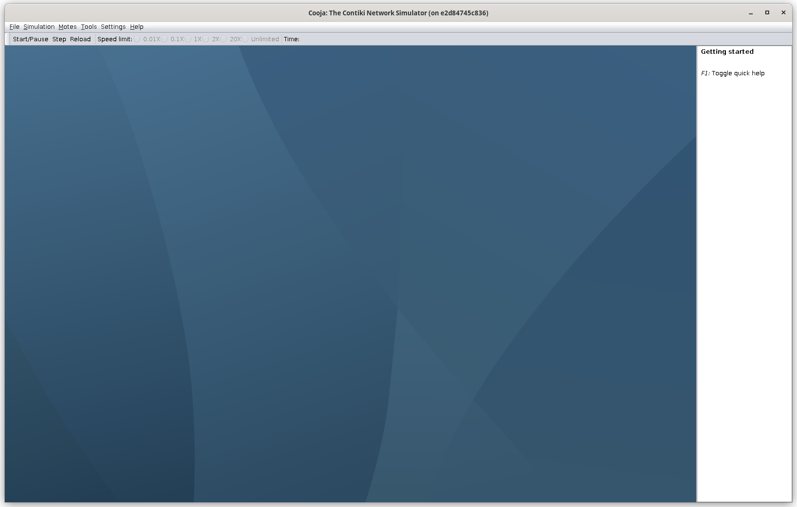
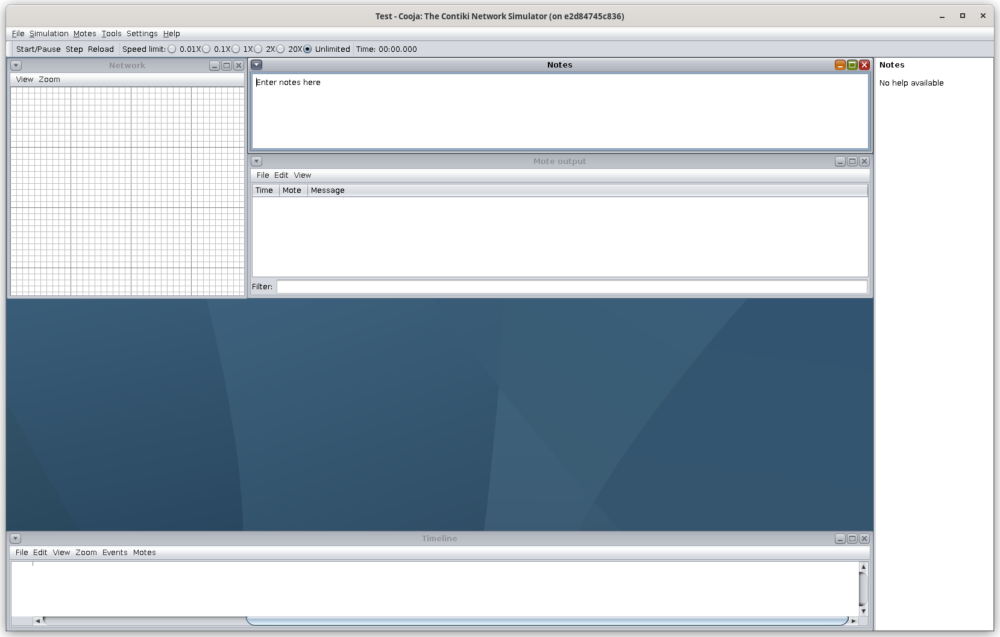
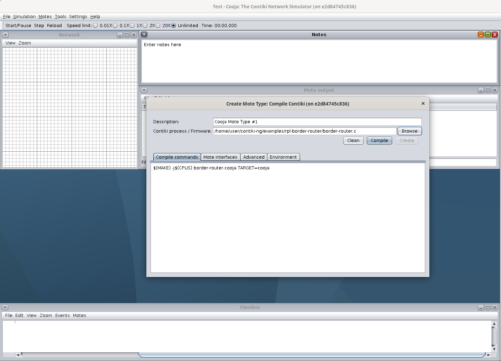
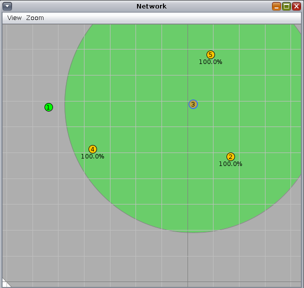
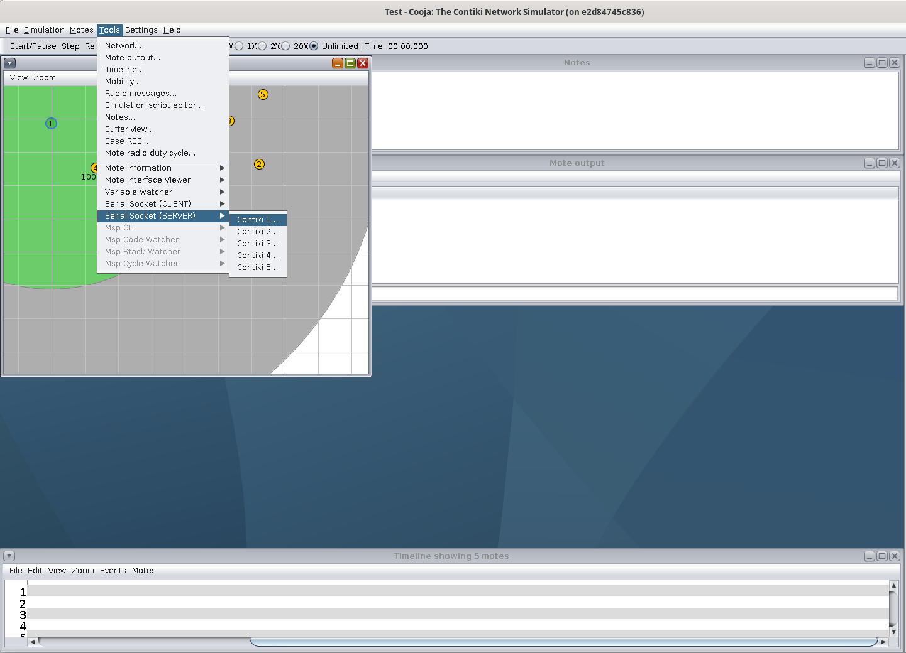
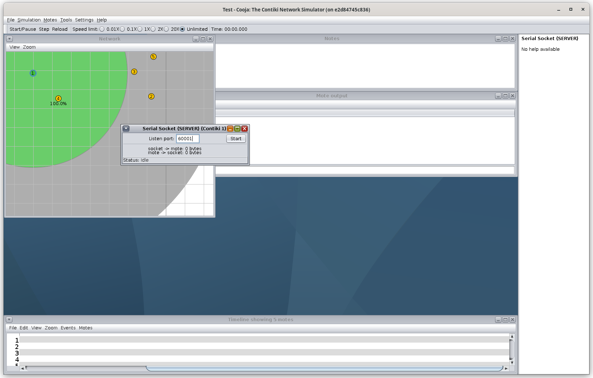
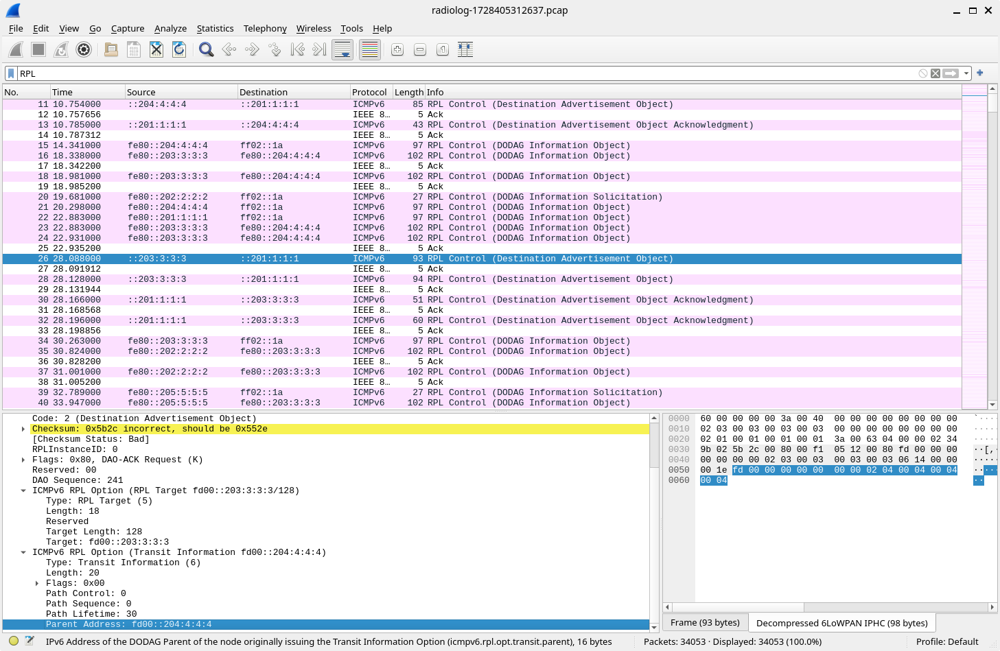

# Práctica 9. 6LowPAN con simulador Cooja

## Introducción y objetivos

Los routers de borde son enrutadores que pueden encontrarse en el borde de una
red, encaminando el tráfico de dicha red hacia una segunda red externa. Su
función, en definitiva, es conectar una red con otra.

En esta práctica, usaremos el simulador Cooja, del proyecto Contiki-ng, para
construir una red de nodos que se comuniquen por 6LowPAN, usando RPL como
algoritmo de encaminamiento. Los nodos simulados usan el RTOS de Contiki-ng.
Veremos cómo un router de borde puede utilizarse para enrutar tráfico entre una
red RPL (una red de sensores simulada) y una red IPv4 externa, siguiendo el
siguiente diagrama:


El objetivo de la práctica es ofrecer una visión general sobre cómo desplegar
tanto una red RPL con Contiki-ng en el simulador Cooja, así como conseguir
hacerla interactuar con una segunda red externa real utilizando la herramienta
`tunslip`.

!!! danger "Tarea"
	Escribe un informe en el que describas cada una de las tareas propuestas, su
	desarrollo y los resultados obeservados, así como tus observaciones o
	comentarios personales.

## Instalación de Cooja 

Damos a los alumnos dos alternativas para instalar el simulador cooja en su
equipo:

- La instalación con contenedores docker, o 
- La copia de una máquina virtual de virtualbox creada por el profesor.

### Alternativa 1: Instalación con Docker

A continuación indicamos los pasos a seguir para realizar la instalación del
software necesario en un sistema GNU/Linux. Los detalles de instalación para
Windows y Mac OS X están detallados en la [*getting started guide* de
Contiki-ng](https://docs.contiki-ng.org/en/develop/doc/getting-started/Docker.html).

Comenzaremos por instalar docker si no lo tenemos instalado ya, haciendo:

```sh 
sudo apt-get install docker-ce docker-ce-cli containerd.io docker-buildx-plugin docker-compose-plugin
```

Si nuestro usuario no pertenece al grupo docker, lo añadimos:

```sh 
sudo usermod -aG docker <your-user>
```

Después de añadirlo deberemos salir de la sesión de escritorio y volver a entrar
para que se actualice la lista de grupos del usuario.

A continuación descargaremos la imagen del contenedor de Contiki-ng:

```sh 
docker pull contiker/contiki-ng
```

Esto descarga la imagen contiker/contiki-ng:latest. Podríamos cambiar el tag de
la imagen por otra anterior si no interesase por algún motivo.

Una vez descargada la image clonaremos el repositorio git de contiki (por
ejemplo en nuestro directorio home), de forma que podamos editar los ficheros
desde la máquina host:

```sh 
git clone https://github.com/contiki-ng/contiki-ng.git
cd contiki-ng
git submodule update --init --recursive
```

A continuación crearemos el script $HOME/.local/bin/contiker que usaremos en el
futuro para lanzar el contenedor. El contenido de este script será:

```bash
#!/bin/bash

export CNG_PATH=$HOME/contiki-ng
xhost +SI:localuser:$(id -un)
docker run --privileged --sysctl net.ipv6.conf.all.disable_ipv6=0 \
  --mount type=bind,source=$CNG_PATH,destination=/home/user/contiki-ng \
  -e DISPLAY=$DISPLAY -e LOCAL_UID=$(id -u $USER) -e LOCAL_GID=$(id -g $USER) \
  -v /tmp/.X11-unix:/tmp/.X11-unix -v /dev/bus/usb:/dev/bus/usb \
  -ti contiker/contiki-ng
xhost -SI:localuser:$(id -un)
```

En este momento, si tenemos añadida la ruta *$HOME/.local/bin* en la variable
*PATH*, podemos ejecutar el contenedor de contiki-ng ejecutando el script
contiker; y una vez dentro del contenedor ejecutar el simulador cooja:

```sh 
$ contiker
localuser:christian being added to access control list
To run a command as administrator (user "root"), use "sudo <command>".
See "man sudo_root" for details.

user@6dd1f25a702d:~/contiki-ng$ cooja
```

La primera vez que lo ejecutemos tardará un poco porque se descargará una serie
de ficheros java necesarios para el simulador. Es posible que se produzca un
error en la resolución de nombres (DNS). En ese caso debemos configurar el dns
de docker:

```sh 
dockerd --dns 8.8.8.8
```

Si queremos ahorrar el tiempo de descarga de los ficheros jar podemos modificar
la imagen del docker:

```sh 
$ docker ps -a
CONTAINER ID   IMAGE                       COMMAND                  CREATED          STATUS         PORTS     NAMES
77675abad9f3   contiker/contiki-ng        "/usr/local/bin/rema…"   10 seconds ago   Up 9 seconds             hardcore_kilby

$ docker commit hardcore_kilby contiker/contiki-ng-cooja 
```

No te olvides en este caso de actualizar el script contiker para que use la
nueva imagen, y si quieres puedes borrar la imagen anterior.

### Alternativa 2: Uso de Máquina Virtual

Si no tenemos instalado Virtualbox en nuestro equipo lo primero que haremos
será instalarlo, descargando el instalable de su página web de [Oracle
Virtualbox](https://www.virtualbox.org/wiki/Downloads).

A continuación descargaremos la máquina virtual debian con contiki-ng instalado
de [este enlace de Google
Drive](https://drive.google.com/file/d/1HpjY9WmlciS46mOyxA6YizqkA1aDBzib/view?usp=drive_link).
Se trata de un fichero ova, que tendremos que importar en Virtualbox. Para ello
abrimos la aplicación y seleccionamos File->Import Appliance, y seleccionamos el
fichero descargado.

Una vez importado podemos arrancar la máquina virtual, el usuario es *user* y la
contraseña *contiki*. Para arrancar el simulador bastará con abrir un terminal y
ejecutar el comando *cooja*. El repositorio de contiki-ng está en una directorio
del mismo nombre dentro del home del usuario *user*.

## Código Contiki

En el desarrollo de la práctica utilizaremos algunos de los ejemplos de la
instalación de contiki-ng (en el directorio contiki-ng/examples):

* `rpl-border-router/border_router.c`: que contendrá la lógica de enrutamiento
  del router de borde, que será la raiz del DODAG.
* `hello-world/hello-world.c`: que ejecutarán el resto de nodos de la red RPL.

Los nodos que implementen el código `hello-world.c` formarán un DAG con el
router de borde configurado como raíz. El router de borde recibirá el prefijo de
red vía una conexión SLIP (*Serial Line Interface Protocol*) y lo comunicará al
resto de nodos de la red RPL para que conformen sus respectivas direcciones IPv6
globales. Una vez recibido el prefijo, el router de borde se configura como la
raíz del DODAG y envía el prefijo al resto de nodos de la red.

## Simulación en Cooja

Para crear una simulación completa en Cooja arrancamos el simulador usando la
siguiente orden:

```sh
To run a command as administrator (user "root"), use "sudo <command>".
See "man sudo_root" for details.

user@e2d84745c836:~/contiki-ng$ cooja
```

Si usamos la máquina virtual sólo tenemos que ejecutar cooja desde un terminal.
De aquí en adelante se pueden ignorar todos los detalles relativos a Docker si
hemos optado por utilizar la máquina virtual de Virtualbox.

Dependiendo de si usamos la imagen original del contenedor de contiki-ng o si la
hemos modificado para almacenar los jar descargados por la ejecución de cooja,
la primera vez que lo ejecutemos puede tardar un poco, pero finalmente se abrirá
la ventana del simulador:




Tras la ejecución, sigue los siguientes pasos para crear una nueva simulación.
Primero selecciona la opción `File->New Simulation`. Selecciona `UDGM` e
introduce el nombre de la simulación. Presiona `Create` y se abrirá una ventana
de simulación:



En el menú `Motes`, selecciona `Add New Motes->Create new motes` y seleccona el
tipo de mota `Cooja mote`. Luego selecciona como código fuente el fichero del
ejemplo para el router de borde: `examples/rpl-border-router/rpl-border-router.c`.



Pulsa en `Compile`y luego en `Create` y añade *una única* mota de este tipo.

Repite los pasos anteriores para crear de 4 a 8 motas de tipo `Cooja` que
ejecuten el ejemplo `hello-world.c`. Distribuyelas por la simulación, vigilando
que no todas estén al alcance del router de borde pero que puedan llegar a él
pasando a través de otros nodos que sí están a su alcance.



A continuación, crearemos un puente entre la red RPL simulada en Cooja y el
contenedor. Para ello pulsamos en el menú `Tools`, `Serial Socket (SERVER)` y
seleccionamos la mota correspondiente al router de borde (identíficala con su
valor numérico). 



Obtendrás un mensaje como el de la siguiente figura (observa que el mensaje
indica *Listening on port 60001*):



A continuación, *arranca la simulación* (botón `Start`).

## Asignando el prefijo de red

Como hemos dicho, un router de borde actúa como enlace para conectar una red a
otra. En este ejemplo, el router de borde se usa para establecer ruta de datos
entre la red RPL y el docker. Para ello, utilizaremos la utilidad *tunslip6*
proporcionada por Contiki-ng en el directorio `tools/serial-io`, y se puede
compilar con la orden:

```sh
make tunslip6
```
A continuación, podemos establecer una conexión entre la red RPL y la máquina
local:

```sh
sudo ./tunslip6 -a 127.0.0.1 aaaa::1/64
```

Si la ejecución ha sido correcta, veremos una salida similar a la siguiente
en la terminal:

```sh
user@50a25697ee43:~/contiki-ng/examples/rpl-border-router$ sudo ../../tools/serial-io/tunslip6 -a 127.0.0.1 aaaa::1/64
slip connected to ``127.0.0.1:60001''
opened tun device ``/dev/tun0''
ifconfig tun0 inet `hostname` mtu 1500 up
ifconfig tun0 add aaaa::1/64
ifconfig tun0 add fe80::0:0:0:1/64
ifconfig tun0

tun0: flags=4305<UP,POINTOPOINT,RUNNING,NOARP,MULTICAST>  mtu 1500
        inet 172.17.0.2  netmask 255.255.255.255  destination 172.17.0.2
        inet6 fe80::1  prefixlen 64  scopeid 0x20<link>
        inet6 aaaa::1  prefixlen 64  scopeid 0x0<global>
        inet6 fe80::93d:daef:6b56:52a7  prefixlen 64  scopeid 0x20<link>
        unspec 00-00-00-00-00-00-00-00-00-00-00-00-00-00-00-00  txqueuelen 500  (UNSPEC)
        RX packets 0  bytes 0 (0.0 B)
        RX errors 0  dropped 0  overruns 0  frame 0
        TX packets 0  bytes 0 (0.0 B)
        TX errors 0  dropped 0 overruns 0  carrier 0  collisions 0

[INFO: Main      ] Starting Contiki-NG-develop/v4.9-749-g7a8ba26ca-dirty
[INFO: Main      ] - Routing: RPL Lite
[INFO: Main      ] - Net: sicslowpan
[INFO: Main      ] - MAC: CSMA
[INFO: Main      ] - 802.15.4 PANID: 0xabcd
[INFO: Main      ] - 802.15.4 Default channel: 26
[INFO: Main      ] Node ID: 1
[INFO: Main      ] Link-layer address: 0001.0001.0001.0001
[INFO: Main      ] Tentative link-local IPv6 address: fe80::201:1:1:1
[INFO: RPL BR    ] Contiki-NG Border Router Web Server Started
[INFO: RPL BR    ] Contiki-NG Border Router started
[INFO: BR        ] RPL-Border router started
*** Address:aaaa::1 => aaaa:0000:0000:0000
[INFO: BR        ] Waiting for prefix
[INFO: BR        ] Server IPv6 addresses:
[INFO: BR        ]   aaaa::201:1:1:1
[INFO: BR        ]   fe80::201:1:1:1
```

El programa ha creado una interfaz puente `tun0` con IPv4 127.0.1.1, y ha
enviado, vía serie, un mensaje de configuración al router de borde indicando el
prefijo deseado para los nodos de la red RPL (`aaaa`). La salida de las últimas
dos líneas pertenece al router de borde, e indica cuáles son sus direcciones
IPv6 tras la recepción del prefijo.

Vuelve al simulador Cooja y observa que ha aparecido un mensaje en el que se
observa la cadena *Client connected: /127.0.0.1*.

## Verificación de resultados

Es posible verificar la dirección del router de borde a través de una orden ping
desde tu máquina virtual:

```sh
user@50a25697ee43:~/contiki-ng/examples/rpl-border-router$ ping6 aaaa::201:1:1:1
PING aaaa::201:1:1:1(aaaa::201:1:1:1) 56 data bytes
64 bytes from aaaa::201:1:1:1: icmp_seq=1 ttl=64 time=17.7 ms
64 bytes from aaaa::201:1:1:1: icmp_seq=2 ttl=64 time=44.8 ms
64 bytes from aaaa::201:1:1:1: icmp_seq=3 ttl=64 time=10.4 ms
64 bytes from aaaa::201:1:1:1: icmp_seq=4 ttl=64 time=1.62 ms
64 bytes from aaaa::201:1:1:1: icmp_seq=5 ttl=64 time=29.2 ms
64 bytes from aaaa::201:1:1:1: icmp_seq=6 ttl=64 time=78.0 ms
^C

```

Así como la de cualquier nodo de la red, por ejemplo el nodo 5:

```sh
user@50a25697ee43:~/contiki-ng/examples/rpl-border-router$ ping6 aaaa::205:5:5:5
PING aaaa::205:5:5:5(aaaa::205:5:5:5) 56 data bytes
64 bytes from aaaa::205:5:5:5: icmp_seq=1 ttl=61 time=6.56 ms
64 bytes from aaaa::205:5:5:5: icmp_seq=2 ttl=61 time=17.2 ms
64 bytes from aaaa::205:5:5:5: icmp_seq=3 ttl=61 time=6.38 ms
^C
--- aaaa::205:5:5:5 ping statistics ---
3 packets transmitted, 3 received, 0% packet loss, time 2003ms
rtt min/avg/max/mdev = 6.380/10.057/17.232/5.073 ms
```

La dirección de cada nodo puede obtenerse filtrando el la pantalla de log en
función del ID del nodo (mota) destino.

## Captura de paquetes para análisis

En el simulador cooja, dentro del menú tools, podemos abrir la ventana de `Radio
Messages`. Esta ventana nos permite capturar todos los paquetes de la simulación
y generar un fichero `pcap` para su posterior análisis con wireshark. Para ello
seleccionamos en el menú `Analyzer` de la ventana de `Radio Messages` la opción
`6LowPAN Analyzer with PCAP`.

Reiniciamos la simulación anterior pulsando en el botón `Reload` en la ventana
de Cooja. Esto habrá cortado la comunicación con el host, por lo que debemos
volver a ejecutar la herramienta tunslip6:
```sh
sudo ./tunslip6 -a 127.0.0.1 aaaa::1/64
```

Ahora estamos listos para volver a simular la red capturando todos los paquetes
enviados entre los nodos, pulsando para ello el botón `Start` de la ventana de
Cooja. Dejamos simular un rato y luego paramos la simulación. Cooja habrá
generado un fichero `radiolog-<n>.pcap`, dónde `<n>` será un número aleatorio,
en el directorio desde el que lanzamos cooja: `/home/user/contiki-ng`. Este
direcorio es el que se ha mapeado con el direcorio del host donde clonamos el
repositorio de contiki-ng, por lo que podemos abrir el fichero con el analizador
de red `Wireshark` instalado en nuestro sistema operativo host (instálalo si no
lo tienes instalado ya).

Con wireshark podemos filtrar los paquetes relacionados con el protocolo RPL, y
buscar los paquetes con `Destination Advertisement Objects`, que los nodos
envían hacia la raiz indicando el nodo que han elegido como padre. Por ejemplo,
en la siguiente figura podemos ver que el nodo 3 envía su DAO indicando que
escoge al nodo 4 como padre:



Esto es razonable para la topología escogida en la simulación en la que el nodo
3 no tiene al nodo 1 al alcance de radio, pero sí al nodo 4, que está a un salto
del nodo raiz:


!!! danger "Tarea"
	Sigue los pasos descritos arriba para crear una red RPL con un número
	reducido de nodos (entre 5 y 10), conectándola a tu red local. Haz que no
	todos los nodos estén al alcance del router de borde, y comienza tu
    simulación. Comprueba la conectividad con todos ellos vía `ping6` y
    documenta el proceso en la memoria de la práctica.

!!! danger "Tarea"
    Con una ejecución de `ping6` activa sobre una mota al alcance directo del
    router de borde, cambia la posición de la mota para que necesite al menos un
    salto intermedio para llegar a la raiz. Reporta el tiempo que tarda RPL en
    hacer converger de nuevo el DODAG. Documenta el proceso y tus observaciones.

!!! danger "Tarea"
    Captura los mensajes enviados por los nodos en un fichero `pcap`. Estudia y
    reporta en tu informe de la práctica el tráfico RPL generado en el proceso
    de construcción del DAG. Deduce a partir de esta información la topología de
    red que se está usando, identificando el padre preferente de cada nodo. Para
	ello debes usar la información transmitida en los paquetes DAO.
