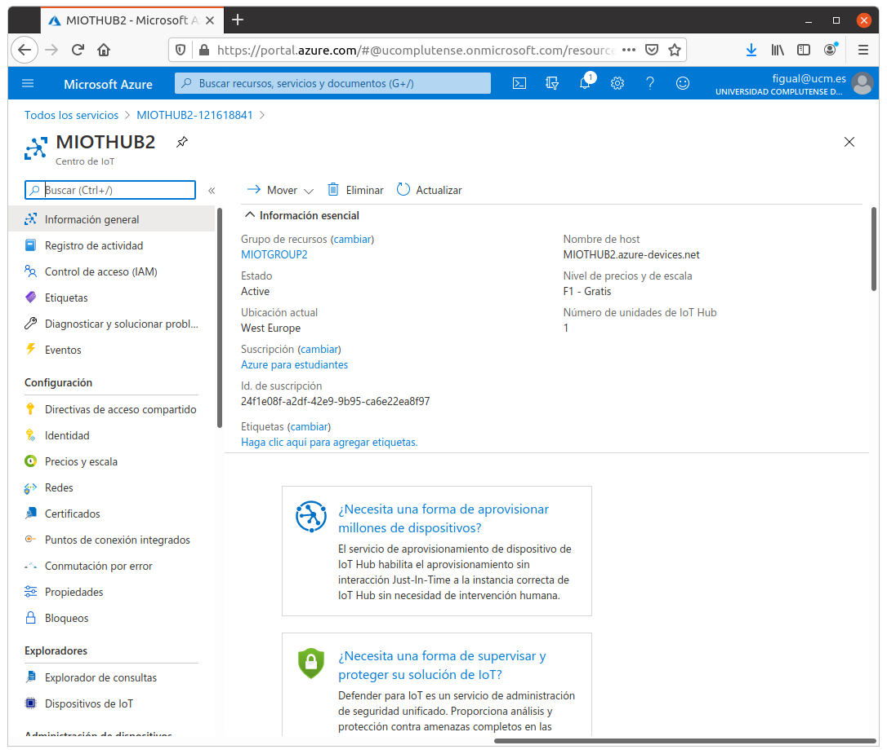
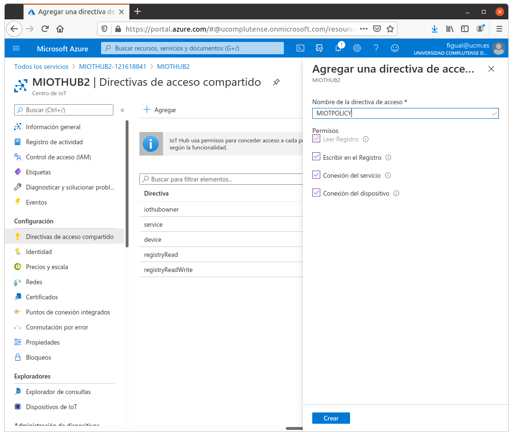

# Práctica 10. Frameworks IoT y Cloud

## Objetivos

La práctica presenta los pasos esenciales que permiten hacer interactuar un
dispositivo (ESP32) con una infraestructura IoT en la nube. Aunque en este
caso utilizaremos Microsoft Azure, los pasos tanto en configuración remota
como a nivel de nodo son muy similares a los que deberías seguir para otras
infraestructuras (Amazon AWS, Google IoT Core, Aliyun IoT, Tencent Iot o 
cualquier otro). La documentación de IDF proporciona ejemplos detallados 
para cada uno.

El objetivo de la práctica es desplegar un sistema de monitorización remota
en Microsoft Power BI, que permita visualizar datos de telemetría emitidos
vía MQTT por el dispositivo a través de un *gateway* en la nube (llamado en
el caso de Azure *IoT Hub*).

## Introducción

El SDK ESP Azure IoT es una infraestructura basada en 
el SDK de Azure par IoT con soporte para C
([azure-iot-sdk-c](https://github.com/Azure/azure-iot-sdk-c)) portado
sobre ESP-IDF para dar soporte al ESP32. Además, proporciona un conjunto
de ejemplos que permiten observar y simplificar el proceso de configuración
y conexión al *framework* Azure IoT Hub.

## Preparación del *firmware* en el ESP32

En la presente práctica utilizarás una placa ESP32 que actuará como cliente
ESP32, con un *firmware* personalizado que implementa la lógica de conexión
e interacción con Azure. En primer lugar:

1. Configura una instalación de ESP IDF tal y como has hecho en prácticas 
anteriores. Si ya la has configurado y es funcional, no es necesario ninguna
reinstalación ni reconfiguración.

2. En un directorio independiente, clona el repositorio de 
*ESP Azure* (fíjate en la opción `--recursive`, que es imprescindible):

```sh
git clone --recursive https://github.com/espressif/esp-azure.git
```

## Configuración de Microsoft Azure

Los siguientes pasos requieren el uso de una cuenta creada con Microsoft
Azure. Los estudiantes UCM pueden adherirse al programa académico, que 
otorga suficiente crédito para realizar este tipo de prácticas. Asegúrate
de acceder al [portal de MS Azure](https://portal.azure.com) y utilizar tu
usuario y credenciales UCM para ello. 

### Creación de un Centro de IoT (*IoT Hub*)

En la página principal de Azure, selecciona la opción "Crear un Recurso"
(en el menú de la parte superior izquierda de la pantalla)
y a continuaición selecciona *IoT Hub* en cuadro "Buscar en Marketplace".

Selecciona *Iot Hub* en los resultados de la búsqueda, y a continuación
"Crear".

En la pestaña *Aspectos Básicos*, completa los campos de la siguiente forma:

* **Suscripción**: selecciona la suscripción que desees usar (por defecto, debería
aparecer *Azure para estudiantes*).
* **Grupo de recursos**: crea un nuevo grupo de recursos seleccionando la opción 
*Crear nuevo*, y otórgale el nombre que desees, por ejemplo `MIOTGROUP`.
* **Región**: selecciona la región más cercana a ti (por ejemplo, *Oeste de Europa*).
* **Nombre**: por último, da un nombre al *hub*, por ejemplo `MIOTHUB`.

Deja los parámetros por defecto en la pestaña *Redes*, y elige como 
*Nivel de precios* F1 en la pestaña *Administración*. Asigna las etiquetas que
desees y finalmente confirma la creación del *Centro de IoT*. Si todo ha ido
bien, verás un resumen del recurso creado y podrás acceder a él 
pinchando en *"Ir al recurso"*. Verás una pantalla similar a la siguiente:




En la sección de *Configuración*, elige *Directivas de acceso compartido*
y crea una nueva directiva llamada, por ejemplo `MIOTPOLICY`, con permisos 
de lectura y escritura en Registro, y conexión de servicios y dispositivos.



Las políticas de *lectura y escritura en registro* otorgan derechos
de acceso al registro de indentidades de Azure. Estos permisos serán
utilizados por servicios de *back-end* para gestionar las identidades
de dispositivos, por ejemplo.
La política de *conexión de servicio* otorga permisos para acceder
a *endpoints* de servicio. Los servicios de *back-end* podrán enviar
y recibir mensajes de dispositivos.
La política de *conexión de dispositivo* otorga permisos para enviar
y recibir mensajes usando el *IoT Hub*. 

Una vez creada, selecciónala y copia la *Cadena de conexión principal (clave principal)*
que aparece en pantalla. No es necesario que la muestres, puedes usar el
botón de copia directamente. **Apunta esta cadena en un fichero de texto.
Esta es la clave de acceso para el Hub**.

### Registro de un nuevo dispositivo

A continuación, crearemos una nueva identidad de dispositivo  en el
Registro de Identidades del *hub* IoT que acabas de crear. Para ello:

1. En el menú de navegación, abre la opción *"Dispositivos de IoT"*
y selecciona *Nuevo* para crear un nuevo dispositivo.

2. Dale el nombre que quieras (por ejemplo MIOTDEVICE), pero recuérdalo, 
y selecciona *Guardar*.

3. Una vez creado, selecciónalo y copia la *Cadena de conexión principal*
que aparece en pantalla. No es necesario que la muestres, puedes usar el
botón de copia directamente. **Apunta esta cadena en un fichero de texto.
Esta es la clave de acceso para el dispositivo**.

### Instalación de el cliente Azure

Para instalar el cliente Azure en Linux, usa la orden:

```sh
curl -sL https://aka.ms/InstallAzureCLIDeb | sudo bash
```

Tienes más opciones de instalación en la [página](https://docs.microsoft.com/en-us/cli/azure/install-azure-cli-apt).

Una vez instalado, desde tu terminal, ejecuta el comando
`az` para comprobar que la instalación fue correcta. Deberías
ver una salida similar a esta:

```sh
az

Welcome to Azure CLI!
---------------------
Use `az -h` to see available commands or go to https://aka.ms/cli.
...
```

Instala la extensión del cliente para Azure IoT:

```sh
az extension add --name azure-iot
```

Ingresa en el sistema ejecutando (se te pedirá autenticación en 
navegador, introduce tus credenciales):

```sh
az login
```

Para usar el cliente como método de creación de un dispositivo, puedes
utilizar la siguiente orden:

```sh
az iot hub device-identity create -n [IoTHub Name] -d [Device ID]
```

!!! note "Tarea"
    Crea un nuevo dispositivo, distinto al que creaste anteriormente, en
    tu hub. Después, obtén su cadena de conexión usando la orden 
    `az iot hub device-identity connection-string show -n [IoTHub Name] -d [Device ID]`. Comprueba que, efectivamente, la creación del dispositivo es
visible en la plataforma web.

### Monitorización de valores de telemetría del dispositivo y eventos

Para observar los datos intercambiados entre el dispositivo y el *hub*
IoT desde línea de ocmandos, puedes usar la orden:

```sh
az iot hub monitor-events -n [IoTHub Name] --login 'cadena de conexion'
```

(Ten en cuenta que las comillas simples deben estar presentes).

## Despliegue de un cliente MQTT en el ESP32

Dirígete al ejemplo situado en el directorio 
`esp-azure/examples/iothub_client_sample_mqtt`. En él, vamos a trabajar con cualquiera
de los dos dispositivos que has creado en tu *Hub*. En cualquier caso,
muestra su *cadena de conexión principal*. Deberás ver un valor 
de devolución de tipo:

```json
{
  "connectionString": "HostName=<azure-iot-hub-name>.azure-devices.net;DeviceId=<azure-iot-device-id>;SharedAccessKey=<base64-encoded-shared-access-key>"
}
```

Deberás apuntar (copiar) únicamente la parte que comienza por 
*HostName=...*, hasta el final de la cadena. No incluyas las comillas
dobles.

Ejecuta `make menuconfig`. En el menú *Example Configuration*, 
configura las credenciales de acceso a tu red WiFi, así como la 
cadena de conexión que copiaste en la opción
*IOT Hub Device Connection String*.

A continuación, ejecuta la orden de compilación, *flasheado* y
monitorización:

```sh
make flash monitor
```

En una ventana separada, puedes monitorizar los eventos IoT
en tu *hub* usando su cadena de conexión:

```sh
az iot hub monitor-events -n [IoTHub Name] --login 'Cadena de conexión primaria'
```

Una vez arrancado y conectado a Internet el dispositivo comenzará a
publicar mensajes MQTT. El monitor que has lanzado los mostrará como:

```json
{
    "event": {
        "origin": "<azure-iot-device-id>",
        "payload": "{\"deviceId\":\"MIOTDEVICE\",\"windSpeed\":13.00,\"temperature\":22.00,\"humidity\":67.00}"
    }
}
```

Observa que incluye tres valores: velocidad del viento, temperatura y humedad.

!!! note "Tarea"
    Analiza el código y observa, en la tarea principal, el uso que hace
    de la API de Azure SDK C, así como el punto en el que genera el mensaje MQTT (y sus valores).

También es posible enviar mensajes al dispositivo directamente desde
línea de comandos (observa que estos mensajes se envían vía red, no 
vía puerto serie, a través del *Hub*). Por tanto, puedes hacerlo desde
cualquier punto, no obligatoriamente desde tu PC:

```sh
az iot device c2d-message send -d [Device Id] -n [IoTHub Name] --data [Data_to_Send]
```

!!! note "Nota"
    Si todo ha ido bien, en este punto deberías estar observando cada uno de los mensajes enviados por tu ESP32 al *hub* desde el monitor.

## Visualización de datos en Microsoft PowerBI

En esta parte, el objetivo es visualizar los datos enviados por tu sensor (temperatura, humedad y 
velocidad del viento, en la herramienta de visualización PowerBI de Microsoft. Aunque PowerBI suele
utilizarse en entornos de inteligencia de negocio, resulta también útil para reportar datos de cualquier
elemento de Azure, incluido el *IoT Hub*.

!!! note "Nota"
    Necesitarás una cuenta de acceso gratuita a PowerBI, que puedes crear con tus credenciales de usuario UCM
    directamente en la [página del producto](https://powerbi.microsoft.com).

### Adición de un grupo de consumidores

Los grupos de consumidores proporcionan vistas independientes en la secuencia de eventos que permiten a las aplicaciones y a los servicios de Azure consumir datos de forma independiente desde el mismo punto de conexión del centro de eventos. 
Vamos a agregar un grupo de consumidores al punto de conexión integrado de tu instancia de *IoT Hub* que se usará posteriormente para extraer datos del punto de conexión.

Para agregar un grupo de consumidores a su centro de IoT, sigue estos pasos:

1. En el portal de Azure, abre tu *IoT Hub*.

2. En el panel izquierdo, selecciona *Puntos de Conexión Integrados*, luego
*Eventos* en el panel superior derecho, y escribe un nombre en *Grupos de consumidores* (por ejemplo,
`MIOTGROUP`). A continuación, selecciona *Guardar*.

### Creación, configuración y ejecución de un trabajo de *Stream Analytics*

Comencemos creando un trabajo de *Stream Analytics*. Después de crear el trabajo, 
definiremos las entradas, las salidas y la consulta que se usará para recuperar los datos.

#### Creación de un trabajo de Stream Analytics

1. En el portal de Azure, selecciona *Crear un recurso -> Internet de las Cosas -> Stream Analytics Job*.

2. Escribe la siguiente información para el trabajo:
    * **Nombre del trabajo**: Nombre que se asigna al trabajo; debe ser único (por ejemplo, `MIOTJOB`).
    * **Grupo de recursos**: Usa el mismo grupo de recursos que definiste para el centro de IoT (por ejemplo, `MIOTGROUP`).
    * **Ubicación**: Usa la misma que para el grupo de recursos.

3. Selecciona *Crear*.

#### Adición de una entrada al trabajo de Stream Analytics

1. Abre el trabajo de *Stream Analytics*.
2. En *Topología de trabajo*, selecciona *Entradas*.
3. En el panel *Entradas*, selecciona *Agregar entrada de flujo*, y a continuación, selecciona
*IoT Hub* en la lista desplegable. En el panel de la nueva entrada, escribe la siguiente información:

    * **Alias de entrada**: Un alias único para la entrada (por ejemplo, `MIOTINPUT`).
    * **Seleccionar centro de IoT de entre las suscripciones**: Selecciona esta opción.
    * **Suscripción**: Usa la suscripción que has utilizado en el resto de la práctica.
    * **IoT Hub**: Selecciona la instancia de tu *Hub IoT* tal y como has hecho en el resto de la práctica.
    * **Punto de Conexión**: Selecciona *Mensajería*.
    * **Nombre de la directiva de acceso compartido**: Selecciona  el nombre de la directiva de acceso compartido que quieras que utilice el trabajo de Stream Analytics para tu centro de IoT. Para esta práctica, puedes seleccionar *service*. La directiva *service* se crea de forma predeterminada en los centros de IoT nuevos y concede permiso de envío y recepción para los puntos de conexión de la nube que expone el centro de IoT. 
    * **Clave de directiva de acceso compartido**: Se rellena automáticamente en función del nombre de directiva de acceso compartido.
    * **Grupo de consumidores**: Selecciona el gruop de consumidores que se creó anteriormente.

El resto de campos pueden dejarse en sus valores predeterminados. Finalmente, selecciona *Guardar*.

#### Adición de una salida al trabajo de Stream Analytics

1. En Topología de trabajo, selecciona *Salidas*.

2. En el panel *Salidas*, selecciona *Agregar* y *Power BI*.

3. En el panel *Power BI: Nueva salida panel*, selecciona *Autorizar* y sigue las indicaciones para iniciar sesión en tu cuenta de Power BI.

4. Una vez que hayas iniciado sesión en Power BI, escribe la siguiente información:
    * **Alias de salida**: alias único para la salida, por ejemplo `MIOTOUTPUT`.
    * **Área de trabajo de grupo**: selecciona el área de trabajo de grupo de destino.
    * **Nombre del conjunto de datos**: escribe un nombre para el conjunto de datos, por ejemplo `MIOTDATASET`.
    * **Nombre de la tabla**: Escribe un nombre de tabla, por ejemplo `MIOTTABLE`.
    * **Modo de autenticación**: Deja la opción predeterminada.

#### Configuración de la consulta del trabajo de Stream Analytics

1. En *Topología de trabajo*, selecciona *Consulta*.
2. Reemplaza *[YourInputAlias]* por el alias de entrada del trabajo.
3. Reemplaza *[YourOutputAlias]* por el alias de salida del trabajo.
4. Selecciona *Guardar consulta*.

#### Ejecución del trabajo de Stream Analytics

En el trabajo de *Stream Analytics*, selecciona 
*Información general* y, a continuación, elige *Iniciar->Ahora->Iniciar*. Una vez que el trabajo se inicia
correctamente, su estado cambia de *Detenido* a *En ejecución*.

### Creación y publicación de un informe de Power BI para visualizar los datos

En los pasos siguientes se muestra cómo crear y publicar un informe mediante el servicio Power BI: 

1. Asegúrate de que la aplicación (tu ESP32) está ejecutándose.
2. Inicia sesión en Power BI.
3. Selecciona tu área de trabajo (*workspace*).
4. Selecciona *Conjunto de datos* usando el conjunto de datos que creaste en pasos anteriores (corresponde al que creaste en el momento de crear la salida para el trabajo de *Stream Analytics*.
5. Para dicho conjunto de datos, selecciona *Agregar Informe* (el primer icono a la derecha del nombre del conjunto de datos. 
6. Crea un gráfico de líneas para mostrar la temperatura en tiempo real en un período determinado. Para ello:
    * En el panel *Visualizaciones* de la página de creación de informes, selecciona el icono de gráfico de líneas para agregar un gráfico de líneas.
    * En el panel *Campos*, expande la tabla que especificó en el momento de crear la salida para el trabajo de *Stream Analytics*.
    * Arrastra *EventEnqueuedUtcTime* (Hora UTC de evento en cola) al Eje en el panel Visualizaciones.
    * Arrastra *temperature* (temperatura) a *Valores*.

Se ha creado un gráfico de líneas. El eje X muestra la fecha y hora en la zona horaria UTC. El eje Y muestra la temperatura del sensor:


!!! note "Tarea"
    Añade ahora información sobre humedad y velocidad del viento y refresca (actualiza) la visualización.

!!! danger "Tarea entregable"
    En esta práctica, simplemente se pide que entregues alguna evidencia (por ejemplo, una captura de pantalla con tu ESP32 femitiendo eventos y una captura simultánea de PowerBI mostrándolos) del correcto funcionamiento de los pasos listados. Opcionalmente, se puede añadir, como información emitida desde el ESP32, valores reales de temperatura obtenidos desde un sensor en el ESP32.
