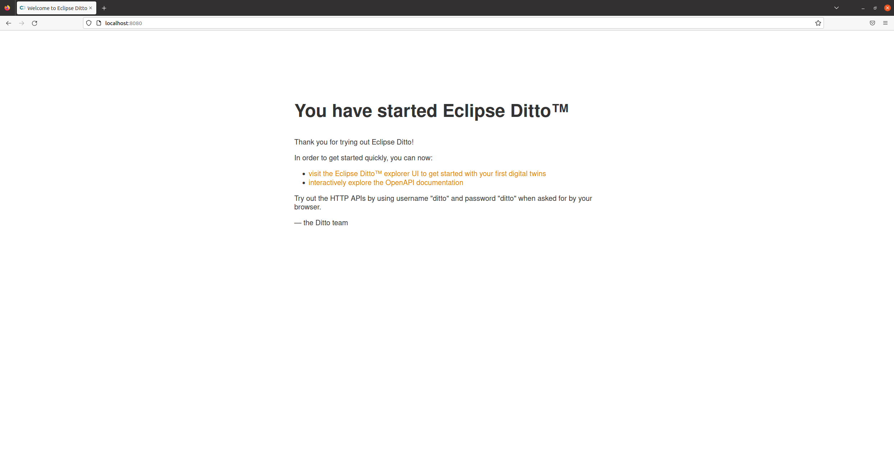
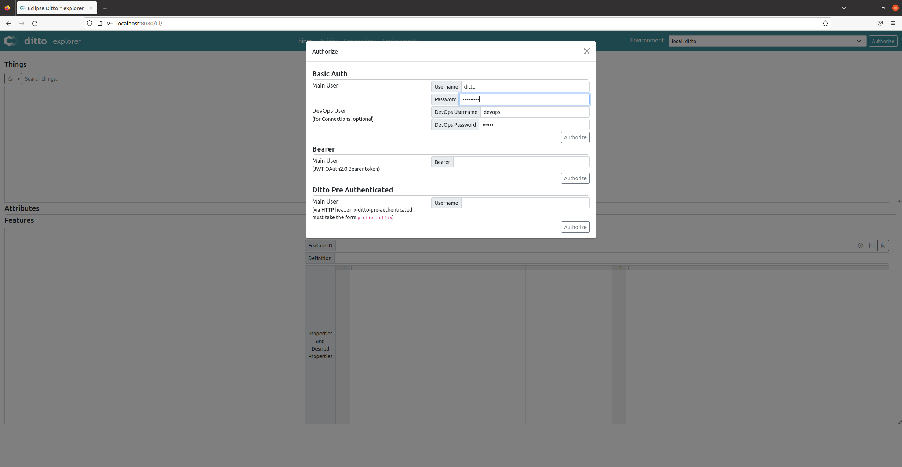
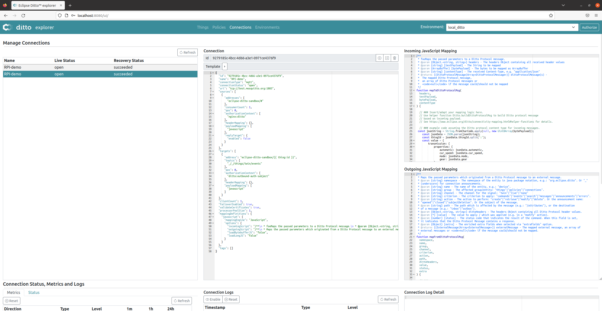

# Práctica 6 (opcional). Eclipse Ditto

## Objetivos

* Conocer el funcionamiento básico de Ditto como *software* de soporte para gemelos digitales.
* Ejercitar el concepto de *Thing* y su representación en Ditto.
* Interactuar con un entorno de gemelos digitales vía una API REST.
* Desplegar un entorno IoT basado en MQTT sobre Ditto.

## Introducción

Eclipse Ditto es un proyecto dentro de Eclipse IoT que implementa un patrón de software llamado *gemelos digitales*.
Un gemelo digital es una representación virtual, basada en la nube, de su contraparte del mundo real (*cosas* del mundo real, por ejemplo, dispositivos como sensores, calefacción inteligente, automóviles conectados, redes inteligentes, estaciones de carga para vehículos eléctricos, ...).

Ditto simplifica el desarrollo de soluciones IoT para desarrolladores de software, ya que no necesitan saber cómo o dónde están conectadas exactamente las "cosas" físicas.  Con Ditto, una cosa puede usarse como cualquier otro servicio web a través de su gemelo digital.

Ditto no es plataforma IoT completa. No proporciona software que se ejecute en *gateways* IoT y no define ni implementa un protocolo de IoT para comunicarse con los dispositivos.

Su enfoque radica en escenarios de *backend*, al proporcionar una API web para simplificar el trabajo con dispositivos  conectados (por ejemplo, a través de MQTT) u otro software de *backend*.

Con Ditto, es posible obtener una API completa y consciente de la autorización (HTTP, WebSocket y otros protocolos de mensajería) para interactuar con sus gemelos digitales y todos los aspectos que los rodean.

Considerando que el desarrollador planeta la creación de una solución de IoT, y suponiendo que utiliza tanto hardware (por ejemplo, sensores o actuadores) como software (por ejemplo, una aplicación móvil o web) para resolver el problema de su cliente, éste tiene varios lugares donde implementar el software:

* En o cerca del hardware, por ejemplo, en una placa Arduino usando C/C++ o en una Raspberry PI usando Python, opcionalmente en un *gateway*  que establece la conectividad a Internet (por ejemplo, basado en Eclipse Kura),

* En la aplicación móvil o web usando Java, Javascript, etc., 

* En el *backend* cumpliendo varias responsabilidades como proporcionar una API que se abstrae del hardware, enrutamiento de solicitudes entre el hardware y las aplicaciones de los clientes, asegurando solo el acceso autorizado, conservando el último estado informado del hardware como caché y  proporcionando los datos cuando el hardware no está conectado actualmente, notificar a las partes interesadas (por ejemplo, otros servicios de *backend*) sobre los cambios.

Ditto se enfoca en resolver las responsabilidades que tiene un *backend* típico en tales escenarios.
Su objetivo es liberar las soluciones IoT de la necesidad de implementar y operar un back-end personalizado. En cambio, al usar Eclipse Ditto, pueden concentrarse en los requisitos comerciales, en conectar dispositivos a la nube/back-end y en implementar aplicaciones comerciales.


## Instalación de prerequisitos (Docker)

La instalación de Ditto que utilizaremos en esta práctica se basa en un despliegue
de microserviciios confinados en contenedores Docker. Por tanto, la instalación de
Docker es un requisito indispensable para el desarrollo de la práctica. 

Si ya dispones de una instalación funcional de Docker en tu PC o en la máquina virtual
del curso, puedes obviar esta sección. En caso contrario, instala y comprueba el 
funcionamiento de Docker siguiendo las instrucciones de su página oficial para la
distribución Linux que estés utilizando (o incluso para otros sistemas operativos).

En el caso de la Máquina Virtual (Ubuntu), se recomienda seguir la instalación paso a paso
detallada en [la página oficial de Docker](https://docs.docker.com/engine/install/ubuntu/).
Concretamente, se sugiere utilizar el método de instalación basado en repositorio (*Install using the repository*).
En el caso de Linux es muy aconsejable, para ejecutar el software con permisos de usuario, finalizar la instalación
con los pasos post-instalación sugeridos en la [propia página](https://docs.docker.com/engine/install/linux-postinstall/).

!!! note "Tarea"
    Si todo ha ido bien, en este punto deberías poder ejecutar, sin permisos de superusuario (`sudo`) el 
    contenedor sencillo *Hello, world* indicado en la documentación.

## Instalación y despliegue de Eclipse Ditto utilizando Docker

[Eclipse Ditto](https://www.eclipse.org/ditto/) se basa en un despliegue de microservicios, cada uno de ellos
dedicado a una tarea específica (gestión de conexiones, autorización, almacenamiento de datos, etc.). 
Más concretamente, los microservicios se encargan de la gestión de:

* Políticas de acceso (*Policies*).
* Things.
* Conectividad.
* Búsqueda.
* Gestión de Ditto como canalizador de mensajes (*Gateway*).

En su versión más operativa, estos microservicios se despliegan y comunican entre ellos utilizando contenedores
Docker, y pueden ser gestionados de forma manual (como nosotros haremos), o integrados en orquestadores de
más alto nivel, como Kubernetes. La única dependencia externa exigida por Ditto es el uso de MongoDB para 
gestionar el almacenamiento de logs, conexiones, eventos y otros registros de interés, y el uso de NginX para dar
soporte a la interfaz Web (opcional) y a tareas de autenticación básica de usuarios.o

### Obtención del software

En primer lugar, clona el repositorio que aloja el código fuente de Eclipse Ditto utilizando `git`:

```sh
git clone https://github.com/eclipse-ditto/ditto.git
```

Esto creará un directorio `ditto` con todo lo necesario para el despliegue del sistema. Podríamos directamente
construir Ditto desde este código fuente, pero haremos uso de una forma de despliegue basada en imágenes Docker
precompiladas y combinadas vía `docker-compose`. 

### Despliegue del sistema

Para comenzar, dirígete al directorio `deployment/docker`. Los pasos que se listan a continuación son los que
se describen en la documentación oficial (fichero `README.md` del directorio).

En primer lugar, configuraremos el servidor web que dará soporte a la interacción básica con Ditto y a las 
tareas de autenticación de usuarios contra la API REST proporcionada por Ditto.

En primer lugar, configuraremos las credenciales que permitirán a los usuarios interactuar con Ditto vía HTTP. Para
ello, utiliza la herramienta `openssl passwd` para crear un *hash* de la contraseña a utilizar por parte del usuario
`ditto` (si no tienes instalado `openssl`, hazlo utilizando el sistema de paquetería de Ubuntu o cualquier otro 
mecanismo disponible en tu distribución):

```sh
openssl passwd -quiet
 Password: <enter password>
 Verifying - Password: <enter password>
```

Es importante que anotes la contraseña que vas a utilizar. En el resto de la práctica asumiremos que has utilizado 
**masteriot** como contraseña, pero puedes usar la que desees.

Como resultado de la anterior ejecución, se mostrará por pantalla el *hash* de la contraseña elegida, por ejemplo
*A6BgmB8IEtPTs*. Edita el fichero *nginx.htpasswd* y añade la siguiente línea:

```sh
ditto:A6BgmB8IEtPTs
```

Esto permitirá la autenticación de un usuario llamado `ditto` utilizando la contraseña escogida.

A continuación, despliega los servicios utilizando `docker-compose`:

```sh
docker-compose up -d
```

Deberías observar una salida similar a la siguiente:

```sh
ubuntu@ubuntu2004:~/Work/ditto/deployment/docker$ sudo docker-compose up -d
Starting docker_policies_1   ... done
Starting docker_mongodb_1       ... done
Starting docker_swagger-ui_1    ... done
Starting docker_connectivity_1  ... done
Starting docker_things_1        ... done
Starting docker_things-search_1 ... done
Starting docker_gateway_1       ... done
Starting docker_nginx_1         ... done
```

En el anterior caso, estamos utilizando `sudo`, aunque esto no debería ser necesario si has configurado correctamente `docker`. No hay mayor problema en hacerlo así en esta práctica.

Si deseas detener los servicios, puedes simplemente ejecutar:

```sh
ubuntu@ubuntu2004:~/Work/ditto/deployment/docker$ sudo docker-compose stop
Stopping docker_nginx_1         ... done
Stopping docker_things_1        ... done
Stopping docker_things-search_1 ... done
Stopping docker_gateway_1       ... done
Stopping docker_connectivity_1  ... done
Stopping docker_policies_1      ... done
Stopping docker_mongodb_1       ... done
Stopping docker_swagger-ui_1    ... done
```

En este punto, Ditto debería estar funcionando correctamente. Por cuestiones de facilidad de uso, y aunque su uso 
es totalmente opcional y de hecho no recomendado en entornos en producción, Ditto ofrece una interfaz de usuario
web que utilizaremos para verificar su correcta instalación y para realizar los pasos básicos de interacción con
el sistema. 

Para ello, abre un navegador en la máquina donde has desplegado el entorno, y navega a la dirección `http://localhost:8080`.
Deberías observar una página similar a la siguiente:



Para acceder a la interfaz de usuario (UI) que utilizaremos, navega a `http://localhost:8080/ui` o pincha en el enlace
correspondiente. En la página anterior tienes también un enlace descriptivo de la API REST ofrecida por Ditto.


Una vez más, el uso de la UI es opcional. Un entorno en producción interactuaría con Ditto a través de la API REST que
ofrece (tal y como hace la UI de forma gráfica), pero por practicidad la utilizaremos en algunas partes de la práctica.

Por último, deberás configurar la UI para que autentique al usuario principal (`ditto`) usando la contraseña que
estableciste previamente en el proceso de instalación. Para ello, pincha en el botón `Authorize` de la parte superior
derecha de la UI, y añade la contraseña elegida para el usuario principal:



Una vez hecho esto, pincha en el primero de los tres botones `Authorize` y podrás comenzar a trabajar.


## Primeros pasos con Ditto

### Elementos principales de la UI

La UI dispone de cuatro pantallas (pestañas principales), seleccionables a través de la barra superior:

* *Things*: para visualizar y gestionar las *Things* existentes en el sistema.
* *Policies*: para visualizar y gestionar las políticas de acceso existentes en el sistema.
* *Connections*: para gestionar las comunicaciones externas del sistema (por ejemplo, su interacción con MQTT).
* *Environments*: para gestionar los entornos que definen condiciones de acceso al sistema (no los utilizaremos).

Pincha en la opción *Things*. Deberías ver una pantalla dividida en cuatro áreas, en tu caso vacías:


En la parte superior izquierda verás las *Things* creadas. En este punto, estarán vacías, pero la captura anterior
muestra una situación con dos entidades ya creadas. Observa sus nombres: por convenio, la nomenclatura de *Things*
es jerárquica, con el símbolo `:` como separación entre entidades. En la próxima sección aprenderás a crear
estas entidades, pero de momento la captura muestra cómo, seleccionando una de ellas, podrás observar sus
atributos (descripciones estáticas de alguna característica del *Thing*) y características (entidades dinámicas
que pueden ir variando con el ciclo de vida del mismo).

En la parte superior derecha dispones de la descripción formal de *Thing* en tres formatos distintos (visual, CRUD
y Web of Things). Se deja como ejercicio la profundización en cada uno de estos formatos si fuera de interés para
el/la estudiante. Por último, en la parte inferior derecha dispones de la información, en varios formatos, asociada
a cada característica. 

A continuación, pincha en la opción *Policies*. Deberías ver una pantalla dividida en cuatro áreas, en tu caso vacías:


En la captura puedes observar las políticas de acceso asociadas a una de las *Things* creadas para el usuario
web `ditto` (el que estás utilizando). Observa que, a grandes rasgos, este usuario tiene permisos de lectura
y escritura concedidos sobre la *Thing* por lo que podrá modificarla y consultarla. Aprenderemos a gestionar
estos permisos más adelante.

Por último, la pestaña *Connections* permite configurar conexiones (por ejemplo MQTT) entrantes y salientes,
para gestionar la comunicación entre el gemelo digital (Ditto) y dispositivos o entidades externas. Más adelante
describiremos algunos de sus campos más interesantes y crearemos las conexiones necesarias para recibir datos
del gemelo físico vía MQTT:



### Creación de *Things*

La creación de *Things* puede realizarse vía un *endpoint* específico proporcionado por la API REST de Ditto.
Asumamos que deseamos crear un gemelo digital para un coche. Este gemelo podría alojar metadatos estáticos
y datos de estado dinámicos, actualizados constantemente desde el gemelo físico. Es decir, la representación
digital (*Features*) de la *Thing* debería cambiar tan pronto como lo hace su representación física.

Estos tipos estáticos y dinámicos de datos se mapean en Ditto como *atributos (attributes)* 
y *características (features)*. Opcionalmente, puede utilizarse una *definición (definition)* del 
objeto, utilizando por ejemplo el modelo de información de *Eclipse Vorto*, aunque esto queda
fuera del alcance de esta práctica). 

A continuación se muestra la representación, en formato JSON, de un objeto de este tipo:

```json
{
  "definition": "digitaltwin:DigitaltwinExample:1.0.0",
  "attributes": {
    "manufacturer": "ACME",
    "VIN": "0815666337"
  },
  "features": {
    "transmission": {
      "properties": {
        "automatic": true,
        "mode": "eco",
        "cur_speed": 90,
        "gear": 5
      }
    },
    "environment-scanner": {
      "properties": {
        "temperature": 20.8,
        "humidity": 73,
        "barometricPressure": 970.7,
        "location": {
          "longitude": 47.682170,
          "latitude": 9.386372
        },
        "altitude": 399
      }
    }
  }
}
```

Dentro de *Attributes*, podemos añadir tantas características como deseemos en forma de pares clave:valor JSON.
Dentro de *Features*, podemos añadir tantas características como deseemos en forma de pares clave:valor JSON, pero
cada una debe tener un objeto JSON llamado *properties*, que contenga tantos pares clave:valor como deseemos para
describir a nuestro objeto.

Utilizaremos `curl` para interactuar con Ditto y crear entidades de tipo *Thing*. La autenticación que usaremos
para ello es la definida para el usuario `ditto` con la contraseña que elegiste en el proceso de instalación, siguiendo
este esquema de consulta:

```sh
curl -u ditto:masteriot -X PUT -H 'Content-Type: application/json' -d '{
   "definition": "digitaltwin:DigitaltwinExample:1.0.0",
   "attributes": {
     "manufacturer": "ACME",
     "VIN": "0815666337"
   },
   "features": {
     "transmission": {
       "properties": {
         "automatic": true, 
         "mode": "eco",
         "cur_speed": 90, 
         "gear": 5
       }
     },
     "environment-scanner": {
       "properties": {
         "temperature": 20.8,
         "humidity": 73,
         "barometricPressure": 970.7,
         "location": {
           "longitude": 47.682170,
           "latitude": 9.386372
         },
         "altitude": 399
       }
     }
   }
 }' 'http://localhost:8080/api/2/things/org.eclipse.ditto:fancy-car'
```

Observa que usamos la contraseña `masteriot`, un verbo PUT para modificar el estado y una petición
en formato JSON utilizando la estructura anteriormente descrita. El *endpoint* utilizado indica 
el identificador de objeto a crear.

Puedes encontrar (y utilizar) toda la información relativa a la API de Ditto en `http://localhost:8080/apidoc/`.

!!! note "Tarea"
    Crea un conjunto de *Things* similar al mostrado y observa/experimenta a través de la UI para determinar si la información proporcionada es correcta. Crea al menos una de ellas tal y como se especifica más arriba, porque la necesitarás con dicha estructura para el resto de la práctica. ¿Qué ocurre si creas de nuevo una *Thing* ya existente, variando alguno de sus datos asociados? (compruébalo a través de la UI).

### Consulta de *Things*

La consulta de *Things* se realiza a través del *endpoint* correspondiente. En el caso de 
desear consultar los datos relativos a una entidad creada anteriormente, podríamos hacerlo
de la siguiente manera:

```sh
curl -u ditto:masteriot -X GET 'http://localhost:8080/api/2/things/org.eclipse.ditto:fancy-car'
```

!!! note "Tarea"
    Consulta los datos relativos a las entidades que has creado anteriormente, y muestra al menos el contenido de la respuesta HTTP devuelta para una de ellas.

### Consulta de valores de estado específicos

La consulta de valores específicos para una *Thing* no resulta más complicada, por ejemplo:

```sh
curl -u ditto:masteriot -X GET 'http://localhost:8080/api/2/things/org.eclipse.ditto:fancy-car/features/transmission/properties/cur_speed'
```

!!! note "Tarea"
    Experimenta y muestra la respuesta para la consulta de valores específicos para las entidades que has creado. 

### Actualización de valores de estado específicos

Es posible incluso modificar directamente el valor de una característica vía HTTP:

```sh
curl -u ditto:masteriot -X PUT -H 'Content-Type: application/json' -d '77' 'http://localhost:8080/api/2/things/org.eclipse.ditto:fancy-car/features/transmission/properties/cur_speed'
```

!!! note "Tarea"
    Experimenta y muestra la respuesta para la modificación de valores específicos para las entidades que has creado. Después, consulta a través de la UI o bien utilizando la API directamente si los valores efectivamente se han modificado.

### Búsqueda

Por último, puedes realizar búsquedas específicas utilizando filtros. Así, para consultar todas las *Things* cuyo fabricante sea ACME, podríamos ejecutar:

```sh
curl -u ditto:masteriot -X GET 'http://localhost:8080/api/2/search/things?filter=eq(attributes/manufacturer,"ACME")'
```

!!! note "Tarea"
    Experimenta con los filtros de búsqueda ofrecidos por Ditto, y muestra algún ejemplo usando las entidades que hayas creado anteriormente. A través de la UI, puedes hacerlo usando el cuadro de texto en la parte superior izquierda de la página.

## Gestión básica de políticas

Ditto ofrece la posibilidad de personalizar el acceso a usuarios específicos a ciertas partes de los objetos creados, limitando por ejemplo su capacidad de lectura o de escritura sobre ellos. Estas condiciones, llamadas *Policy*, permiten definir cómo se puede acceder a un objeto o conjunto de objetos que compartan la misma política de acceso.

En este caso, utilizaremos la UI para la gestión de políticas, pero este tipo de operaciones se pueden realizar a través de la API REST de Ditto. Navega hacia la pestaña *Policies* de la UI. En la parte superior izquierda podrás seleccionar la política que deseas consultar o editar. En este caso, y ya que por defecto se asignan políticas con el mismo nombre las *Things* creadas, deberías poder editar una política llamada *org.eclipse.ditt:fancy-car*. Pincha sobre ella y aparecerá una entrada DEFAULT en el panel inferior izquierdo; seleccionándola, observarás las características de esta política. En este caso, para el Recurso *thing:/*, verás que la política permite leer y escribir (panel inferior derecho):

```json
{
  "grant": [
    "READ",
    "WRITE"
  ],
  "revoke": []
}
``` 

!!! note "Tarea"
    Revoca en primer lugar el permiso de lectura (READ) sobre un objeto que siga esta política. Guarda los cambios (botón que muestra una caja con una flecha en el panel inferior derecho) e intenta consultar vía API alguna característica de dicha *Thing*. A continuación, haz lo propio con el permiso de escritura e intenta modificar la *Thing*. 

## Creación de una conexión MQTT e interacción con Ditto

Hasta este punto, el extremo *backend* de nuestro entorno interactuaba con su gemelo digital utilizando la API REST, pero una de las ventajas de Ditto radica en su capacidad para unificar protocolos utilizados por los dispositivos físicos. Por ejemplo, un dispositivo podría utilizar MQTT para, a través de un *broker*, comunicarse con Ditto, que podría analizar el contenido del mensaje y "enrutarlo" hacia el *Thing* asociado.

Para gestionar este tipo de despliegues, podemos crear *conexiones (Connections)* a través de la UI. Dirígete hacia la pestaña *Connections*. En el panel central, observarás un campo en blanco donde definiremos las características de la conexión que deseamos crear. Aunque Ditto permite utilizar plantillas para distintos tipos de conexiones (MQTT, MQTT5, Kafka, AMQP, ...) a través de la opción *Template*, nosotros definiremos nuestra propia conexión MQTT, pegando el siguiente fragmento JSON:

```json
{
  "id": "9279185c-4bcc-4d66-a3e1-0971ce4376f9",
  "name": "RPI-demo",
  "connectionType": "mqtt",
  "connectionStatus": "open",
  "uri": "tcp://test.mosquitto.org:1883",
  "sources": [
    {
      "addresses": [
        "eclipse-ditto-sandbox/#"
      ],
      "consumerCount": 1,
      "qos": 0,
      "authorizationContext": [
        "nginx:ditto"
      ],
      "headerMapping": {},
      "payloadMapping": [
        "javascript"
      ],
      "replyTarget": {
        "enabled": false
      }
    }
  ],
  "targets": [
    {
      "address": "eclipse-ditto-sandbox/{{ thing:id }}",
      "topics": [
        "_/_/things/twin/events"
      ],
      "qos": 0,
      "authorizationContext": [
        "ditto:outbound-auth-subject"
      ],
      "headerMapping": {},
      "payloadMapping": [
        "javascript"
      ]
    }
  ],
  "clientCount": 1,
  "failoverEnabled": true,
  "validateCertificates": true,
  "processorPoolSize": 1,
  "mappingDefinitions": {
    "javascript": {
      "mappingEngine": "JavaScript",
      "options": {
        "incomingScript": "/**\n * Maps the passed parameters to a Ditto Protocol message.\n * @param {Object.<string, string>} headers - The headers Object containing all received header values\n * @param {string} [textPayload] - The String to be mapped\n * @param {ArrayBuffer} [bytePayload] - The bytes to be mapped as ArrayBuffer\n * @param {string} [contentType] - The received Content-Type, e.g. \"application/json\"\n * @returns {(DittoProtocolMessage|Array<DittoProtocolMessage>)} dittoProtocolMessage(s) -\n *  The mapped Ditto Protocol message,\n *  an array of Ditto Protocol messages or\n *  <code>null</code> if the message could/should not be mapped\n */\nfunction mapToDittoProtocolMsg(\n  headers,\n  textPayload,\n  bytePayload,\n  contentType\n) {\n\n  // ### Insert/adapt your mapping logic here.\n  // Use helper function Ditto.buildDittoProtocolMsg to build Ditto protocol message\n  // based on incoming payload.\n  // See https://www.eclipse.org/ditto/connectivity-mapping.html#helper-functions for details.\n\n  // ### example code assuming the Ditto protocol content type for incoming messages.\n const jsonString = String.fromCharCode.apply(null, new Uint8Array(bytePayload));\n    const jsonData = JSON.parse(jsonString); \n    const thingId = jsonData.thingId.split(':'); \n    const value = { \n        transmission: { \n            properties: { \n                automatic: jsonData.automatic,\n                cur_speed: jsonData.cur_speed,\n                mode: jsonData.mode,\n                gear: jsonData.gear\n            } \n        }  \n    };    \n    return Ditto.buildDittoProtocolMsg(\n        thingId[0], // your namespace \n        thingId[1], \n        'things', // we deal with a thing\n        'twin', // we want to update the twin\n        'commands', // create a command to update the twin\n        'modify', // modify the twin\n        '/features', // modify all features at once\n        headers, \n        value\n    );\n}",
        "outgoingScript": "/**\n * Maps the passed parameters which originated from a Ditto Protocol message to an external message.\n * @param {string} namespace - The namespace of the entity in java package notation, e.g.: \"org.eclipse.ditto\". Or \"_\"\n * (underscore) for connection announcements.\n * @param {string} name - The name of the entity, e.g.: \"device\".\n * @param {string} group - The affected group/entity: \"things\"|\"policies\"|\"connections\".\n * @param {string} channel - The channel for the signal: \"twin\"|\"live\"|\"none\"\n * @param {string} criterion - The criterion to apply: \"commands\"|\"events\"|\"search\"|\"messages\"|\"announcements\"|\"errors\".\n * @param {string} action - The action to perform: \"create\"|\"retrieve\"|\"modify\"|\"delete\". Or the announcement name:\n * \"opened\"|\"closed\"|\"subjectDeletion\". Or the subject of the message.\n * @param {string} path - The path which is affected by the message (e.g.: \"/attributes\"), or the destination\n * of a message (e.g.: \"inbox\"|\"outbox\").\n * @param {Object.<string, string>} dittoHeaders - The headers Object containing all Ditto Protocol header values.\n * @param {*} [value] - The value to apply / which was applied (e.g. in a \"modify\" action).\n * @param {number} [status] - The status code that indicates the result of the command. When this field is set,\n * it indicates that the Ditto Protocol Message contains a response.\n * @param {Object} [extra] - The enriched extra fields when selected via \"extraFields\" option.\n * @returns {(ExternalMessage|Array<ExternalMessage>)} externalMessage - The mapped external message, an array of\n * external messages or <code>null</code> if the message could/should not be mapped.\n */\nfunction mapFromDittoProtocolMsg(\n  namespace,\n  name,\n  group,\n  channel,\n  criterion,\n  action,\n  path,\n  dittoHeaders,\n  value,\n  status,\n  extra\n) {\n\n  // ###\n  // Insert your mapping logic here\n\n  // ### example code using the Ditto protocol content type.\n  let headers = dittoHeaders;\n  let textPayload = JSON.stringify(Ditto.buildDittoProtocolMsg(namespace, name, group, channel, criterion, action,\n                                                               path, dittoHeaders, value, status, extra));\n  let bytePayload = null;\n  let contentType = 'application/vnd.eclipse.ditto+json';\n\n  return Ditto.buildExternalMsg(\n      headers, // The external headers Object containing header values\n      textPayload, // The external mapped String\n      bytePayload, // The external mapped byte[]\n      contentType // The returned Content-Type\n  );\n}",
        "loadBytebufferJS": "false",
        "loadLongJS": "false"
      }
    }
  },
  "tags": []
}
```

Copia y pega el objeto en el panel, y pincha sobre el botón central de carga. 
Pese a la longitud del objeto, lo que nos interesan son sólo ciertas partes del mismo, a saber:

* Definición del tipo de conexión: `"connectionType": "mqtt"`.
* Definición del tipo de persistencia de la conexión, en este caso *open* para una conectividad y actualizaciones en tiempo real.
* Definición del *broker* MQTT: `"uri": "tcp://test.mosquitto.org:1883"`.
* Definición del mapeado, en forma de scripts Javascript que se realizará de los mensajes entrantes y salientes. En este caso, los scripts de pre y post procesamiento se muestran en los paneles de la derecha de la pantalla.

Despliega la conexión utilizando el botón central en el panel central. En el panel de la izquierda, observarás que la conexión con nombre *RPI-demo* se ha creado y permanece abierta.

Ahora, cualquier mensaje MQTT enviado al *broker* especificado será recibido por Ditto a través de él, que lo procesará utilizando el script correspondiente. En este caso, el script simplemente mapea el mensaje (JSON) recibido y lo convierte en un mensaje utilizando el protocolo de Ditto para su procesamiento.

Hagamos una prueba. Considerando que has creado una *Thing* con nombre *org.eclipse.ditt:fancy-car*, prepara un fichero de texto llamado `message.json` con el siguiente contenido:

```json
{
	"automatic":true, 
	"mode": "gasoil", 
	"cur_speed": 82,
	"gear":8, 
	"thingId":"org.eclipse.ditto:fancy-car"
}
```

El objetivo es modificar el estado del objeto correspondiente, por ejemplo fijando nuevos valores para alguna de sus características.

Una vez listo, lo enviaremos al broker utilizando cualquier cliente MQTT:

```sh
mosquitto_pub -t "eclipse-ditto-sandbox/org.eclipse.ditto:fancy-car" -f message.json -h test.mosquitto.org
```

Observa el *topic* utilizado y el *broker*, necesarios para la comunicación con Ditto.

!!! note "Tarea"
    Experimenta con el envío de mensajes MQTT desde la terminal, y su repercusión en Ditto. Tras el envío, consulta vía la API REST el estado de la *Thing* correspondiente. ¿Ha variado? Activa los logs desde la UI (panel inferior central) e intenta entender el proceso que sigue un mensaje MQTT desde que es recibido hasta que llega a la *Thing* correspondiente.

!!! note "Tarea adicional"
    Diseña, en uno o varios nodos ESP32, clientes MQTT que expongan cierto valor a través de MQTT, y éste sea mapeado a una *Thing* también diseñada por ti.
