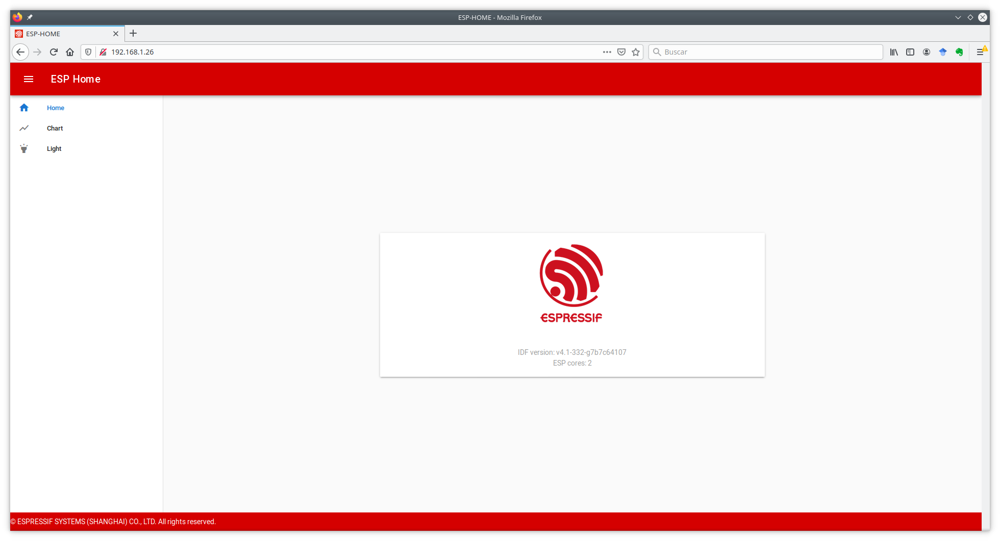
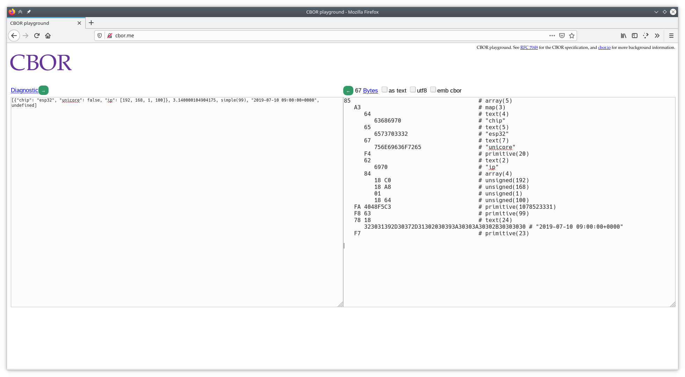

# Práctica 3. Servidores REST y representación de la información. JSON y CBOR

## Objetivos

* Entender los mecanismos ofrecidos por ESP-IDF para la creación de 
un servidor REST HTTP.

* Implementar, a través de los mecanismos ofrecidos por ESP-IDF, una API
REST extendida en el ESP32.

* Entender los conceptos básicos de representación de datos a través
de JSON.

* Implementar, a través de la biblioteca `cJSON`, un tipo de mensaje
personalizado para los intercambios de datos entre cliente y servidor.

* Entender los conceptos básicos de representación de datos a través
de CBOR, y evaluar sus ventajas con respecto a JSON.

* Implementar, a través de la biblioteca `tinycbor`, un tipo de mensaje
personalizado para los intercambios de datos entre cliente y servidor, comparando
los tamaños de *payload* con respecto al intercambio JSON.

## Desarrollo de un servidor REST en ESP-IDF

En la primera parte de la práctica, veremos cómo desarrollar, utilizando las
funcionalidades ofrecidas por ESP-IDF, un servidor HTTP que exponga una API
REST mediante la cual será posible interactuar, en modos lectura y escritura,
con un servidor (en nuestro caso, un dispositivo ESP32). 
Concretamente, trabajaremos con el ejemplo 
`example/protocols/http_server/restful_server` de la distribución de IDF.

### Descripción de la API

El ejemplo que estudiaremos construye una sencilla interfaz (API) con
tres *endpoints* que permiten interactuar con distintas funcionalidades
del ESP32. Nótese que tanto las URLs como la funcionalidad asociada a ellas
es totalmente personalizable, y puede ser ampliada de acuerdo a las necesidades
de nuestra aplicación.

La siguiente tabla resume la funcionalidad de cada *endpoint*, así como
posibles ejemplos de valores enviados o devueltos a/por el servidor:


| API                        | Método | Ejemplo de recurso leído/escrito                      | Descripción                                                                              | URL |
| -------------------------- | ------ | ----------------------------------------------------- | ---------------------------------------------------------------------------------------- | -------- |
| `/api/v1/system/info`      | `GET`  | {<br />version:"v4.0-dev",<br />cores:2<br />}        | Utilizado por los clientes para obtener información de la placa (versión, número de cores, ...)| `/`      |
| `/api/v1/temp/raw`         | `GET`  | {<br />raw:22<br />}                                  | Utilizado por los clientes para obtener datos de temperatura desde un sensor (no disponible en el ESP32)          | `/chart` |
| `/api/v1/light/brightness` | `POST` | { <br />red:160,<br />green:160,<br />blue:160<br />} | Utilizado por los clientes para escribir en la placa valores de control para controlar la luminosidad de LEDs | `/light` |

### Configuración y compilación del ejemplo

En primer lugar, configura, compila y flashea el ejemplo mencionado. En este
caso, las instrucciones se dividen en dos partes: compilación del *firmware*
para el ESP32, y preparación de un cliente web sencillo que nos permitirá 
observar la interacción con el mismo. Esta última parte no es estrictamente
necesaria, pero nos ayudará en la interacción con el dispositivo de forma 
visual hasta que veamos cómo hacerlo a través de línea de comandos.

A través del menú de configuración,
configura un nombre para el dispositivo (por ejemplo, `esp-home-nombre`),
e indica que el modo de despliegue (`Website deploy mode`) sea
*Deploy website to SPI Nor Flash*. Por último, configura las credenciales
del punto de acceso WiFi al que conectará, siguiendo la metodología habitual.

En segundo lugar, necesitamos instalar los componentes necesarios para 
desplegar el cliente web. Para ello, navega al subdirectorio `front/web-demo`,
donde reside el código fuente del cliente. Ejecuta los siguientes comandos
para instalar las dependencias necesarias:

```sh
sudo apt-get install npm node-vue*
npm install
npm run build 
```

Dependiendo del sistema, en este punto se puede producir un error de openssl ("digital envelope routines::unsupported").
Si fuese el caso, es preciso establecer la variable de entorno adecuada y volver a ejecutar el comando `npm run build`.

* En Linux/MacOS:

```sh
export NODE_OPTIONS=--openssl-legacy-provider
```

* En Windows:

```
set NODE_OPTIONS=--openssl-legacy-provider
```

Una vez construido el front-end, ya podrás ejecutar, desde el directorio base del ejemplo, la
orden de compilación y flasheado:

```sh
idf.py build
idf.py flash
idf.py monitor
```

### Interacción con el dispositivo vía interfaz web

Si todo ha ido bien, podrás observar en la salida de monitorización la
IP proporcionada al ESP32. Abre un navegador en la máquina virtual o 
en tu PC (estando conectada a la misma red que tu ESP32), navega hacia 
la dirección IP del ESP32 o simplemente `esp-home-nombre` si el equipo host soporta mDNS, 
y deberías observar una página como la siguiente:



Esta es una página web servida por el propio ESP32, que te permitirá interactuar
con él. Concretamente, la página dispone de dos funcionalidades:

* **Chart**: consulta periódicamente el valor de temperatura devuelto por
el ESP32 a través del *endpoint* `/api/v1/temp/raw`.

* **Light**: permite enviar al ESP32 nuevos valores para las tres componentes
de luminosidad que hipotéticamente podría equipar el ESP32.

!!! note "Tarea 3.1"
    Interactúa con el sensor de luminosidad del ESP32 enviando distintos
    valores. Observa cómo la salida de monitorización del ESP32 responde mostrando
    los valores recibidos. Analiza el tráfico generado para una de dichas peticiones
    utilizando Wireshark. ¿Cómo se codifican los datos en el envío? ¿Cómo se
    codifican los datos periódicos de temperatura recibidos?

### Interacción con el dispositivo vía línea de comandos (`curl`)

`curl` es una herramienta orientada a la transferencia de archivos por red.     Entre
otras (muchas) funcionalidades, `curl` soporta los métodos `GET` y `PUT` del 
protocolo HTTP, justo las necesarias para realizar peticiones de lectura y 
escritura sobre nuestro servidor HTTP REST. 

!!! note "Nota"
	La versión de `curl` de `PowerShell` en Windows hace uso de `Invoke-WebRequest` 
	y es mejor evitarla. Es preferible usar la versión de `curl` de `CMD` que es más
	compatible con las versiones UNIX (Linux/MacOS). 

Concretamente, para realizar una petición HTTP `GET` sobre nuestro servidor, 
podemos ejecutar:

```sh
curl http://IP/URI
```

Por ejemplo, la petición:

```sh
curl http://192.168.1.26/api/v1/temp/raw
```
(siendo `192.168.1.26` la IP del ESP32)
nos responderá con el valor de temperatura instantánea.

Del mismo modo, para escribir (método `POST`) sobre el servidor, utilizaremos
el parámetro `-d`, seguido del recurso que queramos enviar. Ten en cuenta
que es responsabilidad del cliente enviar un recurso bien formado e interpretable
por el dispositivo:

```sh
curl -d '{"red":70,"green":80,"blue":99}' -H "Content-Type: application/json" 
-X POST http://192.168.1.26/api/v1/light/brightness
```

Observa que hemos incluido el tipo de recurso enviado (`JSON`) y la operación
solicitada (`POST`). Volveremos a esto en breve.

!!! note "Tarea 3.2"
    Comprueba que, efectivamente, el tráfico generado por las anteriores órdenes
    es el mismo que el que observaste en el caso del  cliente web. Observa qué 
    ocurre si consultas un *endpoint* inexistente, o si envías un JSON mal
    formado o con información incorrecta.

### Interacción con el dispositivo vía Node-RED

Para interactuar con el dispositivo vía Node-RED, simplemente despliega un flujo
que contenga un nodo de tipo `HTTP Request`. En su cuadro de diálogo de configuración,
podrás incluir tanto el método a utilizar (e.g. `GET` o `POST`) como el *endpoint* (URL)
destino y, opcionalmente, los datos a enviar si esto es necesario.

!!! note "Tarea 3.3"
    Comprueba que, efectivamente, el tráfico generado por un flujo que utilice un nodo de 
    interacción HTTP es el esperado, y el comportamiento del ESP32 también. En el caso de 
    necesitar enviar un objeto JSON, puedes investigar cómo formarlo con los nodos correspondientes,
    aunque esto lo veremos en las siguientes secciones.

### Implementación de un servidor HTTP con API REST

La implementación de un servidor HTTP en ESP-IDF se delega al componente
*HTTP Server*, que implementa toda la funcionalidad necesaria para tal fin
de forma eficiente y ligera. La construcción de un servidor puede
resumirse en tres funciones principales (observa la implementación de la
función `start_rest_server` en el fichero `rest_server.c`) del ejemplo:

* `httpd_start`: crea una instancia de servidor HTTP, y aloja recursos para
ella según la configuración proporcionada. En función del tráfico generado
(URIs solicitadas), se utilizarán manejadores específicos definidos por el 
usuario para analizarlo y, en caso necesario, enviar respuestas al cliente
correspondiente.

* `httpd_stop`: finaliza el servidor HTTP, cerrando cualquier conexión
previamente establecida con clientes.

* `httpd_register_uri_handler`: registra un manejador (una función definida
por el usuario) para tratar una petición sobre una URI determinada. La estructura
proporcionada dispone de campos para indicar la URI destino (`uri`), el 
método que se espera recibir (`method`, por ejemplo `HTTPD_GET`
o `HTTPD_POST`) y un puntero a una función que procesará la petición
recibida a través de la URI indicada. Dicha función sólo se ejecutará si
el método coincide con el indicado.

La función `start_rest_server` del ejemplo proporciona los mecanismos básicos
para la creación de la API anteriormente descrita. Así, para crear el 
*endpoint* `/api/v1/system/info`, procederemos, en primer lugar, registrándolo
en el servidor, preparando previamente la estructura de tipo `httpd_uri_t`:

```c
httpd_uri_t system_info_get_uri = {
        .uri = "/api/v1/system/info",
        .method = HTTP_GET,
        .handler = system_info_get_handler,
        .user_ctx = rest_context
    };
    httpd_register_uri_handler(server, &system_info_get_uri);
```

En este caso, la operación asociada a la invocación del handler será, exclusivamente
`GET`; de hecho, si invocamos a un método `POST` sobre este *endpoint*, el 
servidor nos responderá automáticamente con un aviso que indicará que dicho método
no está soportado.

El procesamiento de la petición `GET` se realiza en la función 
`system_info_get_handler`, y el esquema que se sigue es, en cualquier caso,
sencillo:

```c
static esp_err_t system_info_get_handler(httpd_req_t *req)
{
    // Preparación del tipo de respuesta.
    httpd_resp_set_type(req, "application/json");

    // Preparación del buffer de respuesta.
    char * buffer = // En el ejemplo preparamos un buffer JSON.

    // Envío de respuesta.
    https_resp_sendstr( req, buffer  );

    return ESP_OK;
```

Alternativamente, si la respuesta es binaria, podríamos utilizar la función
`https_resp_send( req, buffer, buffer_len  )` para procesarla y enviarla 
(lo necesitarás para enviar un buffer binario CBOR).

La creación de un *endpoint* con soporte para método `POST`
resulta algo más larga, aunque el registro del mismo no difiere del ejemplo
anterior:

```c
    /* URI handler for light brightness control */
    httpd_uri_t light_brightness_post_uri = {
        .uri = "/api/v1/light/brightness",
        .method = HTTP_POST,
        .handler = light_brightness_post_handler,
        .user_ctx = rest_context
    };
    httpd_register_uri_handler(server, &light_brightness_post_uri);
```

Observa el cuerpo de la función `light_brightness_post_handler`. La recepción
del objeto enviado por parte del cliente se realiza en base a múltiples
invocaciones a la rutina `httpd_req_recv`:

```c
/* Simple handler for light brightness control */
static esp_err_t light_brightness_post_handler(httpd_req_t *req)
{
    int total_len = req->content_len;
    int cur_len = 0;
    char *buf = ((rest_server_context_t *)(req->user_ctx))->scratch;
    int received = 0;
    if (total_len >= SCRATCH_BUFSIZE) {
        /* Respond with 500 Internal Server Error */
        httpd_resp_send_err(req, HTTPD_500_INTERNAL_SERVER_ERROR, "content too long");
        return ESP_FAIL;
    }
    while (cur_len < total_len) {
        received = httpd_req_recv(req, buf + cur_len, total_len);
        if (received <= 0) {
            /* Respond with 500 Internal Server Error */
            httpd_resp_send_err(req, HTTPD_500_INTERNAL_SERVER_ERROR, "Failed to post control value");
            return ESP_FAIL;
        }
        cur_len += received;
    }
    buf[total_len] = '\0';

    /// A partir de este punto, disponemos en buf del objeto recibido vía HTTP.
    /// ... 
```

!!! danger "Tarea entregable"
    Observa y estudia los códigos de los manejadores implementados en el ejemplo. 
    Extiende la API proporcionada para crear un nuevo *endpoint* que permita
    obtener la temperatura (número aleatorio), pero transformándola a 
    grados Fahrenheit. En este caso, el valor devuelto en el fichero 
    JSON será un número en punto flotante (en la siguiente sección te
    se explicará cómo hacerlo, por lo que de momento puedes enviar 
    únicamente la parte entera del mismo). 

## Representación de la información. JSON

JSON es un formato de representación de datos en modo texto para el
intercambio de datos entre sistemas informáticos. Se creó inicialmente
como una notación literal de los objetos Javascript, pero dada su amplia
aceptación (realmente como alternativa a XML), se considera a día de hoy
un componente totalmente independiente al lenguaje.

Los tipos de datos soportados por JSON incluyen:

* Valores numéricos: permitiendo números con y sin signo, y con parte
decimal en notación separada por puntos.

* Cadenas: secuencias de cero o más caracteres.

* Booleanos: `true` y `false`.

* Arrays: listas ordenadas de cero o más valores de cualquier tipo, separados
por comas y encerrados entre corchetes.

* Objetos: colecciones no ordenadas de pares `<nombre>:<valor>`, separados
por comas y encerrados entre llaves.

ESP-IDF incluye el componente [cJSON](https://github.com/DaveGamble/cJSON)
para parsear y construir objetos de tipo JSON de forma sencilla y consistente.
La biblioteca cJSON representa datos JSON utilizando una estructura sencilla, 
véase:

```c
/* The cJSON structure: */
typedef struct cJSON
{
    struct cJSON *next;
    struct cJSON *prev;
    struct cJSON *child;
    int type;
    char *valuestring;
    /* writing to valueint is DEPRECATED, use cJSON_SetNumberValue instead */
    int valueint;
    double valuedouble;
    char *string;
} cJSON;
```

El campo `type` informa sobre el tipo de dato contenido en el objeto, véase:

* `cJSON_False` (`cJSON_IsFalse()`): representa un valor booleano falso.
* `cJSON_True` (`cJSON_IsTrue()`): representa un valor booleano verdadero.
* `cJSON_NULL` (`cJSON_IsNULL()`): representa un valor nulo.
* `cJSON_Number` (`cJSON_IsNumber()`): representa un valor numérico. Dicho
valor se almacena en el campo `valuedouble` como flotante y en `valueint`
como entero.
* `cJSON_String` (`cJSON_IsString()`): representa un valor cadena, y se 
almacena en el campo `valuestring` como un array de bytes terminado por
el carácter nulo ('\0').
* `cJSON_Array` (`cJSON_IsArray()`): representa un array de valores. En el
campo `child` se almacena una lista enlazada con los elementos del array, 
terminada en NULL.
* `cJSON_Object` (`cJSON_IsObject()`): representa un valor objeto. Sus
valores se almacenan de la misma manera que el array anterior, pero en el
campo `string` se almacenan además las claves del objeto a modo de lista.

### Creación y parseado de una estructura JSON

Para cada tipo de datos, existe una rutina asociada con nombre
`cJSON_Create...` que permite crear un item del tipo correspondiente.
Todas estas funciones alojan memoria suficiente como para albergar 
el dato creado. 

Dado un objeto JSON en forma de cadena, es posible analizarlo (parsearlo)
utilizando la función `cJSON_Parse`:

```c
cJSON * json = cJSON_Parse( string );
```

Para imprimir el contenido de una estructura JSON en modo texto, podemos
hacer uso de la función `cJSON_Print(json)`:

```c
char * string = cJSON_Print( json );
```

### Ejemplos

Observa de nuevo el contenido de las funciones manejadoras en nuestro servidor
REST. Concretamente, céntrate en la función `system_info_get_handler`, que
construye un objeto JSON con dos campos, de tipo cadena ("version")
y numérico ("cores"):

```c
/* Simple handler for getting system handler */
static esp_err_t system_info_get_handler(httpd_req_t *req)
{
    // Preparación del tipo de datos de la respuesta.
    httpd_resp_set_type(req, "application/json");

    // Creación del objeto JSON.
    cJSON *root = cJSON_CreateObject();

    // Obtención del dato.
    esp_chip_info_t chip_info;
    esp_chip_info(&chip_info);

    // Anyadimos un campo de tipo cadena.
    cJSON_AddStringToObject(root, "version", IDF_VER);

    // Anyadimos un campo de tipo numérico.
    cJSON_AddNumberToObject(root, "cores", chip_info.cores);

    // Imprimimos a cadena previo al envío.
    const char *sys_info = cJSON_Print(root);

    // Enviamos cabecera + objeto JSON en modo texto vía HTTP.
    httpd_resp_sendstr(req, sys_info);

    // Liberamos recursos.
    free((void *)sys_info);

    // Liberamos recursos del objeto JSON.
    cJSON_Delete(root);

    return ESP_OK;
}
```

La función `light_brightness_post_handler` realiza un parseado del objeto
JSON recibido. Observa su cuerpo:

```c
    // buf contiene la cadena recibida a través de HTTP (método POST).
    // ...
    // Parseamos el objeto JSON.
    cJSON *root = cJSON_Parse(buf);

    // Obtenemos tres valores numéricos (RGB).
    int red = cJSON_GetObjectItem(root, "red")->valueint;
    int green = cJSON_GetObjectItem(root, "green")->valueint;
    int blue = cJSON_GetObjectItem(root, "blue")->valueint;

    // Mostramos por pantalla los valores parseados.
    ESP_LOGI(REST_TAG, "Light control: red = %d, green = %d, blue = %d", red, green, blue);

    // Liberamos recursos JSON.
    cJSON_Delete(root);

    // Enviamos una respuesta generica en modo texto.
    httpd_resp_sendstr(req, "Post control value successfully");

    return ESP_OK;
```

!!! danger "Tarea entregable"
    Extiende la tarea anterior para añadir el dato en formato punto flotante
    de la temperatura en grados Fahrenheit.

!!! danger "Tarea entregable"
    Crea un nuevo *endpoint* que utilice un formato más complejo de objetos
    JSON, incluyendo distintos tipos de datos que puedan dar respuesta a 
    un hipotético entorno IoT. Documenta la API generada y el formato de los
    objetos que has diseñado. Puedes, si así lo deseas, incluir capturas
    Wireshark para ilustrar el intercambio de mensajes producido. Nos interesará,
    especialmente, el número de bytes transportados para enviar/recibir tus
    mensajes JSON.

## Representación de la información. CBOR

CBOR (*Concise Binary Object Representation*) es el formato de serialización
de datos recomendado en muchos de los *stacks* IoT, específicamente en aquellos
basados en CoAP. Pese a ser un formato binario, CBOR guarda similitudes con
JSON, ya que sigue su mismo modelo de datos: valores numéricos, *strings*,
arrays, mapas (objetos en JSON) y valores booleanos y nulos. 

Sin embargo, a diferencia de JSON, un objeto CBOR es autodescriptivo, y en
este punto radica una de sus ventajas: es posible intercambiar datos entre
un cliente y un servidor sin ceñirse a un esquema de datos concreto conocido
por ambas partes.

El hecho de ser un formato binario implica mejoras sustanciales con respecto a
JSON, por ejemplo al transportar datos binarios (claves de cifrado, datos
gráficos, o valores flotantes sensorizados, entre otros muchos); estos
datos solían codificarse en JSON utilizando, por ejemplo, formato *base64*, 
añadiendo complejidad al proceso de codificación/decodificación. 
En general, el uso de un formato binario implica menor complejidad a la hora
de ser integrado en aplicaciones, y es por esta razón por la que se considera
óptimo para nodos de bajas prestaciones, típicos en IoT. 

El formato CBOR está documentado en el [RFC 7049](https://tools.ietf.org/html/rfc7049),
y por tanto se considera un estándar bien documentado y estable de cara al futuro.

### CBOR en el ESP32

ESP-IDF incluye la biblioteca `tinyCBOR` como implementación ligera del estándar,
que permite tanto codificar distintos tipos de datos a formato CBOR, parsear
estructuras CBOR y convertir dichas estructuras tanto a formato texto visualizable
como a JSON. TinyCBOR está mantenido como proyecto de software libre por parte
de Intel, y su documentación detallada (se sugiere consultarla) se encuentra
disponible en el siguiente [enlace](https://intel.github.io/tinycbor/current/).

Estudiaremos el funcionamiento de `tinyCBOR` a través de un ejemplo
funcional (lo puedes encontrar en `examples/protocols/cbor`). El ejemplo
muestra los mecanismos necesarios para, en primer lugar, crear un objeto
CBOR completo utilizando la biblioteca, y en segundo lugar, el mecanismo
para convertir dicho objeto a representación JSON, así como para parsearlo
manualmente.

En primer lugar, compila, flashea y ejecuta el ejemplo. 
Verás que la salida debería ser similar a la siguiente:

```sh
I (320) example: encoded buffer size 67
I (320) example: convert CBOR to JSON
[{"chip":"esp32","unicore":false,"ip":[192,168,1,100]},3.1400001049041748,"simple(99)","2019-07-10 09:00:00+0000","undefined"]
I (340) example: decode CBOR manually
Array[
  Map{
    chip
    esp32
    unicore
    false
    ip
    Array[
      192
      168
      1
      100
    ]
  }
  3.14
  simple(99)
  2019-07-10 09:00:00+0000
  undefined
]
```

Observa que la estructura del objeto CBOR será medianamente compleja: constará
de un array formado por cinco elementos:

1. Un *mapa* (conjunto no ordenado de pares *clave-valor*), combinando cadenas,
booleanos y un segundo array para especificar una dirección IP.
2. Un valor flotante (3.14).
3. Un valor numérico "simple" (99).
4. Una fecha (en forma de cadena).
5. Un valor indefinido.

El *firmware* procede en tres etapas:

### Etapa 1: creación (codificación) del objeto CBOR

Observa el cuerpo de la tarea principal (`app_main`). El codificador 
CBOR se basa en dos variables:

```c
CborEncoder Root_encoder; // Codificador CBOR.
uint8_t buf[100];         // Buffer para alojar el objeto CBOR (array de bytes). 
```

En segundo lugar, y ya que utilizaremos un array y un mapa, necesitaremos
constructores especiales para dichos objetos:

```c
// Creación de Array.
CborEncoder array_encoder;
CborEncoder map_encoder;

cbor_encoder_create_array(&root_encoder, &array_encoder, 5); // [
  // 1. Creación del Mapa.
  cbor_encoder_create_map(&array_encoder, &map_encoder, 3); // {
```

A partir de este punto, podemos proceder con la construcción de los objetos
siguiendo el esquema deseado:

```c
  // chip: esp32 (cadena:cadena)
  cbor_encode_text_stringz(&map_encoder, "chip");
  cbor_encode_text_stringz(&map_encoder, "esp32");

  // unicore: false (cadena:booleano)
  cbor_encode_text_stringz(&map_encoder, "unicore");
  cbor_encode_boolean(&map_encoder, false);

  // IP:[192,168,1,100] (cadena:array)
  cbor_encode_text_stringz(&map_encoder, "ip");

    CborEncoder array2;

    cbor_encoder_create_array(&map_encoder, &array2, 4); // [

    // Valores numéricos.
    cbor_encode_uint(&array2, 192);
    cbor_encode_uint(&array2, 168);
    cbor_encode_uint(&array2, 1);
    cbor_encode_uint(&array2, 100);

    cbor_encoder_close_container(&map_encoder, &array2);        // ]

 cbor_encoder_close_container(&array_encoder, &map_encoder); // }

// 2. Flotante
cbor_encode_float(&array_encoder, 3.14);

// 3. Valor simple
cbor_encode_simple_value(&array_encoder, 99);

// 4. Cadena
cbor_encode_text_stringz(&array_encoder, "2019-07-10 09:00:00+0000");

// 5. Undefined value.
cbor_encode_undefined(&array_encoder);
cbor_encoder_close_container(&root_encoder, &array_encoder); // ]

// Mostramos el tamaño del buffer creado.
ESP_LOGI(TAG, "encoded buffer size %d", cbor_encoder_get_buffer_size(&root_encoder, buf));
```

### Etapa 2: conversión a JSON

La conversión a JSON (típicamente por motivos de visualización o depuración), 
puede realizarse del siguiente modo:

```c
    // Initialize the cbor parser and the value iterator
    cbor_parser_init(buf, sizeof(buf), 0, &root_parser, &it);

    ESP_LOGI(TAG, "convert CBOR to JSON");
    // Dump the values in JSON format
    cbor_value_to_json(stdout, &it, 0);
```

### Etapa 3: parseado manual de un objeto CBOR

Por último, el parseado manual del objeto CBOR se deja como ejercicio de estudio
para el alumno, y está implementado en la función `example_dump_cbor_buffer`
del ejemplo. Básicamente, la función itera por cada uno de los elementos
del objeto CBOR, consultando el tipo de cada elemento y actuando en consecuencia.
Para aquellos tipos complejos (e.g. arrays o mapas), la función se invoca
recursivamente hasta encontrar un elemento de tipo básico. En este caso, 
simplemente imprime por pantalla su valor (e.g. en el caso de un entero,
caso `CborIntegerType`).

!!! danger "Tarea entregable"
    Se pide extender la API REST con un nuevo *endpoint* que permita obtener
    la misma información que el *endpoint* JSON desarrollado en la anterior
    tarea, pero en esta ocasión, utilizando formato CBOR. El objetivo del 
    ejercicio es comparar la cantidad de tráfico generado en cada 
    representación, por lo que se sugiere que el objeto intercambiado 
    sea relativamente complejo (es decir, incluya disintos tipos de datos numéricos,
    arrays, o mapas). A continuación se incluyen notas adicionales que te 
    permitirán depurar tu desarrollo, observando los valores devueltos
    por el servidor HTTP.

### Notas adicionales: creación y consulta de un *endpoint* CBOR en la API REST

Las modificaciones a realizar en la función manejadora del *endpoint* para 
responder con un objeto CBOR son mínimas. De hecho, se centran simplemente en 
el tipo de respuesta y el mecanismo a usar para enviarla, véase:

```c
static esp_err_t system_info_get_handler(httpd_req_t *req)
{
    // Tipo de respuesta.
    httpd_resp_set_type(req, "application/cbor");

    CborEncoder root_encoder;
    uint8_t buf[100];

    // Codificador CBOR.
    cbor_encoder_init(&root_encoder, buf, sizeof(buf), 0);

    // Codificamos CBOR.
    // ...

    // Enviamos respuesta, consultando previamente el tamaño del buffer codificado.
    httpd_resp_send(req, (char*)buf, cbor_encoder_get_buffer_size( &root_encoder, buf));

    return ESP_OK;
```

Para consultar desde línea de comandos sobre este *endpoint*, podemos utilizar
directamente `curl`, volcando la salida recibida a un fichero (por
ejemplo, `output.cbor`):

```sh
curl http://192.168.1.26/api/v1/system/info > output.cbor
```

Si visualizas el contenido del fichero, verás que contiene datos binarios
difícilmente interpretables. A continuación veremos distintos mecanismos
de visualización.

### Notas adicionales: visualización de datos CBOR

Una opción de visualización consiste en utilizar la web [cbor.me](http://cbor.me/).
En el panel derecho, podrás pegar el contenido binario leído. Si necesitas
realizar la conversión antes de pegarlo en la web, puedes hacerlo con la orden:

```sh
xxd -ps output.cbor
```

Un ejemplo de salida (a pegar en el panel derecho de la web), podría ser:

```sh
$ xxd -ps output.cbor 
85a3646368697065657370333267756e69636f7265f46269708418c018a8
011864fa4048f5c3f8637818323031392d30372d31302030393a30303a30
302b30303030f7
```

Deberías observar una salida similar a la siguiente (ten en cuenta que 
la herramiente automáticamente indenta el contenido del panel derecho; 
recuerda que simplemente debes pegar la salida generada por `xxd`):



<!--Otra opción de visualización puede ser un programa Python (podrías integrarlo
en tu servidor TCP/UDP, por ejemplo), que haga uso del módulo `cbor2`
 ([documentación](https://pypi.org/project/cbor2/)). Para
comprobar su funcionamiento, primero instálalo:

```sh
pip install cbor2
```

Y comprueba si efectivamente funciona utilizando el siguiente programa Python:

```python
from cbor2 import dumps, loads, dump, load

with open('output.cbor', 'rb') as fp:
    obj = load(fp)

print(obj)
```

Al ejecutarlo, observarás el contenido del objeto:

```sh
python cbor.py
[{'chip': 'esp32', 'unicore': False, 'ip': [192, 168, 1, 100]}, 3.140000104904175, CBORSimpleValue(value=99), '2019-07-10 09:00:00+0000', undefined]
```
-->