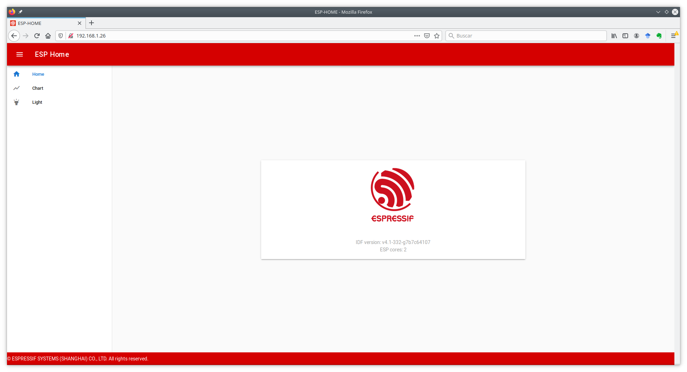

# Práctica 5. Servidores REST y representación de la información

## Objetivos

* Entender los mecanismos ofrecidos por ESP-IDF para la creación de 
un servidor REST HTTP.

* Entender los conceptos básicos de representación de datos a través
de JSON.

* Entender los conceptos básicos de representación de datos a través
de CBOR, y evaluar sus ventajas con respecto a JSON.

## Desarrollo de un servidor REST en ESP-IDF

En la primera parte de la práctica, veremos cómo desarrollar, utilizando las
funcionalidades ofrecidas por ESP-IDF, un servidor HTTP que exponga una API
REST mediante la cual será posible interactuar, en modos lectura y escritura,
con un servidor (en nuestro caso, un dispositivo ESP32). 
Concretamente, trabajaremos con el ejemplo 
`example/protocols/http_server/rest_server` de la distribución de IDF 
(versión 4.1).

### Descripción de la API

El ejemplo que estudiaremos construye una sencilla interfaz (API) con
tres *endpoints* que permiten interactuar con distintas funcionalidades
del ESP32. Nótese que tanto las URLs como la funcionalidad asociada a ellas
es totalmente personalizable, y puede ser ampliada de acuerdo a las necesidades
de nuestra aplicación.

La siguiente tabla resume la funcionalidad de cada *endpoint*, así como
posibles ejemplos de valores enviados o devueltos a/por el servidor:


| API                        | Método | Ejemplo de recurso leído/escrito                      | Descripción                                                                              | URL |
| -------------------------- | ------ | ----------------------------------------------------- | ---------------------------------------------------------------------------------------- | -------- |
| `/api/v1/system/info`      | `GET`  | {<br />version:"v4.0-dev",<br />cores:2<br />}        | Utilizado por los clientes para obtener información de la placa (versión, número de cores, ...)| `/`      |
| `/api/v1/temp/raw`         | `GET`  | {<br />raw:22<br />}                                  | Utilizado por los clientes para obtener datos de temperatura desde un sensor (no disponible en el ESP32)          | `/chart` |
| `/api/v1/light/brightness` | `POST` | { <br />red:160,<br />green:160,<br />blue:160<br />} | Utilizado por los clientes para escribir en la placa valores de control para controlar la luminosidad de LEDs | `/light` |

### Configuración y compilación del ejemplo

En primer lugar, configura, compila y flashea el ejemplo mencionado. En este
caso, las instrucciones se dividen en dos partes: compilación del *firmware*
para el ESP32, y preparación de un cliente web sencillo que nos permitirá 
observar la interacción con el mismo. Esta última parte no es estrictamente
necesaria, pero nos ayudará en la interacción con el dispositivo de forma 
visual hasta que veamos cómo hacerlo a través de línea de comandos.

A través del menú de configuración,
configura un nombre para el dispositivo (por ejemplo, 'esp_home_tunombre'),
e indica que el modo de despliegue (`Website deploy mode`) sea
*Deploy website to SPI Nor Flash*. Por último, configura las credenciales
del punto de acceso WiFi al que conectará, siguiendo la metodología habitual.

En segundo lugar, necesitamos instalar los componentes necesarios para 
desplegar el cliente web. Para ello, navega al subdirectorio `front/web-demo`,
donde reside el código fuente del cliente. Ejecuta los siguientes comandos
para instalar las dependencias necesarias:

```sh
sudo apt-get install npm node-vue*
npm install
npm run build 
```

En este punto, ya podrás ejecutar, desde el directorio base del ejemplo, la
orden de compilación y flasheado:

```sh
idf.py build
idf.py flash
idf.py monitor
```

### Interacción con el dispositivo vía interfaz web

Si todo ha ido bien, podrás observar en la salida de monitorización la
IP proporcionada al ESP32. Abre un navegador en la máquina virtual o 
en tu PC (estando conectada a la misma red que tu ESP32), navega hacia 
la dirección IP del ESP32, y deberías observar una página como la siguiente:



Esta es una página web servida por el propio ESP32, que te permitirá interactuar
con él. Concretamente, la página dispone de dos funcionalidades:

* **Chart**: consulta periódicamente el valor de temperatura devuelto por
el ESP32 a través del *endpoint* `/api/v1/temp/raw`.

* **Light**: permite enviar al ESP32 nuevos valores para las tres componentes
de luminosidad que hipotéticamente podría equipar el ESP32.

!!! note "Tarea"
    Interactúa con el sensor de luminosidad del ESP32 enviando distintos
    valores. Observa cómo la salida de monitorización del ESP32 responde mostrando
    los valores recibidos. Analiza el tráfico generado para una de dichas peticiones
    utilizando Wireshark. ¿Cómo se codifican los datos en el envío? ¿Cómo se
    codifican los datos periódicos de temperatura recibidos?

### Interacción con el dispositivo vía línea de comandos (`curl`)

`curl` es una herramienta orientada a la transferencia de archivos por red.     Entre
otras (muchas) funcionalidades, `curl` soporta los métodos `GET` y `PUT` del 
protocolo HTTP, justo las necesarias para realizar peticiones de lectura y 
escritura sobre nuestro servidor HTTP REST. 

Concretamente, para realizar una petición HTTP `GET` sobre nuestro servidor, 
podemos ejecutar:

```sh
curl http://IP/URI
```

Por ejemplo, la petición:

```sh
curl http://192.168.1.26/api/v1/temp/raw
```
nos responderá con el valor de temperatura instantánea.

Del mismo modo, para escribir (método `POST`) sobre el servidor, utilizaremos
el parámetro `-d`, seguido del recurso que queramos enviar. Ten en cuenta
que es responsabilidad del cliente enviar un recurso bien formado e interpretable
por el dispositivo:

```sh
curl -d '{"red":70,"green":80,"blue":99}' -H "Content-Type: application/json" 
-X POST http://192.168.1.26/api/v1/light/brightness
```

Observa que hemos incluido el tipo de recurso enviado (`JSON`) y la operacion
solicitada (`POST`). Volveremos a esto en breve.

!!! note "Tarea"
    Comprueba que, efectivamente, el tráfico generado por las anteriores órdenes
    es el mismo que el que observaste en el caso del  cliente web. Observa qué 
    ocurre si consultas un *endpoint* inexistente, o si envías un JSON mal
    formado o con información incorrecta.

### Implementación de un servidor HTTP con API REST

La implementación de un servidor HTTP en ESP-IDF se delega al componente
*HTTP Server*, que implementa toda la funcionalida necesaria para tal fin
de forma eficiente y ligera. La construcción de un servidor puede
resumirse en tres funciones principales (observa la implementación de la
funcion `start_rest_server` en el fichero `rest_server.c`) del ejemplo:

* `httpd_start`: crea una instancia de servidor HTTP, y aloja recursos para
ella según la configuración proporcionada. En función del tráfico generado
(URIs solicitadas), se utilizarán manejadores específicos definidos por el 
usuario para analizarlo y, en caso necesario, enviar respuestas al cliente
correspondiente.

* `httpd_stop`: finaliza el servidor HTTP, cerrando cualquier conexión
previamente establecida con clientes.

* `httpd_register_uri_handler`: registra un manejador (una función definida
por el usuario) para tratar una petición sobre una URI determinada. La estructura
proporcionada dispone de campos para indicar la URI destino (`uri`), el 
método que se espera recibir (`method`, por ejemplo `HTTPD_GET`
o `HTTPD_POST`) y un puntero a una función que procesará la petición
recibida a través de la URI indicada. Dicha función sólo se ejecutará si
el método coincide con el indicado.

!!! danger "Tarea entregable"
    Observa los códigos de los manejadores implementados en el ejemplo. 
    Extiende la API proporcionada para crear un nuevo *endpoint* que permita
    obtener la temperatura (número aleatorio), pero transformándola a 
    grados Fahrenheit. En este caso, el valor devuelto en el fichero 
    JSON será un número en punto flotante (en la siguiente sección te
    se explicará cómo hacerlo, por lo que de momento puedes enviar 
    únicamente la parte entera del mismo). 

## Representación de la información. JSON

JSON es un formato de representación de datos en modo texto para el
intercambio de datos entre sistemas informáticos. Se creó inicialmente
como una notación literal de los objetos Javascript, pero dada su amplia
aceptación (realmente como alternativa a XML), se considera a día de hoy
un componente totalmente independiente al lenguaje.

Los tipos de datos soportados por JSON incluyen:

* Valores numéricos: permitiendo números con y sin signo, y con parte
decimla en notación separada por puntos.

* Cadenas: secuencias de cero o más caracteres.

* Booleanos: `true` y `false`.

* Arrays: listas ordenadas de cero o más valores de cualquier tipo, separados
por comas y encerrados entre corchetes.

* Objetos: colecciones no ordenadas de pares `<nombre>:<valor>`, separados
por comas y encerrados entre llaves.

ESP-IDF incluye el componente [cJSON](https://github.com/DaveGamble/cJSON)
para parsear y construir objetos de tipo JSON de forma sencilla y consistente.
La biblioteca cJSON representa datos JSON utilizando una estructura sencilla, 
véase:

```c
/* The cJSON structure: */
typedef struct cJSON
{
    struct cJSON *next;
    struct cJSON *prev;
    struct cJSON *child;
    int type;
    char *valuestring;
    /* writing to valueint is DEPRECATED, use cJSON_SetNumberValue instead */
    int valueint;
    double valuedouble;
    char *string;
} cJSON;
```

El campo `type` informa sobre el tipo de dato contenido en el objeto, véase:

* `cJSON_False` (`cJSON_IsFalse()`): representa un valor booleano falso.
* `cJSON_True` (`cJSON_IsTrue()`): representa un valor booleano verdadero.
* `cJSON_NULL` (`cJSON_IsNULL()`): representa un valor nulo.
* `cJSON_Number` (`cJSON_IsNumber()`): representa un valor numérico. Dicho
valor se almacena en el campo `valuedouble` como flotante y en `valueint`
como entero.
* `cJSON_String` (`cJSON_IsString()`): representa un valor cadena, y se 
almacena en el campo `valuestring` como un array de bytes terminado por
el carácter nulo ('\0').
* `cJSON_Array` (`cJSON_IsArray()`): representa un array de valores. En el
campo `child` se almacena una lista enlazada con los elementos del array, 
terminada en NULL.
* `cJSON_Object` (`cJSON_IsObject()`): representa un valor objeto. Sus
valores se almacenan de la misma manera que el array anterior, pero en el
campo `string` se almacenan además las claves del objeto a modo de lista.

### Creación y parseado de una estructura JSON

Para cada tipo de datos, existe una rutina asociada con nombre
`cJSON_Create...` que permite crear un item del tipo correspondiente.
Todas estas funciones alojan memoria suficiente como para albergar 
el dato creado. 

Dado un objeto JSON en forma de cadena, es posible analizarlo (parsearlo)
utilizando la función `cJSON_Parse`:

```c
cJSON * json = cJSON_Parse( string );
```

Para imprimir el contenido de una estructura JSON en modo texto, podemos
hacer uso de la función `cJSON_Print(json)`:

```c
char * string = cJSON_Print( json );
```

### Ejemplos

Observa de nuevo el contenido de las funciones manejadoras en nuestro servidor
REST. Concretamente, céntrate en la función `system_info_get_handler`, que
construye un objeto JSON con dos campos, de tipo cadena ("version")
y numérico ("cores"):

```c
/* Simple handler for getting system handler */
static esp_err_t system_info_get_handler(httpd_req_t *req)
{
    // Preparación del tipo de datos de la respuesta.
    httpd_resp_set_type(req, "application/json");
    // Creación del objeto JSON.
    cJSON *root = cJSON_CreateObject();
    // Obtención del dato.
    esp_chip_info_t chip_info;
    esp_chip_info(&chip_info);
    // Anyadimos un campo de tipo cadena.
    cJSON_AddStringToObject(root, "version", IDF_VER);
    // Anyadimos un campo de tipo numérico.
    cJSON_AddNumberToObject(root, "cores", chip_info.cores);
    // Imprimimos a cadena previo al envío.
    const char *sys_info = cJSON_Print(root);
    // Enviamos cabecera + objeto JSON en modo texto vía HTTP.
    httpd_resp_sendstr(req, sys_info);
    // Liberamos recursos.
    free((void *)sys_info);
    // Liberamos recursos del objeto JSON.
    cJSON_Delete(root);
    return ESP_OK;
}
```

La función `light_brightness_post_handler` realiza un parseado del objeto
JSON recibido. Observa su cuerpo:

```c
    // buf contiene la cadena recibida a través de HTTP (método POST).
    // ...
    // Parseamos el objeto JSON.
    cJSON *root = cJSON_Parse(buf);
    // Obtenemos tres valores numéricos (RGB).
    int red = cJSON_GetObjectItem(root, "red")->valueint;
    int green = cJSON_GetObjectItem(root, "green")->valueint;
    int blue = cJSON_GetObjectItem(root, "blue")->valueint;
    // Mostramos por pantalla los valores parseados.
    ESP_LOGI(REST_TAG, "Light control: red = %d, green = %d, blue = %d", red, green, blue);
    // Liberamos recursos JSON.
    cJSON_Delete(root);
    // Enviamos una respuesta generica en modo texto.
    httpd_resp_sendstr(req, "Post control value successfully");
    return ESP_OK;
```

!!! danger "Tarea entregable"
    Extiende la tarea anterior para añadir el dato en formato punto flotante
    de la temperatura en grados Fahrenheit.
    Crea nuevos *endpoints* que utilicen formatos más complejos de objetos
    JSON, incluyendo distintos tipos de datos que puedan dar respuesta a 
    un hipotético entorno IoT. Documenta la API generada y el formato de los
    objetos que has diseñado. Puedes, si así lo deseas, incluir capturas
    Wireshark.

