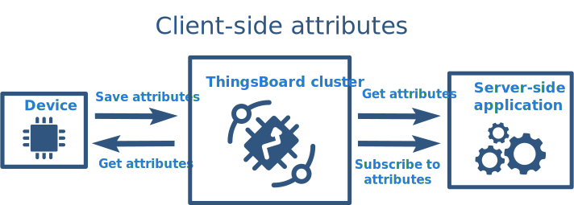

# Práctica 6. Introducción a ThingsBoard

## Objetivos

- Entender los conceptos básicos detrás de la plataforma IoT Thingsboard.
- Dominar el proceso de provisionamiento automático de dispositivos.
- Aprender a gestionar datos de telemetrí enviados a la plataforma desde el dispositivo. 
- Aprender a gestionar atributos de dispositivos y diferenciar entre los tres tipos que ofrece Thingsboard.
- Realizar representaciones sencillas en forma de *dashboard* y gestionar alarmas.

## Introducción a ThingsBoard

# ¿Qué es ThingsBoard?

ThingsBoard es una plataforma de código abierto para la gestión de dispositivos IoT (Internet de las Cosas) que permite a los usuarios conectar, administrar y analizar datos de dispositivos de forma sencilla y eficiente. Algunas de sus características clave incluyen:

1. **Gestión de Dispositivos**: ThingsBoard permite a los usuarios registrar y administrar dispositivos IoT, así como definir atributos y telemetría que pueden ser enviados desde los dispositivos a la plataforma.

2. **Visualización de Datos**: La plataforma proporciona herramientas para crear dashboards personalizables, donde los usuarios pueden visualizar datos en tiempo real mediante gráficos, mapas y otros widgets.

3. **Integración de Protocolos**: ThingsBoard admite múltiples protocolos de comunicación, como MQTT, HTTP y CoAP, lo que facilita la conexión de dispositivos IoT de diferentes fabricantes.

4. **Reglas y Alarmas**: Los usuarios pueden configurar reglas y alertas para gestionar eventos en tiempo real, lo que permite automatizar acciones basadas en condiciones específicas.

5. **Escalabilidad**: Es adecuada para aplicaciones desde pequeñas hasta grandes, lo que la hace versátil para diferentes tipos de proyectos IoT.

6. **API y Extensibilidad**: ThingsBoard ofrece API REST y MQTT que permiten a los desarrolladores integrar la plataforma con otros sistemas y servicios.

En resumen, ThingsBoard es una solución robusta para la gestión y análisis de datos IoT que proporciona a los usuarios las herramientas necesarias para construir y escalar aplicaciones IoT de manera efectiva.

### Instalación y acceso

En esta práctica, puedes optar por utilizar la versión de demostración en *cloud* de 
Thingsboard, o bien instalar tu propia versión de la plataforma en una máquina con
acceso local o remoto. 

Dispones de toda la información sobre instalación en distintas plataformas en
[la página de ThingsBoard](https://thingsboard.io/docs/user-guide/install/installation-options/).

En un entorno Docker ya preparado, la forma más sencilla de proceder es mediante la instalación de
la imagen `tb-postgres` (instrucciones [aquí](https://hub.docker.com/r/thingsboard/tb-postgres/).

!!! note "Tarea (opcional)"
    Instala en tu máquina local Thingsboard siguiendo el método de instalación más apropiado a tu caso.


### Conceptos básicos

### Prueba básica de conectividad de un dispositivo 

## Provisionamiento

### Conceptos generales

El proceso de provisionamiento en ThingsBoard puede ser automatizado para así partir 
de un *firmware* común que no deba personalizarse para cada dispositivo. Durante el
provisionamiento automático, el dispositivo puede o bien generar credenciales únicas,
o bien solicitar al servidor que le proporcione dichas credenciales.

El funcionamiento es sencillo. El dispositivo envía una petición de provisonamiento
(*request*) a ThingsBoard. Esta petición debe contener una clave de provisonamiento
(*provision key*) y un secreto (*secret*). La petición puee incluir, opcionalmente,
el nombre del dispositivo y las credenciales generadas por el dispositivo. Si dichas
credenciales no se proporcionan, el servidor generará un *access token* para que sea
utilizado en el futuro por el dispositivo provisionado. El esquema podría resumirse como:


Siendo un ejemplo de petición de provisionamiento:

```json
{
  "deviceName": "DEVICE_NAME",
  "provisionDeviceKey": "YOUR_PROVISION_KEY_HERE",
  "provisionDeviceSecret": "YOUR_PROVISION_SECRET_HERE"
}
```

ThingsBoard validará la petición y responderá con la respuesta (*response*) de provisionamiento
correspondiente. Una respuesta exitosa contendrá el identificador del dispositivo, tipo de credenciales,
y el cuerpo de la respuesta (habitualmente, un *token*). Si la respuesta no fue exitosa, 
típicamente únicamente contendrá el estado.

Ejemplo de respuesta de provisionamiento:

```json
{
  "provisionDeviceStatus":"SUCCESS",
  "credentialsType":"ACCESS_TOKEN",
  "accessToken":"sLzc0gDAZPkGMzFVTyUY"
}
```

Durante la validación de la petición, ThingsBoard comprobará la información proporcionada
(*provisionDeviceKey* y *provisionDeviceSecret*) para encontrar el 
[Perfil de Dispositivo](https://thingsboard.io/docs/user-guide/device-profiles/) correspondiente.
Cuando se encuentre, la plataforma utilizará la correspondiente estrategia de provisionamiento para
validar el nombre del dispositivo.

Existen dos tipos de estrategias de provisionamiento:

- **Permitir crear nuevos dispositivos**. Se comprueba que ningún dispositivo con el mismo nombre está ya provisonado en ThingsBoard. Esta estrategia es útil si no se dispone de una lista de nombres de dispositivo única (e.g. direcciones MAC) durante la fabricación de los dispositivos pero el dispositivo sí dispone de acceso a dicha información en el *firmware*. Es más sencilla de implementar, pero menos segura que la segunda estrategia.

- **Comprobar dispositivos pre-provisionados**. Comprueba que el dispositivo con el mismo nombre ya ha sido creado en ThingsBoard, pero todavía no ha sido provisionado. Esta estrategia es útil cuando se desea provisionar sólo una lista preconfeccionada de dispositivos. Asumamos que se ha obtenido una lista de identificadores (e.g. MACs) durante la fabricación. Sería posible utilizar [*bulk provisioning*](https://thingsboard.io/docs/user-guide/device-profiles/) para subir dicha lista a ThingsBoard; así, los dispositivos de la lista pueden solicitar peticiones de provisionamiento, y ningún otro dispositivo podría hacerlo.

Cuando el provisionamiento ha finalizado, ThingsBoard actualizará el atributo del servidor *provisionState* asociado al dispositivo (más sobre atributos más adelante en esta misma práctica), asignándole el valor *provisioned*.

### Configuración del perfil de dispositivo

Es necesario configurar un perfil de dispositivo para habilitar la funcionalidad de provisionamiento. Concretamente, es necesario seguir los siguientes pasos:

1. Crear un nuevo perfil de dispositivo, o editar uno existente. 
2. Asignarle un nombre, un tipo de transporte (e.g. MQTT), reglas de alarma para los dispositivos que se adhieran al perfil, y por último una estrategia de provisionamiento.
3. En el paso 4 (Estrategia de Provisionamiento), seleccionar *Permitir crear nuevos dispositivos*, y anotar (o recordar clave y secreto de provisonamiento.

Dispones de toda la información en la [documentación](https://thingsboard.io/docs/user-guide/device-profiles/) de ThingsBoard.

!!! note "Tarea"
    Crea dos perfiles de dispositivo con capacidades de provisionamiento. Investiga la definición de alarmas para un campo de telemetría llamado "temperature", que active una alarma siempre que un dispositivo bajo dicho perfil emita un valor superior al umbral fijado. Fija el transporte en MQTT y recuerda los datos de credenciales para los nuevos perfiles.

### APIs para provisonamiento

En esta práctica, utilizaremos MQTT como API para forzar un proceso de provisionamiento automático desde el dispositivo. Existen alternativas utilizando HTTP y CoAP, que puedes consultar en la documentación de ThingsBoard.

La API MQTT es sencilla. En esta práctica usaremos credenciales generadas por el servidor ThingsBoard, pero puedes encontrar fácilmente la correspondiente API para credenciales generadas por el dispositivo en la documentación de la plataforma. 

Mediante MQTT, el *firmware* de dispositivo puede solicitar un proceso de provisionamiento de forma sencilla. Sin embargo, veremos un ejemplo Python que nos servirá de inspiración para la tarea entregable, que se basará en un proceso equivalente utilizando ESP-IDF. Si no lo hiciste en la anterior práctica, instala *paho* en un entorno virtual:


```sh
python -m venv .venv
source .venv/bin/activate
pip install paho-mqtt
```

Observa el siguiente código; ejecútalo desde cualquier máquina con una instalación de *paho-mqtt* `python3 test.py`:

```py
from paho.mqtt.client import Client
from json import dumps, loads

RESULT_CODES = {
    1: "incorrect protocol version",
    2: "invalid client identifier",
    3: "server unavailable",
    4: "bad username or password",
    5: "not authorised",
    }


def collect_required_data():
    config = {}
    print("\n\n", "="*80, sep="")
    print(" "*10, "\033[1m\033[94mThingsBoard device provisioning with basic authorization example script.\033[0m", sep="")
    print("="*80, "\n\n", sep="")
    host = input("Please write your ThingsBoard \033[93mhost\033[0m or leave it blank to use default (thingsboard.cloud): ")
    config["host"] = host if host else "demo.thingsboard.io"
    port = input("Please write your ThingsBoard \033[93mport\033[0m or leave it blank to use default (1883): ")
    config["port"] = int(port) if port else 1883
    config["provision_device_key"] = input("Please write \033[93mprovision device key\033[0m: ")
    config["provision_device_secret"] = input("Please write \033[93mprovision device secret\033[0m: ")
    device_name = input("Please write \033[93mdevice name\033[0m or leave it blank to generate: ")
    if device_name:
        config["device_name"] = device_name
    print("\n", "="*80, "\n", sep="")
    return config


class ProvisionClient(Client):
    PROVISION_REQUEST_TOPIC = "/provision/request"
    PROVISION_RESPONSE_TOPIC = "/provision/response"

    def __init__(self, host, port, provision_request):
        super().__init__()
        self._host = host
        self._port = port
        self._username = "provision"
        self.on_connect = self.__on_connect
        self.on_message = self.__on_message
        self.__provision_request = provision_request

    def __on_connect(self, client, userdata, flags, rc):  # Callback for connect
        if rc == 0:
            print("[Provisioning client] Connected to ThingsBoard ")
            client.subscribe(self.PROVISION_RESPONSE_TOPIC)  # Subscribe to provisioning response topic
            provision_request = dumps(self.__provision_request)
            print("[Provisioning client] Sending provisioning request %s" % provision_request)
            client.publish(self.PROVISION_REQUEST_TOPIC, provision_request)  # Publishing provisioning request topic
        else:
            print("[Provisioning client] Cannot connect to ThingsBoard!, result: %s" % RESULT_CODES[rc])

    def __on_message(self, client, userdata, msg):
        decoded_payload = msg.payload.decode("UTF-8")
        print("[Provisioning client] Received data from ThingsBoard: %s" % decoded_payload)
        decoded_message = loads(decoded_payload)
        provision_device_status = decoded_message.get("status")
        if provision_device_status == "SUCCESS":
            self.__save_credentials(decoded_message["credentialsValue"])
        else:
            print("[Provisioning client] Provisioning was unsuccessful with status %s and message: %s" % (provision_device_status, decoded_message["errorMsg"]))
        self.disconnect()

    def provision(self):
        print("[Provisioning client] Connecting to ThingsBoard (provisioning client)")
        self.__clean_credentials()
        self.connect(self._host, self._port, 60)
        self.loop_forever()

    def get_new_client(self):
        client_credentials = self.__get_credentials()
        new_client = None
        if client_credentials:
            new_client = Client()
            new_client.username_pw_set(client_credentials)
            print("[Provisioning client] Read credentials from file.")
        else:
            print("[Provisioning client] Cannot read credentials from file!")
        return new_client

    @staticmethod
    def __get_credentials():
        new_credentials = None
        try:
            with open("credentials", "r") as credentials_file:
                new_credentials = credentials_file.read()
        except Exception as e:
            print(e)
        return new_credentials

    @staticmethod
    def __save_credentials(credentials):
        with open("credentials", "w") as credentials_file:
            credentials_file.write(credentials)

    @staticmethod
    def __clean_credentials():
        open("credentials", "w").close()


def on_tb_connected(client, userdata, flags, rc):  # Callback for connect with received credentials
    if rc == 0:
        print("[ThingsBoard client] Connected to ThingsBoard with credentials: %s" % client._username.decode())
    else:
        print("[ThingsBoard client] Cannot connect to ThingsBoard!, result: %s" % RESULT_CODES[rc])


if __name__ == '__main__':

    config = collect_required_data()

    THINGSBOARD_HOST = config["host"]  # ThingsBoard instance host
    THINGSBOARD_PORT = config["port"]  # ThingsBoard instance MQTT port

    PROVISION_REQUEST = {"provisionDeviceKey": config["provision_device_key"],  # Provision device key, replace this value with your value from device profile.
                         "provisionDeviceSecret": config["provision_device_secret"],  # Provision device secret, replace this value with your value from device profile.
                         }
    if config.get("device_name") is not None:
        PROVISION_REQUEST["deviceName"] = config["device_name"]
    provision_client = ProvisionClient(THINGSBOARD_HOST, THINGSBOARD_PORT, PROVISION_REQUEST)
    provision_client.provision()  # Request provisioned data
    tb_client = provision_client.get_new_client()  # Getting client with provisioned data
    if tb_client:
        tb_client.on_connect = on_tb_connected  # Setting callback for connect
        tb_client.connect(THINGSBOARD_HOST, THINGSBOARD_PORT, 60)
        tb_client.loop_forever()  # Starting infinity loop
    else:
        print("Client was not created!")
```

!!! note "Tarea"
    Contesta a las siguientes cuestiones:
    - ¿Qué nombre de usuario es necesario usar para la autenticación en el *broker* MQTT?
    - ¿Qué *topics* se utilizan para publicar la información de petición de provisionamiento y recibir la respuesta correspondiente?


!!! danger "Tarea entregable"
    Crea un *firmware* con ESP-IDF que proceda de forma similar al anterior ejemplo, de modo que provisione automáticamente (con nombre generado por el servidor) a un dispositivo ESP32 en ThingsBoard.

## Gestión de telemetría y visualización

ThingsBoard proporciona un conjunto de características que permite trabajar con datos en forma de series temporales, permitiendo:

- **Recolectar** datos de dispositivos usando distintos [protocolos e integracioens](https://thingsboard.io/docs/getting-started-guides/connectivity/).
- **Almacenar** series temporales en forma de base de datos SQL (PostgreSQL) o NoSQL (Cassandra o Timescale).
- **Consultar** los últimos valores de telemetría obtenidos o todos los datos en rango de tiempo determinado.
- **Suscribirse**  a actualizaciones de datos usando [Websockets](https://thingsboard.io/docs/user-guide/telemetry/#websocket-api) para visualización en tiempo real y analítica.
- **Visualizar** las series temporales usando [*dashboards* configurables](https://thingsboard.io/docs/user-guide/dashboards/).
- **Filtrar y analizar** datos usando [cadenas de reglas](https://thingsboard.io/docs/user-guide/rule-engine-2-0/re-getting-started/).
- **Generar** [**alarmas**](https://thingsboard.io/docs/user-guide/alarms/) basadas en datos recolectados.
- **Reenviar datos** a servicios externos usando [reglas](https://thingsboard.io/docs/user-guide/rule-engine-2-0/external-nodes/) (por ejemplo, a Kafka o RabbitMQ).

### Puntos de datos

ThingsBoard trata internamente los datos de series temporales como pares clave-valor con marca de tiempo. Llamamos punto de datos a un único par clave-valor con marca de tiempo. La flexibilidad y simplicidad del formato clave-valor permite una integración fácil y sin problemas con casi cualquier dispositivo IoT del mercado. La clave siempre es una cadena de texto y, básicamente, es el nombre de la clave del punto de datos, mientras que el valor puede ser una cadena, un valor booleano, un doble, un entero o un JSON.

Los ejemplos a continuación usan el formato de datos interno. El propio dispositivo puede cargar datos utilizando varios protocolos y formatos de datos. Consulta la [API de carga de datos](https://thingsboard.io/docs/user-guide/telemetry/#time-series-data-upload-api) para más información.

El siguiente JSON contiene 5 puntos de datos: temperatura (double), humedad (integer), hvacEnabled (boolean), hvacState (string) y configuración (JSON):

```json
{
  "temperature": 42.2, 
  "humidity": 70,
  "hvacEnabled": true,
  "hvacState": "IDLE",
  "configuration": {
    "someNumber": 42,
    "someArray": [1, 2, 3],
    "someNestedObject": {"key": "value"}
  }
}
```

Observa que el JSON listado arriba no contiene información de marca de tiempo. En tal caso, ThingsBoard utiliza la marca de tiempo actual del servidor. Sin embargo, puedes incluir información de marca de tiempo en el mensaje. Consulta el ejemplo a continuación:

```json
{
  "ts": 1527863043000,
  "values": {
    "temperature": 42.2,
    "humidity": 70
  }
}
```

### API MQTT

Para publicar datos de telemetría al servidor ThingsBoard desde cualquier dispositivo, es suficiente con publicar
un mensaje MQTT bajo el siguiente topic:

```sh
v1/devices/me/telemetry`
```

El formato de datos más simple soportado es:

```json
{"key1":"value1", "key2":"value2"}
```

o

```json
[{"key1":"value1"}, {"key2":"value2"}]
```

(en este caso, la marca de tiempo será asignada por el servidor).

Si se desea que el cliente fije la marca de tiempo, es posible usar el formato:

```json
{"ts":1451649600512, "values":{"key1":"value1", "key2":"value2"}}
```

Donde 1451649600512 es una marca de tiempo Unix con precisión de milisegundos.

Usando las herramientas de la suite *mosquitto*, podríamos enviar un dato como:

```sh
mosquitto_pub -d -q 1 -h "demo.thingsboard.io" -t "v1/devices/me/telemetry" -u "$ACCESS_TOKEN" -m "{"temperature":42}"
```

Para enviar un objeto JSON sin datos de marca de tiempo:

```sh
mosquitto_pub -d -q 1 -h "demo.thingsboard.io" -t "v1/devices/me/telemetry" -u "$ACCESS_TOKEN" -f "telemetry-data-as-object.json"
```

Siendo el contenido del fichero JSON:

```json
{
  "stringKey": "value1",
  "booleanKey": true,
  "doubleKey": 42.0,
  "longKey": 73,
  "jsonKey": {
    "someNumber": 42,
    "someArray": [1,2,3],
    "someNestedObject": {"key": "value"}
  }
}
```

Para publicar, por ejemplo, un objeto con marca de tiempo, usando datos más complejos, podríamos construir el siguiente JSON:

```json
{
  "ts": 1451649600512,
  "values": {
    "stringKey": "value1",
    "booleanKey": true,
    "doubleKey": 42.0,
    "longKey": 73,
    "jsonKey": {
      "someNumber": 42,
      "someArray": [1, 2, 3],
      "someNestedObject": {
        "key": "value"
      }
    }
  }
}
```

!!! danger "Tarea entregable"
    Modifica el anterior firmware para que, desde una tarea y periódicamente, se envíe a Thingsboard datos de telemetría. Estos datos pueden tener un valor aleatorio, pero sería muy conveniente (aunque no evaluable para la práctica) que se tomasen desde sensores reales. El formato del mensaje es libre, pero intenta obtener uno que aune realismo y cierta complejidad en el uso de tipos de datos.

## Gestión de atributos

ThingsBoard proporciona la capacidad de asignar atributos personalizados a las entidades (por ejemplo, a los dispositivos) y gestionar estos atributos. Estos atributos se almacenan en la base de datos y pueden ser utilizados para la visualización y el procesamiento de datos.

Los atributos se tratan como pares clave-valor. La flexibilidad y simplicidad del formato clave-valor permiten una integración fácil y sin problemas con casi cualquier dispositivo IoT del mercado. La clave siempre es una cadena de texto y, básicamente, es el nombre del atributo, mientras que el valor del atributo puede ser una cadena, un valor booleano, un doble, un entero o un JSON. Por ejemplo:

```json
{
 "firmwareVersion":"v2.3.1", 
 "booleanParameter":true, 
 "doubleParameter":42.0, 
 "longParameter":73, 
 "configuration": {
    "someNumber": 42,
    "someArray": [1,2,3],
    "someNestedObject": {"key": "value"}
 }
}
```

El desarrollador es libre para seleccionar cualquier nombre de atributo.

### Tipos de atributos

#### Atributos de servidor

Este tipo de atributo es compatible con casi cualquier entidad de la plataforma, incluyendo dispositivos, bienes, u otras entidades.
Los atributos del lado del servidor son aquellos que pueden ser configurados a través de la interfaz de administración o la API REST. El firmware del dispositivo no puede acceder al atributo del lado del servidor.


Supongamos que deseas construir una solución de monitorización de edificios y revisemos algunos ejemplos:

- La latitud, longitud y dirección son buenos ejemplos de atributos del lado del servidor que puedes asignar a activos que representen edificios u otros bienes inmuebles. Puedes utilizar estos atributos en el widget de mapa en tu panel para visualizar la ubicación de los edificios.
- El atributo floorPlanImage puede contener una URL de la imagen. Puedes usar este atributo para visualizar el plano de planta en el widget de mapa de imagen.
- Los atributos maxTemperatureThreshold y temperatureAlarmEnabled pueden ser utilizados para configurar y habilitar/deshabilitar alarmas para un dispositivo o activo en particular.

!!! note "Tarea"
    1. Ve a **Dispositivos**. Haz clic en la fila del dispositivo en particular para abrir los detalles del dispositivo.
    2. Selecciona la pestaña **Atributos**. Elige el alcance de **Atributos del servidor**. Haz clic en el icono "+".
    3. Introduce el nombre del nuevo atributo. Selecciona el tipo de valor del atributo e introduce el valor del atributo.
    4. Ordena usando **Hora de la última actualización** para ubicar rápidamente el atributo recién creado.

En la documentación de ThingsBoard encontrarás la API para gestionar este tipo de atributos programáticamente.

#### Atributos compartidos

Este tipo de atributos está disponible solo para Dispositivos. Es similar a los atributos del lado del servidor, pero tiene una diferencia importante. El firmware/aplicación del dispositivo puede solicitar el valor de los atributos compartidos o suscribirse a las actualizaciones de estos atributos. Los dispositivos que se comunican mediante MQTT u otros protocolos de comunicación bidireccional pueden suscribirse a las actualizaciones de atributos y recibir notificaciones en tiempo real. Los dispositivos que se comunican a través de HTTP u otros protocolos de comunicación de solicitud-respuesta pueden solicitar periódicamente el valor de los atributos compartidos.


El caso de uso más común de los atributos compartidos es almacenar configuraciones de dispositivos. Supongamos la misma solución de monitoreo de edificios y revisemos algunos ejemplos:

- El atributo targetFirmwareVersion puede ser utilizado para almacenar la versión de firmware para un dispositivo en particular.
- El atributo maxTemperature puede ser utilizado para activar automáticamente el sistema HVAC si hace demasiado calor en la habitación.
- El usuario puede cambiar el atributo a través de la interfaz de usuario. Un script u otra aplicación del lado del servidor puede cambiar el valor del atributo a través de la API REST.

!!! note "Tarea"
    1. Ve a **Dispositivos**. Haz clic en la fila del dispositivo en particular para abrir los detalles del dispositivo.
    2. Selecciona la pestaña **Atributos**. Elige el alcance de **Atributos compartidos**. Haz clic en el icono "+".
    3. Introduce el nombre del nuevo atributo. Selecciona el tipo de valor del atributo e introduce el valor del atributo.
    4. Observa el nuevo atributo.

La función de [*bulk provisioning*](https://thingsboard.io/docs/user-guide/bulk-provisioning/) te permite crear rápidamente múltiples dispositivos y activos y sus atributos desde un archivo CSV.

#### Atributos de cliente 

### Este tipo de atributos está disponible solo para Dispositivos

Se utiliza para reportar varios datos semiestáticos desde el Dispositivo (Cliente) a ThingsBoard (Servidor). Es similar a los atributos compartidos, pero tiene una diferencia importante. El firmware/aplicación del dispositivo puede enviar el valor de los atributos desde el dispositivo a la plataforma.



El caso de uso más común de los atributos del cliente es reportar el estado del dispositivo. Supongamos la misma solución de monitoreo de edificios y revisemos algunos ejemplos:

- El atributo `currentFirmwareVersion` puede ser utilizado para reportar la versión del firmware/aplicación instalada para el dispositivo a la plataforma.
- El atributo `currentConfiguration` puede ser utilizado para reportar la configuración actual del firmware/aplicación a la plataforma.
- El atributo `currentState` puede ser utilizado para persistir y restaurar el estado actual del firmware/aplicación a través de la red, si el dispositivo no tiene almacenamiento persistente.

Los usuarios y las aplicaciones del lado del servidor pueden explorar los atributos del lado del cliente a través de la interfaz de usuario/API REST, pero no pueden cambiarlos. Básicamente, el valor del atributo del lado del cliente es de solo lectura para la UI/API REST.


### API para gestión de atributos

La API de atributos de ThingsBoard permite a los dispositivos:

- Subir atributos del dispositivo del lado del cliente al servidor.
- Solicitar atributos del dispositivo del lado del cliente y compartidos desde el servidor.
- Suscribirse a atributos compartidos del dispositivo desde el servidor.

#### Publicar actualización de atributos en el servidor

Para publicar atributos del dispositivo del lado del cliente en el nodo del servidor de ThingsBoard, envía un mensaje **PUBLISH** al siguiente topic:

```sh
v1/devices/me/attributes
```

A continuación, se muestran ejemplos de cómo publicar atributos de dispositivo del lado del cliente.

No olvides reemplazar `demo.thingsboard.io` con tu host y `$ACCESS_TOKEN` con el token de acceso de tu dispositivo. En este ejemplo, el nombre de host hace referencia al servidor de demostración en vivo.

**Ejemplo 1. Publicar actualización de atributos del lado del cliente.**

Datos de telemetría:

```json
{"attribute1": "value1", "attribute2": true}
```

Ejecuta el comando:

```sh
mosquitto_pub -d -h "demo.thingsboard.io" -t "v1/devices/me/attributes" -u "$ACCESS_TOKEN" -m "{"attribute1": "value1", "attribute2": true}"
```

**Ejemplo 2. Publicar actualización de atributos del lado del cliente utilizando datos del archivo `new-attributes-values.json`.**

Contenido del archivo new-attributes-values.json:

```json
{
  "attribute1": "value1",
  "attribute2": true,
  "attribute3": 42.0,
  "attribute4": 73,
  "attribute5": {
    "someNumber": 42,
    "someArray": [1, 2, 3],
    "someNestedObject": {"key": "value"}
  }
}
```

#### Solicitar valores de atributos del servidor

Para solicitar atributos del dispositivo del lado del cliente o compartidos en el nodo del servidor de ThingsBoard, envía un mensaje **PUBLISH** al siguiente topic:

```sh
v1/devices/me/attributes/request/$request_id
```


donde `$request_id` es tu identificador de solicitud entero. Antes de enviar el mensaje **PUBLISH** con la solicitud, el cliente necesita suscribirse a:

```sh
v1/devices/me/attributes/response/+
```

El siguiente ejemplo está escrito en JavaScript. No hay ejemplos en línea de comandos puros disponibles porque la suscripción y publicación deben ocurrir en la misma sesión de MQTT.

Guarda el archivo `mqtt-js-attributes-request.js` en tu PC. No olvides reemplazar el nombre de host `demo.thingsboard.io` con tu host. 

```javascript
var mqtt = require('mqtt')
var client  = mqtt.connect('mqtt://demo.thingsboard.io',{
    username: process.env.TOKEN
})

client.on('connect', function () {
    console.log('connected')
    client.subscribe('v1/devices/me/attributes/response/+')
    client.publish('v1/devices/me/attributes/request/1', '{"clientKeys":"attribute1,attribute2", "sharedKeys":"shared1,shared2"}')
})

client.on('message', function (topic, message) {
    console.log('response.topic: ' + topic)
    console.log('response.body: ' + message.toString())
    client.end()
})
```

Puedes ejecutar el comando desde cualquier máquina con `node` instalado:

```sh
export TOKEN=$ACCESS_TOKEN
node mqtt-js-attributes-request.js
```

#### Suscribirse a las actualizaciones de atributos desde el servidor

Para suscribirse a los cambios de atributos compartidos del dispositivo, envía un mensaje **SUBSCRIBE** al siguiente topic:

```sh
v1/devices/me/attributes
```

Cuando un atributo compartido es modificado por uno de los componentes del servidor (como la API REST o la Cadena de Reglas), el cliente recibirá la siguiente actualización:

```json
{"key1":"value1"}
```

En el siguiente ejemplo, no olvides reemplazar demo.thingsboard.io con tu host y $ACCESS_TOKEN con el token de acceso de tu dispositivo. 

Ejecuta el comando:

```sh
mosquitto_sub -d -h "demo.thingsboard.io" -t "v1/devices/me/attributes" -u "$ACCESS_TOKEN"
```

!!! danger "Tarea entregable"
    En un escenario de monitorización de edificios en la UCM, aprovecha el concepto de atributo para reemplazar la jerarquía de topics que diseñaste en una práctica anterior. Busca en tu diseño utilizar atributos de los tres tipos mencionados anteriormente, descríbelos en la memoria e interactúa con ellos desde el *firmware* y usando APIs externas (para ello, deberás consultar la documentación de Thingsboard).

!!! danger "Tarea entregable"
    Mediante el uso de atributos, gestiona la activación/desactivación del envío de cada sensor, así como el intervalo entre envíos para un dispositivo. Deberías poder gestionar dichos valores desde la interfaz de Thingsboard.

!!! danger "Tarea entregable"
    Investiga en la documentación de Thingsboard sobre el desarrollo de *dashboard* y la gestión de alarmas. Desarrolla un *dashboard* de visualización para tus dispositivos, incluyendo información sobre alarmas recibidas.
