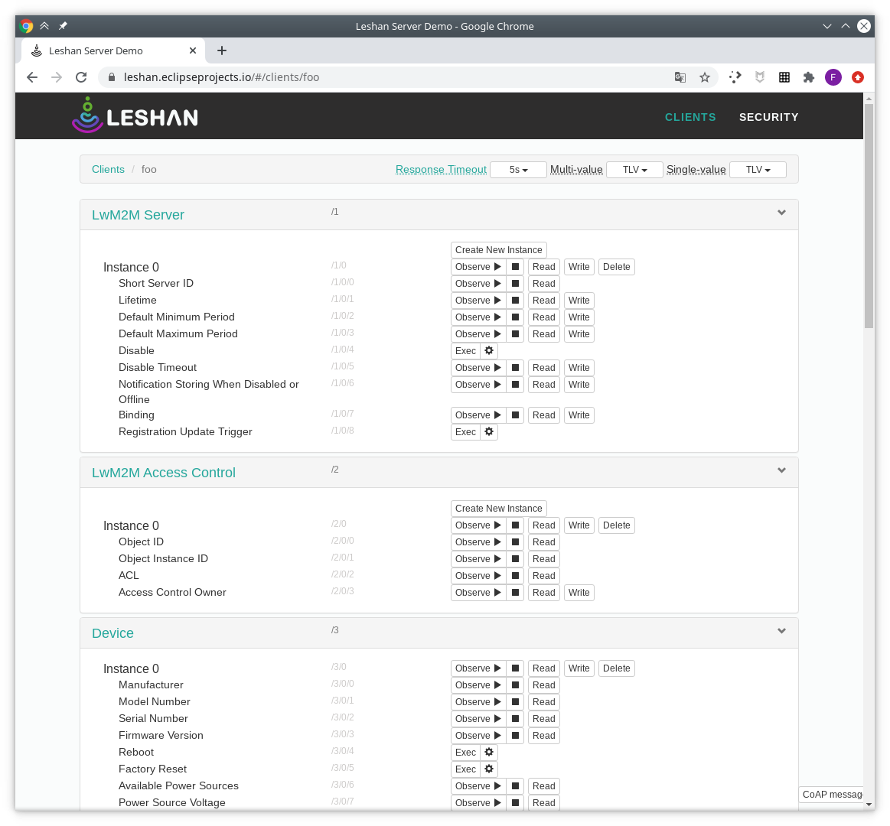

# Práctica 8. El protocolo LWM2M

## Objetivos

* Familiarizarse con el protocolo LWM2M, tanto en la interacción con servidores
como en la generación y definición de objetos y recursos.
* Familiarizarse con el protocolo de *bootstrapping* LWM2M y entender su
importancia en entornos reales.
* Conocer dos herramientas para el desarrollo de sistemas basados en LWM2M:
Wakaama y Leshan.
* Experimentar con el proceso de definición de objetos en Wakaama.
* Observar y poner en marcha un proceso de provisionamiento (*bootstrapping*)
usando Wakaama.
* Desplegar servidores locales LWM2M usando tanto Wakaama como Leshan.

## El protocolo LWM2M

OMA Lightweight M2M (LWM2M) es un protocolo impulsado por la Open Mobile
Alliance para la comunicación M2M entre dispositivos y su gestión en entornos
IoT. LWM2M está construido sobre el protocolo CoAP, y soporta, a nivel de 
transporte, el protocolo UDP (también presenta soporte para SMS). 
Entre las funcionalidades básicas de LWM2M destacan la existencia de servidores
LWM2M, *bootstrapping*, control de acceso, gestión de dispositivos, 
actualizaciones de *firmware*, localización o estadísticas de conectividad. 
Además, soporta seguridad a través de DTLS.

Concretamente, la primera especificación de LWM2M (versión 1.0) introdujo las
siguientes características básicas:

- Definición de un modelo simple para la definición de recursos, basado en objetos.
- Definición de operaciones de creación, consulta, modificación, borrado y 
  configuración de recursos.
- Observación/notificación sobre recursos.
- Soporte para formato de datos JSON, texto plano y TLV.
- Colas de mensajes para soportar modos de bajo consumo en dispositivos.
- Soporte para múltiples servidores LWM2M.
- Objetos básicos LWM2M: Seguridad, Servidor, Control de Acceso, Dispositivo,
Conectividad, Actualización de Firmware, Localización, Estadísticas de 
Conectividad. Para más información sobre los objetos predefinidos, 
consulta el [siguiente enlace](http://www.openmobilealliance.org/wp/omna/lwm2m/lwm2mregistry.html).

Versiones subsiguientes del protocolo (1.1 y 1.2) introdujeron características
adicionales, como por ejemplo:

- Mejora del proceso de *bootstrapping*.
- Mejora del soporte para PKI.
- Soporte para TCP/TLS.
- Soporte para CBOR.
- Soporte para MQTT y HTTP como protocolos subyacentes.

## Implementaciones LWM2M

En la presente práctica, utilizaremos dos paquetes de *software* pertenecientes
al proyecto Eclipse IoT, ambos con soporte completo para LWM2M. Cada uno de
ellos presenta ventajas e inconvenientes que es necesario conocer. 

### Eclipse Wakaama

Eclipse Wakaama es un conjunto de ficheros fuente escritos en C que permiten ser integrados
en cualquier proyecto para proporcionar funcionalidad de *cliente*, *servidor*
y *servidor de bootstrap* LWM2M hasta su versión 1.1. 
En el lado cliente, Wakaama permite la 
definición de objetos conforme al estándar, así como la recepción de comandos
desde servidores y su enrutado hacia el objeto u objetos correspondientes. Desde
el punto de vista servidor, Wakaama proporciona APIs para enviar comandos a 
clientes LWM2M registrados. 

Todo el proyecto es compatible con POSIX, y en esta práctica experimentaremos 
con su funcionalidad trabajando desde Linux (modo cliente, servidor y 
servidor de *bootstrap*) y desde el ESP32 (modo cliente).

#### Instalación

Utilizaremos una versión específica que permitirá ser ejecutada tanto en 
Linux como en el ESP32. Para ello, clonamos en primer lugar la versión 
correspondiente del proyecto (es importante que utilices este
*commit* específico):

```sh
git clone https://github.com/eclipse/wakaama.git
cd wakaama
git reset --hard 31d64c0c41fae9653c1fa53ef58d1a44e49017fa
```

El proyecto Wakaama proporciona cuatro componentes que utilizaremos durante
la práctica, todos dentro del directorio `examples`:

* `bootstrap_server`: implementa un servidor de *bootstrap* con línea de 
  comandos propia.
* `client`: implementa un cliente complejo, con definición de nueve objetos
  que siguen las especificaciones de la OMA más uno propio, 
  y soporte para *bootstrapping*.
* `lightclient`: implementa un cliente sencillo, con definición de tres objetos
  según especificaciones OMA y un cuarto objeto propio.
* `server`: implementa un servidor LWM2M que ofrece línea de comandos para
  la interacción con clientes registrados.

El modo de compilar cada uno de los ejemplos es exactamente el mismo:

1. Dirígete al directorio del ejemplo.
2. Crea un directorio `build` y accede a él.
3. Configura el proyecto con la orden `cmake ..`.
4. Compila el ejemplo con la orden `make`.

Si todo ha ido bien, deberías tener un binario distinto en el directorio
`build` correspondiente, con los que trabajarás el resto de la práctica.

!!! note "Tarea"
    Compila cada uno de los ejemplos anteriormente mencionados en tu máquina
    virtual, utilizando los parámetros por defecto para cada uno de ellos.

### Eclipse Leshan

Eclipse Leshan es un proyecto alternativo que proporciona implementaciones en
Java de clientes, servidores y servidores de *bootstrap* LWM2M, y está especialmente
diseñado para ser adaptable y extensible, permitiendo a los desarrolladores 
implementar sus propias versiones de cada uno de los tres anteriores elmentos
adaptados a sus necesidades específicas. Al igual que Wakaama, Leshan proporciona
la definición e interacción con objetos IPSO, construcción sobre DTLS y
utilización de CoAP como protocolo subyacente.

Además, el proyecto proporciona dos servidores de test que resultan muy útiles
 a la hora de desarrollar, véase:

- Servidor LWM2M en [leshan.eclipseprojects.io](https://leshan.eclipseprojects.io/), disponible en *coap://leshan.eclipseprojects.io:5683 y coaps://leshan.eclipseprojects.io:5684*.
- Servidor de *bootstrap* en [leshan.eclipseprojects.io/bs](https://leshan.eclipseprojects.io/bs/), disponible en *coap://leshan.eclipseprojects.io:5783 y coaps://leshan.eclipseprojects.io:5784*.

#### Instalación

Instala en primer lugar los prerequisitos necesarios para la correcta instalación
de Leshan (pueden variar en función de tu distribución Linux):

```sh
sudo apt-get update
sudo apt-get install openjdk-14-jdk maven git-core
```

Clona el repositorio oficial de Leshan desde la siguiente dirección:

```sh
git clone https://github.com/eclipse/leshan.git
```

Por último, compila el proyecto:

```sh
cd leshan
mvn clean install
```

Tras la fase de instalación, podrás lanzar tanto el servidor LWM2M:

```sh
java -jar leshan-server-demo/target/leshan-server-demo-*-SNAPSHOT-jar-with-dependencies.jar 
```

La opción `-h` te permitirá observar la ayuda del servidor.

Como el servidor de *bootstrapping*:

```sh
java -jar leshan-bsserver-demo/target/leshan-bsserver-demo-*-SNAPSHOT-jar-with-dependencies.jar
```

La opción `-h` te permitirá observar la ayuda del servidor.

En ambos casos, la salida asociada a la ejecución de los servidores nos 
indicarán la URL que podremos consultar desde cualquier navegador para 
obtener información del mismo, así como la URL y puerto de escucha de cada
uno, que deberemos indicar en los clientes correspondientes.

!!! note "Tarea"
    Instala Eclipse Leshan y arranca el servidor LWM2M. Accede a la página
    web de gestión y comprueba que efectivamente funciona. A continucación,
    detenlo y haz lo propio con el servidor de *bootstrapping*.

## Eclipse Wakaama. Cliente y servidor LWM2M

El objetivo principal de esta parte de la práctica será disponer de un sistema
completo LWM2M basado en un cliente y dos servidores (uno LWM2M, otro de
*bootstrapping*), todos funcionando bajo Eclipse Wakaama.

Para ello, en primer lugar, arrancaremos el servidor Wakaama en una de las
terminales. Observa que el servidor, tras arrancar, expone una sencilla
línea de comandos que podemos aprovechar para interactuar con él:

```sh
./lwm2mserver 

> help
help	Type 'help [COMMAND]' for more details on a command.
list	List registered clients.
read	Read from a client.
disc	Discover resources of a client.
write	Write to a client.
time	Write time-related attributes to a client.
attr	Write value-related attributes to a client.
clear	Clear attributes of a client.
exec	Execute a client resource.
del	Delete a client Object instance.
create	Create an Object instance.
observe	Observe from a client.
cancel	Cancel an observe.
q	Quit the server.

```

La orden `help` muestra la ayuda global, pudiéndose especializar para cada
comando concreto:

```sh
> help read
 read CLIENT# URI
   CLIENT#: client number as returned by command 'list'
   URI: uri to read such as /3, /3/0/2, /1024/11, /1024/0/1
Result will be displayed asynchronously.
```

Si en este instante listamos un los clientes registrados, veremos que no
hay ninguno:

```sh
> list
No client.
```

En segundo lugar, vamos a arrancar el cliente Wakaama. Por defecto, este cliente
intentará conectar con un servidor LWM2M existente en `localhost`, puerto 
5683. En cualquier caso, estos valores pueden modificarse en la propia 
invocación (consulta la opción `-h` para más información sobre parámetros
disponibles):

```sh
./lwm2mclient
Trying to bind LWM2M Client to port 56830
LWM2M Client "testlwm2mclient" started on port 56830
> Opening connection to server at ::1:5683
 -> State: STATE_REGISTERING
13 bytes received from [::1]:5683
64 41 69 06  06 69 E8 86  82 72 64 01  30  dAi..i...rd.0
 -> State: STATE_READY


> help
help	Type 'help [COMMAND]' for more details on a command.
list	List known servers.
change	Change the value of resource.
update	Trigger a registration update
bootstrap	Initiate a DI bootstrap process
dispb	Display current backup of objects/instances/resources
	    (only security and server objects are backupped)
ls	List Objects and Instances
disp	Display current objects/instances/resources
dump	Dump an Object
add	Add support of object 31024
rm	Remove support of object 31024
quit	Quit the client gracefully.
^C	Quit the client abruptly (without sending a de-register message).

>  -> State: STATE_READY
```

Al igual que el servidor, el cliente soporta la introducción de comandos
por parte del usuario.  Observa que hemos ejecutado el comando `help`
para mostrar los comandos disponibles. 

Además, el cliente ha pasado desde un estado `STATE_REGISTERING` a un estado
`STATE_READY`, lo que significa que se ha registrado correctamente en el 
servidor con el nombre `testlwm2mclient`.

Observa ahora la salida del servidor, y verás que éste ha realizado un 
proceso de descubrimiento de recursos en el cliente conectado. Concretamente,
el servidor reporta la información relativa al nuevo cliente conectado:

```sh
New client #0 registered.
Client #0:
	name: "testlwm2mclient"
	version: "1.1"
	binding: "UDP"
	lifetime: 300 sec
	objects: /1/0, /2/0, /3/0, /4/0, /5/0, /6/0, /7/0, /31024/10, /31024/11, /31024/12, 
```
Concretamente, el número asociado al cliente es el `0`. Podemos recuperar
esta información en todo momento con el comando `list` en el servidor.

En el cliente, puedes seleccionar el nombre que se utilizará en el proceso
de registro con la opción `-n`.

!!! danger "Tarea entregable"
    Observa, utilizando Wireshark, el proceso de registro de un cliente en un
    servidor, y analiza el contenido del mensaje o mensajes intercambiados entre
    ambos. ¿Qué protocolos se utilizan?

El cliente con el que estamos trabajando es suficientemente complejo en su
funcionamiento, y permite observar cómo se implementa el soporte tanto para
objetos predefinidos por la OMA como para objetos propios. Concretamente,
el cliente implementa nueve objetos distintos:

* *Security Object* (`id=0`).
* *Server Object* (`id=1`).
* *Access Control Object* (`id=2`), como un simple esqueleto, sin funcionalidad asociada.
* *Device Object* (`id=3`), que contiene (y devuelve) valores específicos 
codificados en base al apéndice E de la especificación técnica de LWM2M.
* *Connectivity Monitoring Object* (`id=4`), como un simple esqueleto, sin funcionalidad.
* *Firmware Update Object* (`id=5`), como un simple esqueleto, sin funcionalidad.
* *Location Object* (`id=6`), como un simple esqueleto, sin funcionalidad.
* *Connectivity Statistics Object* (`id=7`), como un simple esqueleto, sin funcionalidad.
* *Test Object* (`id=31024`), con la siguiente descripción:

Objetos:

|Objeto |  ID   | Multiples Instancias| Obligatorio |
|-------|-------|--------------------|-----------|
|Test   | 31024 |    Sí              |    No     |

Recurso:

| Nombre | ID | Operaciones| Múltiples Instancias | Obligatorio |  Tipo   | Rango |
|------|----|------------|-----------|-----------|---------|-------|
| test |  1 |    R/W     |    No     |    Yes    | Integer | 0-255 |
| exec |  2 |     E      |    No     |    Yes    |         |       |
| dec  |  3 |    R/W     |    No     |    Yes    |  Float  |       |

En el cliente, el comando `dump` nos permitirá observar el contenido de una 
instancia determinada de un objeto, o de todas ellas. En el servidor, el
comando `read` nos permitirá hacer lo propio.

!!! danger "Tarea entregable"
    Analiza el valor actual de los objetos `/3` y el objeto de test, tanto desde
    el cliente (comando `dump`) como desde el servidor (comando `read`). En 
    último caso, realiza una captura de tráfico vía Wireshark y analiza los 
    mensajes intercambiados entre ambos extremos.

Para escribir en un determinado recurso desde el servidor, podemos hacer
uso del comando `write` de la siguiente forma:

```sh
write 0 /31024/10/1 91
```

Así, estaríamos escribiendo en el recurso `1` de la instancia `10` del objeto
`31024` el valor entero 91.

!!! danger "Tarea entregable"
    Realiza escrituras en objetos del cliente y analiza el nuevo valor, comprobando
    que efectivamente se han llevado a cabo. 
    Realiza una captura de tráfico vía Wireshark y analiza los 
    mensajes intercambiados entre ambos extremos en el caso de una escritura.
    Observa también que el servidor permite la observación de recursos específicos
    (comando `observe`).
    Experimenta con esta opción y observa el tráfico generado (puedes modificar
    el valor de un recurso desde el propio cliente y ver qué ocurre en el servidor).

Por último, con la orden `quit` desconectamos del servidor. Observa también
los mensajes CoAP que se generan en este caso.

## Definición de un objeto en Eclipse Wakaama

Como has podido observar, el ejemplo de cliente define una serie de objetos,
algunos especificados por la OMA, y otros personalizados. En este último
caso, al que nos referiremos como `test_object`, se utilizan e ilustran 
algunas de las funcionalidades básicas de Wakaama como infraestructura
para el desarrollo de Smart Objects vía LWM2M.

Observa tanto el código del cliente LWM2M (fichero fuente `lwm2mclient.c` del
ejemplo `client`) como la definición del objeto de test (fichero fuente
`test_object.c`). 

El primer fichero implementa la lógica principal del cliente, 
incluyendo gestión de la conexión, lógica de análisis de comandos introducidos
por el usuario, gestión de *bootstrapping*, etc. Concretamente, nos interesa
analizar las líneas relativas a la invocación de la función `get_test_object`,
en cuyo interior se definen tanto los recursos como el comportamiento de 
nuestro cliente ante distintos tipos de operaciones sobre ellos. Observa que,
al igual que para nuestro objeto de test, existen funciones similares 
para el resto de objetos definidos (obviamente podrían existir más), con un
fichero fuente donde se define el comportamiento de cada uno de ellos.

Uno de estos objetos es `test_object.c`. La principal función de entrada
a este módulo es precisamente `get_test_object()`. Observa que, en ella, 
se define el identificador del objeto, así como cada uno de los recursos que
expone (en este caso, tres), sus valores iniciales, 
y las funciones que se utilizarán como *callbacks* asociados a cada posible operación:

```c
  lwm2m_object_t * testObj;

    testObj = (lwm2m_object_t *)lwm2m_malloc(sizeof(lwm2m_object_t));

    if (NULL != testObj)
    {
        int i; 
        prv_instance_t * targetP;

        memset(testObj, 0, sizeof(lwm2m_object_t));

        testObj->objID = TEST_OBJECT_ID;
        for (i=0 ; i < 3 ; i++)
        {
            targetP = (prv_instance_t *)lwm2m_malloc(sizeof(prv_instance_t));
            if (NULL == targetP) return NULL;
            memset(targetP, 0, sizeof(prv_instance_t));
            targetP->shortID = 10 + i;
            targetP->test    = 20 + i;
            targetP->dec     = -30 + i + (double)i/100.0;
            testObj->instanceList = LWM2M_LIST_ADD(testObj->instanceList, targetP);
        }
        /*
         * From a single instance object, two more functions are available.
         * - The first one (createFunc) create a new instance and filled it with the provided informations. If an ID is
         *   provided a check is done for verifying his disponibility, or a new one is generated.
         * - The other one (deleteFunc) delete an instance by removing it from the instance list (and freeing the memory
         *   allocated to it)
         */
        testObj->readFunc = prv_read;
        testObj->discoverFunc = prv_discover;
        testObj->writeFunc = prv_write;
        testObj->executeFunc = prv_exec;
        testObj->createFunc = prv_create;
        testObj->deleteFunc = prv_delete;
    }

    return testObj;
```

Estas funciones de *callback* están definidas en el propio fichero, y su 
contenido es personalizable en función del diseño del objeto. Observemos, 
por ejemplo, el contenido de la función asociada a la lectura, `prv_read`:

```c
static uint8_t prv_read(uint16_t instanceId,
                        int * numDataP,
                        lwm2m_data_t ** dataArrayP,
                        lwm2m_object_t * objectP)
{
    prv_instance_t * targetP;
    int i;

    targetP = (prv_instance_t *)lwm2m_list_find(objectP->instanceList, instanceId);
    if (NULL == targetP) return COAP_404_NOT_FOUND;

    if (*numDataP == 0)
    {
        *dataArrayP = lwm2m_data_new(2);
        if (*dataArrayP == NULL) return COAP_500_INTERNAL_SERVER_ERROR;
        *numDataP = 2;
        (*dataArrayP)[0].id = 1;
        (*dataArrayP)[1].id = 3;
    }

    for (i = 0 ; i < *numDataP ; i++)
    {
        switch ((*dataArrayP)[i].id)
        {
        case 1:
            lwm2m_data_encode_int(targetP->test, *dataArrayP + i);
            break;
        case 2:
            return COAP_405_METHOD_NOT_ALLOWED;
        case 3:
            lwm2m_data_encode_float(targetP->dec, *dataArrayP + i);
            break;
        default:
            return COAP_404_NOT_FOUND;
        }
    }

    return COAP_205_CONTENT;
}
```

Observa que en primer lugar se busca la instancia del objeto solicitada, 
devolviéndose el error correspondiente en caso de no existir (puedes 
comprobar esta funcionalidad solicitando desde el servidor la lectura de 
una instancia inexistente).

El parámetro `numDataP` nos indica el recurso concreto que se desea leer, o
todos si dicho valor es 0.

Tras tomar el valor actual a servir, éste se codifica en función del tipo de
datos predefinido para el recurso específico solicitado. En caso de no 
estar soportado el método para un recurso específico, se devuelve el error
correspondiente (en este caso `405`). En caso de solicitar un recurso inexistente,
se devuelve el error `404`.

!!! note "Tarea"
    Comprueba que el comportamiento del objeto de test es el esperado, interactuando
    con él desde el servidor utilizando todos los métodos disponibles. Puedes modificar
    su comportamiento, añadir invocaciones a rutinas de *log*, o lo que consideres
    de utilidad.

## Eclipse Wakaama. *Bootstrapping*

En este punto, el cliente Wakaama se conecta directamente con el servidor 
que hemos lanzado, y cuya dirección IP y puerto son los proporcionados por 
defecto en el código. Llevado el cliente a un sensor, esto haría que nunca
pudiese variar, durante el ciclo de vida del mismo, el servidor (o servidores)
a los que conecta. Esto hace también que un cliente pueda únicamente conectar
con un servidor LWM2M, cuando en algunas ocasiones es deseable replicar los
mensajes enviados a múltiples servidores, bien por razones de tolerancia
a fallos, o bien por necesidades de la aplicación.

Para solucionar este problema, los *firmwares* de fábrica suelen conocer únicamente
la dirección o direcciones fijas de uno o varios servidores de *bootstrap* que,
ante peticiones de provisionamiento, proporcionan al cliente las credenciales
de seguridad y las direcciones de los servidores LWM2M en los que deben 
registrarse. Así, resulta sencillo manejar dinámicamente ambos aspectos sin necesitar
*reflashear* el *firmware* del sensor.

En nuestro caso, utilizaremos un sencillo servidor de *bootstrap* proporcionado
por Wakaama, aunque Leshan ofrece mecanismos mucho más sofisticados para realizar
este mismo proceso, con su propio esqueleto de servidor *bootstrap* e interfaces
REST (con monitores web) para gestionar el proceso.

En primer lugar, dirígete al directorio que contiene el servidor *bootstrap* de
Wakaama. Allí encontrarás un fichero de configuración 
(`bootstrap_server.ini`) para el proceso de 
*bootstrapping*, cuyo contenido es completamente estructurado. El servidor,
ante una petición de *bootstrapping* por parte de un cliente, responde en 
función del contenido del fichero, que sigue las siguientes directivas:

Las secciones soportadas son `[Server]` y `[Endpoint]`.

**[Server]** describe una cuenta en un servidor LWM2M:

Las claves soportadas en esta sección son:

  - id: Identificador del servidor. (OBLIGATORIO).
  - uri: URI del servidor LWM2M (OBLIGATORIO).
  - bootstrap: YES o NO. Determina si este servidor es un servidor de bootstrap. Su valor por defecto es NO.
  - lifetime: tiempo de vida del registro (opcional).
  - security: modo de seguridad. Valores soportados: NoSec, PSK, RPK and
              Certificate (OBLIGATORIO).
  - public: clave pública o identidad del cliente, definida por el recurso
            `/0/x/3`.
  - server: clave pública del servidor, definida por el recurso `/0/x/4`.
  - secret: clave privada definida por el recurso `/0/x/5`.

**[Endpoint]** contiene las operaciones de *bootstrapping* Si no se especifica
un nombre (Name) las operaciones se enviarán a cualquier cliente desconocido
que solicite *bootstrapping*
Si se especifica, las operaciones se enviarán sólo al cliente con el correspondiente
nombre. Las operaciones se envían en el orden definido en el fichero.

Las claves soportadas en esta sección son:
  - Name: Nombre del cliente (OPCIONAL).
  - Delete: Debe ser una URI LWM2M válida, incluida `/`. Envía una operación
delete en la URI indicada.
  - Server: [Value] es un ID de servidor que debe existir en la sección correspondiente.
Envía operaciones de escritura sobre el objeto correspondiente del cliente para
definir el servidor sobre el que debe conectar.

!!! note "Tarea"
    Analiza e intenta entender el contenido por defecto del fichero de 
    *bootstrapping* proporcionado. Puedes de momento obviar los parámetros referentes
    a seguridad, ya que los trataremos en la próxima práctica.

!!! note "Tarea entregable"
    Modifica el fichero de configuración para que, ante la petición de un cliente
    con nombre determinado, conecte, por este orden, a un servidor LWM2M en la 
    máquina local, y al servidor de pruebas de Leshan en Internet. Además, elimina
    cualquier intento de borrado de recursos en la información de *bootstrapping* 
    para dicho cliente.

Para arrancar el servidor *bootstrap*, basta con ejecutar (puedes utilizar
otro fichero de configuración):

```sh
./build/bootstrap_server -f bootstrap_server.ini
```

El servidor quedará a la espera de peticiones por parte del cualquier cliente
en el puerto 5685, tal y como indica su salida. Se puede forzar un proceso
de *bootstrapping* con el comando `boot`, pero en este punto no es necesario.

A continuación, lanzaremos un cliente indicando que deseamos un proceso de
*bootstrapping* contra el servidor local. *Asegúrate de dar un nombre a tu
dispositivo que te permita diferenciarlo de cualquier otro*:

!!! danger "Nota importante"
    Antes de realizar este ejercicio, debes modificar una línea del fichero
    `lwm2mclient.c`, reemplazando la línea que contiene `data.addressFamily = AF_INET6;`
    por `data.addressFamily = AF_INET;`.

```sh
./lwm2mclient -h localhost -p 5685 -b -c -n midispositivo
Trying to bind LWM2M Client to port 56830
LWM2M Client "testlwm2mclient" started on port 56830
> New Battery Level: 38
value changed!
Opening connection to server at localhost:5685
 -> State: STATE_BOOTSTRAPPING
 -> State: STATE_BOOTSTRAPPING
 -> State: STATE_BOOTSTRAPPING

```

Observa que las opciones de invocación han cambiado, y hemos usado `-b` para indicar
que deseamos un proceso de *bootstrapping* contra el servidor proporcionado. Como
nota adicional, la opción `-c` simplemente actualiza de forma periódica la lectura
del nivel de batería (esto no es en absoluto obligatorio, pero así podremos
observar sus cambios desde el servidor).

Si todo ha ido bien, el cliente estará ahora registrado en dos servidores:
el local Wakaama (observa su salida) y el remoto Leshan, al que puedes acceder
a través de la dirección [leshan.eclipseprojects.io](https://leshan.eclipseprojects.io).

## Eclipse Leshan. Despliegue de un servidor local

En este punto, tu cliente debería estar conectado tanto a tu servidor LWM2M Wakaama
local, como a un servidor Leshan en la nube. Aprovecha esta situación para observar
las funcionalides del servidor Leshan. Deberías, para un dispositivo con nombre
*"foo"* observar algo como esto:



Observa que todos y cada uno de los objetos de los que hablamos anteriormente
se muestran ahora en pantalla tras el proceso de registro. Además, para aquellos
que son bien conocidos (estandarizados por la OMA), se muestran nombres legibles,
no sólo URIs. 

!!! note "Tarea"
    Busca y observa el recurso que te indica el nivel de batería del cliente, y 
    observa cómo se actualiza automáticamente cuando varía en el cliente (verás 
    a la vez un cambio en el servidor y un mensaje en el cliente). Interactúa
    con el objeto de *test* que se definió anteriormente. En todos los casos,
    observa que, efectivamente, el tráfico generado corresponde al esperado.

Para replicar dicha instalación en tu máquina local, rescata la instalación
de Leshan que realizaste en la primera parte de la práctica, y arranca el 
servidor LWM2M usando la siguiente orden:

```sh
java -jar leshan-server-demo/target/leshan-server-demo-*-SNAPSHOT-jar-with-dependencies.jar
```

!!! note "Tarea entregable"
    Arranca el servidor Leshan para que escuche en un puerto diferente al que 
    está escuchando ya el servidor Wakaama, para que puedan convivir en la misma 
    máquina. Modifica tu proceso de provisionamiento para que el cliente o clientes
    se conecten a ambos servidores.

!!! danger "Tarea entregable"
    El principal objetivo de esta parte es que seas capaz de definir un objeto 
    e instanciarlo, con una cantidad de recursos suficientemente rica como para
    observar y ejercitar las capacidades de LWM2M en general, y de Eclipse
    Wakaama en particular. Por ello, se pide que definas, en primer lugar, 
    uno o múltiples objetos y sus recursos que podrían formar parte de un 
    hipotético sensor IoT. En segundo lugar, se pide que, siguiendo las 
    directivas del código analizado, lo implementes en Eclipse Wakaama y seas
    capaz de interactuar con él desde un servidor Leshan y/o Wakaama utilizando
    además un proceso de provisionamiento o *bootstrapping*.


